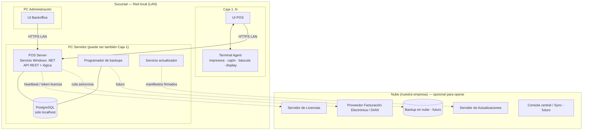
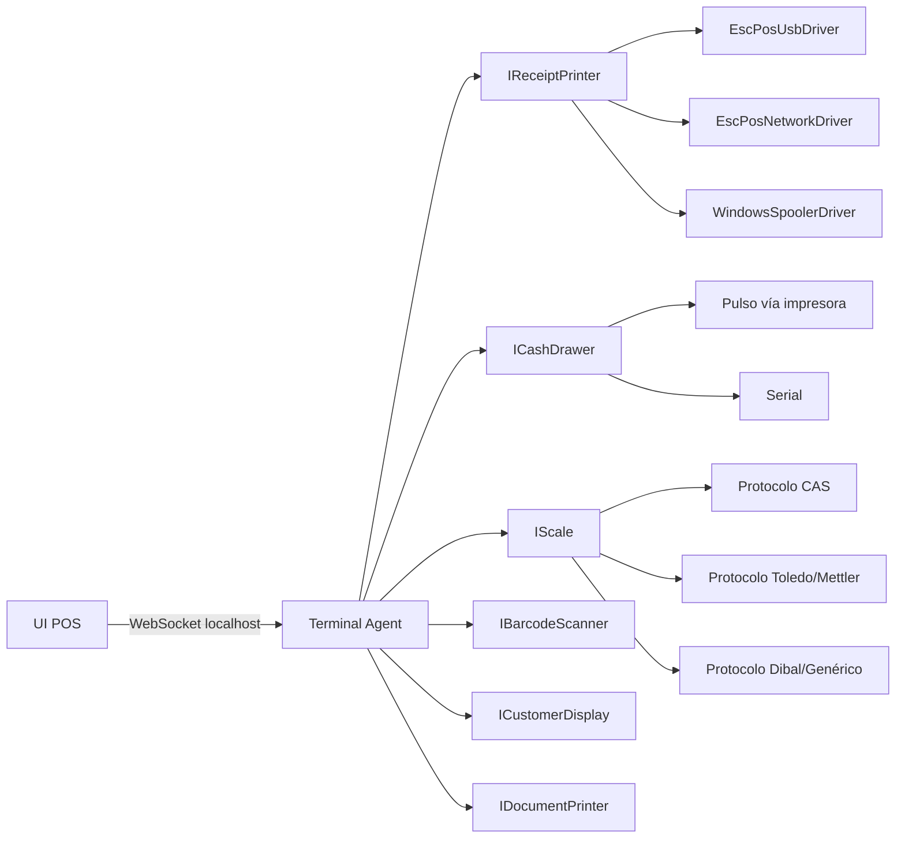

# 03 · Arquitectura tecnológica (D) y arquitectura del sistema (E)

> Estado: **PROPUESTA — pendiente de aprobación**

## D. Evaluación de alternativas tecnológicas

### Requisitos que deciden la tecnología

1. Instalable en Windows por personal no técnico, con servicios que arrancan solos.
2. Varias cajas contra un servidor en la **misma tienda (LAN)**, sin Internet.
3. **Dinero exacto** (aritmética decimal nativa).
4. Periféricos: puerto serial (básculas), USB/ESC-POS, spooler de Windows.
5. Transacciones concurrentes seguras (varias cajas vendiendo el mismo producto).
6. Protección razonable del código contra la evasión de la licencia.
7. Actualizaciones automáticas, migraciones y rollback.
8. Mantenibilidad a 5–10 años por un equipo pequeño.

### Motor de aplicación / backend

| Criterio | **.NET 10 (C#)** | Node.js (TypeScript) | PHP | Python |
|---|---|---|---|---|
| Servicio de Windows nativo | ✅ `UseWindowsService()` | ⚠️ vía wrappers (node-windows, NSSM) | ❌ requiere Apache/IIS + PHP | ⚠️ pywin32, frágil |
| Aritmética de dinero | ✅ `decimal` nativo 128 bits | ❌ solo `number` (float); requiere librería y disciplina | ⚠️ bcmath | ✅ `Decimal` |
| Tipado fuerte / refactor seguro | ✅ | ✅ (TS, pero se borra en runtime) | ⚠️ | ⚠️ |
| Periféricos (serial, spooler, USB) | ✅ `System.IO.Ports`, Win32 printing | ⚠️ módulos nativos que se rompen entre versiones | ❌ | ⚠️ |
| Protección de código | ✅ ofuscación / NativeAOT | ❌ JS legible (asar se extrae en segundos) | ❌ fuente legible | ❌ |
| Rendimiento | ✅ muy alto | ✅ alto | ⚠️ | ⚠️ |
| ORM + migraciones | ✅ EF Core (migrations bundles) | ✅ Prisma/Drizzle | ✅ | ✅ |
| Distribución sin dependencias | ✅ self-contained single-folder | ⚠️ node + node_modules | ❌ | ❌ |
| Soporte largo plazo | ✅ LTS 3 años, Microsoft | ✅ LTS | ✅ | ✅ |

**PHP y Python se descartan** para un producto de escritorio comercial: dependen de un runtime/servidor web externo, son difíciles de empaquetar y el código viaja en claro.

### Capa de interfaz (se decide en Fase 15, pero la arquitectura la desacopla desde hoy)

| Opción | Pros | Contras |
|---|---|---|
| **Electron** | Ecosistema enorme, UI web moderna | 150–300 MB RAM por caja, instalador ~100 MB, código JS extraíble |
| **Tauri 2** | Ligero (usa WebView2 del sistema), updater integrado, seguro | Backend en Rust (no lo usaríamos: solo como "cáscara") |
| **WPF / WinUI 3** | Nativo, maduro, rápido | UI moderna más costosa de construir; menos talento disponible |
| **Host .NET + WebView2** | Mismo lenguaje que el backend, UI web moderna, ligero | Hay que construir la "cáscara" (poco código) |
| .NET MAUI / Avalonia | Multiplataforma | Innecesario (solo Windows); ecosistema más pequeño |

> **Decidido en la Fase 15 (D15-01):** Blazor WebAssembly + MudBlazor servida por el servidor de la tienda, abierta en Edge en modo aplicación ([propuesta](fases/fase-15-propuesta.md)). El texto siguiente queda como referencia histórica.

**Decisión propuesta:** la UI será **web (React + TypeScript)** consumiendo la API local, alojada en una cáscara ligera (**Tauri 2** o **host .NET + WebView2**; se decide en Fase 15). Como la UI solo habla con la API, esta decisión **no afecta** nada de lo que construyamos en las fases 1–14.

### Base de datos

| Criterio | **PostgreSQL** | SQLite | MySQL/MariaDB |
|---|---|---|---|
| Varias cajas en LAN concurrentes | ✅ diseñado para ello | ❌ **no apto por red** (archivo compartido = corrupción) | ✅ |
| Integridad (FK, CHECK, transacciones) | ✅ excelente | ✅ buena (FK opcional) | ✅ buena |
| `numeric` exacto | ✅ | ⚠️ almacena como REAL/TEXT | ✅ |
| Índices parciales, trigramas, JSONB | ✅ | ⚠️ parcial | ⚠️ |
| Backups en caliente (`pg_dump`), PITR | ✅ | ✅ (API backup) | ✅ |
| Instalación silenciosa en Windows | ✅ binarios portables + `initdb` | ✅ nada que instalar | ⚠️ |
| Licencia | ✅ PostgreSQL (libre, comercial OK) | ✅ dominio público | ⚠️ MySQL GPL/comercial; MariaDB GPL |
| Nube futura (sync/central) | ✅ mismo motor en la nube | ❌ | ✅ |

**Decisión propuesta: PostgreSQL (17 o 18, se fija en Fase 1) en TODOS los planes**, incluido el de 1 caja.
Razón: mantener un solo motor evita el doble de pruebas y bugs de "funciona en SQLite pero no en Postgres". SQLite se reserva para la **caché local del terminal** (modo offline de caja, fase futura) y para el agente de dispositivos.

### Stack recomendado

| Capa | Tecnología |
|---|---|
| Backend / servidor de tienda | **.NET 10 LTS**, ASP.NET Core (Minimal APIs), ejecutado como **Servicio de Windows** |
| Acceso a datos | **EF Core 10** + Npgsql (escritura/dominio) · **Dapper** (reportes/lecturas pesadas) |
| Base de datos | **PostgreSQL** empaquetado, puerto no estándar, escuchando solo en `localhost` |
| Validación | FluentValidation |
| Logs | Serilog → archivos rotativos (+ opcional envío a soporte) |
| Hash de contraseñas | Argon2id |
| Criptografía licencias | Ed25519 (firma), AES-256-GCM (backups), DPAPI (secretos locales) |
| Agente de terminal | .NET 10 Worker Service por caja (periféricos + caché offline futura) |
| UI (Fase 15) | React + TypeScript en Tauri 2 o WebView2 |
| Pruebas | xUnit, Testcontainers (Postgres real), FluentAssertions, pruebas de arquitectura (NetArchTest) |
| Instalador | WiX Toolset (MSI + bootstrapper) |
| Actualizaciones | Servicio actualizador propio + manifiestos firmados (Velopack evaluable para la UI) |
| Servidor de licencias (nube) | ASP.NET Core + PostgreSQL (proyecto separado) |

> ⚠️ **Advertencia honesta:** si tu experiencia (o la del equipo) es fuerte en JavaScript/TypeScript y nula en C#, la alternativa viable es **Node.js + TypeScript + PostgreSQL** con la misma arquitectura. Es posible, pero exige disciplina estricta con decimales (librería `decimal.js` en *todo* cálculo monetario), wrappers para servicios de Windows y acepta que el código es más fácil de piratear. Por eso recomiendo .NET. Esta es la **decisión #2** del documento 12.

---

## E. Arquitectura general del sistema

### Estilo: **monolito modular, local-first, API-first**

- **Monolito modular**: un solo proceso servidor por tienda, dividido en módulos con fronteras estrictas (cada uno con su dominio, su esquema de BD y una API pública interna). Evita la complejidad de microservicios (inviable en el PC de un supermercado) sin caer en código espagueti. Un módulo puede extraerse a servicio en el futuro si hace falta.
- **Local-first**: la fuente de verdad de la operación es la BD de la tienda. La nube es un complemento (licencias, actualizaciones, facturación electrónica, respaldo y — en el futuro — consolidación).
- **API-first**: toda funcionalidad se expone por API HTTP versionada (`/api/v1/...`). La UI, el agente de terminal, pruebas automatizadas y futuras integraciones usan la misma API. Esto permite **construir y probar todo el cerebro sin interfaz visual**.

### Topología de despliegue



**Modos de instalación** (mismo instalador):

| Modo | Uso | Componentes |
|---|---|---|
| **Todo en uno** | 1 caja (plan Básico) | Servidor + BD + Agente + UI en un solo PC |
| **Servidor** | PC principal de la tienda | Servidor + BD (+ opcionalmente caja) |
| **Terminal** | Cajas adicionales | Agente + UI; se conecta al servidor (descubrimiento automático en LAN o IP manual) |

### Capas internas de cada módulo

```
Módulo (p. ej. Inventory)
├── Api            → endpoints HTTP, DTOs de entrada/salida, autorización por permiso y por feature
├── Application    → casos de uso (comandos/consultas), validación, transacción, eventos
├── Domain         → entidades, value objects, reglas de negocio, estados (sin dependencias externas)
├── Infrastructure → EF Core (DbContext del módulo, configuraciones, repositorios), integraciones
└── Contracts      → lo único que otros módulos pueden ver (interfaces, DTOs, eventos de integración)
```

**Reglas de dependencia** (verificadas con pruebas de arquitectura automáticas):
1. `Domain` no depende de nada salvo `SharedKernel`.
2. Un módulo **no** accede a tablas ni clases internas de otro: usa sus `Contracts`.
3. Nada de lógica de negocio en controladores ni en la UI.
4. La BD tiene **un esquema por módulo** (`catalog`, `inventory`, `sales`, ...) para hacer visibles las fronteras.

### Comunicación entre módulos

| Necesidad | Mecanismo | Ejemplo |
|---|---|---|
| Consistencia inmediata (misma transacción) | Llamada síncrona a la interfaz del otro módulo dentro de la **misma transacción de BD** | Finalizar venta → `IInventoryPosting.PostSale(...)` descuenta stock atómicamente |
| Efectos secundarios no críticos | **Eventos de dominio** + patrón **Outbox** (tabla `outbox_messages` escrita en la misma transacción, procesada después) | Venta completada → encolar documento fiscal, actualizar resúmenes de reportes, imprimir |
| Integraciones externas | Outbox + worker con reintentos exponenciales | Envío a facturación electrónica, heartbeat de licencia |

> Decisión clave: **finalizar una venta es UNA transacción ACID** que escribe venta + líneas + pagos + movimientos de kardex + movimiento de caja + documento fiscal en estado `PENDING` + mensaje outbox. O todo o nada. La comunicación con el proveedor fiscal ocurre **después**, fuera de la transacción, para que Internet nunca bloquee la venta.

### Conceptos transversales

| Tema | Decisión |
|---|---|
| Identificadores | **UUID v7** (ordenados por tiempo) generados en la aplicación. Permiten crear registros offline y sincronizar sin colisiones. Los documentos además tienen **número legible** (`FV-C01-000123`). |
| Fechas | `timestamptz` en **UTC**; conversión a zona horaria de la empresa solo al mostrar. Campo `business_date` (fecha de jornada) en documentos operativos. |
| Dinero | `decimal` en C#, `numeric(19,4)` en BD. Redondeo a la moneda (COP: 0 o 2 decimales, configurable) en puntos definidos: total de línea, impuestos por línea, total documento. |
| Cantidades | `numeric(18,4)` — soporta kg con gramos, litros con ml. |
| Concurrencia | Bloqueo optimista con `xmin` de PostgreSQL en entidades maestras; bloqueo pesimista (`SELECT ... FOR UPDATE`) en saldos de inventario y secuencias. |
| Idempotencia | Cabecera `Idempotency-Key` obligatoria en comandos críticos; tabla `idempotency_keys` guarda la respuesta. |
| Reloj | `IClock` inyectado (pruebas deterministas; detección de manipulación de fecha para licencia). |
| Errores | Resultados tipados (`Result<T>`), errores de negocio con código estable (`SALES.INSUFFICIENT_STOCK`) → HTTP `ProblemDetails`. |
| Configuración | `Settings` tipados por alcance; secretos cifrados con DPAPI. |
| Autorización | Permiso (quién puede) + feature de licencia (qué plan lo incluye) + reglas de negocio (si procede ahora). |
| Observabilidad | Logs estructurados con `correlation_id` por petición; endpoint `/health`; paquete de diagnóstico exportable para soporte. |
| Seguridad de red | PostgreSQL escucha solo en `localhost`; las cajas acceden **solo a la API** por HTTPS (certificado autogenerado en la instalación, *pinned* por los terminales). |

### Arquitectura de periféricos (punto 17)

Los periféricos están **físicamente conectados a cada caja**, no al servidor. Por eso cada caja ejecuta un **Terminal Agent** local:



- Cada tipo de periférico es una **interfaz**; cada marca/protocolo es un **driver** registrado como plugin. Agregar una báscula nueva = agregar un driver, sin tocar el POS.
- La configuración de periféricos por caja se guarda en BD (`terminal_devices`) y se descarga al agente.
- La impresión usa un **modelo de documento neutral** (líneas, columnas, negrita, QR, código de barras, corte) que cada driver traduce (ESC/POS, GDI, PDF). Las plantillas de tiquete son configurables sin programar.
- Cola de impresión con reintentos: si la impresora no tiene papel, la venta **ya está guardada**; se reimprime al resolverse.
- El lector de código de barras en modo teclado (el 95 % de los casos) lo maneja la UI; modo serial/HID-POS lo maneja el agente.
- La pantalla secundaria puede ser un segundo monitor (ventana de la UI) o un visor VFD serial (driver del agente).
