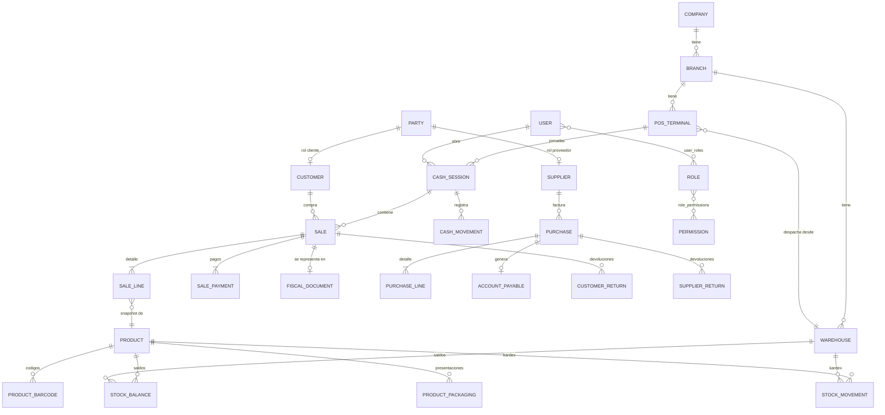
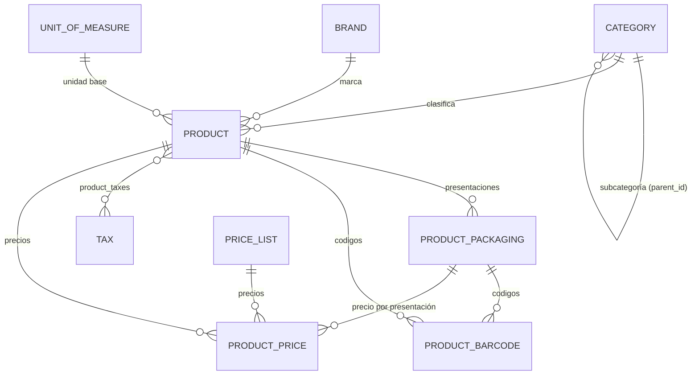
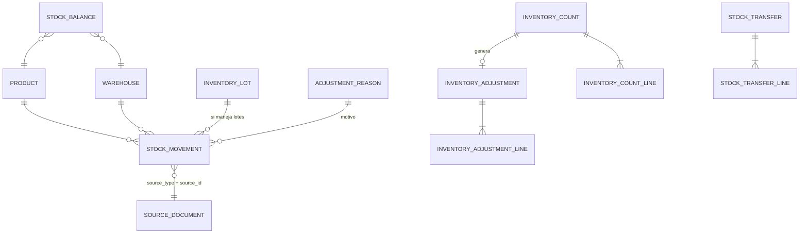
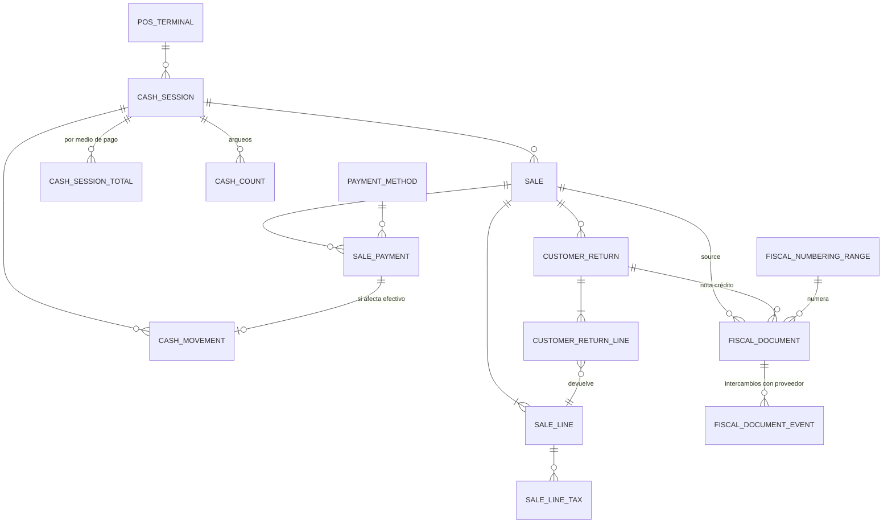
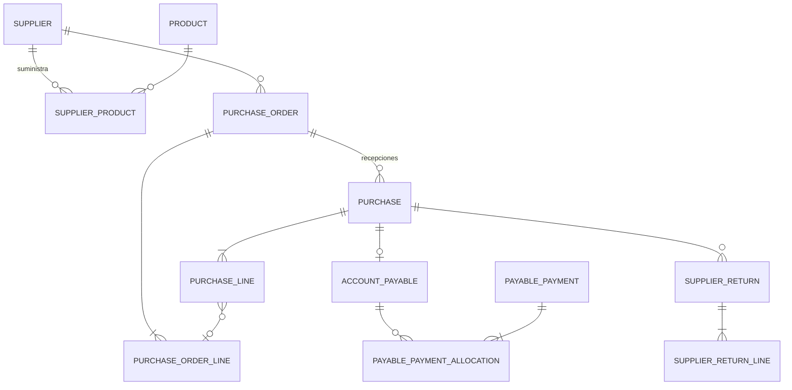
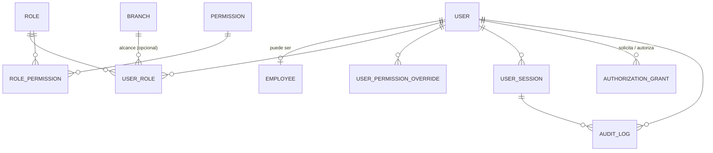

# 04 · Base de datos (F, G, H, I)

> Estado: **PROPUESTA — pendiente de aprobación** · Motor: PostgreSQL
> Este documento es el modelo lógico. Los tipos exactos, nombres finales e índices se confirman en la **Fase 2** antes de generar la primera migración.

## F. Arquitectura de la base de datos

> **Actualización Fase 2 (implementada).** El esquema real de `system`, `ref`, `org`, `identity` y `audit` está en
> `src/Server/Pos.Server.Migrations/Scripts` y en la [propuesta de la Fase 2 (v2)](fases/fase-02-propuesta.md), que
> prevalecen sobre este documento. Cambios principales: esquema `ref` (tipos de identificación, DIVIPOLA),
> `org.nodes`, bodegas únicas por sucursal, `system.document_series` (numeración interna, ADR-0013), auditoría con
> sellado por nodo (ADR-0012), `row_version` en maestros sincronizables, outbox con `node_seq` e inbox (ADR-0014).

### Principios

1. **Normalizada (3FN)** en datos maestros; **desnormalización controlada** solo en: snapshots de documentos (por diseño legal/histórico) y saldos de inventario (derivados del kardex, siempre reconstruibles).
2. **Un esquema por módulo**: `org`, `identity`, `parties`, `catalog`, `inventory`, `purchasing`, `sales`, `cash`, `expenses`, `billing`, `audit`, `licensing`, `backup`, `system`.
3. **Documentos inmutables** una vez contabilizados (`POSTED`/`COMPLETED`): no se editan ni se borran; se **anulan** o se **revierten** con otro documento.
4. **Maestros con borrado lógico** (`deleted_at`) y estado (`ACTIVE`/`INACTIVE`). FK con `ON DELETE RESTRICT` siempre: la BD impide borrar lo que tiene historial.
5. **Integridad en la BD, no solo en el código**: `NOT NULL`, `CHECK`, `UNIQUE`, FK e índices únicos parciales. Si hay un bug en el código, la BD lo rechaza.
6. **Multiempresa desde el día 1**: toda tabla de negocio lleva `company_id`; las operativas también `branch_id`. En la tienda normalmente habrá una sola empresa, pero el modelo no cambia al crecer ni al llevarlo a la nube.
7. **Estados como texto con `CHECK`** (`'COMPLETED'`, no `3`): legibles, sin ambigüedad y validados por la BD.

### Convenciones

| Elemento | Convención |
|---|---|
| Nombres | Inglés, `snake_case`, tablas en plural (`sale_lines`). Documentación y UI en español. |
| PK | `id uuid` (UUID v7, generado por la aplicación) |
| FK | `<entidad>_id` |
| Dinero | `numeric(19,4)` |
| Cantidad | `numeric(18,4)` |
| Porcentaje / tasa | `numeric(9,4)` (19 % = `19.0000`) |
| Fechas-hora | `timestamptz` (UTC) · fechas de negocio `date` |
| Textos | `varchar(n)` con límites razonables; `text` solo para notas |
| Flexibles | `jsonb` solo para datos no consultables por relación (configuración de drivers, payloads) |
| Columnas de control **[CTL]** | `created_at timestamptz NN`, `created_by uuid FK users`, `updated_at timestamptz`, `updated_by uuid` |
| Borrado lógico **[DEL]** | `deleted_at timestamptz`, `deleted_by uuid` |
| Concurrencia | columna de sistema `xmin` como token de concurrencia (EF Core) |

`NN` = NOT NULL · `UQ` = único · `FK→` = clave foránea · `CK` = check

---

## G. Modelo entidad-relación

### G.1 Vista general (dominios y relaciones principales)



### G.2 Catálogo



### G.3 Inventario



### G.4 Ventas, caja y facturación



### G.5 Compras



### G.6 Seguridad y auditoría



---

## H. Tablas iniciales propuestas

> Formato: `columna  tipo  restricciones — comentario`. Todas las tablas incluyen `id uuid PK`; se omite en el listado. **[CTL]** y **[DEL]** según convenciones.

### H.1 `org` — Empresa y estructura

**org.companies** [CTL]
```
legal_name            varchar(200) NN
trade_name            varchar(200) NN
identification_type   varchar(10)  NN            — NIT, RUT, RFC...
identification_number varchar(30)  NN  UQ
check_digit           varchar(2)
tax_regime            varchar(30)  NN            — p.ej. RESPONSABLE_IVA, NO_RESPONSABLE_IVA, SIMPLE
fiscal_responsibilities varchar(20)[]            — códigos oficiales (O-13, O-15, R-99-PN…)
address / city_code / country_code / phone / email
currency_code         char(3)      NN  default 'COP'
money_decimals        smallint     NN  CK 0..4   — decimales visibles/redondeo
timezone              varchar(50)  NN  default 'America/Bogota'
logo                  bytea
status                varchar(20)  NN  CK IN ('ACTIVE','INACTIVE')
```

**org.branches** [CTL][DEL]
```
company_id  uuid NN FK→companies
code        varchar(10) NN            — UQ(company_id, code)
name        varchar(120) NN
address, city_code, phone
default_warehouse_id uuid FK→warehouses
status      varchar(20) NN CK IN ('ACTIVE','INACTIVE')
```

**org.warehouses** [CTL][DEL]
```
company_id, branch_id uuid NN FK
code        varchar(10) NN            — UQ(company_id, code)
name        varchar(120) NN
type        varchar(20) NN CK IN ('SALES_FLOOR','STORAGE','DAMAGED','IN_TRANSIT')
allow_sales boolean NN
status      varchar(20) NN
```

**org.pos_terminals** (caja lógica) [CTL][DEL]
```
company_id, branch_id uuid NN FK
code          varchar(10) NN          — UQ(branch_id, code) ej. 'C01'
name          varchar(60) NN
warehouse_id  uuid NN FK→warehouses  — bodega de la que descuenta
device_id     uuid FK→devices        — PC físico actualmente vinculado
status        varchar(20) NN CK IN ('ACTIVE','INACTIVE','BLOCKED')
```

**org.devices** (equipo físico / instalación)
```
company_id       uuid NN
installation_id  uuid NN UQ           — generado por el instalador
machine_fingerprint_hash varchar(128) NN — hash de identificadores de hardware
hostname, os_version, app_version, role CK IN ('SERVER','TERMINAL','ALL_IN_ONE')
last_seen_at     timestamptz
status           CK IN ('ACTIVE','REVOKED')
```

**org.terminal_devices** (periféricos por caja) [CTL]
```
pos_terminal_id uuid NN FK
device_type     varchar(30) NN CK IN ('RECEIPT_PRINTER','CASH_DRAWER','SCALE','BARCODE_SCANNER','CUSTOMER_DISPLAY','DOCUMENT_PRINTER')
driver          varchar(60) NN          — 'escpos-usb', 'cas-serial'…
connection      jsonb NN                — puerto, baudios, IP, nombre de impresora
options         jsonb                   — ancho papel, codepage, pulso cajón…
is_enabled      boolean NN
```

**org.document_templates** [CTL] — plantillas de tiquete/reportes por tipo de documento y alcance (company/branch/terminal).

### H.2 `system` — Infraestructura de datos

**system.settings**
```
company_id  uuid NN
scope_type  varchar(20) NN CK IN ('COMPANY','BRANCH','TERMINAL','USER')
scope_id    uuid NN
key         varchar(100) NN            — 'inventory.allow_negative_stock'
value       jsonb NN
updated_at, updated_by
UQ(scope_type, scope_id, key)
```

**system.document_sequences**
```
company_id      uuid NN
branch_id       uuid                   — null = nivel empresa
pos_terminal_id uuid                   — null = nivel sucursal
document_type   varchar(30) NN         — 'SALE','CUSTOMER_RETURN','PURCHASE','ADJUSTMENT'…
prefix          varchar(20) NN
next_number     bigint NN CK > 0
padding         smallint NN
UQ(company_id, branch_id, pos_terminal_id, document_type)  (NULLS NOT DISTINCT)
```
Se consume con `SELECT ... FOR UPDATE` dentro de la transacción del documento → sin duplicados ni saltos.

**system.outbox_messages**
```
occurred_at, type varchar(200) NN, payload jsonb NN,
status CK IN ('PENDING','PROCESSING','PROCESSED','FAILED'),
attempts int NN, next_attempt_at, last_error text, processed_at
INDEX parcial (next_attempt_at) WHERE status IN ('PENDING','FAILED')
```

**system.idempotency_keys**
```
key varchar(100) PK-compuesta con user_id, request_hash, response_status, response_body jsonb, created_at, expires_at
```

### H.3 `identity` — Usuarios y seguridad

**identity.users** [CTL][DEL]
```
company_id        uuid NN
username          varchar(60) NN          — UQ(company_id, lower(username))
display_name      varchar(120) NN
email             varchar(200)
password_hash     varchar(255) NN         — Argon2id (formato PHC con sal y parámetros)
pin_hash          varchar(255)            — Argon2id; PIN para caja/autorizaciones
status            varchar(20) NN CK IN ('ACTIVE','LOCKED','DISABLED')
must_change_password boolean NN
failed_login_count smallint NN default 0
locked_until      timestamptz
password_changed_at timestamptz NN
last_login_at     timestamptz
employee_id       uuid FK→employees UQ
```

**identity.employees** [CTL][DEL] — `company_id, branch_id, identification_type, identification_number (UQ por empresa), first_name, last_name, position, phone, email, hire_date, termination_date, status CK ('ACTIVE','INACTIVE')`

**identity.roles** [CTL] — `company_id, code UQ, name, description, is_system boolean` (los roles de sistema no se pueden borrar)

**identity.permissions** — catálogo **sembrado por código** (no editable): `code varchar(100) UQ` (ej. `sales.sale.void`), `module`, `description`, `is_sensitive boolean`, `requires_feature varchar(60)`

**identity.role_permissions** — `role_id FK, permission_id FK, PK(role_id, permission_id)`

**identity.user_roles** — `user_id FK, role_id FK, branch_id FK nullable` (null = todas las sucursales); UQ(user_id, role_id, branch_id) NULLS NOT DISTINCT

**identity.user_permission_overrides** — `user_id, permission_id, effect CK IN ('GRANT','DENY'), branch_id nullable, reason, [CTL]`

**identity.user_sessions**
```
user_id NN FK, token_hash varchar(128) NN UQ,    — nunca se guarda el token en claro
device_id FK, pos_terminal_id FK, ip_address inet, user_agent,
created_at, last_activity_at, expires_at NN, revoked_at, revoked_reason
```

**identity.login_attempts** — `username_attempted, user_id nullable, succeeded, ip_address, device_id, failure_reason, occurred_at` (append-only)

**identity.authorization_grants** (autorización de supervisor)
```
permission_code    varchar(100) NN
requested_by       uuid NN FK users
authorized_by      uuid NN FK users      — CK authorized_by <> requested_by
pos_terminal_id    uuid
target_type / target_id                 — la venta, línea, retiro… afectado
reason             varchar(250)
context            jsonb                 — p.ej. descuento solicitado 25 %
granted_at         timestamptz NN
consumed_at        timestamptz           — una autorización se usa una sola vez
```

**identity.password_history** — `user_id, password_hash, created_at` (evitar reutilización)

### H.4 `parties` — Terceros (clientes y proveedores)

> Implementado en la Fase 5 (`V2026.10.010`, ADR-0023) con cambios: los tipos de identificación siguen en `ref.identification_types`
> (Fase 2); las responsabilidades fiscales se guardan en el tercero como texto `O-13;O-15` validado contra `ref.fiscal_responsibilities`;
> `merged_into_id` y estado `MERGED` para la fusión en la nube; `search_text` con índice de trigramas. Los grupos, el crédito y los
> puntos de clientes llegan en la Fase 8. Los medios de pago nacen en `cash.payment_methods` (`V2026.10.011`).

Un **tercero** es una persona o empresa identificada una sola vez; puede ser cliente, proveedor o ambos. Evita duplicar datos fiscales (vital para facturación electrónica).

**parties.identification_types** — `code PK ('CC','NIT','CE','PA','TI','NIT_EXT'…), name, fiscal_code` (código oficial)

**parties.parties** [CTL][DEL]
```
company_id             uuid NN
person_type            varchar(10) NN CK IN ('NATURAL','LEGAL')
identification_type    varchar(10) NN FK
identification_number  varchar(30) NN        — UQ(company_id, identification_type, identification_number)
check_digit            varchar(2)
first_name, last_name  varchar(100)          — CK: persona natural requiere nombres
legal_name             varchar(200)          — CK: persona jurídica requiere razón social
trade_name             varchar(200)
tax_regime             varchar(30)
fiscal_responsibilities varchar(20)[]
email, phone, mobile, address, city_code, country_code
status                 CK IN ('ACTIVE','INACTIVE')
```

**parties.party_contacts** — `party_id, name, position, phone, email, is_primary, notes`

**parties.customers** [CTL][DEL] — rol cliente del tercero: `party_id UQ FK, company_id, customer_group_id, price_list_id, status CK IN ('ACTIVE','INACTIVE','BLOCKED')` + campos preparados (nulos hasta su fase): `credit_limit, credit_days, loyalty_enabled`. El "Consumidor final" es un tercero sembrado por la instalación (identificación genérica según el país).

**parties.customer_groups** — `company_id, code, name, default_price_list_id`

### H.5 `catalog` — Productos

> Implementado en la Fase 4 (`V2026.10.008`) con los cambios de la [propuesta §4.1](fases/fase-04-propuesta.md): unidades en `ref`, tarifas de impuestos en `catalog.tax_rates`, `normalized_code` en los códigos, `search_text` en productos, restricciones de exclusión para vigencias, consecutivos internos por nodo e importaciones.

**catalog.categories** [CTL][DEL] — `company_id, parent_id FK→categories (nullable), code, name, path ltree/varchar (para consultas de árbol), sort_order, status`; UQ(company_id, parent_id, name)

**catalog.brands** [CTL][DEL] — `company_id, name UQ(company_id, lower(name)), status`

**catalog.units_of_measure** — `code PK ('UND','KG','G','LB','L','ML'…), name, dimension CK IN ('UNIT','WEIGHT','VOLUME','LENGTH'), fiscal_code, decimals_allowed smallint`

**catalog.unit_conversions** — `from_unit, to_unit, factor numeric(18,8)` (KG→G = 1000)

**catalog.taxes** [CTL]
```
company_id, code varchar(20) NN UQ, name
tax_kind      CK IN ('VAT','CONSUMPTION','EXCISE','OTHER')   — IVA, INC, impuestos saludables…
calculation   CK IN ('PERCENTAGE','FIXED_PER_UNIT')
rate          numeric(9,4)       — si PERCENTAGE
fixed_amount  numeric(19,4)      — si FIXED_PER_UNIT (p.ej. impuesto a la bolsa)
fiscal_code   varchar(10)        — código del ente tributario
is_exempt / is_excluded boolean  — exento (tarifa 0 con derecho) vs excluido
valid_from, valid_to date
status
```

**catalog.products** [CTL][DEL]
```
company_id          uuid NN
sku                 varchar(40) NN              — UQ(company_id, sku)
name                varchar(200) NN
short_name          varchar(40) NN              — para tiquete
description         text
category_id         uuid NN FK
brand_id            uuid FK
base_unit_code      varchar(10) NN FK→units_of_measure
sale_mode           varchar(20) NN CK IN ('UNIT','WEIGHT','VOLUME')
product_type        varchar(20) NN CK IN ('STOCKABLE','SERVICE','KIT')  — servicios no afectan inventario
is_sold_by_scale    boolean NN
allows_decimal_qty  boolean NN                  — CK: WEIGHT/VOLUME ⇒ true
allows_open_price   boolean NN
tracks_lots         boolean NN
tracks_expiry       boolean NN
plu_code            varchar(10)                 — código para báscula; UQ parcial (company_id, plu_code)
price_includes_tax  boolean NN
last_purchase_cost  numeric(19,4)               — informativo; el costo real está en inventario
status              varchar(20) NN CK IN ('ACTIVE','INACTIVE','DISCONTINUED')
INDEX GIN (name gin_trgm_ops)                   — búsqueda rápida por texto
```

**catalog.product_packagings** (presentaciones) [CTL][DEL]
```
product_id  uuid NN FK
name        varchar(60) NN         — 'Paquete x6', 'Caja x24'
unit_code   varchar(10) NN
factor      numeric(18,4) NN CK > 0 — cantidad en unidad base
is_sellable, is_purchasable boolean NN
UQ(product_id, name)
```

**catalog.product_barcodes** [CTL]
```
company_id    uuid NN
product_id    uuid NN FK
packaging_id  uuid FK              — null = unidad base
code          varchar(50) NN       — UQ(company_id, code) → un código identifica UNA cosa
code_type     CK IN ('EAN13','EAN8','UPCA','CODE128','INTERNAL')
is_primary    boolean NN           — UQ parcial (product_id) WHERE is_primary
```

**catalog.variable_barcode_rules** (códigos de peso/precio variable)
```
company_id, prefix varchar(3) NN ('20'..'29'), content CK IN ('WEIGHT','PRICE'),
plu_start, plu_length, value_start, value_length, value_decimals, has_check_digit, priority
```

**catalog.product_taxes** — `product_id FK, tax_id FK, PK(product_id, tax_id)`

**catalog.price_lists** [CTL] — `company_id, code UQ, name, is_default (UQ parcial por empresa), prices_include_tax boolean, status`

**catalog.product_prices** [CTL]
```
price_list_id  uuid NN FK
product_id     uuid NN FK
packaging_id   uuid FK                 — null = unidad base
branch_id      uuid FK                 — null = todas las sucursales
price          numeric(19,4) NN CK >= 0
valid_from     timestamptz NN
valid_to       timestamptz              — null = vigente indefinidamente
EXCLUDE USING gist (no solapamiento de vigencias para la misma combinación)
```
El historial de precios queda en la propia tabla (no se sobrescriben precios: se cierra la vigencia y se crea uno nuevo) + auditoría.

### H.6 `inventory` — Existencias y kardex

> Implementado en la Fase 4 (`V2026.10.009`) con los cambios de la [propuesta §4.2](fases/fase-04-propuesta.md): `total_value`/`balance_value`, `seq`, `node_id` y `branch_id`; capturas de conteo separadas; verificaciones registradas.

**inventory.stock_balances** (saldo derivado, reconstruible)
```
company_id, warehouse_id, product_id uuid NN
lot_id           uuid FK                 — null si el producto no maneja lotes
quantity         numeric(18,4) NN
average_cost     numeric(19,4) NN
last_movement_at timestamptz
UQ(warehouse_id, product_id, lot_id) NULLS NOT DISTINCT
```

**inventory.stock_movements** (KARDEX — append-only)
```
company_id, branch_id, warehouse_id, product_id uuid NN
lot_id              uuid
movement_type       varchar(30) NN CK IN (ver doc 07)
direction           smallint NN CK IN (1,-1)
quantity            numeric(18,4) NN CK > 0        — siempre en unidad base
unit_cost           numeric(19,4) NN
total_cost          numeric(19,4) NN
balance_quantity    numeric(18,4) NN               — saldo después del movimiento
balance_avg_cost    numeric(19,4) NN
source_type         varchar(30) NN                 — 'SALE','PURCHASE','ADJUSTMENT','TRANSFER'…
source_id           uuid NN
source_line_id      uuid
source_number       varchar(40)                    — número legible del documento
reason_id           uuid FK→adjustment_reasons
reverses_movement_id uuid FK→stock_movements       — si es reversión
business_date       date NN
occurred_at         timestamptz NN
user_id             uuid NN
INDEX (product_id, warehouse_id, occurred_at)
INDEX (source_type, source_id)
```
Permisos de BD: el rol de aplicación **no tiene UPDATE ni DELETE** sobre esta tabla.

**inventory.inventory_lots** — `product_id, lot_number, expiry_date, manufactured_date, status CK IN ('AVAILABLE','QUARANTINE','EXPIRED','EXHAUSTED')`, UQ(product_id, lot_number)

**inventory.stock_policies** — `warehouse_id, product_id, min_qty, max_qty, reorder_point, reorder_qty`, UQ(warehouse_id, product_id)

**inventory.adjustment_reasons** — `company_id, code, name, direction CK IN (1,-1,0), movement_type, requires_note, status`

**inventory.inventory_adjustments** [CTL] — `company_id, branch_id, warehouse_id, number, business_date, reason_id, status (ver doc 05), notes, posted_at, posted_by, approved_by, source_count_id`
**inventory.inventory_adjustment_lines** — `adjustment_id, product_id, lot_id, quantity (±), unit_cost, notes`

**inventory.inventory_counts** [CTL] — `warehouse_id, number, count_type CK IN ('FULL','PARTIAL','CYCLIC'), is_blind, scope jsonb (categorías/ubicaciones), status, snapshot_at, started_at, closed_at, approved_by`
**inventory.inventory_count_lines** — `count_id, product_id, lot_id, system_qty (congelada al snapshot), counted_qty, recount_qty, counted_by, counted_at, difference (generada)`

**inventory.stock_transfers** [CTL] — `number, origin_warehouse_id, destination_warehouse_id (CK distintos), status, shipped_at/by, received_at/by, notes`
**inventory.stock_transfer_lines** — `transfer_id, product_id, lot_id, quantity_sent, quantity_received, unit_cost`

### H.7 `purchasing` — Compras y proveedores

> Implementado en la Fase 5 (`V2026.10.012`, ADR-0024 y ADR-0026) con cambios: líneas con presentación, factor y cantidad base,
> cargos prorrateados y `net_unit_cost`; impuestos por línea (`purchase_line_taxes`, descontable sí/no); retenciones
> (`purchase_withholdings`); cuenta por pagar como libro (`payable_entries`, solo inserción) y pagos con aplicaciones; devoluciones
> con `total` (costo) y `credit_total` (lo que descuentan de la cartera). Lotes en `inventory` (`V2026.10.013`, ADR-0025): número único
> por sucursal y producto, filas de saldo por lote solo con cantidad, una sola reversión por movimiento.

**purchasing.suppliers** [CTL][DEL] — `party_id UQ FK, company_id, code, payment_terms_days, default_payment_method, credit_limit, notes, status CK IN ('ACTIVE','INACTIVE','BLOCKED')`

**purchasing.supplier_products** — `supplier_id, product_id, packaging_id, supplier_sku, last_cost, last_purchase_at, lead_time_days, is_preferred`; UQ(supplier_id, product_id, packaging_id)

**purchasing.purchase_orders** [CTL] — `company_id, branch_id, warehouse_id, supplier_id, number UQ, order_date, expected_date, status, subtotal, tax_total, total, notes, approved_by, approved_at`
**purchasing.purchase_order_lines** — `order_id, product_id, packaging_id, quantity, unit_cost, discount, tax_amount, line_total, quantity_received`

**purchasing.purchases** (compra / recepción con factura del proveedor) [CTL]
```
company_id, branch_id, warehouse_id, supplier_id  uuid NN
purchase_order_id     uuid FK
number                varchar(30) NN UQ(company_id, number)  — número interno
supplier_invoice_number varchar(50) NN       — UQ(supplier_id, supplier_invoice_number) evita doble registro
supplier_invoice_date date NN
business_date         date NN
payment_type          CK IN ('CASH','CREDIT')
due_date              date                    — CK: CREDIT ⇒ NOT NULL
subtotal, discount_total, tax_total, withholding_total, other_charges, total  numeric(19,4) NN
status                varchar(20) NN
posted_at, posted_by, voided_at, voided_by, void_reason
```
**purchasing.purchase_lines** — `purchase_id, line_no, product_id, packaging_id, quantity, quantity_base, unit_cost, discount_amount, taxes jsonb→ normalizado en purchase_line_taxes, line_subtotal, line_total, lot_number, expiry_date, purchase_order_line_id`
**purchasing.purchase_line_taxes** — `purchase_line_id, tax_id, tax_code, rate, base_amount, tax_amount`

**purchasing.accounts_payable** — `company_id, supplier_id, purchase_id UQ, document_number, issue_date, due_date, original_amount, balance, status CK IN ('OPEN','PARTIALLY_PAID','PAID','VOIDED')`
**purchasing.payable_payments** [CTL] — `supplier_id, payment_date, payment_method_id, amount, reference, cash_session_id (si se paga desde caja), notes, status`
**purchasing.payable_payment_allocations** — `payment_id, account_payable_id, amount` (un pago puede cubrir varias facturas)

**purchasing.supplier_returns** [CTL] — `number, supplier_id, purchase_id, warehouse_id, business_date, reason, subtotal, tax_total, total, settlement CK IN ('CREDIT_NOTE','REFUND','REPLACEMENT'), status`
**purchasing.supplier_return_lines** — `return_id, purchase_line_id, product_id, lot_id, quantity, unit_cost, tax_amount, line_total`

### H.8 `sales` — Ventas y devoluciones

**sales.payment_methods** [CTL]
```
company_id, code UQ, name
kind              CK IN ('CASH','DEBIT_CARD','CREDIT_CARD','BANK_TRANSFER','DIGITAL_WALLET','VOUCHER','STORE_CREDIT','CUSTOMER_CREDIT','OTHER')
affects_cash_drawer boolean NN      — solo efectivo suma al arqueo de efectivo
allows_change     boolean NN        — solo efectivo puede dar cambio
requires_reference boolean NN       — transferencia/voucher exigen referencia
fiscal_code       varchar(10)
sort_order, status
```

**sales.sales** [CTL]
```
company_id, branch_id, pos_terminal_id, warehouse_id  uuid NN
cash_session_id    uuid NN FK→cash.cash_sessions
number             varchar(30)            — asignado al COMPLETAR; UQ(company_id, number)
customer_id        uuid FK                — null = consumidor final
customer_snapshot  jsonb                  — datos del cliente al momento de la venta
cashier_id         uuid NN FK users
price_list_id      uuid NN
status             varchar(20) NN CK IN ('OPEN','ON_HOLD','COMPLETED','CANCELLED','VOIDED')
return_status      varchar(20) NN CK IN ('NONE','PARTIALLY_RETURNED','FULLY_RETURNED')
business_date      date NN
started_at         timestamptz NN
completed_at       timestamptz
subtotal           numeric(19,4) NN       — sin impuestos, después de descuentos de línea
discount_total     numeric(19,4) NN
tax_total          numeric(19,4) NN
rounding_adjustment numeric(19,4) NN      — redondeo a la moneda (registrado, no oculto)
total              numeric(19,4) NN CK >= 0
paid_total         numeric(19,4) NN
change_total       numeric(19,4) NN
hold_label         varchar(60)            — identificador al suspender
cancel_reason, void_reason  varchar(250)
voided_at, voided_by, void_authorization_id
idempotency_key    varchar(100) UQ
CK: status='COMPLETED' ⇒ number, completed_at NOT NULL y paid_total - change_total = total
INDEX (branch_id, business_date) · (cash_session_id) · (customer_id) · (status) parcial WHERE status IN ('OPEN','ON_HOLD')
```

**sales.sale_lines**
```
sale_id            uuid NN FK
line_no            int NN                 — UQ(sale_id, line_no)
product_id         uuid NN FK
packaging_id       uuid FK
-- SNAPSHOT (no cambia si el producto cambia)
sku, barcode_scanned, product_name, unit_code
quantity           numeric(18,4) NN CK > 0
quantity_base      numeric(18,4) NN        — quantity × factor de presentación
unit_price         numeric(19,4) NN        — precio lista unitario al momento
price_includes_tax boolean NN
price_overridden   boolean NN              — precio abierto / modificado
discount_percent   numeric(9,4) NN
discount_amount    numeric(19,4) NN
line_subtotal      numeric(19,4) NN        — base gravable
line_tax_total     numeric(19,4) NN
line_total         numeric(19,4) NN
unit_cost          numeric(19,4)           — costo promedio al completar (para utilidad)
weight_source      CK IN ('MANUAL','SCALE','BARCODE')
status             CK IN ('ACTIVE','VOIDED')  — líneas eliminadas antes de pagar NO se borran
voided_at, voided_by, void_authorization_id
quantity_returned  numeric(18,4) NN default 0 — CK <= quantity
authorization_id   uuid                    — si hubo descuento/precio autorizado
```

**sales.sale_line_taxes** — `sale_line_id, tax_id, tax_code, tax_kind, rate, fixed_amount, base_amount, tax_amount` (snapshot fiscal por línea)

**sales.sale_payments**
```
sale_id            uuid NN FK
payment_method_id  uuid NN FK
method_kind        varchar(30) NN           — snapshot
amount_tendered    numeric(19,4) NN CK > 0  — lo entregado
amount_applied     numeric(19,4) NN CK > 0  — lo que cubre de la venta
change_amount      numeric(19,4) NN CK >= 0 — CK: change_amount = amount_tendered - amount_applied
reference          varchar(100)             — nro. transferencia, voucher, autorización
card_brand, card_last4 varchar                — NUNCA número completo
status             CK IN ('CAPTURED','REVERSED')
created_at
```

**sales.customer_returns** [CTL]
```
company_id, branch_id, pos_terminal_id, warehouse_id uuid NN
number, sale_id NN FK, customer_id, cash_session_id NN
business_date, reason_code, reason_notes
subtotal, tax_total, total
refund_method_id  FK payment_methods
status            CK IN ('DRAFT','COMPLETED','CANCELLED')
authorization_id
```
**sales.customer_return_lines** — `return_id, sale_line_id NN FK, product_id, quantity CK > 0, restock_action CK IN ('RETURN_TO_STOCK','SEND_TO_DAMAGED','DISCARD'), unit_price, tax_amount, line_total`

### H.9 `cash` — Caja

**cash.denominations** — `currency_code, value numeric(19,4), kind CK IN ('BILL','COIN'), status`

**cash.cash_sessions** (jornada de caja)
```
company_id, branch_id, pos_terminal_id uuid NN
number            varchar(30) NN UQ
opened_by         uuid NN FK users           — cajero responsable
opened_at         timestamptz NN
business_date     date NN
opening_float     numeric(19,4) NN CK >= 0
status            CK IN ('OPEN','CLOSING','CLOSED')
closing_started_at, closed_at, closed_by
expected_cash     numeric(19,4)             — calculado al cerrar
counted_cash      numeric(19,4)
cash_difference   numeric(19,4)             — counted - expected
is_blind_count    boolean NN
reviewed_by, reviewed_at, review_notes
UNIQUE INDEX parcial (pos_terminal_id) WHERE status <> 'CLOSED'   — una jornada abierta por caja
UNIQUE INDEX parcial (opened_by) WHERE status <> 'CLOSED'         — (configurable) un cajero, una caja
```

**cash.cash_movements** (append-only)
```
cash_session_id    uuid NN FK
movement_type      CK IN ('OPENING_FLOAT','SALE','SALE_VOID','CUSTOMER_REFUND','CASH_IN','CASH_OUT_WITHDRAWAL','EXPENSE','SUPPLIER_PAYMENT','CLOSING_REMOVAL','NO_SALE_DRAWER_OPEN')
payment_method_id  uuid NN
direction          smallint NN CK IN (1,-1,0)  — 0 para apertura de cajón sin dinero
amount             numeric(19,4) NN CK >= 0
source_type, source_id   — venta, devolución, gasto…
reason, notes
authorization_id
user_id, occurred_at NN
INDEX (cash_session_id, occurred_at)
```

**cash.cash_session_totals** (resumen por medio de pago al cerrar)
```
cash_session_id, payment_method_id  PK compuesta
expected_amount, counted_amount, difference, transactions_count
```

**cash.cash_counts** — `cash_session_id, count_type CK IN ('OPENING','PARTIAL','CLOSING'), counted_by, counted_at, total` · **cash.cash_count_lines** — `count_id, denomination_id, quantity, amount`

### H.10 `expenses`

**expenses.expense_categories** — `company_id, code, name, parent_id, status`
**expenses.expenses** [CTL] — `company_id, branch_id, number, category_id, supplier_id nullable, business_date, description, amount, tax_amount, payment_method_id, cash_session_id nullable, support_reference, status CK IN ('POSTED','VOIDED'), void_reason`

### H.11 `billing` — Documentos fiscales

**billing.fiscal_numbering_ranges** (resoluciones de numeración)
```
company_id, branch_id, pos_terminal_id (nullable)
document_kind   CK IN ('POS_TICKET','POS_ELECTRONIC','INVOICE_ELECTRONIC','CREDIT_NOTE','DEBIT_NOTE','INTERNAL_RECEIPT')
resolution_number, resolution_date, prefix, range_from bigint, range_to bigint, next_number bigint
valid_from, valid_to date
technical_key   varchar (cifrado)
status          CK IN ('ACTIVE','EXHAUSTED','EXPIRED','INACTIVE')
CK next_number BETWEEN range_from AND range_to + 1
```

**billing.fiscal_documents**
```
company_id, branch_id                  uuid NN
source_type        CK IN ('SALE','CUSTOMER_RETURN','SALE_VOID')
source_id          uuid NN
document_kind      varchar(30) NN
numbering_range_id uuid FK
prefix, number     — UQ(company_id, document_kind, prefix, number)
issue_datetime     timestamptz NN
fiscal_status      CK IN ('NOT_REQUIRED','PENDING','SUBMITTING','ACCEPTED','ACCEPTED_WITH_OBSERVATIONS','REJECTED','CONTINGENCY','ERROR','VOIDED')
provider_code      varchar(40)          — adaptador usado
unique_code        varchar(200)         — CUFE/CUDE/UUID fiscal
qr_data            text
xml_document       bytea / ruta
provider_document_id varchar(100)
submission_attempts int NN, last_attempt_at, accepted_at
related_fiscal_document_id FK→fiscal_documents   — nota crédito → documento original
buyer_snapshot     jsonb
totals_snapshot    jsonb
INDEX parcial (fiscal_status) WHERE fiscal_status IN ('PENDING','ERROR','CONTINGENCY')
```

**billing.fiscal_document_events** (append-only) — `fiscal_document_id, event_type ('SUBMIT','RESPONSE','STATUS_QUERY','RETRY','CONTINGENCY_ENTER'…), request_payload, response_payload, http_status, provider_status_code, message, occurred_at`

### H.12 `audit`

**audit.audit_log** (append-only, tamper-evident)
```
id                 uuid PK (v7)
occurred_at        timestamptz NN
company_id, branch_id, pos_terminal_id uuid
user_id            uuid                    — null = sistema
user_display_name  varchar(120)            — snapshot
session_id         uuid
device_id          uuid
ip_address         inet
module             varchar(40) NN          — 'catalog'
action             varchar(60) NN          — 'PRODUCT_PRICE_CHANGED', 'SALE_VOIDED', 'LOGIN_FAILED'
entity_type        varchar(60)             — 'Product'
entity_id          uuid
entity_label       varchar(200)            — 'Arroz Diana 500g (SKU 00123)'
old_values         jsonb                   — solo campos modificados
new_values         jsonb
summary            varchar(500)            — 'Juan cambió el precio de X de $4.500 a $4.800'
authorized_by      uuid                    — si hubo autorización de supervisor
correlation_id     varchar(64)             — relaciona todo lo ocurrido en una misma petición
severity           CK IN ('INFO','WARNING','CRITICAL')
prev_hash, hash    bytea NN                — cadena de hash (evidencia de manipulación)
INDEX (entity_type, entity_id, occurred_at) · (user_id, occurred_at) · (module, action, occurred_at) · BRIN (occurred_at)
```

### H.13 `licensing` (local) y `backup`

**licensing.license_state** (una fila) — `installation_id, license_key_hash, signed_token text, plan_code, features jsonb, limits jsonb, valid_until, grace_until, last_verified_at, last_verification_result, max_observed_clock timestamptz (anti-retroceso de reloj), status`
**licensing.license_checkins** — `occurred_at, result, server_message, token_issued_at`

**backup.backup_destinations** — `type CK IN ('LOCAL_FOLDER','EXTERNAL_DRIVE','NETWORK_SHARE','CLOUD'), path/config jsonb (credenciales cifradas), is_enabled`
**backup.backup_schedules** — `cron_expression, trigger CK IN ('SCHEDULED','ON_SESSION_CLOSE','PRE_UPDATE'), retention_policy jsonb, is_enabled`
**backup.backup_runs** — `started_at, finished_at, trigger, status CK IN ('RUNNING','SUCCEEDED','FAILED','VERIFIED','VERIFICATION_FAILED'), file_name, size_bytes, sha256, db_schema_version, app_version, destinations_result jsonb, error, triggered_by`

### H.14 Tablas reservadas para funciones futuras (se crean en su fase, el modelo ya las contempla)

| Tabla | Propósito | Se engancha a |
|---|---|---|
| `customers.accounts_receivable` / `receivable_payments` | Ventas a crédito | `sales` con medio `CUSTOMER_CREDIT` |
| `customers.loyalty_accounts` / `loyalty_transactions` | Puntos | `sales` (evento venta completada) |
| `sales.promotions` / `promotion_rules` / `sale_line_promotions` | Motor de promociones | `sale_lines` |
| `catalog.product_components` | Kits/combos | `products.product_type='KIT'` |
| `sync.change_log` / `sync.peers` | Sincronización con nube | UUID v7 + outbox |

---

## I. Relaciones entre tablas (resumen)

| Relación | Cardinalidad | Regla de borrado |
|---|---|---|
| companies → branches → warehouses / pos_terminals | 1:N | RESTRICT |
| pos_terminals → cash_sessions → sales / cash_movements | 1:N | RESTRICT |
| users → cash_sessions (opened_by) | 1:N | RESTRICT |
| sales → sale_lines → sale_line_taxes | 1:N | CASCADE solo mientras la venta está `OPEN` (a nivel de aplicación); en BD RESTRICT |
| sales → sale_payments | 1:N | RESTRICT |
| sale_payments → cash_movements | 1:0..1 | RESTRICT |
| sales → fiscal_documents | 1:N (documento original + notas) | RESTRICT |
| sale_lines → customer_return_lines | 1:N (devoluciones parciales sucesivas) | RESTRICT |
| products → product_barcodes / packagings / prices / product_taxes | 1:N | RESTRICT (inactivar, no borrar) |
| categories → categories | 1:N (árbol) | RESTRICT |
| products + warehouses → stock_balances | N:M con atributos | RESTRICT |
| products + warehouses → stock_movements | N:M (kardex) | RESTRICT |
| stock_movements → documento origen | polimórfica (`source_type`,`source_id`) | integridad validada por la aplicación + índice |
| parties → suppliers / customers | 1:0..1 cada rol | RESTRICT |
| suppliers → purchase_orders → purchases → purchase_lines | 1:N | RESTRICT |
| purchases → accounts_payable | 1:0..1 | RESTRICT |
| payable_payments ↔ accounts_payable | N:M vía allocations | RESTRICT |
| users ↔ roles (por sucursal) | N:M vía user_roles | CASCADE sobre la tabla puente |
| roles ↔ permissions | N:M vía role_permissions | CASCADE sobre la tabla puente |
| users → audit_log | 1:N | sin FK dura (el log sobrevive a cualquier cosa; guarda snapshot del nombre) |

### Índices clave (rendimiento del POS)

| Consulta crítica | Índice |
|---|---|
| Escanear código | `product_barcodes UQ(company_id, code)` → < 1 ms |
| Buscar por nombre | `GIN (name gin_trgm_ops)` + `products(company_id, status)` |
| Precio vigente | `product_prices(price_list_id, product_id, packaging_id, valid_from DESC)` |
| Stock para vender | `stock_balances UQ(warehouse_id, product_id, lot_id)` |
| Ventas suspendidas de la caja | parcial `sales(pos_terminal_id) WHERE status IN ('OPEN','ON_HOLD')` |
| Reportes por día | `sales(branch_id, business_date)`, `stock_movements(product_id, warehouse_id, occurred_at)` |
| Cola fiscal | parcial `fiscal_documents(fiscal_status)` pendientes |
| Auditoría | `audit_log(entity_type, entity_id)`, BRIN por fecha |

### Estrategia de auditoría (resumen técnico — detalle en doc 06)

1. **Automática por entidad**: un interceptor de EF Core detecta cambios en entidades marcadas `[Audited]` y registra solo los campos modificados (antes/después) en la **misma transacción**.
2. **Explícita por evento de negocio**: acciones que no son "cambios de fila" (login fallido, reimpresión, apertura de cajón, anulación, autorización) se registran con `IAuditWriter` desde el caso de uso.
3. **Inmutabilidad**: el rol de BD de la aplicación solo tiene `INSERT`/`SELECT` sobre `audit.audit_log`; cada fila guarda `hash = SHA-256(prev_hash + contenido)`; un verificador detecta cualquier alteración.
4. **Campos sensibles** (hashes de contraseña, claves técnicas) se excluyen o se enmascaran.
5. **Retención**: particionado mensual (`PARTITION BY RANGE (occurred_at)`) cuando el volumen lo exija; archivado, nunca borrado silencioso.

### Validación de crecimiento del modelo

| Escenario futuro | ¿El modelo lo soporta sin rehacer? |
|---|---|
| 2ª sucursal | ✅ `branch_id` en todo lo operativo; bodegas, cajas y secuencias por sucursal |
| 20 cajas | ✅ secuencias por caja, una jornada por caja, bloqueos por fila |
| Consolidar en la nube | ✅ UUID v7 sin colisiones, `company_id` en todo, outbox para eventos |
| Caja offline sin servidor | ✅ UUIDs generados en cliente, numeración por caja, idempotencia |
| Facturación electrónica | ✅ `billing` separado con estados y eventos |
| Crédito / puntos / promociones | ✅ tablas reservadas enganchadas por eventos y medios de pago |
| Otro país | ✅ impuestos, tipos de identificación, moneda y documentos fiscales parametrizados |
| 5 años de datos (~millones de líneas) | ✅ índices por fecha, BRIN, particionado de kardex/auditoría cuando haga falta |
