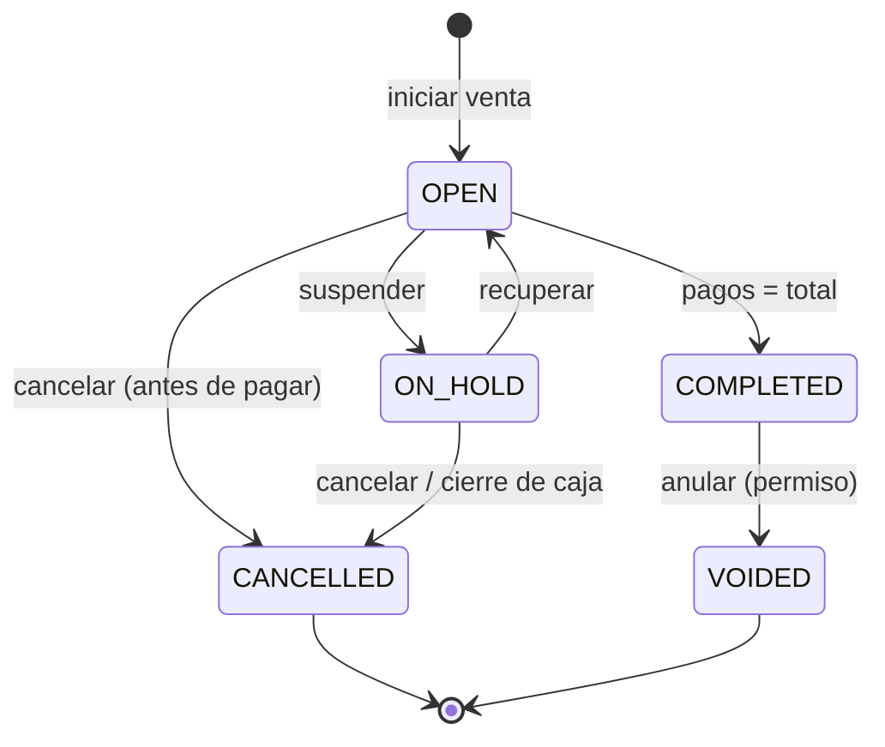
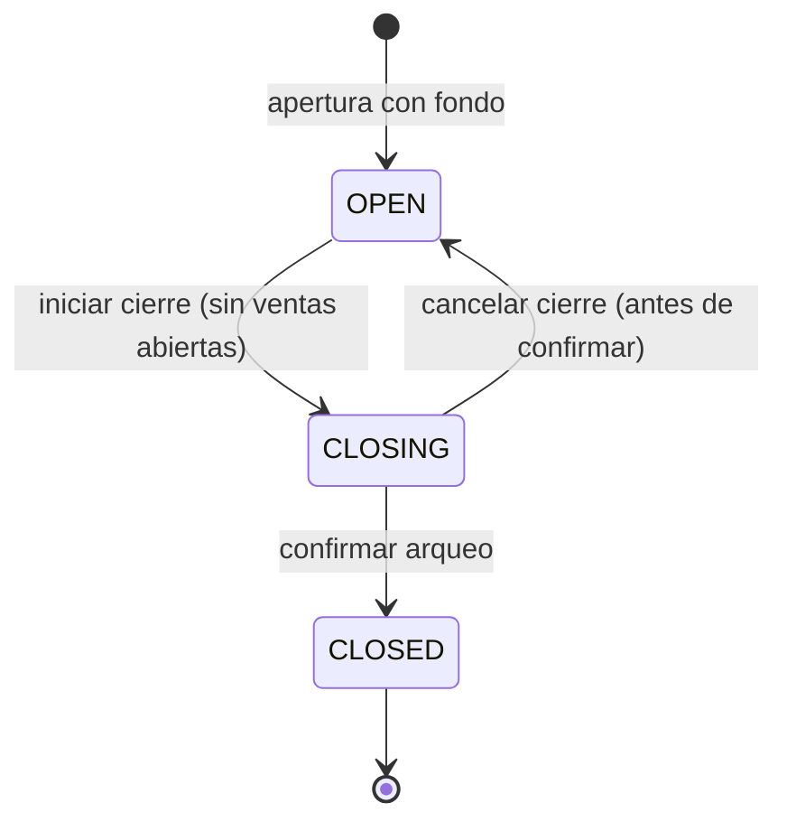
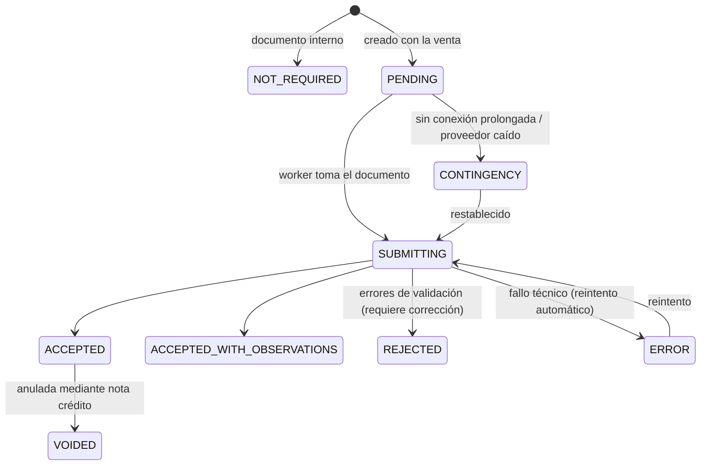

# 05 · Reglas de negocio (J) y estados

> Estado: **PROPUESTA — pendiente de aprobación**
> Cada regla tiene un código estable (`RN-XXX-nn`). Ese código se usará en el código fuente, en los errores devueltos por la API y en las pruebas automatizadas, para que cada regla sea **trazable de la documentación al test**.
> ⚙️ = configurable (con el valor por defecto propuesto).

## J. Reglas de negocio

### RN-GEN — Generales

| Código | Regla |
|---|---|
| RN-GEN-01 | Ningún documento contabilizado (`COMPLETED`, `POSTED`, `CLOSED`) se modifica ni se borra. Se corrige con un documento inverso (anulación, devolución, ajuste). |
| RN-GEN-02 | Ningún maestro con historial se borra físicamente; se inactiva. La BD lo impide con FK `RESTRICT`. |
| RN-GEN-03 | Todo documento almacena **snapshot** de los datos que lo definen (nombre, precio, impuestos, costo, cliente). Cambiar un producto nunca altera documentos históricos. |
| RN-GEN-04 | Toda modificación de maestros relevantes (precio, costo, impuesto, usuario, permisos, configuración) genera auditoría con valor anterior y nuevo. |
| RN-GEN-05 | Toda acción sensible exige permiso; si el usuario no lo tiene, puede autorizarla un supervisor (queda registrado quién autorizó). |
| RN-GEN-06 | *(Redacción v2, Fase 2 — ADR-0013)* **Fiscal:** consecutivo y sin repetir dentro del rango autorizado (lo asigna el proveedor de facturación electrónica). **Interno:** único por serie, asignado al contabilizar dentro de la transacción del documento, nunca reutilizado ni recalculado; sin huecos en operación normal y con **huecos justificados** (evento `NUMBERING_GAP`) solo ante restauraciones o pérdida de una caja autónoma. |
| RN-GEN-07 | Todo importe se calcula con decimales exactos; el redondeo se aplica en puntos definidos (línea → impuesto por línea → total) y cualquier diferencia de redondeo se registra explícitamente. |
| RN-GEN-08 | Las fechas se guardan en UTC; los documentos operativos tienen además `business_date` = fecha de la jornada de caja (o del día contable). |
| RN-GEN-09 | Una operación crítica repetida con la misma clave de idempotencia devuelve el mismo resultado sin duplicar efectos. |
| RN-GEN-10 | Las operaciones solo se ejecutan si la funcionalidad está incluida en la licencia vigente (excepto consulta de datos, backups y exportación, que siempre están disponibles). |

### RN-CAT — Catálogo

> Implementadas en la Fase 4 ([informe](fases/fase-04-informe.md)): códigos únicos sobre el código normalizado (UPC-A → EAN-13) con dígito de control; RN-CAT-02 se evalúa al escanear (`isSellable` + motivos); RN-CAT-06 advierte o bloquea (`catalog.price_below_cost`); RN-CAT-07 configurable (`catalog.block_discontinue_with_stock`).

| Código | Regla |
|---|---|
| RN-CAT-01 | SKU único por empresa. Código de barras único por empresa (un código identifica exactamente un producto/presentación). |
| RN-CAT-02 | Un producto activo debe tener: categoría, unidad base, al menos un impuesto (aunque sea "excluido"/0 %) y precio en la lista por defecto para poder venderse. |
| RN-CAT-03 | Productos por peso/volumen permiten cantidades decimales; productos por unidad no, salvo configuración explícita. |
| RN-CAT-04 | El factor de una presentación es > 0 y se expresa en la unidad base. |
| RN-CAT-05 | Los cambios de precio no sobrescriben: cierran la vigencia anterior y crean una nueva (historial completo). No puede haber dos precios vigentes solapados para la misma combinación. |
| RN-CAT-06 | Precio de venta por debajo del costo ⚙️ (advertencia por defecto; puede bloquearse). |
| RN-CAT-07 | Un producto con stock distinto de cero no puede pasar a `DISCONTINUED` sin ajustar el stock ⚙️. |
| RN-CAT-08 | Cambiar la unidad base de un producto con movimientos está prohibido (se crea un producto nuevo). |

### RN-INV — Inventario

> Implementadas en la Fase 4, salvo RN-INV-08/09 (lotes y vencimientos: estructura lista, gestión en la Fase 5). RN-INV-04: umbral `inventory.adjustment_approval_threshold` ($500.000 por defecto); el saldo inicial no pasa por el umbral pero solo lo publica quien tiene `inventory.adjustment.approve`. RN-INV-11: verificación diaria y manual; ninguna diferencia se corrige en silencio.

| Código | Regla |
|---|---|
| RN-INV-01 | El stock **solo** cambia por un movimiento de kardex asociado a un documento origen. No existe "editar stock". |
| RN-INV-02 | Los movimientos son inmutables; un error se corrige con un movimiento inverso que referencia al original. |
| RN-INV-03 | Venta sin stock suficiente: **bloqueada** por defecto ⚙️ (`inventory.allow_negative_stock`, por empresa/bodega/producto). Si se permite, se registra y se reporta como alerta. |
| RN-INV-04 | Todo ajuste requiere motivo; ajustes mayores a un umbral ⚙️ (cantidad o valor) requieren aprobación. |
| RN-INV-05 | El costo promedio ponderado se recalcula solo con entradas valorizadas (compra, devolución de cliente al costo de la venta, traslado de entrada al costo de origen). Las salidas se valoran al costo promedio vigente. |
| RN-INV-06 | Un conteo físico congela el saldo teórico al iniciar (`snapshot_at`); los movimientos posteriores se consideran al calcular la diferencia. |
| RN-INV-07 | Un traslado descuenta del origen al despachar y suma al destino al recibir; mientras tanto la mercancía está "en tránsito". Las diferencias al recibir se registran como faltante/sobrante del traslado. |
| RN-INV-08 | Productos con lote exigen lote en toda entrada; salidas por FEFO (primero en vencer, primero en salir) ⚙️. |
| RN-INV-09 | No se vende un lote vencido ⚙️. |
| RN-INV-10 | Los servicios (`SERVICE`) no generan movimientos de inventario. |
| RN-INV-11 | El saldo (`stock_balances`) debe ser siempre igual a la suma del kardex; existe un proceso de verificación/reconstrucción. |

### RN-PUR — Compras

| Código | Regla |
|---|---|
| RN-PUR-01 | Una compra solo afecta inventario y costos al **contabilizarse** (`POSTED`), no en borrador. |
| RN-PUR-02 | No se puede registrar dos veces la misma factura de un proveedor (UQ proveedor + número de factura). |
| RN-PUR-03 | Una compra a crédito genera una cuenta por pagar; una de contado pagada desde caja genera movimiento de caja (requiere caja abierta). |
| RN-PUR-04 | La recepción contra orden de compra no puede exceder lo pedido más una tolerancia ⚙️ (0 %). |
| RN-PUR-05 | Una compra contabilizada solo se anula si ningún producto de ella tuvo salida posterior que deje el stock negativo, o mediante devolución a proveedor. Requiere permiso. |
| RN-PUR-06 | Una devolución a proveedor no puede exceder lo comprado menos lo ya devuelto; descuenta inventario al costo de la compra y reduce la cuenta por pagar o genera saldo a favor. |
| RN-PUR-07 | Un proveedor `BLOCKED` no admite nuevas órdenes ni compras. |
| RN-PUR-08 | Los pagos a proveedores no pueden exceder el saldo de las cuentas que aplican. |

### RN-SAL — Ventas / POS

| Código | Regla |
|---|---|
| RN-SAL-01 | No se puede iniciar una venta sin una jornada de caja `OPEN` en esa caja, perteneciente al usuario (o autorizado). |
| RN-SAL-02 | Solo se agregan productos `ACTIVE` con precio vigente. Productos inactivos o sin precio → error explícito. |
| RN-SAL-03 | La cantidad debe ser > 0; decimales solo si el producto lo permite. |
| RN-SAL-04 | Descuentos: el cajero puede hasta X % ⚙️ (5 %); por encima requiere autorización. Un descuento nunca produce precio negativo. |
| RN-SAL-05 | Precio abierto/modificado: solo en productos que lo permiten y con permiso. |
| RN-SAL-06 | Eliminar una línea de una venta en curso **no la borra**: la marca `VOIDED` con usuario y hora. Opcionalmente exige autorización ⚙️ (no). |
| RN-SAL-07 | Una venta puede suspenderse (`ON_HOLD`) y recuperarse solo en la misma sucursal ⚙️ (misma caja). Máximo de ventas suspendidas por caja ⚙️ (10). Las ventas suspendidas al cerrar la caja deben recuperarse o cancelarse. |
| RN-SAL-08 | Cancelar una venta en curso (antes de pagar) requiere motivo ⚙️ y queda auditada. No consume número de documento. |
| RN-SAL-09 | Para completar: Σ `amount_applied` de pagos = total. Solo métodos con `allows_change` (efectivo) pueden entregar más que el saldo; los demás no pueden exceder el saldo pendiente. |
| RN-SAL-10 | Métodos que requieren referencia (transferencia, voucher) no se aceptan sin ella. |
| RN-SAL-11 | Completar una venta es atómico: número, stock, caja, documento fiscal pendiente y outbox en una sola transacción. |
| RN-SAL-12 | Una venta completada no se edita. Solo se **anula** (mismo día y jornada abierta ⚙️, con permiso y motivo) o se **devuelve** (total/parcial). La anulación revierte inventario y caja y genera el documento fiscal correspondiente. |
| RN-SAL-13 | Venta sin cliente = "Consumidor final". Si el monto supera el tope legal para facturar a consumidor final ⚙️ o el cliente pide factura, se exige identificación. |
| RN-SAL-14 | La reimpresión de tiquetes queda auditada y marcada como "COPIA". |
| RN-SAL-15 | El costo de la línea se fija al completar (costo promedio vigente) para calcular utilidad histórica. |
| RN-SAL-16 | La lectura de código de peso variable toma el PLU y el peso/precio del código; si el precio embebido difiere del precio actual se usa el embebido ⚙️. |

### RN-RET — Devoluciones de clientes

| Código | Regla |
|---|---|
| RN-RET-01 | Toda devolución referencia una venta `COMPLETED`; la devolución sin tiquete requiere permiso especial ⚙️ (deshabilitada). |
| RN-RET-02 | Cantidad devuelta por línea ≤ vendida − ya devuelta. |
| RN-RET-03 | Plazo máximo desde la venta ⚙️ (30 días). |
| RN-RET-04 | Motivo obligatorio. Destino obligatorio: vuelve a stock vendible, a bodega de averías o se descarta (con su movimiento respectivo). |
| RN-RET-05 | El reintegro en efectivo requiere caja abierta con efectivo suficiente ⚙️ y genera movimiento de caja. El reintegro no puede superar lo pagado por las líneas devueltas (proporcional a descuentos). |
| RN-RET-06 | Genera nota crédito fiscal si la venta tenía documento fiscal electrónico. |
| RN-RET-07 | Actualiza `return_status` de la venta (`PARTIALLY_RETURNED` / `FULLY_RETURNED`). |

### RN-CSH — Caja

| Código | Regla |
|---|---|
| RN-CSH-01 | Una caja tiene como máximo una jornada no cerrada. Un cajero tiene como máximo una jornada abierta ⚙️. |
| RN-CSH-02 | No se puede cerrar una caja que no está abierta. No se puede operar (vender, retirar, ingresar) en una caja cerrada. |
| RN-CSH-03 | Al iniciar el cierre (`CLOSING`) no se admiten nuevas ventas; debe resolverse toda venta `OPEN`/`ON_HOLD`. |
| RN-CSH-04 | Efectivo esperado = fondo inicial + ventas en efectivo − cambio + ingresos − retiros − gastos − reintegros − pagos a proveedor desde caja. Se calcula del registro de movimientos, nunca se digita. |
| RN-CSH-05 | Diferencia = contado − esperado. Diferencias mayores a un umbral ⚙️ requieren observación y revisión del supervisor. |
| RN-CSH-06 | Retiros (sangrías) requieren permiso/autorización y no pueden dejar el efectivo esperado en negativo. |
| RN-CSH-07 | Cada apertura de cajón sin venta se registra (`NO_SALE_DRAWER_OPEN`) con motivo. |
| RN-CSH-08 | El cierre es definitivo. Reabrir una jornada cerrada no está permitido; las correcciones se hacen en la siguiente jornada con movimientos explícitos. |
| RN-CSH-09 | Arqueo ciego ⚙️ (activado): el cajero registra su conteo sin ver el esperado. |
| RN-CSH-10 | Aviso de jornada abierta por más de X horas ⚙️ (16 h) o de un día anterior. |

### RN-SEC — Usuarios y seguridad

> Implementadas en la Fase 3 (ver [informe](fases/fase-03-informe.md)); la condición de jornada abierta de RN-SEC-07 llega en la Fase 6.

| Código | Regla |
|---|---|
| RN-SEC-01 | Contraseñas: mínimo 8 caracteres ⚙️ (máx. 128); nunca en texto plano; hash Argon2id; no reutilizar las últimas 5 ⚙️; distinta del usuario y fuera de la lista de contraseñas comunes. PIN de 4–6 dígitos ⚙️, no trivial (0000, 1234…), solo válido en cajas emparejadas. |
| RN-SEC-02 | Bloqueo tras 5 intentos fallidos ⚙️ durante 15 min ⚙️; el PIN se bloquea tras 3 intentos ⚙️ sin impedir la entrada con contraseña. Además, límite por IP en `/auth/*` y `/devices/pair`. Los mensajes no revelan si el usuario existe. |
| RN-SEC-03 | Un usuario no puede autorizarse a sí mismo acciones que requieren supervisor (CHECK en la BD). La autorización es de un solo uso, vence en 120 s ⚙️ y queda ligada al permiso, la acción y el objetivo. |
| RN-SEC-04 | Debe existir siempre al menos un usuario activo con rol de administrador (no se puede desactivar el último). |
| RN-SEC-05 | Un usuario no puede concederse permisos a sí mismo ni asignar roles con más privilegios que los propios. |
| RN-SEC-06 | Sesiones expiran por inactividad ⚙️ (caja: 15 min bloqueo de pantalla; backoffice: 30 min). |
| RN-SEC-07 | Desactivar un usuario revoca sus sesiones. Un usuario con caja abierta no puede desactivarse sin cerrar/transferir la jornada. |

### RN-FIS — Facturación

| Código | Regla |
|---|---|
| RN-FIS-01 | Una venta completada tiene exactamente un documento fiscal principal; anulaciones y devoluciones generan documentos relacionados (notas). |
| RN-FIS-02 | La falla del proveedor fiscal nunca revierte ni bloquea una venta: el documento queda `PENDING`/`CONTINGENCY` y se reintenta. |
| RN-FIS-03 | No se emite con una resolución vencida o agotada; alerta al llegar al 90 % del rango o 30 días del vencimiento ⚙️. |
| RN-FIS-04 | El documento fiscal aceptado es inmutable; se corrige con nota crédito/débito. |

### RN-LIC — Licencia

| Código | Regla |
|---|---|
| RN-LIC-01 | La pérdida de conexión con el servidor de licencias **nunca** interrumpe ventas mientras el token firmado local esté vigente o en periodo de gracia. |
| RN-LIC-02 | Una restricción por licencia **nunca** afecta a una venta en curso ni a una jornada ya abierta: se aplica al intentar abrir una nueva jornada. |
| RN-LIC-03 | *(Redacción v2, Fase 2 — ADR-0015)* Sin límite de cajas. La edición **Caja Única** admite exactamente una caja (`LICENSE.EDITION_SINGLE_TERMINAL`); la edición **Multicaja**, cajas y equipos administrativos ilimitados. |
| RN-LIC-04 | Con licencia vencida/restringida siempre se permite: consultar, reportar, exportar, respaldar y restaurar datos. Los datos son del cliente. |
| RN-LIC-05 | Un retroceso del reloj del sistema mayor a la tolerancia ⚙️ (24 h) respecto al máximo observado exige verificación en línea. |

---

## Estados

Principios: nombres en inglés, mayúsculas, sin abreviaturas; **cada estado tiene un significado único** y las transiciones válidas están definidas en el dominio (máquina de estados) y probadas. Los aspectos independientes se modelan como **dimensiones separadas** (p. ej. estado de la venta ≠ estado de devolución ≠ estado fiscal).

### Ventas (`sales.status`)

| Estado | Significado |
|---|---|
| `OPEN` | Venta en curso en la caja (carrito persistido). Sin número, sin efecto en inventario/caja. |
| `ON_HOLD` | Suspendida para atender a otro cliente. Sin efectos. |
| `CANCELLED` | Abandonada antes de pagar. Sin efectos. Sin número. Auditada. |
| `COMPLETED` | Pagada. Tiene número, afectó inventario y caja, tiene documento fiscal. |
| `VOIDED` | Venta completada anulada totalmente con reversión de inventario, caja y documento fiscal. |

Dimensión separada `return_status`: `NONE` → `PARTIALLY_RETURNED` → `FULLY_RETURNED`.

### Compras

| Entidad | Estados |
|---|---|
| Orden de compra | `DRAFT` → `APPROVED` → `SENT` → `PARTIALLY_RECEIVED` → `RECEIVED` → `CLOSED`; `CANCELLED` desde `DRAFT/APPROVED/SENT` |
| Compra (recepción) | `DRAFT` → `POSTED` → `VOIDED` |
| Cuenta por pagar | `OPEN` → `PARTIALLY_PAID` → `PAID`; `VOIDED` |
| Devolución a proveedor | `DRAFT` → `POSTED` → `SETTLED` (nota/reintegro recibido); `CANCELLED` desde `DRAFT` |

### Devoluciones de clientes

`DRAFT` (seleccionando) → `COMPLETED` (inventario, caja y fiscal afectados) · `CANCELLED` desde `DRAFT`.

### Productos (`catalog.products.status`)

| Estado | Venta | Compra | Visible en búsquedas |
|---|---|---|---|
| `ACTIVE` | ✅ | ✅ | ✅ |
| `INACTIVE` | ❌ | ❌ | solo backoffice (temporal: p.ej. temporada) |
| `DISCONTINUED` | ❌ (se liquida stock con permiso ⚙️) | ❌ | solo backoffice, histórico |
| (borrado lógico `deleted_at`) | — | — | solo auditoría; solo si nunca tuvo movimientos |

### Inventario

| Entidad | Estados |
|---|---|
| Ajuste | `DRAFT` → `PENDING_APPROVAL` (si supera umbral) → `POSTED`; `CANCELLED` desde `DRAFT/PENDING_APPROVAL` |
| Conteo físico | `DRAFT` → `IN_PROGRESS` (snapshot tomado) → `IN_REVIEW` (reconteos) → `POSTED` (genera ajuste) ; `CANCELLED` |
| Traslado | `DRAFT` → `IN_TRANSIT` → `RECEIVED` / `RECEIVED_WITH_DIFFERENCES`; `CANCELLED` desde `DRAFT` |
| Lote | `AVAILABLE`, `QUARANTINE`, `EXPIRED`, `EXHAUSTED` |

### Cajas

| Entidad | Estados |
|---|---|
| Caja/terminal (`pos_terminals`) | `ACTIVE`, `INACTIVE`, `BLOCKED` (por seguridad o por límite de licencia) |
| Jornada (`cash_sessions`) | `OPEN` → `CLOSING` (contando, no vende) → `CLOSED`. Dimensión de revisión: `reviewed_at` nulo = pendiente de revisión |

### Usuarios

`ACTIVE` · `LOCKED` (temporal, por intentos fallidos o manual) · `DISABLED` (baja). `must_change_password` es un indicador aparte, no un estado.

### Facturas / documentos fiscales (`fiscal_status`)

### Licencias (servidor central)

| Estado | Significado |
|---|---|
| `PENDING_ACTIVATION` | Emitida, sin instalación asociada |
| `ACTIVE` | Asociada y vigente |
| `SUSPENDED` | Suspendida manualmente (fraude, falta de pago tras gracia) |
| `EXPIRED` | Fin de periodo sin renovación |
| `REVOKED` | Anulada definitivamente |

Estado **local** de aplicación de la licencia (lo que ve el POS): `VALID` · `VALID_OFFLINE` (sin conexión, token vigente) · `GRACE` (token vencido, dentro de gracia) · `RESTRICTED` (fuera de gracia: solo lectura/exportar/backup) · `UNLICENSED` (sin activar: modo demostración).

### Suscripciones

`TRIALING` → `ACTIVE` → `PAST_DUE` (pago pendiente, en gracia) → `SUSPENDED` → `CANCELLED` / `EXPIRED`. `ACTIVE` → `CANCELLED` (cancelación al final del periodo con `cancel_at_period_end`).
