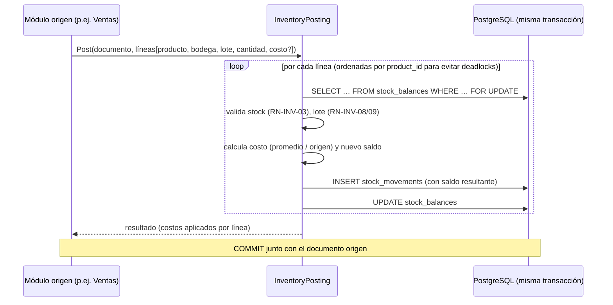

# 07 · Sistema de inventario y kardex (L)

> Estado: **PROPUESTA — pendiente de aprobación**

## Principio central

> **El stock es la consecuencia de los movimientos, no un número que se edita.**

```
stock(producto, bodega, fecha) = Σ (direction × quantity) de stock_movements hasta esa fecha
```

`stock_balances` es un **caché transaccional** de esa suma (para vender rápido), actualizado en la misma transacción que el movimiento y verificable/reconstruible en cualquier momento (RN-INV-11).

## Tipos de movimiento

| `movement_type` | Dir. | Documento origen | Valorización | Afecta costo promedio |
|---|---|---|---|---|
| `INITIAL_BALANCE` | + | Carga inicial | Costo indicado | ✅ |
| `PURCHASE_RECEIPT` | + | Compra (`POSTED`) | Costo neto de la compra (incluye descuentos y cargos prorrateados; excluye IVA descontable) | ✅ |
| `SALE` | − | Venta (`COMPLETED`) | Costo promedio vigente | ❌ |
| `SALE_VOID` | + | Anulación de venta | Costo de la salida original | ✅ (reentrada al mismo costo) |
| `CUSTOMER_RETURN` | + | Devolución de cliente (a stock vendible) | Costo de la línea de venta original | ✅ |
| `CUSTOMER_RETURN_DAMAGED` | + | Devolución a bodega de averías | Costo de la venta original | ✅ (en bodega de averías) |
| `SUPPLIER_RETURN` | − | Devolución a proveedor | Costo de la compra original | ✅ (salida valorada a costo de compra) |
| `ADJUSTMENT_IN` | + | Ajuste | Costo promedio vigente | ❌ |
| `ADJUSTMENT_OUT` | − | Ajuste | Costo promedio vigente | ❌ |
| `LOSS` | − | Ajuste (motivo pérdida/robo) | Costo promedio | ❌ |
| `DAMAGE` | − | Ajuste (daño) | Costo promedio | ❌ |
| `EXPIRY` | − | Ajuste (vencimiento) | Costo promedio (del lote) | ❌ |
| `INTERNAL_USE` | − | Ajuste (consumo interno) | Costo promedio | ❌ |
| `TRANSFER_OUT` | − | Traslado (`IN_TRANSIT`) | Costo promedio origen | ❌ |
| `TRANSFER_IN` | + | Traslado (`RECEIVED`) | Costo del `TRANSFER_OUT` | ✅ (en destino) |
| `COUNT_ADJUSTMENT_IN` | + | Conteo físico (`POSTED`) | Costo promedio | ❌ |
| `COUNT_ADJUSTMENT_OUT` | − | Conteo físico (`POSTED`) | Costo promedio | ❌ |
| `REVERSAL` | ± | Reversión de un movimiento erróneo | Igual al original | según original |

Los motivos (`adjustment_reasons`) son configurables pero cada uno se mapea a uno de estos tipos fijos → los reportes siempre se pueden agrupar.

## Flujo de una publicación de inventario

Todos los módulos (ventas, compras, ajustes, traslados, devoluciones) usan **un único servicio**: `IInventoryPosting`.



- **Orden de bloqueo determinista** (por `product_id`) → sin *deadlocks* entre cajas.
- **Conversión de unidades**: el módulo origen envía cantidades en la presentación; `IInventoryPosting` guarda siempre `quantity` en **unidad base** (6 × "Paquete x6" = 36 UND).
- Si el producto es `SERVICE` → no genera movimiento (RN-INV-10).

## Costo promedio ponderado

Al registrar una entrada que afecta costo:

```
nuevo_costo_promedio = (saldo_qty × costo_prom_actual + qty_entrada × costo_unit_entrada)
                       / (saldo_qty + qty_entrada)
```

Casos límite definidos:
- Si `saldo_qty ≤ 0` (stock negativo permitido) → el nuevo promedio es el costo de la entrada.
- El promedio es **por producto y bodega** (decisión propuesta; alternativa: por producto a nivel empresa — ver decisiones en doc 12).
- Precisión interna de 4 decimales; el costo total del movimiento = qty × costo unitario redondeado a 4 decimales.

## Kardex (consulta)

Para un producto + bodega + rango de fechas:

| Fecha | Documento | Tipo | Entrada | Salida | Saldo | Costo unit. | Costo total | Costo promedio | Usuario |
|---|---|---|---|---|---|---|---|---|---|
| 01/10 08:00 | CMP-000045 | PURCHASE_RECEIPT | 48 | | 60 | 2.950 | 141.600 | 2.940 | ana |
| 01/10 09:14 | FV-C01-001233 | SALE | | 2 | 58 | 2.940 | 5.880 | 2.940 | juan |
| 01/10 18:00 | AJ-000012 | DAMAGE | | 1 | 57 | 2.940 | 2.940 | 2.940 | ana |

Cada fila responde **por qué cambió el inventario** y enlaza al documento que lo causó.

## Conteo físico

```mermaid
flowchart LR
  A[Crear conteo<br/>DRAFT: bodega, alcance, ciego?] --> B[Iniciar<br/>IN_PROGRESS: snapshot de saldos teóricos]
  B --> C[Registrar conteos<br/>(varios usuarios / terminales)]
  C --> D[Revisión IN_REVIEW<br/>diferencias, reconteo de líneas fuera de tolerancia]
  D --> E[Aprobar → POSTED<br/>genera ajuste con COUNT_ADJUSTMENT_IN/OUT]
```

- Diferencia = contado − (teórico al snapshot + movimientos posteriores al snapshot). Así se puede contar **sin cerrar la tienda**.
- Conteo ciego: el contador no ve el teórico.
- Productos del alcance no contados: configurable si se asumen en cero o se excluyen.

## Traslados

`DRAFT` → despacho (`TRANSFER_OUT` en origen; mercancía en tránsito) → recepción (`TRANSFER_IN` en destino por lo recibido; faltante registrado como diferencia del traslado, asignable a pérdida). En multisucursal futura, el traslado sincroniza entre tiendas.

## Lotes y vencimientos (plan Profesional+)

- Productos con `tracks_lots`: entrada exige lote y vencimiento; saldo por lote; salida por **FEFO** automática.
- Alertas: por vencer en N días ⚙️; vencidos → bloqueo de venta y sugerencia de ajuste `EXPIRY`.

## Alertas y reposición

- `stock_policies` (mín/máx/punto de pedido por bodega) → reporte de bajo mínimo y **sugerido de compra** = máx − (saldo + pedido pendiente).

## Verificación de integridad

- Tarea programada (y comando manual) que compara `stock_balances` vs Σ kardex; cualquier diferencia se reporta como incidente crítico (jamás se "corrige" en silencio).
