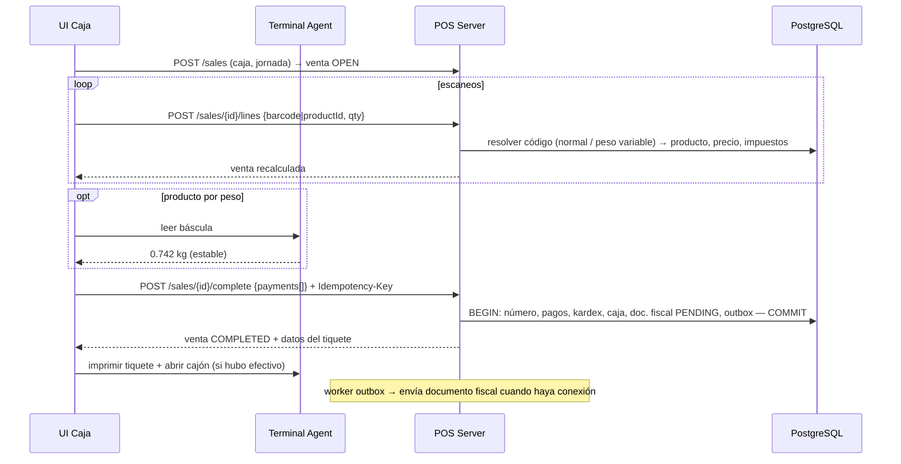
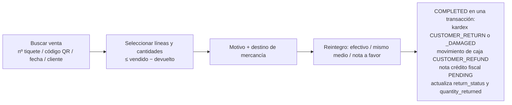
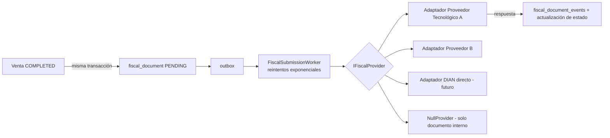

# 08 · Arquitectura del POS (M), caja, devoluciones y facturación

> Estado: **PROPUESTA — pendiente de aprobación**

## M. Arquitectura del POS

### Decisión: venta en curso persistida en el servidor

El carrito **no** vive solo en la memoria de la interfaz. Cada acción (agregar, cambiar cantidad, descuento, eliminar línea) es un comando a la API que actualiza la venta `OPEN` en la BD.

| Ventaja | Por qué importa en un supermercado |
|---|---|
| Resistente a fallos | Se va la luz o se cierra la app → al volver, la venta sigue ahí. |
| Antifraude | Las líneas eliminadas quedan registradas (`VOIDED`), no desaparecen. |
| Suspender/recuperar trivial | Es solo un cambio de estado. |
| Lógica en un solo lugar | Precios, impuestos y promociones los calcula el servidor; la UI solo muestra. |

Coste: una petición LAN por escaneo (~5–20 ms). Aceptable. El diseño permite, en el modo offline de caja (fase futura), ejecutar el mismo motor de cálculo localmente.

### Motor de cálculo de la venta (`SaleCalculator`, dominio puro)

Función determinista y 100 % probada con tests: recibe líneas + reglas → devuelve totales. Se usa en servidor y (futuro) en el terminal offline.

Para cada línea activa:
1. `bruto = unit_price × quantity`
2. `descuento_línea` (% o valor) → `neto = bruto − descuento`
3. Si el precio **incluye** impuestos porcentuales: `base = neto / (1 + Σ tasas)`; si no: `base = neto`.
4. `impuesto_i = redondear(base × tasa_i)` por cada impuesto porcentual; impuestos fijos por unidad = `valor × quantity`.
5. `line_total = base + Σ impuestos` (si el precio incluye impuesto, se fuerza `line_total = neto` y la diferencia de redondeo se absorbe en la base, para que el cliente pague exactamente el precio exhibido).

Totales: `subtotal = Σ base`, `tax_total = Σ impuestos`, descuento global prorrateado a las líneas (necesario para la base gravable fiscal), `rounding_adjustment` si la moneda redondea (p.ej. a $50), `total`.

### Flujo de una venta



### Pagos: reglas y algoritmo

1. Se reciben los pagos en cualquier orden.
2. Se aplican **primero los medios que no dan cambio** (tarjeta, transferencia, voucher); cada uno no puede exceder el saldo pendiente (RN-SAL-09).
3. El **efectivo** cubre el resto; si el efectivo entregado excede el saldo → `change_amount`.
4. `Σ amount_applied = total` exacto; si falta, la venta no se completa.

**Ejemplo pedido — venta de $100.000:**

| Pago | Entregado | Aplicado | Cambio |
|---|---|---|---|
| Transferencia (ref. 83921) | 50.000 | 50.000 | 0 |
| Efectivo | 50.000 | 50.000 | 0 |
| **Total** | 100.000 | **100.000** | 0 |

**Variante — el cliente entrega $60.000 en efectivo + $50.000 por transferencia:**

| Pago | Entregado | Aplicado | Cambio |
|---|---|---|---|
| Transferencia | 50.000 | 50.000 | 0 |
| Efectivo | 60.000 | 50.000 | **10.000** |

Movimiento de caja: +50.000 en efectivo (lo que efectivamente queda en el cajón = entregado − cambio). La transferencia **no** suma al efectivo esperado, pero sí al total esperado de su medio en el cierre.

**Caso inválido:** Transferencia $120.000 para una venta de $100.000 → rechazado (`SALES.NON_CASH_OVERPAYMENT`): un medio sin cambio no puede exceder el saldo.

### Operaciones del POS (API)

| Operación | Endpoint (propuesto) | Permiso |
|---|---|---|
| Iniciar venta | `POST /api/v1/sales` | `sales.sale.create` |
| Agregar línea (código/búsqueda/PLU) | `POST /sales/{id}/lines` | `sales.sale.create` |
| Cambiar cantidad | `PATCH /sales/{id}/lines/{lineId}` | `sales.sale.create` |
| Eliminar línea | `POST /sales/{id}/lines/{lineId}/void` | `sales.line.void` |
| Descuento línea/global | `POST /sales/{id}/discounts` | `sales.discount.apply` (+ `above_limit`) |
| Precio abierto | `POST /sales/{id}/lines/{lineId}/price` | `sales.price.override` |
| Asignar cliente | `PUT /sales/{id}/customer` | `sales.sale.create` |
| Suspender / recuperar | `POST /sales/{id}/hold` · `/resume` | `sales.sale.create` |
| Cancelar | `POST /sales/{id}/cancel` | `sales.sale.cancel` |
| Completar | `POST /sales/{id}/complete` | `sales.sale.create` |
| Anular completada | `POST /sales/{id}/void` | `sales.sale.void` |
| Reimprimir | `POST /sales/{id}/reprint` | `sales.sale.reprint` |
| Consultar precio | `GET /catalog/price-check?code=` | `catalog.product.view` |

### Códigos de peso/precio variable

Ejemplo EAN-13 `2 0 01234 01250 C` con regla *prefijo 20, PLU 5 dígitos, peso 5 dígitos con 3 decimales*:
→ PLU `01234`, peso `1.250 kg`. Si la regla es de precio: valor `012.50` → cantidad = precio / precio_kg.
Las reglas son configurables (`variable_barcode_rules`) porque cada marca de báscula etiquetadora usa su formato.

---

## Caja (punto 8)

> Implementado en la Fase 6 ([informe](fases/fase-06-informe.md), ADR-0027 a 0029): jornadas desde la caja emparejada (o el
> equipo Caja Única), movimientos de solo inserción, arqueo ciego por denominación y por medio, cierre en dos pasos, cierre por
> supervisor, revisión de diferencias y reportes X y Z (texto de 80 mm y JSON) con el sello de la auditoría. Gastos y pagos a
> proveedores (y compras de contado) desde la caja.

### Trazabilidad completa

```
Usuario (cajero) ─abre─▶ Jornada (cash_session) en Caja (pos_terminal) de Sucursal
      │                         │
      │                         ├── Ventas (sales.cash_session_id)
      │                         │       └── Pagos ─▶ Movimientos de caja
      │                         ├── Devoluciones ─▶ Movimientos de caja (reintegro)
      │                         ├── Ingresos / Retiros / Gastos ─▶ Movimientos de caja
      │                         ├── Aperturas de cajón sin venta
      │                         └── Arqueos (conteos por denominación)
      └─cierra─▶ Cierre: esperado vs contado por medio de pago ─▶ diferencia ─▶ revisión supervisor
```

### Cierre de caja

1. `CLOSING`: bloquea nuevas ventas; exige resolver ventas `OPEN`/`ON_HOLD`.
2. El cajero cuenta efectivo por denominación y registra totales de otros medios (vouchers de datáfono, transferencias).
3. El sistema calcula el esperado **desde los movimientos** (RN-CSH-04) — con arqueo ciego, el cajero no lo ve antes de confirmar.
4. `CLOSED`: se guardan `cash_session_totals` por medio, diferencias, se imprime **reporte Z**, se dispara backup ⚙️.
5. Diferencias sobre umbral → pendiente de revisión del supervisor (con observación).

Reporte **X** (parcial) disponible en cualquier momento sin cerrar.

---

## Devoluciones (punto 9)

### De clientes



El valor a reintegrar se calcula con los precios, descuentos e impuestos **de la venta original** (snapshot), no con los precios actuales.

### A proveedores

> Implementado en la Fase 5 (ADR-0026): la devolución descuenta de la cuenta por pagar la proporción del total de la línea con
> impuestos (`credit_total`); se liquida con nota crédito (queda la reducción), reintegro (asiento `REFUND`) o reposición (la
> mercancía vuelve a entrar al costo de la compra y la deuda se restablece).

Buscar compra → seleccionar líneas (≤ comprado − devuelto) → `POSTED`: kardex `SUPPLIER_RETURN` al costo de la compra, reduce la cuenta por pagar o registra saldo a favor (nota crédito del proveedor) → `SETTLED` cuando el proveedor emite la nota o reintegra el dinero.

---

## Facturación (punto 12)

### Separación de conceptos

| Concepto | Entidad | Pregunta que responde |
|---|---|---|
| Venta POS | `sales.sales` | ¿Qué se vendió, a quién, cómo se pagó? (operación comercial) |
| Documento interno | `billing.fiscal_documents` (kind `INTERNAL_RECEIPT`) | Comprobante interno cuando no aplica documento fiscal |
| Documento fiscal / factura | `billing.fiscal_documents` (kind `POS_ELECTRONIC`, `INVOICE_ELECTRONIC`) | ¿Cuál es la representación legal? |
| Número fiscal | `prefix` + `number` del rango autorizado | ¿Qué consecutivo legal tiene? |
| Estado de facturación | `fiscal_status` | ¿Fue aceptado por la autoridad/proveedor? |
| Respuesta del proveedor | `billing.fiscal_document_events` | ¿Qué respondió exactamente, cuándo, en qué intento? |
| Código único | `unique_code` (CUFE/CUDE) + `qr_data` | Validación legal del documento |

### Arquitectura de adaptadores



```csharp
public interface IFiscalProvider
{
    string Code { get; }
    Task<FiscalSubmissionResult> SubmitAsync(FiscalDocumentPayload doc, CancellationToken ct);
    Task<FiscalStatusResult> QueryStatusAsync(string providerDocumentId, CancellationToken ct);
    Task<FiscalSubmissionResult> SubmitCreditNoteAsync(FiscalDocumentPayload note, CancellationToken ct);
}
```

- `FiscalDocumentPayload` es un **modelo canónico** propio (emisor, adquirente, líneas, impuestos, totales, medios de pago) construido desde los snapshots de la venta. Cada adaptador lo traduce al formato de su proveedor (UBL 2.1 XML, JSON propio…).
- Cambiar de proveedor = escribir un adaptador; ventas, caja e inventario no cambian.
- **Contingencia**: sin conexión, el documento se numera y se entrega al cliente con su numeración y leyenda de contingencia según norma ⚙️; se transmite al restablecer la conexión.

> **Actualización Fase 2 (decisión del propietario):** el proveedor tecnológico será **Factus**, que asigna el número
> fiscal y el CUFE **en línea**. La venta se completa con su número interno y el documento fiscal queda `PENDING` sin
> número hasta que haya conexión (ADR-0013, revisión §10.3). Pendiente de validar con Factus y el contador antes de la
> Fase 7: documento equivalente POS, costo por volumen y tratamiento legal de la venta sin Internet.

> ⚠️ Ver **doc 12, riesgo R-01**: en Colombia el tiquete POS debe ser *documento equivalente electrónico* (DIAN). Esto afecta el alcance del plan Básico y el orden de las fases.
