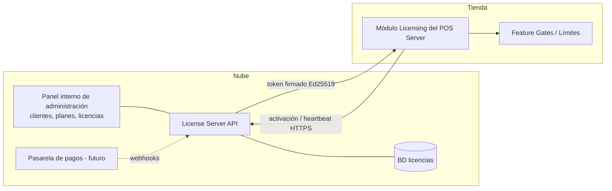
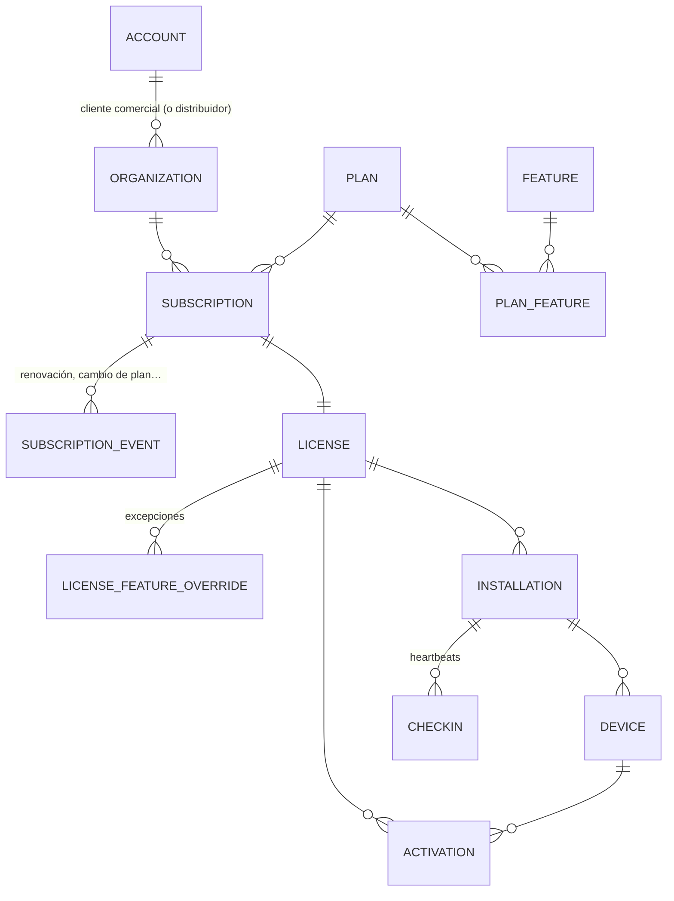
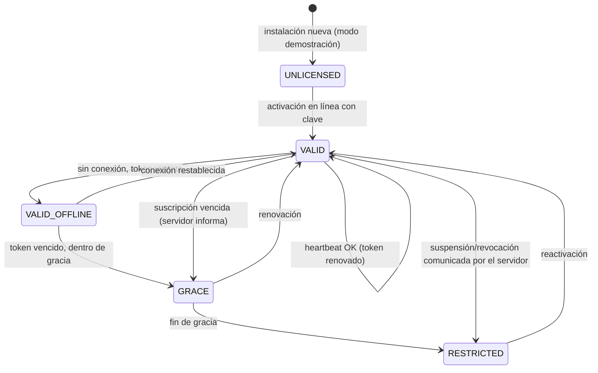

# 09 · Arquitectura de licenciamiento (N)

> Estado: **PROPUESTA — pendiente de aprobación** · El cobro de suscripciones **no** se implementa ahora; solo la arquitectura.

## Objetivos y restricciones

1. Vender por suscripción mensual con planes que habilitan **módulos** y **límites**.
2. **Nunca** detener ventas por falta de Internet (RN-LIC-01/02).
3. Dificultar el uso sin pagar, sin castigar al cliente honesto.
4. Los datos del cliente siempre le pertenecen: consulta, exportación y backup siempre disponibles (RN-LIC-04).

## Componentes



- **License Server**: proyecto separado (ASP.NET Core + PostgreSQL), desplegado en la nube.
- **Clave privada** Ed25519 solo en el servidor (idealmente en un KMS/HSM). La **clave pública** va embebida en el POS → el POS verifica licencias **sin conexión**.

## Modelo de datos del servidor de licencias



| Entidad | Campos principales |
|---|---|
| `accounts` | Cliente comercial/distribuidor: nombre, identificación fiscal, contacto, tipo (`DIRECT`,`RESELLER`) |
| `organizations` | Empresa/comercio licenciado: razón social, NIT, país, `account_id` |
| `plans` | `code` (`BASIC`,`PRO`,`ENTERPRISE`), nombre, precio de referencia, periodicidad, `is_public`, versión |
| `features` | Catálogo de funcionalidades: `code` (`purchasing.orders`, `inventory.lots`, `reporting.advanced`, `multi_branch`…), tipo (`BOOLEAN`/`LIMIT`) |
| `plan_features` | `plan_id, feature_code, enabled, limit_value` (ej. `max_terminals = 3`) |
| `subscriptions` | `organization_id, plan_id, status` (doc 05), `current_period_start/end`, `trial_ends_at`, `cancel_at_period_end`, `grace_days` |
| `subscription_events` | Historial: `CREATED`, `RENEWED`, `PLAN_CHANGED`, `SUSPENDED`, `REACTIVATED`, `CANCELLED`, con `old_plan/new_plan`, fechas, usuario |
| `licenses` | `license_key` (hash + prefijo visible), `subscription_id`, `status` (doc 05), `max_installations`, `issued_at` |
| `license_feature_overrides` | Habilitar/limitar una feature puntual para un cliente (promociones, pruebas) |
| `installations` | `installation_id` (generado en la tienda), `license_id`, sucursal declarada, versión de la app, `first_activated_at`, `last_checkin_at`, `status` |
| `devices` | Equipos de la instalación (servidor y cajas): `fingerprint_hash`, rol, hostname |
| `activations` | `license_id, device_id, activated_at, deactivated_at, status (ACTIVE/DEACTIVATED/REVOKED)`, motivo |
| `checkins` | Heartbeats: fecha, versión, nº de cajas activas, reloj reportado, IP, resultado |

## Planes (ejemplo configurable, no fijado en código)

| Feature / límite | Básico | Profesional | Empresarial |
|---|---|---|---|
| `max_terminals` | 1 | 3 | ilimitado (o por contrato) |
| `max_branches` | 1 | 1 | N |
| Ventas / caja / inventario / compras básicas | ✅ | ✅ | ✅ |
| Reportes básicos | ✅ | ✅ | ✅ |
| Órdenes de compra, CxP | — | ✅ | ✅ |
| Inventario avanzado (lotes, conteos cíclicos, traslados) | — | ✅ | ✅ |
| Reportes avanzados, utilidad, antifraude | — | ✅ | ✅ |
| Clientes avanzados (crédito, puntos) | — | ✅ | ✅ |
| Multisucursal, consolidación, backup en nube | — | — | ✅ |

## Token de licencia

Documento firmado (formato tipo JWS con Ed25519) que el servidor entrega en activación y en cada heartbeat:

```json
{
  "lic": "LIC-7F3A…", "org": "…", "inst": "installation-uuid",
  "dev": ["fingerprint-hash-servidor"],
  "plan": "PRO", "plan_version": 3,
  "features": ["sales","inventory","purchasing.orders","reporting.advanced"],
  "limits": { "max_terminals": 3, "max_branches": 1 },
  "sub_status": "ACTIVE",
  "iat": "2026-10-01T00:00:00Z",
  "valid_until": "2026-11-01T23:59:59Z",
  "grace_days": 7,
  "refresh_after": "2026-10-02T00:00:00Z"
}
```

- `valid_until` = fin del periodo pagado. **Mientras el token no venza, el POS funciona completo aunque no haya Internet.**
- `refresh_after` → el POS intenta renovar el token (heartbeat) diariamente ⚙️; si no puede, sigue funcionando con el token vigente.
- `grace_days` → días extra después de `valid_until` en los que el sistema sigue operando con avisos (cubre caídas de Internet coincidentes con la renovación, o pagos atrasados).

## Ciclo de vida local



| Estado local | Ventas | Nuevas jornadas | Administración | Consulta / reportes / backup / exportar |
|---|---|---|---|---|
| `VALID` / `VALID_OFFLINE` | ✅ | ✅ | ✅ | ✅ |
| `GRACE` | ✅ (con aviso visible) | ✅ | ✅ | ✅ |
| `RESTRICTED` | ✅ solo en jornadas ya abiertas | ❌ | ❌ | ✅ |
| `UNLICENSED` (demo) | ✅ limitado ⚙️ (p.ej. 30 días o N ventas, marca "DEMO") | ✅ | ✅ | ✅ |

## Activación, dispositivos y cambio de equipo

1. El instalador genera un `installation_id`; el servidor de tienda calcula un **fingerprint** (hash de identificadores estables: UUID de placa base, número de serie de disco del sistema, MachineGuid de Windows) — se guarda solo el hash.
2. El usuario ingresa la **clave de licencia** → `POST /activations` → el servidor valida límites (`max_installations`), registra instalación/dispositivo y devuelve el token.
3. Las **cajas adicionales** no se activan contra la nube: se emparejan con el servidor de la tienda, que controla `max_terminals` localmente (el límite viene en el token). El heartbeat informa el nº de cajas para detectar abuso.
4. **Cambio de PC** (equipo dañado): desactivar la activación anterior desde el panel (o autoservicio con límite de N cambios por año ⚙️) y activar en el nuevo; el backup restaurado conserva el `installation_id`.
5. **Tolerancia del fingerprint**: se aceptan cambios parciales de hardware (coincidencia de 2 de 3 componentes) para no bloquear por cambiar un disco.

## Guardas de funcionalidad (feature gates) en el POS

```csharp
app.MapPost("/api/v1/purchase-orders", ...)
   .RequirePermission("purchasing.order.create")
   .RequireFeature("purchasing.orders");
```

- Verificación **en el backend** (autoritativa). La UI solo oculta opciones.
- Límites: `ILicenseLimits.EnsureCanOpenSession(terminal)` cuenta cajas con jornada abierta (RN-LIC-03).
- Los permisos cuyo `requires_feature` no está en el plan se consideran denegados.

## Anti-manipulación (realista)

| Ataque | Mitigación |
|---|---|
| Editar el token / la BD | Firma Ed25519: cualquier cambio invalida el token. |
| Copiar la instalación a otro PC | Fingerprint en el token; al no coincidir → requiere reactivación en línea. |
| Atrasar el reloj del PC | `max_observed_clock` en BD + comparación con fechas de los últimos documentos; retroceso > 24 h → exige verificación en línea (RN-LIC-05). |
| Bloquear el acceso a Internet para siempre | El token vence en `valid_until + grace_days` → `RESTRICTED`. |
| Parchar el binario | Ofuscación, firma de código, verificación de integridad. Asumimos que un atacante determinado puede romperlo: el objetivo es que no valga la pena y que el cliente honesto nunca sufra. |

## API del servidor de licencias (borrador)

| Endpoint | Uso |
|---|---|
| `POST /v1/activations` | Activar clave en instalación/dispositivo → token |
| `POST /v1/checkins` | Heartbeat: estado, versión, cajas, reloj → token renovado + mensajes (avisos de pago, actualizaciones) |
| `POST /v1/deactivations` | Liberar un dispositivo |
| `GET /v1/licenses/{id}/status` | Consulta |
| Panel interno | CRUD de cuentas, organizaciones, planes, features, suscripciones, renovaciones, suspensiones, cambio de plan |

Cambio de plan / renovación / suspensión → se reflejan en el siguiente heartbeat (máx. 24 h) o de inmediato si el usuario pulsa "verificar licencia".
