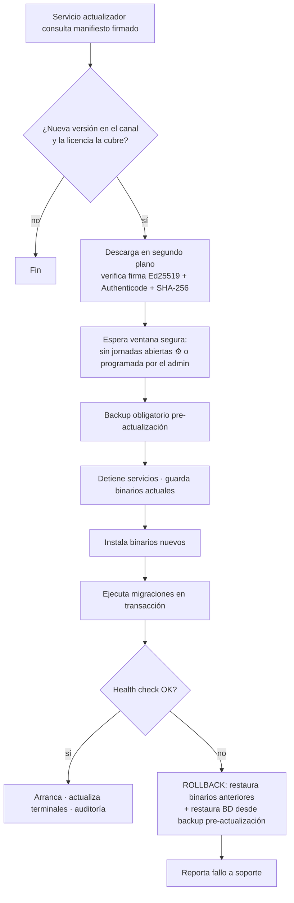

# 10 · Offline (O), backups (P), actualizaciones (Q) e instalador

> Estado: **PROPUESTA — pendiente de aprobación**

## O. Estrategia de funcionamiento offline

> **Actualización Fase 2 (decisiones del propietario):** cada venta sube a la nube en cuanto hay Internet; si un día no
> hubo conexión, la tienda exporta un **paquete `.possync`** (solo los eventos pendientes, cifrado) y se carga en el
> portal web desde otro equipo; el portal también permite editar maestros y descargar los cambios para la tienda. El
> **backup en la nube** se agrega como destino de la sección P. Ver [revisión §9–§10](fases/fase-02-revision-arquitectonica.md) y ADR-0014.

El sistema es **local-first**: la tienda es autónoma. Analizamos cada falla posible:

| Escenario | Impacto en ventas | Comportamiento |
|---|---|---|
| **Cae Internet** | ✅ Ninguno | Todo opera en la LAN. Se encolan: documentos fiscales (outbox), heartbeat de licencia, backups en nube, descarga de actualizaciones. Al volver, se procesan solos. |
| **Cae el servidor de licencias** | ✅ Ninguno | Token firmado vigente + gracia (doc 09). |
| **Cae el proveedor de facturación electrónica** | ✅ Ninguno | Documento en `PENDING`/`CONTINGENCY`; reintentos; alerta si supera el plazo legal de transmisión. |
| **Se va la luz en una caja** | ⚠️ Solo esa caja | La venta en curso está persistida; al reiniciar se recupera. (Recomendado: UPS en servidor y cajas.) |
| **Cae la red local o el PC servidor** (multi-caja) | ❌ en v1 las cajas terminales no pueden vender | **v1:** alerta inmediata + procedimiento de contingencia. **Fase futura "Caja autónoma":** ver abajo. |
| **Instalación todo-en-uno** (1 caja) | ✅ | El servidor es la propia caja; no depende de la red. |
| **Se daña el disco del servidor** | ❌ hasta restaurar | Backups (sección P) + procedimiento de recuperación en otro PC en < 1 h. |

### Caja autónoma (diseñada ahora, implementada después — decisión #4 en doc 12)

Para que una caja siga vendiendo si el servidor de tienda o la LAN fallan:

1. El Terminal Agent mantiene una **réplica local SQLite** de lo necesario para vender: productos activos, códigos, precios vigentes, impuestos, medios de pago, usuarios de caja (hash de PIN) — sincronizada continuamente.
2. En modo autónomo, la venta se calcula con el **mismo `SaleCalculator`** (dominio compartido) y se guarda en un **diario local** con UUID v7 generado en la caja y numeración de la **serie propia de la caja** (por eso las secuencias son por caja).
3. Al volver la conexión, el diario se sube con **idempotencia** (el mismo UUID nunca crea dos ventas); el servidor aplica kardex y caja. Conflictos de stock (ventas offline que dejan stock negativo) se registran como alerta, nunca se rechaza una venta ya entregada al cliente.
4. Lo que **no** se permite offline: devoluciones, anulaciones, cambios de precio, cierres de caja (se cierran al reconectar).

Todas las decisiones de la Fase 2 (UUID v7, secuencias por caja, idempotencia, snapshots, motor de cálculo en dominio puro) existen para que esto sea posible **sin rehacer nada**.

---

## P. Estrategia de backups

### Regla 3-2-1 adaptada a un supermercado

**3** copias, en **2** medios distintos, **1** fuera del local.

| Nivel | Qué | Cuándo | Dónde |
|---|---|---|---|
| 1. Automático programado | `pg_dump` formato custom, comprimido, **cifrado AES-256-GCM** | Cada N horas ⚙️ (4 h) en horario de operación + diario nocturno | Carpeta local (disco distinto al de la BD si existe) |
| 2. Al cerrar jornada | Igual | Tras cada cierre de caja ⚙️ | Local + destino secundario |
| 3. Antes de actualizar | Igual, **obligatorio** | Antes de toda migración | Local |
| 4. Externo | Copia del último backup | Diario | USB / disco externo / carpeta de red / **nube** (plan Empresarial o add-on) |
| 5. Manual | A demanda | Botón "Respaldar ahora" | Cualquier destino configurado |

- **Retención GFS** ⚙️: 7 diarios, 4 semanales, 12 mensuales + los de pre-actualización de las últimas 3 versiones.
- **Verificación**: cada backup se valida (`pg_restore --list` + checksum SHA-256); semanalmente se hace una **restauración de prueba** automática en una BD temporal y se ejecutan verificaciones (conteos, integridad del kardex). Un backup no verificado no cuenta como backup.
- **Historial** en `backup.backup_runs`, con alertas visibles si el último backup exitoso tiene más de X horas o si falla un destino.
- **Contenido del paquete**: dump de BD + configuración de la instalación + versión de esquema y app + manifiesto con hash. Nunca incluye la clave de cifrado en claro.
- **Clave de cifrado**: generada en la instalación; se entrega al propietario un **código de recuperación** (impreso/guardado) para poder restaurar en otro equipo. Sin él, el backup en nube no se puede leer ni siquiera por nosotros.

> **Implementado en la Fase 11** (ADR-0050 a 0052): paquete `.posbak` cifrado con AES-256-GCM, código de recuperación del propietario,
> destinos local, USB, red y nube S3 (MinIO en el VPS), programación (4 h, nocturno, cierre de jornada, antes de migrar, manual),
> retención 7/4/12, verificación inmediata, restauración de prueba semanal y restauración desde la consola
> ([guía de recuperación](guia-recuperacion.md)). La nube de backups está en ambas ediciones (no es un add-on).

### Restauración

1. Asistente "Restaurar": elegir archivo → verificar firma/hash → mostrar fecha, versión y datos de la empresa.
2. Backup automático del estado actual (por si se elige mal).
3. Detener servicios → restaurar en **BD nueva** → aplicar migraciones si el backup es de una versión anterior → validar → cambiar la BD activa → arrancar.
4. Auditoría del evento. Nunca se permite restaurar un backup de una **versión más nueva** que la app instalada.

### Recuperación ante pérdida total del PC servidor (objetivo < 1 h)

Instalar en PC nuevo → "Recuperar desde backup" en el asistente inicial → seleccionar backup (USB/red/nube) → código de recuperación → reactivar licencia en el nuevo dispositivo → re-emparejar cajas. **Pérdida máxima de datos (RPO)**: hasta el último backup (≤ 4 h por defecto; ≈ 0 con replicación/WAL en fase avanzada).

---

## Q. Estrategia de actualizaciones

### Versionado

- **SemVer** `MAYOR.MENOR.PARCHE` para la aplicación; **versión de esquema** de BD independiente (historial de migraciones de EF Core).
- **Canales**: `stable`, `beta` (clientes piloto), `internal`.
- **Compatibilidad**: la API está versionada (`/api/v1`); el servidor declara la versión mínima de terminal compatible; los terminales se actualizan desde el servidor de la tienda (no cada uno desde Internet).

### Flujo de actualización

### Reglas para migraciones seguras

1. Migraciones **solo hacia adelante** en producción y **probadas contra una copia de BD real anonimizada** antes de publicar.
2. Patrón **expand → migrate → contract**: agregar columnas/tablas nuevas primero; eliminar lo viejo en una versión posterior. Nunca se renombra ni se elimina una columna en la misma versión que deja de usarse.
3. Toda migración corre en transacción (PostgreSQL soporta DDL transaccional) → o se aplica completa o no se aplica.
4. Migraciones de datos grandes: por lotes, idempotentes y reanudables.
5. **Rollback**: binarios anteriores + restauración del backup pre-actualización. Por eso el backup previo es obligatorio y verificado.
6. Una actualización jamás borra datos del cliente; los datos obsoletos se archivan.

---

## Instalador (punto 20)

**Tecnología propuesta:** WiX Toolset (MSI + bootstrapper `.exe`). Alternativa más simple: Inno Setup.

| Paso | Detalle |
|---|---|
| 1. Modo | Todo en uno · Servidor · Caja (terminal) |
| 2. Prerrequisitos | App **self-contained** (.NET incluido, sin instalar runtime). WebView2 Runtime si falta. PostgreSQL **binarios empaquetados** (no el instalador interactivo de PostgreSQL). |
| 3. Base de datos | `initdb` en `C:\ProgramData\<Producto>\data`, puerto no estándar, solo localhost, contraseña aleatoria guardada con DPAPI, servicio `<Producto>-DB`. Creación de BD y roles, migraciones iniciales, datos semilla (permisos, roles, unidades, tipos de identificación, impuestos del país, medios de pago, consumidor final). |
| 4. Servicios | `<Producto>-Server` (API), `<Producto>-Updater`, `<Producto>-Agent` (en cajas). Inicio automático, recuperación automática ante fallos. |
| 5. Red | Regla de firewall solo para el puerto de la API en perfil de red privada (modo servidor). Certificado TLS autogenerado. |
| 6. Accesos directos | Escritorio y menú inicio (POS / Administración). |
| 7. Asistente inicial (primer arranque) | Datos de la empresa y fiscales → sucursal y caja → usuario propietario → activación de licencia (o demo) → ubicación de backups → prueba de impresora. O bien **"Recuperar desde backup"**. |
| 8. Caja adicional | Descubre el servidor en la LAN (difusión UDP/mDNS) o IP manual → código de emparejamiento. |
| 9. Desinstalación | Quita binarios y servicios; **conserva datos y backups por defecto** (opción explícita y con confirmación doble para eliminarlos, ofreciendo backup antes). |
| 10. Diagnóstico | Herramienta "Generar paquete de soporte" (logs, versión, estado de servicios; sin datos sensibles). |

Firma de código del instalador con **certificado de firma de código** (preferible EV) para evitar alertas de SmartScreen.
