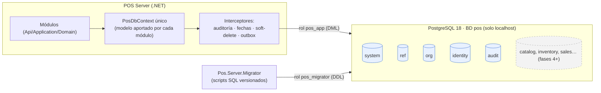
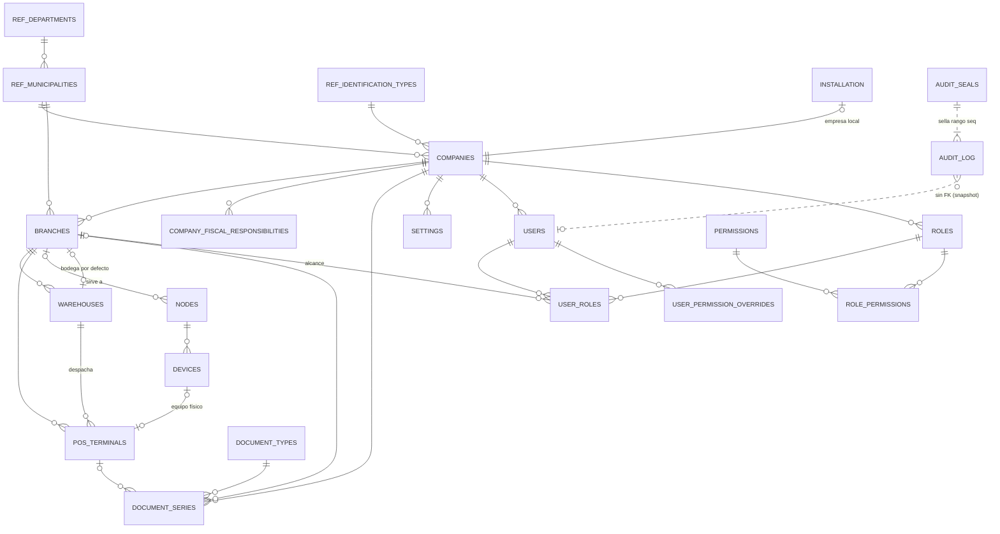

# Fase 2 · Arquitectura de datos y núcleo organizacional — Propuesta

> Estado: **APROBADA e IMPLEMENTADA (2026-09-28)** — ver el [informe de la fase](fase-02-informe.md). Incorpora la [revisión arquitectónica](fase-02-revision-arquitectonica.md) (cambios P1–P9) y las decisiones del propietario.
> Requisito previo: validación de la Fase 1 (`tools/scripts/service-smoke-test.ps1`).
>
> **Cambios de la v2:** BD por **nodo** y registro `org.nodes` · asistente con dos modos · bodegas únicas por sucursal · numeración interna separada de la fiscal (Factus asigna el número fiscal) · auditoría por nodo con horizonte seguro y anclas · reglas de configuración · convenciones de sincronización con la nube (`row_version`, outbox con consecutivo por nodo, inbox) · ediciones **Caja Única / Multicaja** sin límite de cajas.

**Convenciones del documento**
- 🔒 = **decisión difícil de cambiar después**. Cambiarla implicaría migrar datos existentes en clientes instalados, reescribir código de varios módulos o romper la sincronización futura. Se revisan en la §19.
- ✅ = regla de negocio de la Fase 1 que la decisión cumple (verificación en la §20).
- "Se crea en Fase N" = la tabla se diseña ahora pero se crea en la fase que la usa. Crear una tabla después es un cambio aditivo y seguro. Lo que **no** se puede posponer son las convenciones que todas las tablas deben respetar desde la primera.

## 0. Objetivo y alcance

La Fase 2 construye **la base de datos y las piezas de datos que todos los módulos usarán**. No incluye módulos de venta ni de inventario.

| Incluido | Excluido (fase) |
|---|---|
| PostgreSQL de desarrollo y pruebas (Docker/Testcontainers) | Login, sesiones, PIN, contraseñas (3) |
| Migraciones SQL versionadas + ejecutable migrador | Productos, inventario (4) |
| Roles y privilegios de la BD | Periféricos por caja (7) |
| Acceso a datos: `PosDbContext`, unidad de trabajo, transacción | Resoluciones DIAN (11-B) |
| Esquemas `system`, `ref`, `org`, `identity` (estructura RBAC), `audit` | Pantallas / UI (15) |
| Datos de referencia de Colombia (DIVIPOLA, tipos de identificación, responsabilidades fiscales…) | |
| Empresa, sucursales, bodegas, cajas, dispositivos + asistente de configuración inicial (API) | |
| Configuración general tipada con herencia empresa → sucursal → caja | |
| Numeración de documentos sin huecos | |
| Auditoría automática + sellado anti-manipulación por nodo | Anclas externas de auditoría (6, 11, 12) |
| Outbox, inbox e idempotencia (infraestructura) | Sincronización con la nube, portal web y paquetes `.possync` (fase nueva "Sincronización y portal web") |
| Convenciones de sincronización: nodos, `row_version`, `origin_node_id` | Backup en la nube (11) · Factus (11-B) |

---

## 1. Arquitectura de la base de datos



### Decisiones fundamentales

| # | Decisión | Por qué | |
|---|---|---|---|
| A1 | **Una base de datos por nodo** (servidor de tienda o equipo Caja Única; en el futuro, la nube), con **un esquema por módulo**. Cada nodo es el único escritor de los documentos de su sucursal | Transacciones ACID entre módulos (vender = venta + kardex + caja + fiscal). Los esquemas hacen visibles las fronteras | 🔒 |
| A2 | **Migraciones SQL-first**: scripts `.sql` versionados, escritos a mano, ejecutados por un migrador propio. **No** se usan las migraciones automáticas de EF Core | Usaremos lo que EF no genera bien: CHECK, índices parciales, `EXCLUDE`, particiones, triggers, privilegios. Los scripts son revisables, deterministas y los puede ejecutar el instalador/actualizador sin herramientas de desarrollo | 🔒 |
| A3 | **Un único `PosDbContext`**, cuyo modelo arman los módulos (cada uno aporta sus configuraciones de entidades) | Una sola transacción y un solo punto de interceptores (auditoría, outbox). Con un contexto por módulo habría que compartir conexión y transacción manualmente | Medio |
| A4 | Las **fronteras entre módulos** se aplican en el código, no en la BD. Un módulo solo toca sus tablas mediante sus repositorios; entre módulos, solo por `Contracts`. Las FK **entre esquemas sí existen** (integridad primero) | La BD garantiza integridad, la arquitectura garantiza desacople | — |
| A5 | EF Core para escritura/dominio; **Dapper** para lecturas pesadas (reportes, kardex) desde la Fase 4 | Cada herramienta en lo que hace bien | — |
| A6 | Una prueba de **conformidad modelo↔esquema** verifica que cada entidad, columna y tipo mapeado por EF exista en la BD real con el tipo esperado | Compensa no usar migraciones EF: si alguien mapea una columna inexistente, falla el build | — |

### Convenciones físicas (aplican a TODAS las tablas, de todas las fases)

| Elemento | Convención | |
|---|---|---|
| Nombres | `snake_case` inglés; tablas en plural; PK `id`; FK `<entidad>_id`; índices `ix_<tabla>__<cols>`, únicos `ux_…`, checks `ck_…`, FK `fk_…` | 🔒 |
| PK | `id uuid` — UUID v7 generado por la app (ADR-0004); default `uuidv7()` solo para scripts SQL | 🔒 |
| Dinero / cantidad / tasa | `numeric(19,4)` / `numeric(18,4)` / `numeric(9,4)` | 🔒 |
| Instantes | `timestamptz` (UTC). Nunca `timestamp` sin zona | 🔒 |
| Fecha de negocio | `business_date date` en documentos operativos | 🔒 |
| Estados y tipos | `varchar(30)` + `CHECK (col IN (...))`. **No** enums de PostgreSQL: no permiten quitar valores y complican las migraciones | 🔒 |
| Texto | `varchar(n)` con límite explícito; `text` solo para notas/payloads | — |
| Columnas de control | `created_at timestamptz NOT NULL`, `created_by uuid NOT NULL`, `updated_at`, `updated_by` (maestros) | 🔒 |
| Concurrencia optimista | Columna de sistema `xmin` como token (EF), sin columna extra | — |
| Borrado | Maestros: **borrado lógico** `deleted_at/deleted_by` + índices únicos parciales `WHERE deleted_at IS NULL`. Documentos: **nunca** se borran ✅RN-GEN-01/02 | 🔒 |
| FK | Siempre `ON DELETE RESTRICT ON UPDATE RESTRICT`; cascada solo en tablas puente puras | ✅RN-GEN-02 |
| Tenencia | `company_id` en toda tabla de negocio; `branch_id` en toda tabla operativa (§16) | 🔒 |
| Unicidad | Las claves únicas de negocio se definen en el **ámbito de quien crea el registro**: lo que crea una sucursal es único por sucursal (`branch_id`), nunca por empresa. Así dos tiendas sin conexión no pueden chocar | 🔒 |
| Versión para sincronizar | `row_version bigint NN DEFAULT 1` en todo **maestro sincronizable**; se incrementa en cada cambio. `xmin` sigue siendo el token de concurrencia local, pero no significa nada en otra BD | 🔒 |
| Nodo de origen | `origin_node_id uuid NN` en toda tabla de **documentos** (desde la Fase 4) y en la auditoría | 🔒 |
| Saldos | Los saldos (stock, crédito, puntos) **se derivan de movimientos** y nunca se sincronizan como valor | 🔒 |
| Codificación y colación | BD `UTF8`, proveedor **builtin `C.UTF-8`** (estable, rápido, no se rompe con actualizaciones de ICU). Para ordenar nombres en español se usa la colación ICU `es_co` de forma **explícita** en las consultas que la necesiten | 🔒 |
| Extensiones | `pg_trgm`, `btree_gist`, `unaccent` (todas *trusted*: no requieren superusuario). Se instalan en la línea base aunque se usen desde la Fase 4 | — |

> **Por qué la colación es 🔒:** la colación por defecto de una BD PostgreSQL no se puede cambiar sin recrearla. Si se usara la de Windows o ICU por defecto, una actualización del sistema operativo o de ICU podría cambiar el orden de los textos y **dejar índices inconsistentes**. Con `C.UTF-8` los índices son estables, y el orden alfabético en español (ñ, tildes) se aplica solo donde se muestra al usuario.

---

## 2. Esquemas

| Esquema | Módulo propietario | Fase | Contenido |
|---|---|---|---|
| `system` | Infraestructura | **2** | Instalación, migraciones, configuración, numeración, outbox, idempotencia |
| `ref` | Reference (nuevo módulo) | **2** | Catálogos de país: países, departamentos, municipios, tipos de identificación, responsabilidades fiscales, monedas |
| `org` | Organization | **2** | Empresas, sucursales, bodegas, cajas, dispositivos |
| `identity` | Identity | **2** estructura RBAC · **3** comportamiento | Usuarios, roles, permisos, asignaciones (sesiones y seguridad en la Fase 3) |
| `audit` | Audit | **2** | Bitácora particionada y sellos |
| `parties`, `catalog`, `inventory`, `purchasing`, `sales`, `cash`, `expenses`, `billing`, `licensing`, `backup` | Sus módulos | 3–12 | Según el doc 04 |

**Cambio respecto del doc 04:** se agrega el esquema `ref` para los catálogos oficiales, que no pertenecen a ningún módulo de negocio. `identification_types` pasa de `parties` a `ref`.

---

## 3. Tablas de la Fase 2

Notación: `NN` NOT NULL · `UQ` único · `FK→` · `CK` check · **[CTL]** columnas de control · **[DEL]** borrado lógico.

### 3.1 `system`

**system.schema_migrations** — la gestiona solo el migrador.
```
version        varchar(20) PK        — '2026.10.001'
module         varchar(30) NN        — 'system', 'org', …
description    varchar(200) NN
kind           varchar(12) NN CK IN ('VERSIONED','REPEATABLE')
checksum       char(64) NN           — SHA-256 del script
applied_at     timestamptz NN
applied_by     varchar(60) NN
execution_ms   integer NN
app_version    varchar(40) NN
```

**system.installation** — exactamente una fila.
```
id                  boolean PK DEFAULT true CK (id)   — garantiza fila única
installation_id     uuid NN UQ           — identidad de esta instalación = id del nodo (licencia, sync)
node_role           varchar(20) NN CK IN ('ALL_IN_ONE','STORE_SERVER')   — edición Caja Única / Multicaja
node_epoch          integer NN DEFAULT 1 — se incrementa al restaurar un backup (evita dos nodos idénticos)
home_company_id     uuid FK→org.companies      — NULL hasta completar el asistente
home_branch_id      uuid FK→org.branches
setup_mode          varchar(20) CK IN ('NEW_COMPANY','JOIN_COMPANY')
setup_completed_at  timestamptz
created_at          timestamptz NN
```
Cambiar de Caja Única a Multicaja solo modifica `node_role`: el esquema es idéntico en las dos ediciones.

**system.document_types** — catálogo semillado.
```
code            varchar(30) PK        — 'SALE','CUSTOMER_RETURN','PURCHASE','INVENTORY_ADJUSTMENT','CASH_SESSION',…
module          varchar(30) NN
name            varchar(80) NN
series_scope    varchar(10) NN CK IN ('BRANCH','TERMINAL')
default_prefix  varchar(6) NN         — 'FV','DV','CP','AJ','JC',…
```

**system.document_series** — numeración (§14).
```
id                 uuid PK
company_id         uuid NN FK→org.companies
branch_id          uuid NN FK→org.branches
pos_terminal_id    uuid FK→org.pos_terminals
document_type      varchar(30) NN FK→system.document_types
prefix             varchar(20) NN CK prefix ~ '^[A-Z0-9-]+$'   — GENERADO: {sucursal}{caja} o {sucursal}; no editable. NO es el prefijo fiscal
next_number        bigint NN CK > 0          — solo lo avanza el escritor de la serie (caja o sucursal)
padding            smallint NN CK BETWEEN 4 AND 12
status             varchar(20) NN CK IN ('ACTIVE','INACTIVE')
[CTL]
UX (company_id, document_type, prefix)                              🔒 unicidad global en la empresa
UX (branch_id, document_type) WHERE pos_terminal_id IS NULL AND status='ACTIVE'
UX (pos_terminal_id, document_type) WHERE pos_terminal_id IS NOT NULL AND status='ACTIVE'
CK series de alcance TERMINAL ⇒ pos_terminal_id NOT NULL (validado por trigger contra document_types)
```

**system.settings** — valores sobrescritos (§13).
```
id           uuid PK
company_id   uuid NN FK→org.companies
scope_type   varchar(10) NN CK IN ('COMPANY','BRANCH','TERMINAL')
scope_id     uuid NN            — company_id, branch_id o pos_terminal_id según scope_type
key          varchar(100) NN CK key ~ '^[a-z]+(\.[a-z_]+)+$'
value        jsonb NN
row_version  bigint NN DEFAULT 1
[CTL]
UX (scope_type, scope_id, key)
```
Las filas se borran físicamente (eliminar la excepción = volver a heredar); el borrado se audita y emite el evento `SettingChanged` con `value = null`, que es lo que se sincroniza.

**system.outbox_messages** — eventos locales (efectos internos) y **eventos de integración** que se sincronizan con la nube o viajan en el paquete `.possync`
```
id              uuid PK
node_seq        bigint NN UQ         — consecutivo del nodo: la nube confirma "recibí hasta N"; el paquete exporta desde N+1
occurred_at     timestamptz NN
destination     varchar(20) NN CK IN ('LOCAL','SYNC')
type            varchar(200) NN
payload         jsonb NN
correlation_id  varchar(64)
status          varchar(12) NN CK IN ('PENDING','PROCESSING','PROCESSED','FAILED')
attempts        integer NN DEFAULT 0
next_attempt_at timestamptz NN
locked_until    timestamptz
last_error      text
processed_at    timestamptz
IX parcial (next_attempt_at) WHERE status IN ('PENDING','FAILED')
```
`node_seq` sale de una secuencia; los huecos por *rollback* no importan porque la nube confirma rangos, no cuenta filas. Los mensajes `SYNC` procesados **no se purgan** hasta que la nube los confirma.

**system.inbox_messages** — eventos recibidos de otros nodos (nube, paquete `.possync`, caja autónoma) ya aplicados
```
message_id      uuid PK              — Id del evento en su nodo de origen
source_node_id  uuid NN
source_seq      bigint NN
type            varchar(200) NN
received_via    varchar(10) NN CK IN ('ONLINE','FILE')
applied_at      timestamptz NN
result          varchar(12) NN CK IN ('APPLIED','CONFLICT','IGNORED')
UX (source_node_id, source_seq)
```
Aplicar dos veces el mismo evento (reintento, paquete cargado dos veces o solapado con lo recibido en línea) no hace nada. La tabla se crea en la Fase 2; se usa en la fase de sincronización.

**system.sync_cursors** — hasta dónde confirmó cada contraparte: `peer_node_id PK, last_sent_seq, last_acked_seq, last_received_seq, updated_at`.

**system.idempotency_keys** ✅RN-GEN-09
```
key             varchar(100) NN
scope           varchar(60) NN      — 'sales.complete', etc.
request_hash    char(64) NN          — misma clave + otro contenido ⇒ 409
response_status smallint NN
response_body   jsonb
created_at      timestamptz NN
expires_at      timestamptz NN
PK (scope, key)
```

### 3.2 `ref` — catálogos oficiales (Colombia)

| Tabla | Clave | Campos | Fuente de los datos |
|---|---|---|---|
| `ref.countries` | `code char(2)` (ISO 3166-1) | `name`, `iso3`, `numeric_code`, `phone_prefix` | ISO 3166 |
| `ref.currencies` | `code char(3)` | `name`, `decimals`, `symbol` | ISO 4217 |
| `ref.departments` | `code varchar(5)` | `country_code FK`, `name` | DANE DIVIPOLA |
| `ref.municipalities` | `code varchar(8)` (DIVIPOLA, 5 dígitos) | `department_code FK`, `name` | DANE DIVIPOLA (~1.100 filas) |
| `ref.identification_types` | `code varchar(10)` | `country_code`, `name`, `fiscal_code` (DIAN: 13 CC, 31 NIT, 22 CE, 41 PA, 47 PEP, 48 PPT…), `requires_check_digit`, `person_types` | Anexo técnico DIAN |
| `ref.fiscal_responsibilities` | `code varchar(10)` | `name` (O-13, O-15, O-23, O-47, R-99-PN) | DIAN |
| `ref.tax_regimes` | `code varchar(10)` | `name` (48 responsable de IVA, 49 no responsable) | DIAN |

- Estas tablas son de **solo lectura** para `pos_app`. Se actualizan únicamente mediante migraciones.
- Los códigos oficiales DIAN se **verificarán contra el anexo técnico vigente** en la Fase 11-B; las actualizaciones serán migraciones de datos.

### 3.3 `org` — estructura del negocio

**org.companies** [CTL] (§9)
```
id                     uuid PK
legal_name             varchar(200) NN
trade_name             varchar(200) NN
person_type            varchar(10) NN CK IN ('LEGAL','NATURAL')
identification_type    varchar(10) NN FK→ref.identification_types
identification_number  varchar(30) NN CK ~ '^[0-9A-Za-z-]+$'
check_digit            varchar(1)            — CK: NIT ⇒ NOT NULL (valor calculado y validado en dominio)
tax_regime             varchar(10) NN FK→ref.tax_regimes
country_code           char(2) NN FK→ref.countries
municipality_code      varchar(8) NN FK→ref.municipalities
address                varchar(250) NN
phone                  varchar(30)
email                  varchar(200)
currency_code          char(3) NN FK→ref.currencies
timezone               varchar(50) NN        — 'America/Bogota'
logo                   bytea                 — CK octet_length(logo) <= 512 KB
status                 varchar(10) NN CK IN ('ACTIVE','INACTIVE')
row_version            bigint NN DEFAULT 1
UX (identification_type, identification_number)
```

**org.company_fiscal_responsibilities** — reemplaza el arreglo `varchar[]` del doc 04 (normalizado y con FK).
```
company_id FK→org.companies, responsibility_code FK→ref.fiscal_responsibilities, PK (company_id, responsibility_code)
```

**org.branches** [CTL][DEL] (§9)
```
id, company_id NN FK
code            varchar(6) NN CK ~ '^[A-Z0-9]{2,6}$'     — 'S01', 'NORTE'; lo asigna la autoridad de la empresa, nunca una sucursal offline
name            varchar(120) NN
row_version     bigint NN DEFAULT 1
municipality_code varchar(8) NN FK→ref.municipalities
address, phone
default_warehouse_id uuid FK→org.warehouses (DEFERRABLE INITIALLY DEFERRED: se crean juntas)
status          varchar(10) NN CK IN ('ACTIVE','INACTIVE')
UX (company_id, code) WHERE deleted_at IS NULL
```

**org.warehouses** [CTL][DEL] (§10)
```
id, company_id NN, branch_id NN FK
code            varchar(10) NN CK ~ '^[A-Z0-9-]{2,10}$'
name            varchar(120) NN
kind            varchar(20) NN CK IN ('SALES_FLOOR','STORAGE','DAMAGED','IN_TRANSIT')
allows_sales    boolean NN
status          varchar(10) NN CK IN ('ACTIVE','INACTIVE')
row_version     bigint NN DEFAULT 1
UX (branch_id, code) WHERE deleted_at IS NULL      — v2: por sucursal (antes por empresa: dos tiendas offline chocaban)
UX (branch_id) WHERE kind='IN_TRANSIT' AND deleted_at IS NULL     — una bodega de tránsito por sucursal
CK kind IN ('DAMAGED','IN_TRANSIT') ⇒ allows_sales = false
```

**org.pos_terminals** [CTL][DEL] (§11)
```
id, company_id NN, branch_id NN FK
code            varchar(6) NN CK ~ '^[A-Z0-9]{2,6}$'     — 'C01'
name            varchar(60) NN
warehouse_id    uuid NN FK→org.warehouses      — trigger: misma sucursal y allows_sales = true
device_id       uuid FK→org.devices
status          varchar(10) NN CK IN ('ACTIVE','INACTIVE','BLOCKED')   — BLOCKED solo por seguridad (no por licencia)
row_version     bigint NN DEFAULT 1
UX (branch_id, code) WHERE deleted_at IS NULL
UX (device_id) WHERE device_id IS NOT NULL AND deleted_at IS NULL    — un equipo = una caja
```

**org.nodes** (v2) — cada instalación con BD propia. Es la identidad que usan la auditoría, las series, la sincronización y la licencia
```
id              uuid PK              — = installation_id del nodo
company_id      uuid NN FK→org.companies
branch_id       uuid FK→org.branches  — NULL solo para la nube
kind            varchar(20) NN CK IN ('ALL_IN_ONE','STORE_SERVER','TERMINAL_AUTONOMOUS','CLOUD')
name            varchar(100) NN
epoch           integer NN DEFAULT 1
status          varchar(10) NN CK IN ('ACTIVE','RETIRED')
registered_at   timestamptz NN
[CTL]
```
En v1 la tabla tiene la fila del propio nodo; al sincronizar se agregan la nube y las demás tiendas.

**org.devices** (§11)
```
id, company_id NN
node_id                   uuid NN FK→org.nodes   — nodo al que pertenece
kind                      varchar(20) NN CK IN ('STORE_SERVER','TERMINAL','ADMIN_WORKSTATION','ALL_IN_ONE')
hostname                  varchar(100) NN
machine_fingerprint_hash  char(64) NN      — SHA-256, nunca identificadores en claro
os_version, app_version   varchar(60)
paired_at                 timestamptz NN
last_seen_at              timestamptz
status                    varchar(10) NN CK IN ('ACTIVE','REVOKED')
[CTL]
UX (company_id, machine_fingerprint_hash) WHERE status='ACTIVE'
```

### 3.4 `identity` — estructura RBAC (§12)

**identity.users** [CTL][DEL]
```
id, company_id NN FK
username          varchar(60) NN CK ~ '^[a-z0-9._-]{3,60}$'   — se guarda en minúsculas
display_name      varchar(120) NN
email             varchar(200)
kind              varchar(10) NN CK IN ('HUMAN','SYSTEM')
password_hash     varchar(255)          — Fase 3; CK kind='HUMAN' AND status='ACTIVE' ⇒ NOT NULL (se activa en Fase 3)
pin_hash          varchar(255)          — Fase 3
status            varchar(10) NN CK IN ('ACTIVE','LOCKED','DISABLED')
must_change_password boolean NN DEFAULT true
failed_login_count smallint NN DEFAULT 0
locked_until, password_changed_at, last_login_at timestamptz   — failed_login_count, locked_until y last_login_at son estado LOCAL del nodo: no se sincronizan
row_version       bigint NN DEFAULT 1
UX (company_id, username) WHERE deleted_at IS NULL
```
- Se siembra un usuario **`system`** por empresa (`kind='SYSTEM'`, `DISABLED`, sin contraseña). Es el autor de las semillas, del asistente inicial y de los procesos automáticos, y nunca puede iniciar sesión. Así `created_by NOT NULL` siempre tiene un valor real.

**identity.permissions** — catálogo **sembrado desde el código** en cada versión (migración repetible).
```
code varchar(100) PK CK ~ '^[a-z]+\.[a-z_]+\.[a-z_]+$'   — 'organization.branch.manage'
module varchar(30) NN, description varchar(200) NN
is_sensitive boolean NN, is_deprecated boolean NN DEFAULT false
-- v2: sin requires_feature — no hay planes por módulos; la única diferencia comercial es la edición
```
Los permisos no se borran: se marcan `is_deprecated`. Así las asignaciones históricas y la auditoría siguen siendo válidas.

**identity.roles** [CTL][DEL]
```
id, company_id NN, code varchar(40) NN, name varchar(80) NN, description varchar(250)
is_system boolean NN          — los de sistema no se editan ni borran; se clonan
row_version bigint NN DEFAULT 1
UX (company_id, code) WHERE deleted_at IS NULL
```

**identity.role_permissions** — `role_id FK (CASCADE), permission_code FK, PK (role_id, permission_code)`

**identity.user_roles**
```
id, user_id FK, role_id FK, branch_id FK NULL (NULL = todas las sucursales)
granted_at timestamptz NN, granted_by uuid NN
UX (user_id, role_id, branch_id) NULLS NOT DISTINCT
```

**identity.user_permission_overrides** — `user_id, permission_code, effect CK IN ('GRANT','DENY'), branch_id NULL, reason varchar(250) NN, [CTL]`, UX (user_id, permission_code, branch_id) NULLS NOT DISTINCT.

**Se crean en la Fase 3** (comportamiento de autenticación): `employees`, `user_sessions`, `login_attempts`, `authorization_grants`, `password_history`, tal como están en el doc 04.

### 3.5 `audit` (§15)

**audit.audit_log** — **particionada por mes** desde el primer día 🔒
```
id              uuid NN
occurred_at     timestamptz NN       — truncado a microsegundos en la app antes de hashear
node_id         uuid NN              — v2: nodo que escribió la fila (cada nodo tiene su cadena)
seq             bigint NN GENERATED BY DEFAULT AS IDENTITY   — v2: BY DEFAULT; las filas importadas de otro nodo conservan su seq
hash_version    smallint NN          — versión de la lista de campos hasheados (v1)
company_id, branch_id, pos_terminal_id uuid
user_id         uuid                 — sin FK: la bitácora sobrevive a todo
user_display_name varchar(120)
session_id, device_id uuid
ip_address      inet
correlation_id  varchar(64)
module          varchar(30) NN
action          varchar(60) NN CK ~ '^[A-Z][A-Z0-9_]+$'
entity_type     varchar(60)
entity_id       uuid
entity_label    varchar(200)
old_values      jsonb
new_values      jsonb
summary         varchar(500)
authorized_by   uuid
severity        varchar(10) NN CK IN ('INFO','WARNING','CRITICAL')
row_hash        char(64) NN          — SHA-256 del JSON canónico RFC 8785 (JCS) de la lista de campos de hash_version
PRIMARY KEY (occurred_at, id)
PARTITION BY RANGE (occurred_at)
IX (entity_type, entity_id, occurred_at) · IX (user_id, occurred_at) · IX (module, action, occurred_at) · IX (node_id, seq, occurred_at)
```
PostgreSQL exige incluir la clave de partición en los índices únicos; la unicidad de `(node_id, seq)` la garantizan la secuencia y el verificador.
Particiones `audit_log_2026_10`, … creadas por adelantado (3 meses) por un proceso de mantenimiento, más una partición `DEFAULT` que garantiza que una inserción nunca falle.

**audit.audit_seals**
```
id bigint PK GENERATED ALWAYS AS IDENTITY
node_id            uuid NN
seal_no            bigint NN          — consecutivo por nodo
format_version     smallint NN
seq_from, seq_to   bigint NN
rows_count         integer NN
rows_digest        char(64) NN        — SHA-256(row_hash₁ ‖ … ‖ row_hashₙ) en orden de seq
prev_seal_hash     char(64) NN
seal_hash          char(64) NN UQ     — SHA-256 del JCS {v, node_id, seal_no, seq_from, seq_to, rows_count, rows_digest, prev_seal_hash, sealed_at}
sealed_at          timestamptz NN
UX (node_id, seal_no)
```
**audit.seal_anchors** (se crea en la Fase 6 con el reporte Z) — copias del sello fuera de la BD: `node_id, seal_no, seal_hash, kind CK IN ('Z_REPORT','BACKUP_MANIFEST','CLOUD','LICENSE_SERVER'), reference_id, external_receipt, created_at`.

### 3.6 Diagrama entidad-relación de la Fase 2



---

## 4. Relaciones (resumen y reglas de borrado)

| Relación | Card. | Borrado | Nota |
|---|---|---|---|
| companies → branches → warehouses / pos_terminals | 1:N | RESTRICT | Inactivar, no borrar |
| branches → default_warehouse | N:1 opcional | RESTRICT, **diferible** | Sucursal y bodega se crean en la misma transacción |
| pos_terminals → warehouses | N:1 | RESTRICT | Trigger: misma sucursal + `allows_sales` |
| pos_terminals → devices | 0..1:0..1 | RESTRICT | Emparejamiento de equipos (Fase 3/13) |
| document_series → company/branch/terminal/type | N:1 | RESTRICT | Documentos futuros → series (N:1) |
| users/roles → company | N:1 | RESTRICT | |
| user_roles, role_permissions | puente | CASCADE solo sobre la fila puente | Revocar = borrar la fila, **auditado** |
| audit_log → cualquier cosa | — | **sin FK** | Guarda snapshots (`user_display_name`, `entity_label`) |
| Relaciones entre esquemas | — | FK reales | Integridad primero (A4) |

---

## 5. Índices

Criterio: **cada índice responde a una consulta concreta**. No se crean índices "por si acaso", porque cada uno cuesta en cada escritura.

| Índice | Consulta que atiende |
|---|---|
| UX parciales `(company_id, code) WHERE deleted_at IS NULL` | Unicidad de códigos vivos; permite reutilizar el código de un registro borrado lógicamente |
| `document_series` UX `(pos_terminal_id, document_type)` activa | Resolver la serie al contabilizar (camino crítico de la venta) |
| `settings` UX `(scope_type, scope_id, key)` | Resolución de configuración (cacheada en memoria) |
| `outbox_messages` parcial `(next_attempt_at) WHERE status IN (PENDING, FAILED)` | Worker de outbox sin recorrer lo procesado |
| `idempotency_keys` PK `(scope, key)` + IX `(expires_at)` | Búsqueda y purga |
| `audit_log` `(entity_type, entity_id, occurred_at)` | Historial de un registro |
| `audit_log` `(user_id, occurred_at)` / `(module, action, occurred_at)` | Actividad de un usuario; reporte antifraude |
| FK sin índice → **se indexan todas las FK** | Evita bloqueos y recorridos completos al validar RESTRICT |

Una prueba automática recorre `pg_constraint` y **falla si alguna FK no tiene índice**.

---

## 6. Restricciones — tres líneas de defensa

1. **DTO** (FluentValidation): formato y obligatoriedad, con mensajes de usuario.
2. **Dominio**: invariantes y reglas `RN-xxx`, con códigos de error estables.
3. **Base de datos**: `NOT NULL`, `CHECK`, `UNIQUE`, FK y triggers de coherencia. **Si el código tiene un bug, la BD lo rechaza.**

Triggers de la Fase 2 (solo invariantes que no se pueden expresar con CHECK/FK):

| Trigger | Regla |
|---|---|
| `trg_pos_terminal_warehouse` | La bodega de una caja pertenece a la misma sucursal y admite ventas |
| `trg_document_series_scope` | Una serie de tipo `TERMINAL` tiene caja y la caja es de la misma sucursal |
| `trg_audit_log_append_only` | `UPDATE`/`DELETE` sobre `audit_log` lanza error, incluso para el propietario (defensa adicional a los privilegios) |
| `trg_audit_seals_append_only` | Igual para los sellos |
| `trg_installation_single_row` | Refuerza la fila única de `system.installation` |

Todas las restricciones tienen **nombre explícito**. El manejador de errores traduce `ux_branches__company_code` en un error de negocio legible (`ORGANIZATION.BRANCH_CODE_DUPLICATED`) en lugar de un 500.

### Roles y privilegios de PostgreSQL 🔒

| Rol | Login | Privilegios | Uso |
|---|---|---|---|
| `pos_owner` | No | Dueño de todos los objetos | Solo mediante `SET ROLE` desde el migrador |
| `pos_migrator` | Sí | Miembro de `pos_owner` (DDL) | Migrador, instalador y actualizador |
| `pos_app` | Sí | `SELECT/INSERT/UPDATE/DELETE` en tablas de negocio; **solo `SELECT/INSERT`** en `audit.*` (y en el kardex desde la Fase 4); **solo `SELECT`** en `ref.*` y `system.schema_migrations`; sin DDL ni `TRUNCATE` | Servidor POS |
| `pos_backup` | Sí | `pg_read_all_data` | Backups (Fase 11); siempre disponible ✅RN-LIC-04 |

Las contraseñas de los roles se generan al instalar y se guardan cifradas con **DPAPI**.

---

## 7. Migraciones

### Formato
```
src/Server/Pos.Server.Migrator/Scripts/
├── 2026.10/
│   ├── V2026.10.001__system__baseline.sql          ← roles, extensiones, esquemas, tablas system
│   ├── V2026.10.002__ref__catalogs.sql
│   ├── V2026.10.003__org__organization.sql
│   ├── V2026.10.004__identity__rbac.sql
│   └── V2026.10.005__audit__audit_log.sql
└── repeatable/
    ├── R__ref__seed_colombia.sql                   ← DIVIPOLA, tipos de ID, responsabilidades…
    ├── R__system__document_types.sql
    └── R__identity__permissions_catalog.sql        ← generado desde el catálogo de permisos del código
```

### Reglas del migrador (`Pos.Server.Migrator`, consola .NET, ~250 líneas)
1. **Versionadas** (`V…`): se ejecutan una sola vez, en orden de versión, **cada una en su propia transacción** (PostgreSQL permite DDL transaccional: o se aplica completa o nada).
2. **Checksum**: si un script ya aplicado cambió, el migrador **se niega a continuar**. Los scripts aplicados son inmutables; las correcciones van en un script nuevo.
3. **Repetibles** (`R__…`): datos de referencia idempotentes (`INSERT … ON CONFLICT DO UPDATE`), reejecutados cuando cambia su checksum.
4. **Bloqueo** con `pg_advisory_lock` para que dos procesos no migren a la vez.
5. **Nunca destructivas en la misma versión** (patrón *expand → migrate → contract*, doc 10). Los scripts `DROP`/`RENAME` pasan por revisión obligatoria.
6. **Backup previo obligatorio** en producción; el actualizador lo exige desde la Fase 11.
7. El servidor **no migra al arrancar en producción**. Comprueba que la versión del esquema sea la esperada; si no, `/health/ready` queda `Unhealthy` y los endpoints de negocio responden `503 SYSTEM.SCHEMA_OUTDATED`. En desarrollo, `Pos:Database:MigrateOnStartup=true` sí migra automáticamente.
8. Comandos: `migrate`, `status`, `verify` (checksums + conformidad) y `create-database` (instalador: crea BD, roles y privilegios).

### Pruebas de migraciones
- BD vacía → todas las migraciones → **conformidad modelo EF ↔ esquema**.
- Reejecución: no cambia nada (idempotencia).
- Script alterado → el migrador falla con `MIGRATION.CHECKSUM_MISMATCH`.
- Script con error → la BD queda en la versión anterior, intacta.

---

## 8. Datos iniciales

| Tipo | Contenido | Cómo |
|---|---|---|
| **Referencia** (igual para todos los clientes) | Países, monedas, departamentos y municipios DIVIPOLA, tipos de identificación DIAN, responsabilidades fiscales, regímenes | Migraciones repetibles con archivos de datos versionados en el repo (fuentes oficiales DANE/DIAN) |
| **Catálogos del sistema** | Tipos de documento, **catálogo de permisos**, definiciones de configuración | Generados desde el código (una sola fuente de verdad) |
| **Instalación** | Fila `system.installation` con `installation_id` nuevo | Comando `create-database` del migrador |
| **Empresa del cliente** | Empresa, sucursal, bodegas (piso de venta + averías + tránsito), primera caja, series de documentos por defecto, roles de sistema, usuario `system`, fila del propio nodo en `org.nodes` | **Asistente de configuración inicial**: `POST /api/v1/setup`. Disponible solo mientras `setup_completed_at IS NULL`; todo en **una transacción** y auditado |
| **Datos de demostración** | Empresa ficticia para desarrollo y pruebas | Script separado `tools/seed-data/dev-demo.sql`; **nunca** se ejecuta en producción |

> El usuario **propietario** (con contraseña) se agrega al asistente en la Fase 3, cuando exista el hash de contraseñas. Hasta entonces el asistente deja la instalación en estado `SETUP_PENDING_OWNER`.

**Dos modos del asistente (v2).** Si la segunda tienda de una empresa instalara con el modo normal, nacería **otra empresa con el mismo NIT** y habría que fusionarlas al sincronizar.

| Modo | Cuándo | Fase |
|---|---|---|
| `NEW_COMPANY` — "Crear empresa" | Primera instalación de la empresa | **2** |
| `JOIN_COMPANY` — "Agregar esta tienda a una empresa existente" | Tiendas adicionales: recibe empresa, sucursal preasignada (con su código) y maestros desde la nube o desde un paquete de alta firmado | Sincronización (el contrato `mode` de la API queda definido en la Fase 2 y responde `501 SETUP.MODE_NOT_AVAILABLE`) |

---

## 9. Empresa y sucursales

- **Empresa** = entidad legal (NIT). Almacena los datos fiscales exigidos por la factura electrónica: identificación y DV, régimen, responsabilidades y dirección con municipio DIVIPOLA.
- **Validación del DV del NIT** con el algoritmo oficial (módulo 11 con los pesos de la DIAN), en el dominio y con pruebas de NIT reales conocidos.
- **Sucursal** = punto físico de venta, con código corto (`S01`) que forma parte de los prefijos de numeración (§14).
- **Reglas de inactivación**: no se puede inactivar una sucursal con cajas activas, ni la última sucursal activa de la empresa. Las jornadas abiertas se añaden como restricción en la Fase 6.
- API: `GET/PUT /organization/company`, `GET/POST/PUT /organization/branches`, `POST /organization/branches/{id}/deactivate`.

## 10. Bodegas

- Cada sucursal nace con: **Piso de venta** (`SALES_FLOOR`, admite ventas), **Averías** (`DAMAGED`) y **En tránsito** (`IN_TRANSIT`, para traslados, Fase 4).
- Bodegas adicionales `STORAGE` (depósito trasero). La bodega de venta por defecto se define en la sucursal.
- No se puede inactivar una bodega con stock distinto de cero (regla completada en la Fase 4) ni la bodega asignada a una caja activa.

## 11. Cajas

- **Caja (`pos_terminals`)** = puesto lógico de venta con código (`C01`), sucursal y bodega de despacho.
- **Dispositivo (`devices`)** = equipo físico identificado por el hash de su huella. Una caja se vincula con un equipo en el **emparejamiento** (Fase 3: código temporal; Fase 13: instalador).
- Al crear una caja se crean automáticamente sus **series de documentos** de alcance `TERMINAL` (ventas, devoluciones, jornadas).
- Estado `BLOCKED`: solo por seguridad (equipo robado, caja comprometida).
- **Ediciones (decisión del propietario, v2):** no hay límite de cajas por cantidad.
  - **Caja Única** (`node_role = ALL_IN_ONE`): exactamente **una** caja, en el mismo equipo. Crear una segunda responde `409 LICENSE.EDITION_SINGLE_TERMINAL`.
  - **Multicaja** (`node_role = STORE_SERVER`): cajas y equipos administrativos **ilimitados** en la LAN.
  - La regla vive en el dominio (depende de `node_role`) y se consultará también al `IFeatureGate` (`edition`) cuando exista la licencia (Fase 12). Pasar de Caja Única a Multicaja no requiere migrar datos.
  - **La edición es la única diferencia comercial**: no hay planes que habiliten módulos; todas las funcionalidades están en ambas ediciones.

## 12. Usuarios y roles

- La Fase 2 crea la **estructura RBAC** (§3.4) y siembra los **7 roles de sistema** del doc 06 (Propietario, Administrador, Supervisor de caja, Cajero, Inventario, Compras, Contador), con los permisos que existen a la fecha.
- **Catálogo de permisos como código**: cada módulo declara sus permisos en una clase estática (`OrganizationPermissions.BranchManage = "organization.branch.manage"`). El build genera `R__identity__permissions_catalog.sql`, y una prueba falla si el catálogo del código y el de la BD difieren.
- Cada endpoint declara su permiso con `.RequirePermission(...)`. **En la Fase 2 la verificación es permisiva** (todavía no hay login), pero la declaración es obligatoria: una prueba de arquitectura falla si un endpoint de negocio no la tiene. En la Fase 3 se activa sin tocar los endpoints.
- ⚠️ **Riesgo aceptado temporalmente:** mientras no exista login, la API de la Fase 2 no tiene autenticación. Se mitiga porque el servidor solo escucha en `localhost` (Fase 1). Se cierra en la Fase 3.

## 13. Configuración general

- **Definiciones en código, valores en BD**: cada configuración se declara una vez, con su clave, tipo, valor por defecto, alcances permitidos, validación y si es sensible.
  ```csharp
  public static readonly SettingDefinition<bool> AllowNegativeStock = new(
      key: "inventory.allow_negative_stock", defaultValue: false,
      scopes: SettingScope.Company | SettingScope.Branch, requiresPermission: "settings.manage");
  ```
- La tabla `system.settings` solo guarda **excepciones** al valor por defecto. Resolución: **caja → sucursal → empresa → valor por defecto del código**.
- Se rechazan claves desconocidas, tipos incorrectos y valores fuera de rango (`SETTINGS.UNKNOWN_KEY`, `SETTINGS.INVALID_VALUE`).
- Caché en memoria, invalidada al guardar (en multi-caja la caché vive en el servidor, así que no hay incoherencias).
- Todo cambio se **audita** con el valor anterior y el nuevo ✅RN-GEN-04.
- Las configuraciones de la Fase 2 son las de redondeo (`finance.money_decimals`, `finance.cash_increment`, que alimentan `RoundingPolicy`), la zona horaria y el formato de documentos. Cada módulo agrega las suyas en su fase: por ejemplo, los parámetros ⚙️ del doc 05.
- API: `GET /settings?scope=…` (valores efectivos con su origen), `PUT /settings/{key}` y `DELETE /settings/{key}?scope=…` (eliminar la excepción = volver a heredar).
- **Reglas v2** (detalle y ejemplos en la [revisión §5](fase-02-revision-arquitectonica.md)):
  - gana el nivel más específico, aunque sea más permisivo; solo se aceptan los alcances declarados (`SETTINGS.SCOPE_NOT_ALLOWED`);
  - eliminar la excepción de un nivel no toca las de los niveles inferiores;
  - **el valor por defecto de una clave publicada no se cambia**; si hiciera falta, la migración guarda el valor anterior como excepción de empresa en las instalaciones existentes;
  - las claves retiradas se marcan obsoletas y nunca se reutilizan con otro tipo;
  - las tarifas de impuestos **no** son configuración (son maestros fiscales, Fase 4);
  - `settings.manage` respeta el alcance del rol (`user_roles.branch_id`).

## 14. Numeración de documentos 🔒

**v2 — alcance:** esta sección trata solo del **número interno de operación**. El número fiscal es otro concepto: lo asigna **Factus** en línea y se guarda en `billing.fiscal_documents` cuando llega (Fase 11-B). El UUID es la identidad; el "consecutivo comercial" impreso no es un contador aparte (es el número fiscal si existe; si no, el interno). Detalle en la [revisión §3 y §10.3](fase-02-revision-arquitectonica.md).

**Objetivo:** consecutivos por serie, **sin duplicados**, sin huecos en la operación normal, asignados al contabilizar y nunca reutilizados ✅RN-GEN-06 (redacción v2). Además, **únicos en toda la empresa**, para que la consolidación de sucursales no produzca colisiones. Cuando un hueco es inevitable (restauración de backup, caja autónoma perdida), se registra como **hueco justificado** (evento de auditoría `NUMBERING_GAP` con serie, rango y motivo).

- **Asignación**: `SELECT … FROM system.document_series WHERE id = $1 FOR UPDATE` → se usa `next_number` → `UPDATE next_number = next_number + 1`, **dentro de la misma transacción del documento**. Si la transacción falla, el número no se consume. Por eso **no se usan secuencias de PostgreSQL**: no son transaccionales y dejan huecos.
- **Contención**: las series de venta son **por caja**, así que dos cajas nunca esperan una por la otra. Las series por sucursal (compras, ajustes) tienen bajo volumen.
- **Formato**: `{prefijo}-{número con ceros}`. El prefijo lo **genera** el sistema con los códigos de sucursal y caja (`S01C01-000001` para ventas de la caja C01, `S01-000001` para compras de la sucursal) y no se edita. El tipo de documento se conoce por la tabla, así que no forma parte del prefijo. Como los códigos de sucursal los asigna la autoridad de la empresa, `UX (company_id, document_type, prefix)` garantiza que dos sucursales nunca compartan una serie.
- **Escritor único**: cada serie la avanza solo su dueño (la caja o la sucursal). La caja autónoma futura es la dueña de sus series.
- **Almacenamiento en cada documento** (fases 4+): `series_id`, `sequence_number bigint` y `number varchar` formateado, con `UX (series_id, sequence_number)`.
- **Numeración fiscal DIAN**: es **otro mecanismo** en `billing` (Fase 11-B). Con Factus, el emisor elige el rango y **Factus asigna el número y el CUFE en línea**; por eso la venta nunca espera al número fiscal y el documento fiscal puede quedar `PENDING` sin número hasta que haya Internet. El número interno y el fiscal coexisten.
- **Restauración de backup** (Fase 11): el asistente adelanta todas las series al máximo conocido (nube o salto configurable) y registra el hueco justificado; `node_epoch` se incrementa.
- **Prueba de concurrencia**: 20 tareas paralelas × 50 asignaciones sobre la misma serie → 1.000 números, sin repetidos y sin huecos. Otra prueba verifica que una transacción revertida no consume número.

## 15. Auditoría

### Captura
1. **Automática** — un interceptor de EF (`SaveChanges`) detecta las entidades marcadas `[Audited]` y registra solo los **campos modificados** (antes/después). Los campos `[Sensitive]` (hashes, claves técnicas) se registran como `"***"`. Va en la **misma transacción** que el cambio ✅RN-GEN-04.
2. **Explícita** — `IAuditWriter` para eventos de negocio que no son cambios de fila (asistente inicial, reimpresiones, autorizaciones, etc.).
3. **Contexto** — usuario, sesión, caja, equipo, IP y **correlation-id** de la petición (Fase 1). En la Fase 2 el usuario es `system` o anónimo.

### Inmutabilidad y evidencia de manipulación
- Privilegios: `pos_app` solo `INSERT/SELECT`. Trigger que rechaza `UPDATE/DELETE` incluso a otros roles.
- **Sellado por lotes, por nodo, con horizonte seguro** (v2; diseño completo en la [revisión §4](fase-02-revision-arquitectonica.md)):
  - cada fila guarda su `row_hash` (SHA-256 del JSON canónico RFC 8785 de una lista fija de campos por `hash_version`);
  - `ALTER ROLE pos_app SET transaction_timeout = '30s'` (PostgreSQL 17+): ninguna transacción de la app dura más; una prueba de arquitectura impide cambiarlo desde el código;
  - `AuditSealer` (una instancia por nodo, con `pg_advisory_lock`) toma cada 60 s el último `seq` entregado, `S₀`; 45 s después sella todas las filas visibles hasta `S₀`. Los huecos del rango son *rollbacks* legítimos y cualquier fila que aparezca después dentro de un rango sellado es manipulación;
  - el comando `verify-audit` recalcula filas → `rows_digest` → `seal_hash` → cadena → anclas, y reporta filas alteradas, borradas o insertadas en rangos sellados.
- **Anclas externas** (lo que hace útil la cadena): código del último sello impreso en el **reporte Z** (Fase 6), en el **manifiesto de cada backup** (Fase 11) y enviado a la **nube** con la sincronización y al servidor de licencias (Fases 12 y de sincronización). Funcionan sin Internet las dos primeras.
- **Límite honesto**: nada local impide que el administrador de Windows reescriba la BD; lo que se garantiza es que la alteración **se detecta** frente a cualquier ancla posterior.
- **Por qué cambié el diseño del doc 04:** con una cadena fila a fila, cada transacción auditada tendría que bloquear el "último hash" hasta su commit. Eso **serializaría todas las ventas de todas las cajas**. Con el sellado por lotes la escritura no tiene contención, y la ventana sin sellar es de segundos.

### Particionado y retención
- Particiones mensuales 🔒 (particionar una tabla ya grande exige reescribirla).
- Retención por defecto: **indefinida** en la BD de la tienda; archivado de particiones antiguas a disco (exportación firmada) configurable desde la Fase 11. Nunca se borra en silencio.

---

## 16. Multiempresa / multisucursal

| Nivel | Datos | Quién puede escribirlos (v2) |
|---|---|---|
| **Empresa** | Datos fiscales, usuarios, roles, catálogo de productos, precios, impuestos, clientes, proveedores, configuración de empresa | **Cualquier tienda y el portal web** (decisión del propietario). La nube consolida y resuelve conflictos por campo |
| **Sucursal** | Bodegas, cajas, series, jornadas, ventas, kardex, compras, configuración de sucursal | **Solo** el nodo de esa sucursal (escritor único: sin conflictos) |
| **Caja** | Configuración de caja, ventas de la caja | El nodo de la sucursal (y, en el futuro, la caja autónoma) |

Matriz completa por entidad (crear, modificar, origen, offline, sincronización, conflicto): [revisión §6 y §10.1](fase-02-revision-arquitectonica.md).

- **Toda** tabla de negocio tiene `company_id`, y toda tabla operativa tiene `branch_id` 🔒. Las consultas de los repositorios filtran siempre por empresa (filtro global de EF sobre el `company_id` del contexto). Una prueba verifica que ninguna entidad de negocio carezca de `company_id`.
- **v1**: una instalación = una empresa y una sucursal "local" (`system.installation.home_branch_id`), aunque la BD admite varias.
- **Varias sucursales**: cada sucursal tiene su propio nodo y su propia BD (local-first) y se consolidan en la **nube** mediante sincronización (§17). Las ventas **nunca** dependen de Internet.
- **Ediciones**: Caja Única (un equipo) y Multicaja (servidor + cajas y equipos administrativos ilimitados en la LAN) usan **el mismo esquema** (§11).
- **Sin Row-Level Security en la BD local** (una sola empresa). La BD de la **nube** es multiempresa y **sí** usará RLS por `company_id`.

## 17. Sincronización con la nube

**Requisito del propietario (v2):** cada venta sube a la BD en línea en cuanto hay Internet; los cambios hechos en el portal web y en las tiendas se ven en tiempo real cuando ambos lados tienen Internet; si un día no hubo Internet, se exporta un **paquete `.possync`** y se carga en el portal desde otro equipo (y viceversa). Se implementa en la fase nueva **"Sincronización y portal web"**; la Fase 2 fija las convenciones sin las cuales sería imposible sin rehacer datos:

| Requisito para sincronizar | Cómo lo cumple la Fase 2 | |
|---|---|---|
| Identificadores sin colisión entre nodos | UUID v7 generado en la aplicación | 🔒 |
| Saber qué nodo escribió cada fila | `org.nodes` + `origin_node_id` en documentos + `node_id` en auditoría | 🔒 |
| Números de documento sin colisión | Prefijo generado con sucursal/caja, único por empresa (§14) | 🔒 |
| Saber a qué empresa/sucursal pertenece cada fila | `company_id` / `branch_id` en todas las tablas | 🔒 |
| Unicidades que no choquen offline | Únicas en el ámbito de quien crea (convenciones §1) | 🔒 |
| Documentos sin conflictos | Escritor único (la sucursal) + inmutables una vez contabilizados | ✅RN-GEN-01 |
| Maestros editables en tiendas y portal | `row_version` + eventos con **solo los campos modificados** y su versión base → combinación por campo; mismo campo → gana el más reciente y queda en la **bandeja de conflictos** | 🔒 |
| Saldos sin conflictos | Se sincronizan movimientos, nunca saldos | 🔒 |
| Borrados replicables | Borrado lógico (`deleted_at`) = "lápida" que se replica como evento | 🔒 |
| Saber qué falta enviar / qué se recibió | `outbox_messages.node_seq` + `sync_cursors` + `inbox_messages` | — |
| Fechas comparables | UTC en todo | 🔒 |

**Mecanismo:** eventos de integración publicados desde el outbox (hacia arriba: documentos y cambios de maestros de la tienda; hacia abajo: cambios hechos en el portal o en otras tiendas), aplicados de forma **idempotente** por Id. **Internet y paquete de archivo son el mismo mecanismo con dos transportes**: el paquete contiene los eventos aún no confirmados (no una copia de la BD, que borraría los cambios hechos en la nube ese día), va comprimido y cifrado, y se puede cargar dos veces o solapado sin duplicar nada. Se descarta la replicación lógica nativa de PostgreSQL: exige conectividad entre servidores, maneja mal los cortes largos y acopla los esquemas de todas las versiones.

**Portal web v1** (decisión del propietario): consultas y reportes de todas las tiendas, edición de maestros (productos, precios, usuarios, clientes, proveedores), carga y descarga de paquetes `.possync`, bandeja de conflictos y descarga de backups. **No vende.**

**Backup en la nube** (decisión del propietario): destino `CLOUD` en la Fase 11, cifrado con la clave del cliente. Es independiente de la sincronización: resguarda la BD completa de la tienda para restaurarla.

## 18. Estrategia de funcionamiento offline

| Escenario | Qué hace la Fase 2 para soportarlo |
|---|---|
| **Sin Internet** | Nada de la Fase 2 depende de Internet: la BD es local, los datos de referencia vienen en las migraciones y el outbox acumula lo que deba salir (hacia la nube o hacia un paquete `.possync`) ✅RN-LIC-01 |
| **Sin Internet con Factus** (Fase 11-B) | La venta se completa con su número interno; el documento fiscal queda `PENDING` sin número y se transmite al volver la conexión. El tratamiento legal de la contingencia se valida con Factus y el contador antes de la Fase 7 (revisión §10.3) |
| **Caja autónoma** (servidor caído; diseñada, implementación posterior) | Series de numeración **por caja**: la caja puede numerar sin el servidor. UUID generados por el cliente. `idempotency_keys` evita duplicar al reenviar el diario local. Configuración efectiva **exportable por caja** (endpoint de configuración resuelta por caja) para cachearla en el terminal |
| **Corte de luz a mitad de una transacción** | Todo cambio (incluida la auditoría y la numeración) ocurre en una transacción: o se guarda completo o no se guarda. `fsync` activo en la BD |
| **Reloj del PC alterado** | Las fechas vienen del `IClock` del servidor, nunca del terminal. En la Fase 12 se registrará el máximo reloj observado (RN-LIC-05) |

---

## 19. Decisiones difíciles de cambiar (resumen 🔒)

| # | Decisión | Costo de cambiarla después | Por qué la tomo ahora |
|---|---|---|---|
| 1 | UUID v7 como PK (ADR-0004) | Reescribir todas las PK/FK y los datos de los clientes | Offline y sincronización |
| 2 | Una BD por **nodo**, un esquema por módulo | Mover tablas entre esquemas en todos los clientes | Transacciones entre módulos, fronteras visibles |
| 3 | **Migraciones SQL-first** con migrador propio | Reescribir el historial de migraciones | Control total del DDL avanzado; instalador sin herramientas de desarrollo |
| 4 | Convenciones de nombres y tipos (`snake_case`, `numeric(19,4)`, `timestamptz`, `varchar`+CHECK) | Renombrar/convertir columnas en todas las tablas | Consistencia y exactitud |
| 5 | **Colación `C.UTF-8`** por defecto + ICU `es_co` explícita | Recrear la BD de cada cliente | Índices estables ante actualizaciones del SO/ICU |
| 6 | `company_id`/`branch_id` en todo; unicidad en el ámbito de quien crea | Agregar y rellenar columnas en tablas con millones de filas | Multisucursal y sincronización |
| 7 | **Numeración interna** separada de la fiscal; prefijo generado con sucursal/caja, único por empresa | Renumerar documentos ya emitidos (inaceptable legalmente) | Sin colisiones al consolidar; cajas autónomas |
| 8 | Borrado lógico en maestros; documentos nunca se borran | Recuperar historial perdido: imposible | Trazabilidad y sincronización |
| 9 | **Auditoría particionada** con PK `(occurred_at, id)`, cadena por nodo, horizonte seguro y `hash_version` | Reescribir la tabla más voluminosa del sistema | Volumen y rendimiento; evidencia de manipulación |
| 10 | Modelo de roles de BD (`pos_app` sin UPDATE/DELETE en auditoría) | Revisar privilegios en todos los clientes | Inmutabilidad real, no solo por código |
| 11 | Usuarios por empresa (`company_id` en `users`) | Unificar identidades entre empresas | La normativa y los permisos son por empresa. Una persona en dos empresas tendrá dos usuarios |
| 12 | Registro de nodos (`org.nodes`) + `origin_node_id` | Rellenar el origen en millones de documentos | Auditoría, series y sincronización necesitan saber qué nodo escribió cada fila |
| 13 | Maestros con varios escritores (tiendas + portal): `row_version` y resolución por campo; documentos con escritor único; saldos derivados | Rehacer el protocolo de sincronización y los datos | Decisión del propietario: editar en tiendas y portal en tiempo real |
| 14 | Outbox con `node_seq`, inbox y cursores; mismo mecanismo para Internet y paquete `.possync` | Reescribir la sincronización y reenviar historial | Cada venta sube en línea; paquete de archivo cuando no hay Internet |

Análisis completo de cada decisión (motivo, alternativas, riesgos e impacto en POS local, multisucursal, sincronización y licenciamiento): [revisión arquitectónica §1](fase-02-revision-arquitectonica.md).

Decisiones de impacto **medio** (reversibles con esfuerzo acotado): `PosDbContext` único (A3), definiciones de configuración en código (§13), catálogo de permisos en código (§12), sin RLS (§16).

---

## 20. Compatibilidad con las reglas de negocio de la Fase 1

| Regla | Mecanismo en la Fase 2 | Estado |
|---|---|---|
| RN-GEN-01 Documentos inmutables | Convención: documentos sin borrado ni edición tras contabilizar; triggers de protección en cada tabla de documentos desde la Fase 4 | ✅ Preparado |
| RN-GEN-02 No borrar maestros con historial | FK `RESTRICT` + borrado lógico | ✅ |
| RN-GEN-03 Snapshots | Convención de columnas snapshot (fases 4+); auditoría con `entity_label`/`user_display_name` | ✅ |
| RN-GEN-04 Auditoría de cambios relevantes | Interceptor + `IAuditWriter` en la misma transacción | ✅ |
| RN-GEN-05 Permisos y autorización de supervisor | Estructura RBAC ahora; autorizaciones en la Fase 3 | ✅ Preparado |
| RN-GEN-06 (v2) Fiscal: consecutivo del rango asignado por Factus · Interno: único, sin huecos en operación normal y huecos justificados | `document_series` + `FOR UPDATE` en la transacción; evento `NUMBERING_GAP` | ✅ |
| RN-GEN-07 Redondeo centralizado | `RoundingPolicy` alimentada por configuración de empresa | ✅ |
| RN-GEN-08 UTC + fecha de negocio | `timestamptz` + `business_date` + `IClock` | ✅ |
| RN-GEN-09 Idempotencia | `system.idempotency_keys` (se usará en la Fase 7) | ✅ Preparado |
| RN-GEN-10 Gating por licencia | Edición Caja Única / Multicaja por `node_role`; `IFeatureGate` (`edition`) en la Fase 12 | ✅ Preparado |
| RN-SEC-04 Siempre un administrador activo | Regla de dominio en la Fase 3; los roles de sistema no se borran | ✅ Preparado |
| RN-SEC-05 No auto-concederse permisos | Fase 3, sobre la estructura `user_roles`/`overrides` | ✅ Preparado |
| RN-CSH-01 Una jornada abierta por caja | Índice único parcial en `cash_sessions` (Fase 6); `pos_terminals` ya lo soporta | ✅ Preparado |
| RN-LIC-03 (v2) Sin límite de cajas; Caja Única admite una sola | Regla de dominio al crear cajas (`LICENSE.EDITION_SINGLE_TERMINAL`) | ✅ |
| RN-LIC-04 Datos siempre accesibles | Rol `pos_backup` independiente de la licencia | ✅ |

**Inconsistencias encontradas en la documentación de la Fase 1 y cómo se resuelven**

| # | Hallazgo | Resolución |
|---|---|---|
| 1 | Doc 04: `fiscal_responsibilities varchar(20)[]` no permite FK ni validar códigos | Tablas puente con FK a `ref.fiscal_responsibilities` |
| 2 | Doc 04: `UQ(company_id, number)` en ventas no distingue series; con prefijos repetidos entre sucursales colisionaría al consolidar | Prefijo único por empresa y tipo + `UX(series_id, sequence_number)` |
| 3 | Doc 04/06: cadena de hash fila a fila → contención entre cajas | Sellado por lotes (§15) |
| 4 | Doc 04: `identification_types` en `parties` | Movido a `ref` (lo usan empresa, terceros y empleados) |
| 5 | Doc 04: `created_by` NOT NULL sin usuario válido para procesos automáticos | Usuario técnico `system` por empresa |
| 6 | Doc 02: la bodega de tránsito figuraba como tipo pero sin regla de unicidad | Una por sucursal (índice parcial) |
| 7 | Doc 09 cuenta jornadas abiertas y la propuesta v1 cuentas cajas activas | Decisión del propietario: sin límite; ediciones Caja Única / Multicaja |
| 8 | Doc 08 asume que el POS numera los documentos fiscales | Con Factus el número fiscal lo asigna el proveedor en línea (revisión §10.3) |
| 9 | Propuesta v1 §16/§17: nube solo en plan Empresarial y maestros con escritor único | Nube y portal en el producto base; maestros editables en tiendas y portal |

Al implementar, los docs 04, 05 (RN-GEN-06, RN-LIC-03), 06, 08, 09, 10 y 12 se actualizarán con estos cambios (quedará registrado en el informe de la fase).

---

## 21. Estructura de código resultante

```
src/Server/Pos.Server.Migrator/          ← consola: migrate | status | verify | create-database
src/BuildingBlocks/Pos.Infrastructure/
  Persistence/  PosDbContext, IModelContributor, UnitOfWork, TransactionBehavior,
                convenciones snake_case, filtro de company_id y soft-delete, traductor de violaciones de restricciones
  Auditing/     AuditInterceptor, AuditWriter, AuditSealer (BackgroundService), AuditVerifier
  Outbox/       OutboxInterceptor, OutboxProcessor (BackgroundService), InboxProcessor (idempotencia de eventos recibidos)
  Numbering/    DocumentNumberAllocator
  Settings/     SettingDefinition<T>, SettingsResolver (caché)
src/Modules/
  Reference/    (Domain, Application, Infrastructure, Api, Contracts) — solo lectura
  Organization/ (5 proyectos) — empresa, sucursales, bodegas, cajas, dispositivos, asistente inicial
  Identity/     (5 proyectos) — estructura RBAC, catálogo de permisos, roles de sistema
  Audit/        (5 proyectos) — consultas de auditoría, verificación
tests/
  Pos.Database.Tests/                      ← Testcontainers postgres:18 (migraciones, restricciones, privilegios, concurrencia)
  Pos.Modules.Organization.UnitTests/      ← reglas: DV del NIT, inactivaciones, series por defecto
  Pos.Server.IntegrationTests/             ← API contra BD real
docker-compose.dev.yml                     ← PostgreSQL 18 de desarrollo (puerto 5488)
```

**Dependencias nuevas** (licencias verificadas antes de agregarlas): `Npgsql.EntityFrameworkCore.PostgreSQL` (PostgreSQL License), `Dapper` (Apache-2.0), `Testcontainers.PostgreSql` (MIT), `System.Security.Cryptography.ProtectedData` (MIT, para DPAPI).

## 22. Criterios de aceptación

- [ ] `migrate` crea desde cero la BD completa de la Fase 2; `verify` confirma checksums y la conformidad modelo↔esquema.
- [ ] Un script aplicado y luego modificado bloquea el migrador; un script con error deja la BD intacta.
- [ ] `POST /api/v1/setup` (modo `NEW_COMPANY`) crea empresa, sucursal, 3 bodegas, caja, series, roles de sistema, usuario `system` y el nodo local en una transacción auditada; un segundo intento responde `409 SETUP.ALREADY_COMPLETED`; el modo `JOIN_COMPANY` responde `501 SETUP.MODE_NOT_AVAILABLE`.
- [ ] En edición Caja Única, crear una segunda caja responde `409 LICENSE.EDITION_SINGLE_TERMINAL`; en Multicaja no hay límite.
- [ ] CRUD de sucursales, bodegas y cajas con sus reglas y errores legibles (ninguna violación de restricción llega como 500).
- [ ] Configuración con herencia caja → sucursal → empresa → defecto, auditada; eliminar una excepción vuelve a heredar (probado con los ejemplos de la revisión §5.2).
- [ ] Numeración: 1.000 asignaciones concurrentes sin repetidos ni huecos; una transacción revertida no consume número.
- [ ] Auditoría: cada cambio en maestros deja antes/después; `pos_app` no puede modificar ni borrar la bitácora (probado con el rol real); `verify-audit` detecta una fila alterada, una borrada y una insertada en un rango sellado; transacciones revertidas y *commits* tardíos **no** producen falsos positivos (prueba de concurrencia).
- [ ] Outbox con `node_seq` e inbox idempotente: aplicar dos veces el mismo evento no cambia nada.
- [ ] Todo maestro sincronizable tiene `row_version` (prueba de arquitectura).
- [ ] Todas las FK indexadas; toda entidad de negocio con `company_id`; todo endpoint de negocio con permiso declarado (pruebas de arquitectura).
- [ ] `/health/ready` informa el estado de la BD y de la versión del esquema.
- [ ] `build.ps1` en verde, con umbrales de cobertura: dominio ≥ 90 %, infraestructura de persistencia ≥ 85 %.
- [ ] Docs actualizados (ver §20), ADRs nuevos (SQL-first, colación, auditoría por nodo y anclas, numeración interna vs. fiscal, nodos y propiedad de datos, ediciones) e informe de fase.

## 23. Requisitos para comenzar

1. Fase 1 validada (prueba del Servicio de Windows).
2. **Docker Desktop en ejecución** (PostgreSQL de desarrollo y Testcontainers).
3. Aprobación de esta propuesta. Las decisiones 🔒 de la §19 son las que más conviene que revises.
