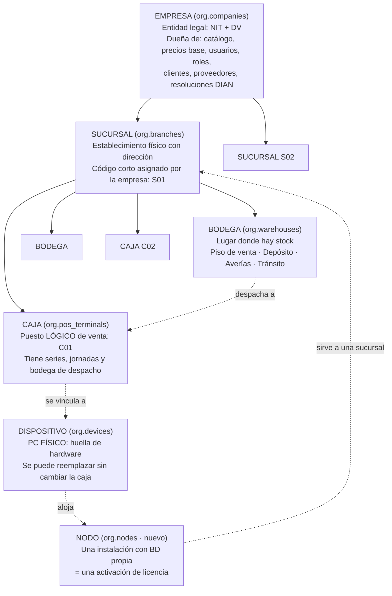
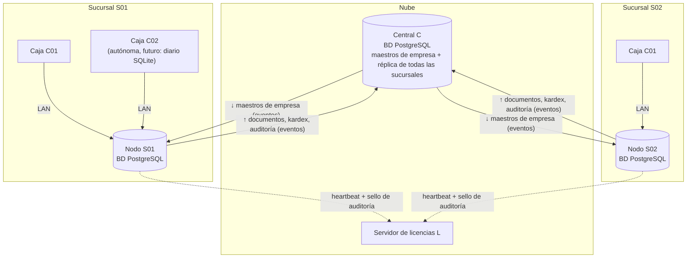
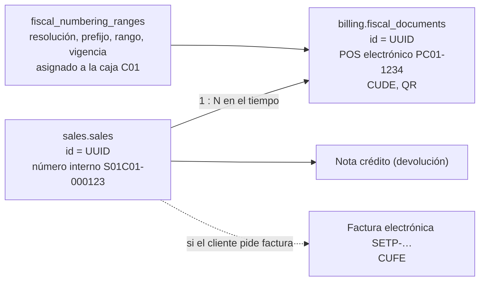
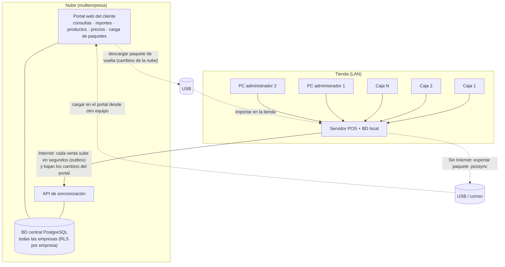

# Fase 2 · Revisión arquitectónica de las decisiones difíciles de cambiar

> Estado: **REVISIÓN — sin código ni migraciones.** Fecha: 2026-09-28.
> Revisa la §19 de [fase-02-propuesta.md](fase-02-propuesta.md) antes de convertirla en migraciones.
> Resultado: **las decisiones centrales se mantienen**, pero encontré **4 problemas que conviene corregir antes de escribir las migraciones** y 5 ajustes menores. Están resumidos en la §7.

**Leyenda de nodos** (se usa en todo el documento)

| Sigla | Nodo | Existe hoy |
|---|---|---|
| **C** | Autoridad de empresa: la **central** futura (nube) o, mientras no exista, el servidor de la tienda principal | Hoy lo cumple el servidor local |
| **S** | Servidor de sucursal (o equipo *todo en uno*) con su propia BD PostgreSQL | Sí |
| **T** | Caja autónoma con diario local SQLite (diseñada, se implementa después, D4) | No |
| **L** | Servidor de licencias (Fase 12) | No |

---

## 1. Matriz de decisiones difíciles de cambiar

Escala de dificultad: **Muy alta** (exige migrar datos ya emitidos o legales) · **Alta** (reescribir tablas grandes en todos los clientes) · **Media** (varios módulos, sin tocar datos históricos) · **Baja** (aditivo).

| ID | Decisión | Motivo | Alternativas consideradas | Consecuencia positiva | Riesgo | Impacto POS local | Impacto multisucursal | Impacto sincronización futura | Impacto licenciamiento | Dificultad de cambiar | Recomendación técnica |
|---|---|---|---|---|---|---|---|---|---|---|---|
| **D-01** | UUID v7 como PK, generado en la app | Crear registros sin coordinarse con nadie (cajas offline, sucursales) | `bigint` autoincremental; UUID v4; ID compuesto nodo+secuencia | Sin colisiones entre nodos; orden aproximado por tiempo; índices B-tree sin fragmentación severa | 16 bytes por clave (vs 8); IDs no legibles para humanos | Ninguno perceptible | Imprescindible: cada sucursal crea filas sin colisionar | Imprescindible: aplicar eventos de forma idempotente por Id | `installation_id` también es UUID: coherente | Muy alta | **Mantener** |
| **D-02** | Una BD por **nodo** (instalación), un esquema por módulo | Transacciones ACID entre módulos; la tienda no depende de Internet | BD central en línea; una BD por módulo; SQLite por caja | Venta = venta + kardex + caja + fiscal en una transacción | Sin la definición de nodo y de "unirse a una empresa" (§2), la segunda sucursal **duplicaría la empresa** | Óptimo | Funciona **con los ajustes P1, P2 y P5** de la §7 | Cada nodo es una fuente de eventos; la central consolida | El límite `max_branches` se aplica por nodos activados | Muy alta | **Mantener, con ajustes P1/P2/P5** |
| **D-03** | Migraciones SQL-first con migrador propio | CHECK, índices parciales, particiones, triggers, privilegios; instalador sin herramientas de desarrollo | Migraciones de EF Core; DbUp / Flyway / Grate | Scripts revisables, deterministas y transaccionales | Se pierde el modelo generado por EF (lo compensa la prueba de conformidad) | Actualizaciones seguras en campo | Todas las sucursales ejecutan los mismos scripts | La central usará el mismo historial: esquemas idénticos | Ninguno | Alta | **Mantener** (evaluar DbUp solo como motor de ejecución si el migrador propio crece) |
| **D-04** | Convenciones `snake_case`, `numeric(19,4)`, `timestamptz`, `varchar`+CHECK | Exactitud del dinero, fechas comparables, estados evolucionables | `float`; `timestamp` sin zona; enums de PostgreSQL | Consistencia; sin descuadres; se pueden quitar valores de estado | Ninguno relevante | Ninguno | Fechas UTC comparables entre sucursales | Payloads de eventos sin conversiones | Ninguno | Alta | **Mantener** |
| **D-05** | Colación `C.UTF-8` (builtin) + ICU `es_co` explícita | Índices estables ante actualizaciones de Windows/ICU | Colación de Windows; ICU por defecto | Nada de índices corruptos tras actualizar | Ordenar en español exige recordar `COLLATE` (se centraliza en los repositorios de consulta) | Ninguno | Mismo orden en todas las sucursales | La central usa la misma colación | Ninguno | Muy alta (recrear la BD) | **Mantener** |
| **D-06** | `company_id` en toda tabla de negocio; `branch_id` en toda tabla operativa | Saber a quién pertenece cada fila | Una BD por empresa sin columnas de tenencia | Consolidación directa; filtros globales | Unicidades mal elegidas (por empresa en datos que crea la sucursal) → colisiones al consolidar | Ninguno | **Ajuste P2**: las entidades que crea la sucursal deben ser únicas **por sucursal** | Base de la matriz de propiedad (§6) | Permite contar sucursales/cajas por empresa | Alta | **Mantener, con ajuste P2** |
| **D-07** | Numeración de documentos por serie, sin huecos, prefijo con sucursal/caja | Documentos únicos y ordenados; cajas autónomas | Secuencias de PostgreSQL; número único global | Sin colisiones; sin contención entre cajas | La propuesta mezcla el número **interno** con lo que exige la DIAN y promete "sin huecos" en escenarios donde no se puede cumplir (restauración, caja perdida) | Una fila bloqueada por caja: sin impacto | Series de sucursal: sin colisión si el código de sucursal lo asigna C | La serie tiene **un único escritor** | Ninguno | Muy alta | **Cambiar el alcance antes de migrar (P3)**: ver §3 |
| **D-08** | Borrado lógico en maestros; documentos nunca se borran | Trazabilidad; FK `RESTRICT` | Borrado físico + auditoría | Historial completo | Crecimiento de tablas (despreciable) | Ninguno | Ninguno | Las lápidas se replican como eventos `…Deleted` | Ninguno | Muy alta (el historial borrado no se recupera) | **Mantener** |
| **D-09** | Auditoría particionada por mes; PK `(occurred_at, id)`; sellado por lotes | Volumen; archivado por partición; evidencia de manipulación sin contención | Cadena de hash fila a fila; sin particiones | Escritura sin bloqueo entre cajas | Tal como está, **los huecos de `seq` por *rollback* y los *commits* tardíos producen falsos positivos o sellos incompletos**; no identifica el nodo de origen | Ninguno | Cada nodo necesita **su propia cadena** | Filas de otros nodos (caja autónoma) no caben en un `seq` local | El sello viajará en el heartbeat (Fase 12) | Alta (tabla más voluminosa) | **Cambiar antes de migrar (P4)**: ver §4 |
| **D-10** | Roles de BD: `pos_app` sin `UPDATE/DELETE` en auditoría | Inmutabilidad real, no solo por código | Solo control en código | Un bug o un usuario de la app no puede borrar la bitácora | No protege contra el administrador de Windows / superusuario de PostgreSQL (nada local puede hacerlo; se detecta, §4.6) | Ninguno | Igual en cada nodo | Ninguno | `pos_backup` siempre disponible (RN-LIC-04) | Media | **Mantener** y documentar el límite honestamente |
| **D-11** | Usuarios por empresa (`company_id` en `users`) | Permisos y normativa por empresa | Identidad global de persona | Modelo simple; roles por empresa | Una persona en dos empresas = dos usuarios (aceptado) | Ninguno | Un cajero puede trabajar en varias sucursales (rol con `branch_id`) | Usuarios = maestros de C; bloqueos y sesiones son **locales del nodo** | Ninguno | Alta | **Mantener** |
| **D-12** *(nueva)* | Registro de **nodos** (`org.nodes`) y `origin_node_id` en documentos y auditoría | Saber qué equipo/BD escribió cada fila | Deducirlo de `branch_id` / `device_id` | Distingue servidor de sucursal, caja autónoma y central | Una columna más en tablas de documentos | Ninguno | Una sucursal puede tener varios nodos (servidor + cajas autónomas) | Imprescindible para cadenas de auditoría y series por escritor | Una activación de licencia = un nodo | Alta si se omite (rellenar millones de filas) | **Agregar ahora (P5)** |
| **D-13** *(nueva)* | **Un único escritor por dato** (matriz de propiedad §6); saldos derivados, nunca replicados | Evitar conflictos en lugar de resolverlos | Multi-maestro con "último que escribe gana" en todo | Casi todos los conflictos desaparecen por diseño | Algunas operaciones exigen estar conectado a C (crear productos en una sucursal) | Ninguno (hoy S = C) | Define qué puede hacer cada sucursal sin la central | Es el contrato de sincronización | Las cuotas de cajas las asigna L por nodo | Alta | **Adoptar como regla de arquitectura (ADR)** |
| **D-14** *(nueva)* | Configuración jerárquica: definiciones en código, excepciones en BD, "el más específico gana" | Pocas filas; validación tipada | Tabla con todos los valores; configuración en archivos | Resolución trivial y cacheable | Cambiar un valor por defecto en una versión nueva cambia el comportamiento de todos los clientes | Caché en memoria del servidor | Cada sucursal tiene sus excepciones | Excepciones de empresa ↓ desde C; de sucursal/caja propiedad de S | Algunas claves pueden depender de una funcionalidad del plan | Media | **Mantener, con las reglas de la §5** |

---

## 2. Base de datos por tienda: jerarquía y funcionamiento con varias sucursales

### 2.1 Definiciones exactas



| Nivel | Qué es | Qué **no** es | Identificador de negocio | Quién lo crea |
|---|---|---|---|---|
| **Empresa** | La persona jurídica o natural que factura (NIT). Todo documento fiscal sale a su nombre | No es la instalación ni el cliente de la licencia (una cuenta de licencia puede tener varias empresas) | NIT + DV | C (en el asistente de la **primera** instalación) |
| **Sucursal** | Un establecimiento físico. Tiene dirección y municipio (van en la factura) | No es un servidor: una sucursal puede tener varios nodos | Código `S01`, **único por empresa y asignado por C** | C |
| **Bodega** | Un lugar con saldo de inventario. El kardex y el costo promedio son por bodega (D7) | No es una sucursal: una sucursal tiene varias bodegas | Código **único por sucursal** (cambio P2) | S |
| **Caja** | El puesto lógico donde se vende. Tiene series de numeración, jornadas y rango fiscal propios | No es el PC: si el PC se daña, la caja C01 continúa en otro equipo con su misma numeración | Código `C01`, único por sucursal | S (sujeto al límite de licencia) |
| **Dispositivo** | Un equipo físico, identificado por el hash de su huella de hardware | No es la caja ni el nodo | Hash de huella | S (emparejamiento) |
| **Nodo** *(nuevo)* | Una instalación del software **con BD propia**: servidor de sucursal, *todo en uno*, caja autónoma (futuro) o central (futuro) | No es un dispositivo: el mismo PC puede ser dispositivo de caja y alojar el nodo *todo en uno* | `node_id` = `installation_id` | El instalador; lo registra C |

**Faltaba el concepto de nodo.** La propuesta tiene `system.installation` (una fila) y `org.devices.installation_id`, pero no un registro de instalaciones. Sin él, la central no puede saber qué BD escribió cada fila, y la caja autónoma no tiene identidad propia para su cadena de auditoría ni para su serie.

### 2.2 ¿La decisión "una BD por tienda" sigue funcionando con varias sucursales?

**Sí, si la regla se formula como "una BD por nodo; cada nodo es el único escritor de los datos operativos de su sucursal"**. Topología objetivo:



Qué contiene cada BD:

| BD | Maestros de empresa | Datos operativos propios | Datos de otras sucursales |
|---|---|---|---|
| Nodo de sucursal S01 | Réplica (solo lectura salvo excepciones de la §6) | **Escritor único** | No (salvo traslados entrantes) |
| Central | **Escritor único** | — | Réplica de todas (reportes consolidados) |
| Hoy (v1, un solo nodo) | Escritor (el nodo es C y S a la vez) | Escritor | — |

Condiciones para que funcione (todas se resuelven en la Fase 2 sin costo apreciable):

1. **Asistente con dos modos (P1).** Hoy `POST /setup` siempre crea la empresa. Si la segunda sucursal instala así, nace **otra empresa con otro UUID y el mismo NIT**; al consolidar, `UX (identification_type, identification_number)` choca y habría que fusionar dos empresas con todos sus datos. El asistente debe ofrecer: **"Crear empresa"** (primera instalación) y **"Agregar sucursal a una empresa existente"** (requiere conexión con C o un **paquete de alta firmado** exportado desde C: empresa, sucursal preasignada, maestros). En v1 solo se implementa el primer modo, pero la API y el modelo quedan preparados.
2. **Unicidad por el ámbito del escritor (P2).** Todo lo que crea una sucursal debe ser único **por sucursal**, no por empresa, o dos sucursales offline pueden crear el mismo código. Cambio concreto: `org.warehouses` pasa de `UX (company_id, code)` a `UX (branch_id, code)`.
3. **Códigos de sucursal asignados por C**, nunca escritos libremente en una sucursal. Así los prefijos internos que los contienen (`S01C01`) son únicos en la empresa.
4. **Registro de nodos (P5)** y `origin_node_id` en documentos y auditoría.

Alternativas descartadas: una **BD central en línea** (las ventas dependerían de Internet: viola RN-LIC-01 y el principio *local-first*); **replicación lógica de PostgreSQL** como mecanismo principal (exige conectividad entre servidores y acopla versiones de esquema, ya descartada en la §17). Un caso válido que el modelo también admite: **un nodo que sirve a dos sucursales pequeñas** conectadas por VPN; como todo lleva `branch_id`, basta con que ese nodo sea el escritor de ambas.

---

## 3. Numeración: separar identidad, número interno y número fiscal

### 3.1 Los siete conceptos

| Concepto | Ejemplo | Para qué sirve | Dónde vive | ¿Consecutivo? | ¿Sin huecos? | ¿Lo exige la ley? | Quién lo asigna |
|---|---|---|---|---|---|---|---|
| **ID técnico (UUID v7)** | `0192f1c4-…` | Identidad, FK, sincronización, idempotencia | `id` de toda fila | No | No | No | La app del nodo (o la caja offline) |
| **Número interno de operación** | `S01C01-000123` (venta), `S01-000045` (ajuste) | Localizar y referenciar documentos en la operación (devoluciones, reportes, soporte) | `document_series` → `series_id`, `sequence_number`, `number` en cada documento | Sí, por serie | **Objetivo**, no garantía legal | No | La serie, con un **único escritor** (la caja o la sucursal) |
| **Consecutivo comercial** | Lo impreso como "Tiquete N.º" | Lo que ve y conserva el cliente | **No es un contador aparte**: es una regla de presentación | — | — | — | Si hay documento fiscal → su número; si no → el número interno |
| **Número de factura** | `SETP-990000123` | Factura electrónica de venta (cuando el cliente la pide con su NIT) | `billing.fiscal_documents` (tipo `INVOICE_ELECTRONIC`) | Sí, dentro del rango autorizado | **Sí** | **Sí** | El rango de la resolución asignada a la caja |
| **Prefijo de sucursal/caja** | `S01C01` | Hacer único el número interno en la empresa | `document_series.prefix` | — | — | No | **Generado** por el sistema a partir de códigos asignados por C |
| **Consecutivo fiscal DIAN** | Prefijo `PC01` + `1234` (documento equivalente POS) | Número legal del documento electrónico | `billing.fiscal_numbering_ranges` + `fiscal_documents` | Sí | **Sí** (dentro del rango; sin repetir) | **Sí** | Rango de una resolución DIAN, asignado a una caja |
| **CUFE / CUDE** | Hash de 96 caracteres hex | Validación legal (QR) | `fiscal_documents.unique_code` | **No** (es un hash) | No aplica | Sí | Se **calcula** localmente con el número fiscal, fecha, totales, impuestos, NIT y clave técnica/PIN |

**Solo el consecutivo fiscal necesita legalmente ser consecutivo y sin repetición.** El UUID nunca; el número interno es consecutivo por diseño y se mantiene sin huecos siempre que se pueda, pero no es un requisito legal y **hay escenarios en que no se puede garantizar** (§3.4). El "consecutivo comercial" no debe ser un tercer contador: sería otra fuente de desincronización.

### 3.2 Qué estaba mal en la propuesta y cómo queda

| Problema | Por qué limita la facturación electrónica | Corrección |
|---|---|---|
| El prefijo interno por defecto (`FV-S01C01`) parece un prefijo fiscal | El anexo técnico de la DIAN limita el prefijo a pocos caracteres alfanuméricos (hoy 4; **se confirma en la Fase 11-B**) y lo fija la resolución. Si el número interno se hubiera usado como fiscal, no cabría | El prefijo interno **no se imprime como número legal**. Queda `{sucursal}{caja}` (`S01C01`), generado y no editable; el tipo de documento ya se sabe por la tabla |
| RN-GEN-06 dice "numeración consecutiva sin huecos" para todo | Promete algo imposible en restauraciones y cajas perdidas (§3.4) y oculta que el requisito duro es el fiscal | Reformular: **fiscal**: consecutivo y sin repetir dentro del rango (obligatorio); **interno**: único, creciente por serie, sin huecos en operación normal y con **huecos justificados** (registro en auditoría) en caso de restauración o pérdida |
| No estaba definido quién escribe cada serie | Con la caja autónoma, servidor y caja podrían numerar la misma serie | Cada serie tiene un **escritor único**: la caja (series de alcance `TERMINAL`) o la sucursal (`BRANCH`). En modo autónomo la caja ya es la escritora de su serie; al reconectar sube su `next_number` |
| Resoluciones DIAN "por sucursal" | Una caja autónoma offline necesita numerar fiscalmente sin preguntar a nadie | **Un rango fiscal por caja** (una resolución/prefijo por caja). Repartir un solo rango en bloques entre cajas produce números emitidos fuera de orden cronológico; se evita |

### 3.3 Cómo se relacionan en una venta



- La venta **nunca** guarda el número fiscal como su identidad: una venta puede tener un documento POS electrónico, luego una nota crédito y luego una factura electrónica. Por eso `billing` sigue separado (advertencia 4 del doc 12).
- El número fiscal se asigna **en la misma transacción** que completa la venta (con el mismo bloqueo `FOR UPDATE` sobre el rango de la caja) y el CUDE/CUFE se calcula en ese momento. **El nodo numera; el proveedor tecnológico solo transmite.** Criterio de selección del proveedor (Fase 11-B): debe aceptar numeración asignada por el emisor; uno que asigne números en línea impediría vender offline.
- **A verificar con el contador en la Fase 11-B:** la contingencia por falla del propio emisor puede exigir un **rango de contingencia independiente**. El modelo `fiscal_numbering_ranges` debe admitir varios rangos activos por caja distinguidos por propósito (`NORMAL`, `CONTINGENCY`). No afecta a la Fase 2, pero se deja escrito.

### 3.4 Dónde es imposible "sin huecos" (y qué hacer)

| Escenario | Número interno | Número fiscal | Tratamiento |
|---|---|---|---|
| Transacción revertida | Sin hueco (bloqueo transaccional) | Sin hueco | Ya cubierto |
| **Restauración de un backup de hace 4 h** | `next_number` retrocede: los números emitidos después del backup **se repetirían** | Igual, y esos documentos **ya se transmitieron a la DIAN** | Al restaurar, el asistente **adelanta** todas las series: el fiscal, al último número consultado al proveedor o a la DIAN; el interno, al máximo visto en la central o con un salto configurable. El salto queda registrado como hueco justificado (`NUMBERING_GAP_RESTORE`) |
| Caja autónoma cuyo disco se daña antes de subir su diario | Números entregados en papel que no llegan al servidor | Igual | Hueco justificado + reporte al contador. Se mitiga subiendo el diario cada pocos segundos cuando hay LAN |
| Backup restaurado en **dos** PCs a la vez | Dos nodos numeran la misma serie | Números fiscales duplicados | La restauración genera una **nueva época del nodo** y exige reactivar la licencia; L detecta dos equipos con el mismo `installation_id` y bloquea el segundo |

### 3.5 Cambios concretos a la Fase 2

- `system.document_series`: `prefix` generado (`{branch.code}{terminal.code}` o `{branch.code}`), no editable desde la API. Se mantiene `UX (company_id, document_type, prefix)`, que ahora es segura porque los códigos de sucursal los asigna C.
- Nuevo tipo de evento de auditoría `NUMBERING_GAP` con serie, rango saltado y motivo.
- Redacción nueva de RN-GEN-06 en el doc 05 (§3.2).
- Sin cambios en `billing` (Fase 11-B), salvo dejar anotados el rango por caja y el propósito del rango.

---

## 4. Auditoría: cómo funcionan los sellos

### 4.1 Problemas de la propuesta

1. **Los huecos de `seq` no indican borrados.** `seq` sale de una secuencia de identidad; PostgreSQL **consume el valor aunque la transacción se revierta**. La propuesta dice que el verificador detecta "filas borradas" por huecos: daría falsos positivos cada vez que falle una venta.
2. **Commits fuera de orden.** La transacción A toma `seq = 102` y tarda; la B toma `103` y confirma. Si el sellador sella hasta 103 mientras A sigue abierta, cuando A confirme su fila quedará **dentro de un rango ya sellado sin estar en el sello**: el verificador la reportaría como manipulación.
3. **Un solo `seq` por BD.** Las filas de auditoría que suba una caja autónoma tienen su propio orden; no se pueden renumerar sin romper su cadena.
4. **Serialización no definida.** Si el hash se calcula sobre el JSON que genera .NET y se verifica sobre lo que devuelve `jsonb` (que reordena claves), o con fechas en ticks de .NET (100 ns) frente a microsegundos de PostgreSQL, **ningún hash coincidirá**.

### 4.2 Diseño corregido

**Qué se firma**

| Nivel | Contenido | Algoritmo |
|---|---|---|
| **Fila** (`row_hash`) | Objeto canónico con una **lista fija de campos por versión** (`hash_version = 1`): `node_id, seq, id, occurred_at, company_id, branch_id, pos_terminal_id, user_id, user_display_name, session_id, device_id, ip_address, correlation_id, module, action, entity_type, entity_id, entity_label, old_values, new_values, summary, authorized_by, severity` | SHA-256 del JSON canónico **RFC 8785 (JCS)** en UTF-8; fechas UTC ISO-8601 con **6 decimales** (se truncan en la app antes de insertar); `null` explícitos |
| **Sello** | `{v, node_id, seal_no, seq_from, seq_to, rows_count, rows_digest, prev_seal_hash, sealed_at}` donde `rows_digest = SHA-256(row_hash₁ ‖ … ‖ row_hashₙ)` en orden de `seq` | `seal_hash` = SHA-256 del JCS del sello |
| **Ancla externa** | `(node_id, seal_no, seq_to, seal_hash)` | Copia fuera de la BD (§4.4); la del servidor de licencias vuelve **contrafirmada con Ed25519** por L |

Agregar columnas nuevas a `audit_log` en el futuro no rompe nada: la versión 1 hashea solo su lista de campos, y una `hash_version = 2` incluirá los nuevos.

**Por qué no hay una firma digital local en la Fase 2:** la clave privada tendría que estar en el mismo PC que el posible manipulador (el administrador de Windows puede descifrar DPAPI de máquina). Una firma local solo sube un poco la dificultad y agrega manejo de claves. La firma que sí aporta valor es la del **servidor de licencias** sobre el ancla, porque su clave no está en la tienda.

**Dónde se almacena**

| Tabla | Cambio respecto de la propuesta |
|---|---|
| `audit.audit_log` | + `node_id uuid NN`, + `hash_version smallint NN`; `seq` pasa a `GENERATED BY DEFAULT` (las filas locales lo toman de la secuencia; las importadas de una caja autónoma conservan el suyo). Índice `(node_id, seq, occurred_at)`: PostgreSQL exige incluir la clave de partición en un índice único, así que la unicidad global de `(node_id, seq)` la garantizan la secuencia y el verificador |
| `audit.audit_seals` | + `node_id`, + `seal_no` (consecutivo por nodo), + `rows_digest`, + `format_version`; `UX (node_id, seal_no)` |
| `audit.seal_anchors` *(se crea en la fase que lo usa)* | `node_id, seal_no, seal_hash, kind CK IN ('Z_REPORT','BACKUP_MANIFEST','LICENSE_SERVER'), reference_id, external_receipt, created_at` |

**Quién lo genera y cuándo**

- `AuditSealer` (servicio en segundo plano del servidor POS), **una instancia por nodo**, garantizada con `pg_advisory_lock`. Usa `pos_app`, que solo puede hacer `INSERT` en los sellos.
- **Horizonte seguro** (resuelve los problemas 1 y 2):
  1. Se fija `transaction_timeout = 30s` para el rol `pos_app` (`ALTER ROLE`, PostgreSQL 17+). Ninguna transacción de la app puede durar más.
  2. Cada 60 s el sellador lee el último valor entregado por la secuencia, `S₀`, en el instante `t₀`.
  3. En `t₀ + 45 s`, toda transacción que tomó un `seq ≤ S₀` ya confirmó o se revirtió. El sellador sella **todas las filas visibles** con `seq` en `(seq_to anterior, S₀]`. Los huecos de ese rango son *rollbacks* legítimos y quedan implícitos en el sello (`rows_count` + `rows_digest`).
  4. A partir de ahí, **cualquier fila que aparezca dentro de un rango sellado es manipulación**: no puede ser legítima.
- Consecuencia para las fases siguientes: los procesos masivos (importación de catálogo, Fase 4) deben trabajar por lotes de transacciones cortas. Una prueba de arquitectura impide que el código cambie `transaction_timeout`.
- Ventana sin sellar: entre 45 y 105 s.

### 4.3 Cómo se verifica y qué detecta

Comando `verify-audit` (migrador) y endpoint de consulta en el módulo Audit. Por cada nodo: recalcula cada `row_hash` → cada `rows_digest` → cada `seal_hash` → comprueba `prev_seal_hash`, que `seal_no` sea continuo y que `seq_from` = `seq_to` anterior + 1 → compara con las anclas disponibles.

| Alteración | Cómo se detecta |
|---|---|
| Se modifica una fila (`UPDATE` con el trigger desactivado) | `row_hash` no coincide |
| Se modifica la fila **y** se recalcula su `row_hash` | `rows_digest` del sello no coincide |
| Se recalcula también el sello | Su `seal_hash` rompe el `prev_seal_hash` del sello siguiente |
| Se reescribe **toda la cadena** desde ese punto | No coincide con el ancla externa más reciente posterior a la alteración |
| Se borra una fila sellada | `rows_count` / `rows_digest` no coinciden |
| Se inserta una fila dentro de un rango sellado | Fila no incluida en el sello → alerta crítica |
| Se borran los últimos sellos y sus filas | `seal_no` final menor que el anclado en el reporte Z, el backup o L |
| Se inserta una fila falsa **después** del último sello | **No detectable** como manipulación (quedaría sellada normalmente). Se marca como anómala si `occurred_at` es mucho más antiguo que el de sus vecinas. Riesgo aceptado: insertar no oculta nada |
| Se borran filas aún no selladas | No detectable; ventana ≤ 105 s |

### 4.4 Anclas externas: la parte práctica

La cadena de hash por sí sola solo detecta manipulaciones torpes. Lo que la vuelve útil es que **copias del último sello salgan del alcance de quien controla la BD**:

| Ancla | Fase | Funciona offline | Qué aporta |
|---|---|---|---|
| **Reporte Z impreso** con `SELLO #1234 · 7F3A-91C2-0B44-E1D8` (16 caracteres del `seal_hash`) | 6 | **Sí** | Papel firmado por el cajero y archivado: nadie lo reescribe. El verificador acepta el código tecleado para compararlo |
| **Manifiesto del backup** (último `seal_no` + `seal_hash`) | 11 | **Sí** | Los backups viajan a USB/red/nube; un backup antiguo prueba cómo era la cadena en ese momento |
| **Heartbeat al servidor de licencias** → recibo contrafirmado Ed25519 | 12 | Se encola en el outbox | Ancla con fecha que el dueño de la tienda no controla |

Con backups cada 4 h y un reporte Z por jornada, **la ventana en la que una reescritura completa pasa inadvertida es de horas, no de meses**.

### 4.5 Offline

- El sellado es 100 % local: **nunca** depende de Internet.
- Sin Internet solo se retrasa el ancla de L; el reporte Z y los backups siguen anclando.
- **Caja autónoma (futuro):** su diario SQLite lleva su propia cadena (`node_id` de la caja, su `seq`, sus sellos, el mismo algoritmo). Al reconectar, el servidor inserta sus filas **conservando** `node_id`, `seq`, `row_hash` y sellos. El verificador valida cada nodo por separado.
- **Restauración de backup:** la cadena continúa desde el último sello del backup. Se registra el evento `AUDIT_CHAIN_RESTORED` con el sello de partida; el verificador reconoce la bifurcación frente a anclas posteriores y la informa como **restauración**, no como manipulación.

### 4.6 Protección frente a un administrador

| Quién | Qué puede hacer | Protección |
|---|---|---|
| Usuario de la app (incluido el rol Administrador) | Nada sobre la bitácora | No existe ningún endpoint que la modifique |
| Alguien con la contraseña de `pos_app` | Solo `INSERT` | Privilegios + trigger; las inserciones en rangos sellados se detectan |
| Administrador de Windows / superusuario de PostgreSQL | **Todo**: puede desactivar triggers y reescribir tablas | **No se puede impedir localmente** (es dueño del PC). Se **detecta** con las anclas externas en cuanto existe una posterior a la alteración |

Esta es la afirmación honesta: el sistema no hace imposible la manipulación por parte del dueño del equipo, pero hace que **no pase inadvertida** frente al papel, los backups y el servidor de licencias.

---

## 5. Configuración jerárquica

### 5.1 Regla de resolución

Para una clave `K` pedida en el contexto de la caja `T` (sucursal `B`, empresa `C`):

```
valor(K, T) = excepción[CAJA T, K]
           ?? excepción[SUCURSAL B, K]
           ?? excepción[EMPRESA C, K]
           ?? valor_por_defecto_en_código(K)
```

- **Gana el nivel más específico**, aunque sea más permisivo que el superior.
- Solo se consultan los niveles que la definición permite. Si `K` solo admite Empresa y Sucursal, **no se puede guardar** una excepción de caja (`SETTINGS.SCOPE_NOT_ALLOWED`).
- Contexto sin caja (backoffice de la sucursal) → la resolución empieza en la sucursal. Contexto de empresa (reportes consolidados) → empieza en la empresa.
- Una caja pertenece siempre a la misma sucursal (no se traslada; se crea otra). Así la cadena de herencia nunca cambia de padre.
- La API devuelve el valor **y su origen**: `{ "value": 15, "source": "TERMINAL", "inheritedValue": 5, "inheritedFrom": "BRANCH" }`.

### 5.2 Ejemplos reales

**Importante sobre el ejemplo del IVA:** las tarifas de impuestos **no son configuración**. Son datos fiscales maestros de la empresa (`catalog.taxes`, Fase 4), con vigencia y asignados por producto. Una sucursal o una caja no puede cambiar la ley. Lo que sí es configuración es, por ejemplo, **si los precios se exhiben con IVA incluido** (D9).

**Ejemplo 1 — `sales.max_discount_percent_without_authorization`** (alcances: Empresa, Sucursal, Caja; defecto: `0`)

| Paso | Empresa | Sucursal Norte | Caja C03 (Norte) | Caja C01 (Norte) | Caja C01 (Centro) |
|---|---|---|---|---|---|
| Sin excepciones | — | — | — | 0 (código) | 0 (código) |
| Empresa pone **10** | 10 | — | — | 10 (empresa) | 10 (empresa) |
| Norte pone **5** | 10 | 5 | — | 5 (sucursal) | 10 (empresa) |
| C03 pone **15** | 10 | 5 | 15 | **C03 → 15 (caja)**; C01 → 5 (sucursal) | 10 (empresa) |
| Se **elimina** la excepción de C03 | 10 | 5 | — | C03 → **5** (vuelve a heredar de Norte) | 10 |
| Se elimina la de Norte | 10 | — | — | C03 → **10** (hereda de la empresa) | 10 |
| Se elimina la de empresa | — | — | — | C03 → **0** (defecto del código) | 0 |

Respuesta a la pregunta: **empresa X → sucursal modifica X → caja modifica X ⇒ la caja obtiene su propio valor.** Las demás cajas de esa sucursal obtienen el de la sucursal y las de otras sucursales, el de la empresa.

**Ejemplo 2 — `finance.cash_increment`** (redondeo del efectivo; alcances: Empresa, Sucursal): la empresa usa `50`; una sucursal rural donde no circulan monedas de $50 pone `100`. Una caja **no** puede tener su propio redondeo: dentro de un mismo arqueo de sucursal los valores serían incoherentes.

**Ejemplo 3 — `inventory.allow_negative_stock`** (D8; alcances: Empresa, Sucursal; defecto `false`): la empresa lo prohíbe y una sucursal con inventario aún desordenado lo permite temporalmente. Cada cambio queda auditado con valor anterior y nuevo.

**Ejemplo 4 — `pos.receipt.footer_message`** (alcances: los tres): la empresa define un mensaje, una sucursal anuncia su horario y una caja rápida imprime "Caja rápida · máx. 10 artículos".

### 5.3 Reglas de ciclo de vida

| Situación | Comportamiento |
|---|---|
| **Se elimina una excepción** | Se borra la fila; ese nivel vuelve a **heredar** del superior de inmediato (se invalida la caché). Se audita (`SETTING_OVERRIDE_REMOVED`, valor anterior) y se emite el evento `SettingChanged` con `value = null` (así se replica el borrado sin necesidad de lápida) |
| Se elimina la excepción de un nivel superior | Los niveles inferiores **conservan** sus propias excepciones; solo cambian los que heredaban |
| "Restablecer a heredado" en la interfaz | Es exactamente eliminar la excepción |
| **Cambia el valor por defecto en una versión nueva** | Cambiaría el comportamiento de todos los clientes sin que nadie lo decida. Regla: **el defecto de una clave publicada no se cambia.** Si hay que hacerlo, la migración escribe el defecto anterior como excepción de empresa en las instalaciones existentes y solo las nuevas reciben el nuevo |
| Se retira una clave | Se marca obsoleta en código; las filas se ignoran y se conservan (auditoría). Nunca se reutiliza el nombre con otro tipo |
| Una definición deja de permitir un alcance | Las excepciones de ese alcance se ignoran y el endpoint de configuración las muestra como "inactivas" |
| Caja autónoma offline (futuro) | Recibe la configuración **ya resuelta** con una versión; la usa hasta reconectar |
| Permisos | `settings.manage` con alcance: un administrador de la sucursal Norte solo edita excepciones de Norte y sus cajas (se usa `user_roles.branch_id`) |

Fuera de alcance por ahora (evaluar con la central): que la empresa **bloquee** una clave para impedir excepciones inferiores. Se puede agregar después como columna sin romper nada.

---

## 6. Matriz de propiedad de datos (sincronización futura)

Principios: **(1) un único escritor por dato**; **(2) los documentos son inmutables y solo se agregan**; **(3) los saldos (stock, crédito, puntos) nunca se replican: se replican sus movimientos y el saldo se recalcula**; **(4) todo se aplica de forma idempotente por UUID**. Hoy, con un solo nodo, S cumple también el papel de C.

| Entidad | Quién puede crearla | Quién puede modificarla | Origen (autoridad) | ¿Offline? | ¿Sincroniza? | Ante conflicto |
|---|---|---|---|---|---|---|
| **Empresa** | C (asistente de la 1.ª instalación) | C | C | Sí (lectura) | ↓ C→S | No hay: escritor único |
| **Sucursales** | C | C (datos) · S (solo estado operativo propio) | C | Sí (lectura) | ↓ | No hay |
| **Bodegas** | S (su sucursal) | S | S | Sí | ↑ S→C | No hay: código único por sucursal (P2) |
| **Cajas** | S, dentro de la cuota de licencia del nodo | S | S | Sí | ↑ | No hay |
| **Dispositivos / nodos** | S (emparejamiento) · instalador (nodo) | S | S (registrados en C y L) | Sí | ↑ | Mismo nodo en dos PCs → L bloquea el segundo (§3.4) |
| **Productos** | **C** | C | C | Sí (réplica de lectura en S y T) | ↓ | No hay. *Opción futura* (§8, pregunta 1): S crea productos "locales"; un código de barras duplicado va a una cola de fusión manual en C |
| **Categorías** | C | C | C | Sí (lectura) | ↓ | No hay |
| **Precios** | C (lista base) · S (listas de su sucursal, si el plan lo permite) | El dueño de la lista | Dueño de la lista | Sí (lectura en T) | ↓ o ↑ según la lista | No hay: una lista, un escritor. La venta guarda el precio aplicado (snapshot): un precio viejo en una caja offline **no** es un conflicto |
| **Inventario (saldos)** | Nadie: se **deriva** del kardex | Nadie | S (por bodega) | Sí | ↑ solo como proyección de lectura | No hay: se recalcula |
| **Movimientos de inventario (kardex)** | S (y T, derivados de ventas offline, aplicados por S al subir) | Nadie (inmutables) | Nodo emisor | Sí | ↑ | No hay (UUID). Stock negativo por ventas offline → alerta, nunca se rechaza una venta entregada |
| **Traslados entre sucursales** | S origen (salida a tránsito) · S destino (recepción) | Nadie tras contabilizar | Cada nodo su documento | Sí | ↑ y ↓ a la sucursal destino | No hay: dos documentos enlazados por el Id del traslado |
| **Ventas** | T / S | Nadie tras `COMPLETED` (anular = documento nuevo, solo en S) | Nodo emisor | **Sí** | ↑ | No hay: UUID + serie propia de la caja |
| **Jornadas de caja** | T / S | S (el cierre se hace en S al reconectar) | S | Apertura sí; cierre no | ↑ | No hay |
| **Clientes** | **Cualquier nodo** (el cajero registra el NIT para facturar) | Cualquier nodo | C tras consolidar | **Sí** | ↑↓ | Mismo documento registrado en dos nodos → C **fusiona**: conserva el UUID más antiguo y marca el otro `merged_into_id`; los documentos no se reescriben porque guardan snapshot del cliente. Datos de contacto: gana la edición más reciente, por campo, y queda auditado. Crédito y puntos: libro de movimientos, sin conflicto |
| **Proveedores** | C (y S si se habilita) | C | C | Sí (lectura) | ↓ (↑ si S crea) | Igual que clientes: fusión por NIT |
| **Compras** | S (la sucursal que recibe) · C (órdenes de compra centralizadas, futuro) | Nadie tras contabilizar | Nodo emisor | Sí | ↑ (órdenes ↓) | No hay |
| **Usuarios** | **C** | C (datos, roles) · cualquier nodo (su propia contraseña) | C | Sí (lectura; login con hash local) | ↓ (cambio de contraseña ↑) | Contraseña: gana `password_changed_at` más reciente. **Bloqueos, intentos fallidos y sesiones son locales del nodo y no se sincronizan** |
| **Roles y asignaciones** | C | C | C | Sí (lectura) | ↓ | No hay |
| **Permisos (catálogo)** | El código de cada versión | Nadie | Versión del software | Sí | **No** (viene en la versión) | Diferencia de versiones → la sincronización exige versiones de esquema compatibles; C no envía asignaciones con permisos que el nodo no conoce |
| **Configuraciones** | Empresa: C · Sucursal y caja: S | Mismo | Según el alcance de la fila | Sí | Empresa ↓ · Sucursal/caja ↑ | No hay: cada alcance tiene un escritor |
| **Series internas** | S (al crear la caja o la sucursal) | Solo su escritor (caja o sucursal) avanza `next_number` | La caja o la sucursal | Sí | ↑ (como estado) | No hay; en restauración, avance forzado (§3.4) |
| **Rangos fiscales DIAN** | C (resoluciones de la empresa) | C | C, asignados a una caja | Sí | ↓ | Un rango se asigna a **una sola** caja |
| **Documentos fiscales** | El nodo que emite la venta | El nodo que los transmite (estado fiscal) | Nodo emisor | Sí (contingencia) | ↑ | No hay |
| **Auditoría** | Todos los nodos, cada uno en su cadena | **Nadie** | Nodo emisor | Sí | ↑ (con sus sellos) | Imposible: `(node_id, seq)` único |
| **Estado de licencia** | L (token firmado) | L | L | Sí (token vigente + gracia) | ↓ L→nodo | La firma decide; el nodo no puede editarlo |

### Licenciamiento con varias sucursales

- Hoy el token lleva `max_terminals` y lo aplica cada instalación. Con varias sucursales, **cada nodo aplicaría el límite completo de la empresa** y el total lo superaría. Regla: **L asigna una cuota por nodo** (`max_terminals` del token de cada instalación) y `max_branches` cuenta **nodos de sucursal activados**, no filas de `org.branches`.
- **Inconsistencia encontrada:** la §11 de la propuesta cuenta **cajas activas** (y las bloquea con `BLOCKED`), mientras que el doc 09 cuenta **jornadas abiertas simultáneas**. Hay que elegir una (pregunta 2 de la §8).

---

## 7. Cambios que propongo incorporar a la Fase 2 antes de las migraciones

| # | Severidad | Cambio | Afecta |
|---|---|---|---|
| **P1** | Alta | Asistente con modo "Crear empresa" (v1) y API preparada para "Agregar sucursal a empresa existente" mediante un paquete de alta; códigos de sucursal asignados por C | §8 asistente, `org.branches` |
| **P2** | Alta | Unicidad por el ámbito del escritor: `org.warehouses` `UX (branch_id, code)`; revisar la misma regla en cada tabla de fases futuras (se agrega a las convenciones) | `org.warehouses`, convenciones |
| **P3** | Alta | Numeración: el prefijo interno se genera y no se edita; se separan explícitamente número interno y fiscal; nueva redacción de RN-GEN-06; evento `NUMBERING_GAP`; rango fiscal por caja anotado para 11-B | `system.document_series`, doc 05, doc 08 |
| **P4** | Alta | Auditoría: `node_id`, `hash_version`, `seq` `BY DEFAULT`, sellos por nodo con `seal_no` y `rows_digest`, horizonte seguro con `transaction_timeout`, serialización JCS con microsegundos, anclas (tabla en fases 6/11/12) | `audit.*`, rol `pos_app` |
| **P5** | Media | Tabla `org.nodes` (id = `installation_id`, empresa, sucursal, tipo, época) y convención `origin_node_id` en tablas de documentos desde la Fase 4 | `org`, `system.installation`, convenciones |
| P6 | Media | Reglas de configuración de la §5.3 (defectos inmutables, borrado = volver a heredar con evento, permisos por sucursal) | §13 |
| P7 | Media | Principio "saldos derivados, nunca replicados" y matriz de propiedad como ADR | ADR nuevo |
| P8 | Baja | Resolver la inconsistencia del conteo de cajas para la licencia | §11 / doc 09 |
| P9 | Baja | Restauración de backup: nueva época del nodo, avance de series y evento `AUDIT_CHAIN_RESTORED` (se implementa en la Fase 11; la columna `epoch` se crea ahora con `org.nodes`) | Fase 11 |

Ninguno cambia las decisiones de fondo (UUID v7, BD local por nodo, SQL-first, colación, tipos, borrado lógico). Todos son baratos **ahora** y caros después de tener clientes instalados.

ADRs que resultarían: SQL-first · colación · numeración interna vs. fiscal · auditoría por nodo con horizonte seguro y anclas · nodos y propiedad de datos.

---

## 8. Preguntas que necesito que decidas

1. **Productos creados en sucursales.** Cuando exista la central, ¿una sucursal debe poder crear productos sin conexión (con fusión manual posterior de duplicados) o solo la central? *Recomiendo: solo la central, con la opción de habilitarlo por configuración más adelante.* No afecta a la Fase 2.
2. **Límite de cajas de la licencia.** ¿Se cuentan **cajas activas** (más simple y visible para el cliente) o **jornadas abiertas simultáneas** (más flexible: 5 cajas registradas con licencia para 3 abiertas)? *Recomiendo jornadas abiertas simultáneas, como dice el doc 09: el cliente nunca ve cajas "bloqueadas" por la licencia, solo no puede abrir la cuarta jornada.* Afecta a la §11 de la Fase 2.
3. **Resolución DIAN por caja.** Para que cada caja pueda facturar offline hace falta una resolución (prefijo) por caja. Conviene confirmarlo con tu contador antes de la Fase 11-B, junto con las reglas actuales de contingencia. No bloquea la Fase 2.

Si estás de acuerdo con los cambios P1–P9 y con las respuestas recomendadas, los incorporo a la propuesta de la Fase 2 y quedo a la espera de tu aprobación explícita para implementarla.

---

## 9. Nuevos requisitos del propietario (2026-09-28): nube en línea, paquete offline y portal web

### 9.1 Requisitos

| # | Requisito | ¿El diseño actual lo soporta? |
|---|---|---|
| R1 | Funcionar **sin Internet** | ✅ *Local-first* (§2) |
| R2 | **Multicaja en red**: varias cajas vendiendo a la vez contra la misma BD de la tienda | ✅ Cajas → API del servidor de tienda → una BD PostgreSQL |
| R3 | **Varios equipos administradores** en la red, viendo los cambios del día en tiempo real | ✅ Son clientes del mismo servidor. ⚠️ Hoy el servidor solo escucha en `localhost` (Fase 1): se abre a la LAN con TLS en la Fase 3, cuando exista el login |
| R4 | **Cada venta sube a la BD en línea** apenas haya Internet | ⚠️ Nuevo alcance: la central pasa de "futuro Empresarial" a **producto base**. El mecanismo (outbox → eventos) ya estaba previsto |
| R5 | Sin Internet en todo el día → **exportar un archivo**, llevarlo a otro equipo con Internet y **cargarlo en una interfaz** | ⚠️ Nuevo: sincronización por archivo |
| R6 | **Portal web** donde el cliente consulta, carga y actualiza sus datos desde cualquier lugar | ⚠️ Nuevo: la central tiene interfaz propia y **también escribe maestros** |

### 9.2 Arquitectura resultante



### 9.3 Decisión clave: el archivo es un **paquete de eventos**, no una copia de la BD

Subir la base de datos completa y "reemplazar" la de la nube **destruiría** los cambios hechos en el portal o en otras sucursales ese mismo día, y obligaría a subir cientos de MB. En su lugar:

| Aspecto | Diseño |
|---|---|
| Contenido | Los eventos del outbox **aún no confirmados por la nube** (ventas, kardex, cajas, clientes nuevos, auditoría con sus sellos) desde el último acuse de recibo. Normalmente pocos MB por día |
| Formato | Archivo `.possync` comprimido, **cifrado** (AES-256-GCM) y con manifiesto: nodo, rango de eventos, hash y último sello de auditoría |
| Carga | Portal web → "Cargar paquete". La nube lo aplica de forma **idempotente**: cargar dos veces el mismo archivo, o un archivo que se solapa con lo que ya subió por Internet, no duplica nada |
| Vuelta | El portal ofrece "Descargar cambios para la tienda" (productos, precios y usuarios editados en la web); la tienda lo importa con el mismo mecanismo |
| Orden | Los paquetes se pueden cargar en cualquier orden; si falta un rango intermedio, el portal lo avisa |
| Ancla de auditoría | Cargar el paquete también ancla el último sello en la nube (§4.4) |

Así, **Internet en vivo y archivo son el mismo mecanismo** con dos transportes distintos. Se programa y se prueba una sola vez.

### 9.4 Lo que cambia en la revisión

1. **Dos escritores de maestros.** Con el portal web, productos, precios y usuarios se pueden editar **en la nube y en la tienda**, incluso offline. Esto contradice el "escritor único" de la §6 para los maestros. Propuesta:
   - La nube es la **autoridad**. Una edición local offline viaja como **cambio pendiente** con la versión sobre la que se hizo (`base_version`).
   - Si en la nube nadie tocó ese registro → se aplica.
   - Si ambos lo cambiaron → se resuelve **por campo**: si son campos distintos se combinan; si es el mismo campo, gana el cambio más reciente **y queda en una bandeja de conflictos visible** en el portal (especialmente precios), con auditoría de ambos valores.
   - Documentos (ventas, kardex, compras, auditoría) siguen sin conflictos posibles: la tienda es su único escritor.
2. **Nuevas convenciones para la Fase 2** (baratas ahora, caras después):
   - `row_version bigint` lógico en todos los maestros sincronizables. El `xmin` de PostgreSQL sirve para la concurrencia local, pero **no significa nada en otra BD**.
   - `system.outbox_messages` con `node_seq` (consecutivo por nodo) para que la nube confirme "recibí hasta N" y el paquete sepa desde dónde exportar.
   - `system.inbox_messages` (eventos recibidos y aplicados, por Id) para la idempotencia al importar desde la nube o desde un archivo.
   - `org.nodes` (P5) pasa de recomendación a **obligatorio**.
3. **RLS en la nube.** La BD central es multiempresa: ahí sí se usa Row-Level Security por `company_id` (la §16 ya lo anticipaba). La BD local sigue sin RLS.
4. **Licenciamiento y costos.** El portal y la sincronización en línea se vuelven parte del producto: hosting, respaldo y seguridad de la nube son un costo fijo (R-12). La sincronización por archivo puede ofrecerse en todos los planes y la sincronización en vivo y el portal completo como diferenciador de plan, si así lo decides.
5. **Plan de fases.** La Fase 2 **no** implementa sincronización ni portal: solo deja las convenciones de la §9.4.2. Propongo una fase nueva, **"Sincronización y portal web"**, después de POS y ventas (Fase 7) y junto a la infraestructura en la nube del servidor de licencias (Fase 12), porque comparten hosting, cuentas y seguridad.

### 9.5 Preguntas adicionales

4. **Conflictos de maestros:** ¿estás de acuerdo con "la nube es autoridad; por campo gana el más reciente y se registra en una bandeja de conflictos"? La alternativa más estricta es que los productos y precios **solo** se editen en un lugar (por ejemplo, solo en el portal cuando hay Internet y localmente solo si el cliente no usa el portal).
5. **¿Qué se podrá hacer en el portal web en la primera versión?** Recomiendo: consultar ventas, caja e inventario de todas las sucursales, editar productos/precios/usuarios y cargar/descargar paquetes. **Vender desde el portal no**: la venta ocurre siempre en la caja.
6. **Tamaño del paquete offline:** ¿basta con los cambios pendientes (recomendado) o quieres **además** poder subir un backup completo a la nube como respaldo? Son funciones distintas: el backup en nube ya está previsto en la Fase 11 y no sincroniza, solo resguarda.

---

## 10. Decisiones del propietario (2026-09-28) y sus consecuencias

| # | Pregunta | Decisión | Consecuencia en el diseño |
|---|---|---|---|
| 1 | ¿Dónde se crean productos? | **En cada supermercado y en la nube**: hay usuarios que actualizan datos en cada tienda | Los maestros pasan a tener **varios escritores** (§10.1) |
| 2 | Límite de cajas | **Sin límite de cajas.** Dos ediciones con instaladores distintos: **Caja Única** (un equipo que hace todo) y **Multicaja** (servidor + cajas y equipos administrativos ilimitados) | Se elimina `max_terminals` como cuota; la licencia lleva la **edición** (§10.2) |
| 3 | Resolución DIAN por caja | Se resuelve con el proveedor tecnológico **Factus** | Factus **asigna el número fiscal en línea** (§10.3) |
| 4 | Edición simultánea en portal y tienda | **En ambos lugares**, con actualización en tiempo real cuando los dos tienen Internet | Sincronización continua bidireccional + resolución por campo (§10.1) |
| 5 | Portal web v1 | Consultas, edición de maestros y carga/descarga de paquetes. **No vende** | Confirmado |
| 6 | Backup en la nube | **Sí**, además del paquete de cambios | Destino `CLOUD` de la Fase 11 disponible en todas las ediciones con portal (§10.4) |

### 10.1 Maestros con varios escritores

Con la decisión 1 y la 4, productos, categorías, precios, clientes, proveedores y usuarios se pueden crear y editar **en cualquier tienda y en el portal**. La matriz de la §6 cambia así para los maestros (los documentos siguen igual: un solo escritor, sin conflictos):

| Situación | Resultado |
|---|---|
| Ambos con Internet | Cada cambio viaja en segundos (canal en vivo nube ↔ tienda). En la práctica los conflictos casi desaparecen |
| Cambios en **campos distintos** del mismo producto (tienda cambia el nombre offline, portal cambia el precio) | Se **combinan** |
| Cambio en el **mismo campo** en dos lugares sin conexión entre ellos | Gana el más reciente (reloj del servidor que registró el cambio, con desempate por nodo); el valor perdedor queda en la **bandeja de conflictos** del portal y en la auditoría, y se puede restaurar con un clic |
| Dos tiendas crean el **mismo código de barras** offline | Se crean dos productos (UUID distintos). Al sincronizar, la nube detecta el duplicado y lo pone en la bandeja de conflictos para **fusionarlos**: se conserva uno y el otro queda como alias; las ventas no se reescriben porque guardan snapshot |
| Código interno de producto (SKU) | **No** se genera con un consecutivo global (dos tiendas offline generarían el mismo). O lo escribe el usuario, o se genera con el prefijo del nodo |
| Precio | Cada cambio de precio es un registro con vigencia (no se sobrescribe un campo), así que dos cambios de precio nunca se pierden; el vigente es el de fecha de vigencia más reciente |
| Borrado en un lado y edición en el otro | Gana el borrado lógico; la edición queda en la bandeja de conflictos |

Requisito para la Fase 2: `row_version` lógico en maestros y **versión por campo** en los eventos de cambio (el evento lleva solo los campos modificados y la versión base). Ya estaba en la §9.4.

### 10.2 Ediciones Caja Única y Multicaja

| | Caja Única | Multicaja |
|---|---|---|
| Instalador | Todo en uno (servidor + BD + caja en el mismo PC) | Servidor (BD + API) y, por separado, instalador de caja / equipo administrativo |
| `node_role` | `ALL_IN_ONE` | `STORE_SERVER` |
| Cajas | **1** (la del propio equipo) | **Ilimitadas** |
| Equipos administrativos | El mismo equipo | **Ilimitados** en la LAN |
| BD y esquema | **Idénticos** | **Idénticos** |
| Pasar de una a otra | Ejecutar el instalador Multicaja sobre la instalación existente: conserva la BD, cambia `node_role` y abre el servidor a la LAN. Sin migración de datos | — |

- La licencia deja de contar cajas: lleva `edition` (`SINGLE` / `MULTI`). En `SINGLE`, el servidor rechaza emparejar una segunda caja (`LICENSE.EDITION_SINGLE_TERMINAL`). Se elimina la inconsistencia P8 y el estado `BLOCKED` de caja queda solo para seguridad.
- La edición es la **única** diferencia comercial (§10.5).

### 10.3 Facturación con Factus: hallazgo importante

Revisé la documentación pública de la API de Factus (developers.factus.com.co):

1. **Factus asigna el número**: la respuesta de "crear y validar factura" devuelve `data.number` "asignado por el sistema según el rango de numeración activo". El emisor elige el rango (`numbering_range_id`), no el número. **Consecuencia:** sin Internet **no se puede obtener el número fiscal ni el CUFE** en el momento de la venta.
2. La documentación lista factura electrónica, notas crédito/débito, documento soporte y nómina, pero **no menciona el documento equivalente electrónico POS**. Emitir factura electrónica a "consumidor final" en cada venta es una alternativa válida al documento POS, pero **multiplica el número de documentos** (un supermercado con 2.000 ventas diarias emitiría ~60.000 facturas al mes), lo que impacta en el costo del plan de Factus.

Cómo queda el diseño (y por qué **no** cambia la Fase 2):

| Momento | Con Internet | Sin Internet |
|---|---|---|
| Completar venta | Venta + número **interno** en una transacción local (nunca espera a Factus) | Igual |
| Documento fiscal | `fiscal_documents` en `PENDING`, **sin número**; el outbox lo envía a Factus en segundos | Queda en `PENDING` / contingencia |
| Tiquete | Se imprime cuando Factus responde (número + CUFE + QR), con un tiempo máximo de espera ⚙️; si se supera, se imprime el tiquete interno y la representación gráfica se entrega después (correo / reimpresión) | Tiquete interno con leyenda de contingencia ⚙️ |
| Reconexión | — | El outbox transmite todo en orden; Factus asigna números y CUFE |

Esto **refuerza** la separación de la §3: el número interno es el que la tienda controla; el fiscal lo asigna Factus y se guarda en `fiscal_documents` cuando llega. Lo que sí queda como **riesgo abierto de la Fase 11-B**, que hay que validar con Factus y con el contador **antes de la Fase 7**:

- si Factus emite documento equivalente POS o hay que usar factura electrónica en cada venta, y cuánto cuesta ese volumen;
- cómo se trata legalmente la venta hecha sin Internet (contingencia) cuando el número lo asigna el proveedor;
- el tiempo de respuesta real de Factus en caja (impacta la fila del supermercado).

El diseño aísla a Factus detrás de `IFiscalProvider` (doc 08): si la respuesta no es satisfactoria, se cambia de proveedor sin tocar ventas, caja ni inventario.

### 10.4 Backup en la nube

- Se añade el destino `CLOUD` a la estrategia 3-2-1 (doc 10 §P): el mismo backup cifrado en la tienda (AES-256-GCM, clave del cliente) se sube al almacenamiento del portal. **La nube no puede leerlo** sin el código de recuperación del propietario.
- Es independiente de la sincronización: el paquete de cambios **actualiza** la BD en línea; el backup **resguarda** la BD de la tienda para restaurarla completa.
- Desde el portal se puede descargar un backup para recuperar una tienda en un PC nuevo.
- Se implementa en la Fase 11; la Fase 2 no cambia.

### 10.5 Planes comerciales (decisión del propietario)

7. **La única diferencia comercial es la edición: Caja Única o Multicaja.** No hay planes que habiliten o deshabiliten módulos: todas las funcionalidades (compras, inventario avanzado, reportes, clientes, portal web, sincronización, backup en la nube) están disponibles en ambas ediciones.

Consecuencias:
- La licencia (Fase 12) se simplifica: el token lleva `edition` (`SINGLE` / `MULTI`), vigencia y dispositivos; desaparecen `features`, `limits` y los planes Básico/Profesional/Empresarial del doc 09, que se actualizará al implementar.
- `identity.permissions.requires_feature` deja de ser necesario; se elimina de la Fase 2.
- `IFeatureGate` se mantiene solo para consultar la edición y el estado de la licencia (vigente, gracia, restringida).
