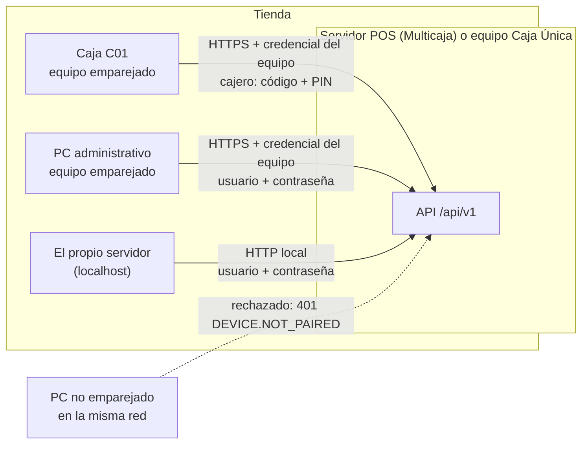
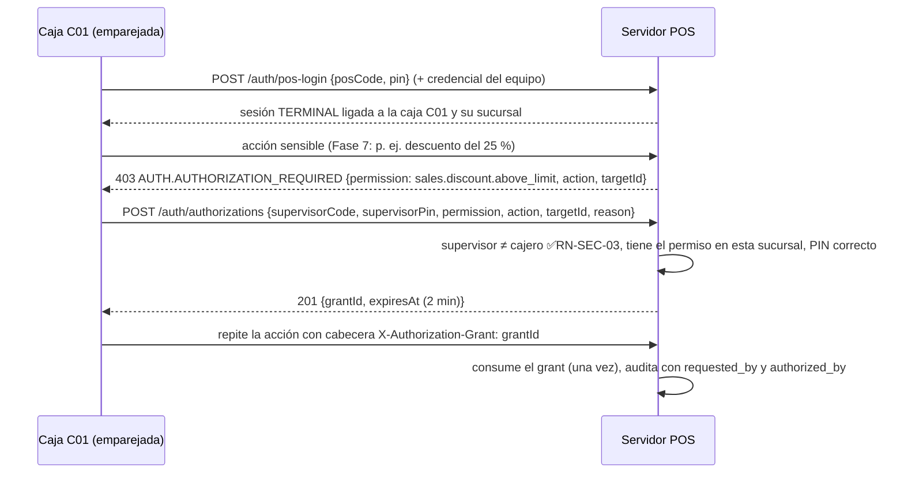

# Fase 3 · Autenticación, usuarios, permisos y equipos — Propuesta

> Estado: **APROBADA (2026-09-28)** con todas las recomendaciones de la §16: backoffice solo desde el servidor y equipos
> emparejados; caja con código de cajero + PIN; empleados desde esta fase; licencia ISC aceptada (NSec/libsodium);
> recuperación del Propietario solo desde el servidor.
> Requisitos previos: Fase 2 implementada ([informe](fase-02-informe.md)); validación del Servicio de Windows de la Fase 1.

**Convenciones:** 🔒 = decisión difícil de cambiar después (se resumen en la §14). ✅ = regla de negocio que se cumple. ⚙️ = parámetro configurable.

## 0. Objetivo y alcance

La Fase 2 dejó la estructura RBAC, el usuario técnico `system` y **todos los endpoints con su permiso declarado, pero verificación permisiva** (riesgo aceptado: el servidor solo escucha en `localhost`). La Fase 3 cierra ese riesgo: **quién es cada usuario, desde qué equipo entra y qué puede hacer**, y abre el servidor Multicaja a la red local de forma segura.

| Incluido | Excluido (fase) |
|---|---|
| Usuarios humanos: alta, edición, roles, excepciones, activación, bloqueo, restablecimiento | Pantallas (15) |
| Contraseñas (Argon2id) y PIN de caja; historial y políticas | Login en el portal web de la nube (Sincronización) |
| Sesiones opacas revocables (backoffice y caja), expiración por inactividad | Empleados con datos de nómina (fuera del producto) |
| **Emparejamiento de equipos** (cajas y equipos administrativos) con código temporal | Descubrimiento automático del servidor en la LAN, mDNS (13) |
| **HTTPS en la LAN** para Multicaja (certificado propio de la instalación, fijado por los equipos) | Instalador que escribe los secretos DPAPI (13) |
| Verificación **real** de permisos por endpoint, con alcance por sucursal | Jornadas de caja (6) — la regla RN-SEC-07 se completa ahí |
| **Autorización de supervisor** de un solo uso (mecanismo genérico) | Descuentos, anulaciones y demás acciones que la usarán (7) |
| Asistente inicial: **usuario Propietario** con contraseña | |
| Recuperación de emergencia del Propietario (herramienta local) | |
| Protección contra fuerza bruta (usuario, IP y equipo) | |
| Sincronización de permisos de los roles de sistema al actualizar | |

---

## 1. Actores y formas de entrar



| Forma de entrar | Dónde | Credencial | Sesión |
|---|---|---|---|
| **Backoffice** | Servidor (localhost) o equipo emparejado | Usuario + contraseña | 30 min de inactividad ⚙️, máximo 12 h ⚙️ |
| **Caja** | Solo en un equipo emparejado como caja | **Código de cajero + PIN** (teclado numérico) | 15 min de inactividad ⚙️ (RN-SEC-06); se vuelve a entrar con PIN y la venta en curso sigue en el servidor |
| **Supervisor** (autorización puntual) | La caja donde ocurre la acción | Código + PIN del supervisor | No crea sesión: crea una autorización de un solo uso |

**Caja Única:** el servidor escucha solo en `localhost` (HTTP) y el propio equipo es la caja; no hace falta emparejar nada.
**Multicaja:** el servidor escucha también en la LAN, **solo por HTTPS**, y **solo atiende equipos emparejados** (🔒 D3-04).

---

## 2. Decisiones principales

| # | Decisión | Por qué | Alternativas descartadas | |
|---|---|---|---|---|
| D3-01 | **Tokens de sesión opacos** (256 bits aleatorios); en la BD solo su SHA-256 | Revocación inmediata (usuario desactivado, cierre remoto); funcionan offline; nada que descifrar si se filtra la BD | JWT: no se revoca sin lista negra, expone datos en el cliente | 🔒 |
| D3-02 | **Argon2id con formato PHC** para contraseñas y PIN; parámetros guardados en cada hash; *rehash* automático al entrar si los parámetros subieron | Estándar actual (OWASP); el formato permite endurecer sin migrar datos; el hash viaja con la sincronización y se verifica igual en la nube | bcrypt (sin memoria dura), PBKDF2 | 🔒 |
| D3-03 | Librería **NSec** (Argon2id y Ed25519 sobre libsodium nativa) | ~10× más rápida que una implementación administrada en PCs modestos; la misma librería firma licencias (Fase 12) y anclas de auditoría | Konscious (MIT, 100 % administrada, lenta con 64 MB) como plan B | — |
| D3-04 | **Emparejamiento obligatorio** de todo equipo de la LAN (cajas y PCs administrativos) con código temporal de 6 dígitos (10 min ⚙️) | Un PC cualquiera de la red (o del Wi-Fi de clientes) no puede ni intentar contraseñas; el PIN solo vale en cajas registradas | Permitir backoffice desde cualquier IP de la LAN | 🔒 |
| D3-05 | **HTTPS con certificado propio de la instalación** (autofirmado, RSA 3072 o ECDSA P-256, 10 años); el equipo lo **fija** al emparejarse (huella SHA-256) | Cifrado en la LAN sin depender de Internet ni de una CA; el *pinning* evita suplantar el servidor | HTTP en la LAN; CA pública (exige dominio e Internet) | 🔒 |
| D3-06 | Permiso efectivo = roles (alcance sucursal) ∪ GRANT − DENY; **DENY siempre gana**; evaluado en el servidor y cacheado por sesión con una **versión de seguridad** | Coincide con el doc 06; un cambio de rol se aplica en la siguiente petición | Evaluar contra la BD en cada petición (lento en caja) | 🔒 |
| D3-07 | **Autorización de supervisor** = registro de un solo uso ligado a permiso + acción + objetivo + caja, válido 2 min ⚙️ | Trazabilidad antifraude (RN-GEN-05); no se puede reutilizar ni transferir | Que el supervisor "inicie sesión" en la caja del cajero | 🔒 |
| D3-08 | **Código de cajero** numérico (3–6 dígitos, único por empresa) para entrar en caja | Rápido con teclado numérico o lector; el nombre de usuario sigue existiendo para el backoffice | Escribir el usuario en la caja | — |
| D3-09 | Identidad **sincronizable** (usuarios, roles, asignaciones) y seguridad **local del nodo** (sesiones, intentos, bloqueos, equipos, autorizaciones) | Aplica la matriz de propiedad (ADR-0014): bloquear a alguien en una tienda no lo bloquea en otra; las credenciales sí viajan | Todo local; todo sincronizado | 🔒 |
| D3-10 | Recuperación de emergencia del Propietario **solo en el servidor**, por un comando local ejecutado como administrador de Windows, auditado | El producto funciona sin Internet ni correo: no hay "olvidé mi contraseña" por email | Recuperación por correo (requiere Internet) | — |

---

## 3. Modelo de datos (migración `V2026.10.006__identity__authentication.sql`)

Cambios sobre tablas existentes:

```
identity.users
  + pos_code            varchar(6)          — código de cajero; UX (company_id, pos_code) WHERE pos_code IS NOT NULL AND deleted_at IS NULL
  + security_version    bigint NN DEFAULT 1 — sube al cambiar roles, excepciones, contraseña, estado: invalida permisos cacheados
  + locked_reason       varchar(30)         — 'FAILED_ATTEMPTS' | 'ADMIN'
  + employee_id         uuid FK→identity.employees
  CK usuario HUMANO ACTIVO ⇒ password_hash NOT NULL          (se activa ahora; en la Fase 2 no había humanos)
  CK pin_hash NOT NULL ⇒ pos_code NOT NULL

org.devices
  + credential_hash     char(64) NN         — SHA-256 del secreto del equipo (el secreto solo lo conoce el equipo)
  + certificate_pin     char(64)            — huella del certificado del servidor que el equipo fijó
  + paired_by           uuid NN             — usuario que generó el código
  + revoked_at, revoked_by
```

Tablas nuevas (todas con `company_id`; las de seguridad llevan también `node_id` porque son **locales del nodo**):

**identity.employees** [CTL][DEL] — persona detrás del usuario (datos mínimos para trazabilidad, sin nómina)
```
id, company_id, branch_id NULL, identification_type FK→ref.identification_types, identification_number,
first_name, last_name, phone, email, status CK ('ACTIVE','INACTIVE'), row_version
UX (company_id, identification_type, identification_number) WHERE deleted_at IS NULL
```

**identity.user_sessions** — local del nodo, no se sincroniza
```
id, company_id, node_id, user_id FK, token_hash char(64) UQ, kind CK ('BACKOFFICE','TERMINAL'),
device_id FK→org.devices NULL (NULL = localhost), pos_terminal_id FK NULL, branch_id FK NN,
ip_address inet, user_agent varchar(200), security_version bigint NN,
created_at, last_activity_at, idle_timeout_seconds int, expires_at NN, revoked_at, revoked_by, revoked_reason
IX parcial (user_id) WHERE revoked_at IS NULL
```

**identity.login_attempts** — append-only, local, se purga a los 180 días ⚙️
```
id, company_id, node_id, occurred_at, kind CK ('PASSWORD','PIN','SUPERVISOR'), identifier_attempted varchar(60),
user_id NULL, device_id NULL, ip_address inet, succeeded bool, failure_reason varchar(40)
IX (identifier_attempted, occurred_at) · IX (ip_address, occurred_at)
```

**identity.password_history** — `user_id, password_hash, created_at` (últimas 5 ⚙️, RN-SEC-01)

**identity.authorization_grants** — local del nodo, sube como documento de auditoría
```
id, company_id, node_id, permission_code FK, requested_by FK users, authorized_by FK users,
CK authorized_by <> requested_by                        ✅ RN-SEC-03
pos_terminal_id FK NULL, action varchar(60) NN, target_type varchar(60), target_id uuid,
reason varchar(250), context jsonb, granted_at, expires_at, consumed_at, consumed_by_request varchar(64)
```

**org.device_pairing_codes** — local, de un solo uso
```
id, company_id, node_id, code_hash char(64), device_kind CK ('TERMINAL','ADMIN_WORKSTATION'),
pos_terminal_id NULL (la caja a la que quedará asociado), created_by, created_at, expires_at, used_at, used_by_device
```

Todas las FK indexadas, restricciones con nombre y la auditoría de `users`, `roles`, `user_roles`, `user_permission_overrides`, `employees` y `devices` automática ([Audited]).

---

## 4. Flujos

### 4.1 Emparejar un equipo (Multicaja)

```mermaid
sequenceDiagram
  participant Adm as Administrador (en el servidor o equipo ya emparejado)
  participant API as Servidor POS
  participant Eq as Equipo nuevo
  Adm->>API: POST /devices/pairing-codes {kind: TERMINAL, posTerminalId}
  API-->>Adm: código 482913 (vence en 10 min) + huella del certificado
  Note over Eq: el instalador de caja muestra la huella y pide el código
  Eq->>API: POST /devices/pair {code, hostname, fingerprintHash} (HTTPS; el equipo comprueba la huella mostrada)
  API->>API: valida código (un solo uso), crea org.devices, genera secreto de 256 bits
  API-->>Eq: deviceId + deviceSecret (solo esta vez) + huella del certificado
  Note over Eq: guarda deviceSecret protegido con DPAPI y fija el certificado
```
- Cada petición posterior del equipo lleva `X-Device-Id` y `X-Device-Secret`; el servidor compara el SHA-256 en tiempo constante.
- Revocar un equipo (`POST /devices/{id}/revoke`) cierra todas sus sesiones de inmediato.
- 5 códigos erróneos seguidos desde una IP la bloquean 15 min ⚙️.

### 4.2 Entrar al backoffice

```mermaid
sequenceDiagram
  participant C as Cliente (localhost o equipo emparejado)
  participant API as Servidor POS
  C->>API: POST /auth/login {username, password}
  API->>API: ¿equipo válido? ¿usuario ACTIVO? ¿bloqueado? Argon2id (cola limitada)
  alt correcto
    API->>API: crea sesión (token 256 bits; guarda SHA-256), auditoría LOGIN_SUCCEEDED
    API-->>C: 200 {token, expiresAt, mustChangePassword, user, permissions, branches}
  else incorrecto
    API->>API: login_attempts + contador; al 5.º ⚙️ → LOCKED 15 min ⚙️ (RN-SEC-02), auditoría
    API-->>C: 401 AUTH.INVALID_CREDENTIALS (mismo mensaje exista o no el usuario)
  end
```
- `mustChangePassword = true` → la sesión solo permite `POST /auth/change-password` y `POST /auth/logout`.
- Si los parámetros de Argon2id del hash son antiguos, se recalcula al entrar (D3-02).

### 4.3 Entrar en la caja y autorización de supervisor


En la Fase 3 el mecanismo se prueba con un endpoint de diagnóstico de desarrollo; los casos reales llegan con cada módulo.

### 4.4 Asistente inicial con Propietario

`POST /api/v1/setup` agrega `owner {username, displayName, password, posCode?, pin?}`: el usuario Propietario (rol `OWNER`, todas las sucursales) se crea en la misma transacción.
Para instalaciones configuradas en la Fase 2 sin Propietario: `POST /api/v1/setup/owner`, **solo desde localhost** y solo mientras no exista un Propietario activo.

### 4.5 Recuperación de emergencia

```
Pos.Server.Migrator reset-owner --connection "<cadena pos_migrator>" --username dueno
```
Solo en el servidor, como administrador de Windows (necesita la credencial DPAPI del migrador). Genera una contraseña temporal, marca `must_change_password`, revoca las sesiones del usuario y audita `OWNER_EMERGENCY_RESET` con severidad crítica.

---

## 5. Reglas de negocio

| Regla | Implementación |
|---|---|
| RN-SEC-01 Contraseñas ≥ 8 ⚙️, sin reutilizar las últimas 5 ⚙️, nunca en claro | Validador + `password_history`; además: distinta del usuario y fuera de una lista de 1.000 contraseñas comunes incrustada |
| RN-SEC-02 Bloqueo tras 5 intentos ⚙️ durante 15 min ⚙️ | Contador por usuario **en el nodo**; además, límite por IP y por equipo (limitador de ASP.NET Core) |
| RN-SEC-03 Nadie se autoriza a sí mismo | CHECK en la BD + regla en el servicio |
| RN-SEC-04 Siempre un Propietario/Administrador activo | No se puede desactivar, bloquear, borrar ni quitar el último rol `OWNER`/`ADMIN` activo (`IDENTITY.LAST_ADMINISTRATOR`) |
| RN-SEC-05 Nadie se concede permisos ni asigna roles con más privilegios que los propios | Al asignar un rol o un GRANT: el conjunto de permisos concedidos ⊆ permisos efectivos del que asigna (`IDENTITY.PRIVILEGE_ESCALATION`); un usuario no modifica sus propios roles |
| RN-SEC-06 Expiración por inactividad | Deslizante por tipo de sesión ⚙️ |
| RN-SEC-07 Desactivar un usuario revoca sus sesiones | Inmediato; la condición de jornada abierta se agrega en la Fase 6 |
| PIN | 4–6 dígitos ⚙️; **3 intentos** ⚙️ antes de bloquear el PIN (no el usuario); PIN no trivial (0000, 1234…); solo válido en cajas emparejadas |
| Roles de sistema | No se editan ni se borran; se **clonan**. Al actualizar el producto, se les agregan los permisos nuevos de su definición (pendiente de la Fase 2) |

## 6. Permisos que se agregan

| Permiso | Sensible | Descripción |
|---|---|---|
| `identity.user.view` | No | Consultar usuarios |
| `identity.user.manage` | Sí | Crear, editar, activar y desactivar usuarios; restablecer contraseña o PIN |
| `identity.role.manage` | Sí | Crear, clonar y editar roles; asignar roles y excepciones |
| `identity.session.revoke` | Sí | Cerrar sesiones de otros usuarios |
| `organization.device.manage` | Sí | Generar códigos de emparejamiento y revocar equipos |

El catálogo sigue saliendo del código (la prueba de la Fase 2 compara código ↔ BD).

## 7. Seguridad técnica

| Tema | Diseño |
|---|---|
| Parámetros Argon2id | Contraseña: 64 MiB, 3 iteraciones, paralelismo 1. PIN: 19 MiB, 2 iteraciones (mínimo de OWASP; el PIN se protege sobre todo por el bloqueo y el emparejamiento). **Criterio: < 500 ms en el hardware mínimo publicado** (R-08); si no se cumple, se ajusta antes de publicar |
| Agotamiento de memoria | Máximo 4 ⚙️ cálculos Argon2id simultáneos (cola); el resto espera o recibe `429` |
| Enumeración de usuarios | Misma respuesta y tiempo similar exista o no el usuario |
| Tokens | 256 bits de `RandomNumberGenerator`; comparación por hash; nunca en logs (el enmascarado de la Fase 1 ya cubre `token`, `pin`, `password`, `secret`) |
| HTTPS en la LAN | Kestrel con el certificado de la instalación (guardado con clave privada protegida por DPAPI en `{DataRoot}\config`); HTTP solo en `localhost`; cabecera HSTS no aplica (sin dominio) |
| CORS | Cerrado; la UI web (Fase 15) se sirve desde el propio servidor |
| Cabeceras | `X-Content-Type-Options`, `Cache-Control: no-store` en respuestas de autenticación |
| Contexto de la petición | El middleware de autenticación llena `ICurrentUser` (usuario, sesión, caja, sucursal) y `IRequestContext.DeviceId`: la auditoría ya registra quién, en qué sesión y desde qué equipo |

## 8. Impacto en la sincronización futura (matriz de la revisión §6 y §10)

| Dato | ¿Viaja? | Conflicto |
|---|---|---|
| Usuarios, empleados, roles, asignaciones, excepciones | Sí (maestros, `row_version`) | Por campo, gana el más reciente; bandeja de conflictos |
| `password_hash`, `pin_hash` | Sí | Gana el `password_changed_at` / `pin_changed_at` más reciente |
| Sesiones, intentos, bloqueos por intentos, equipos, códigos de emparejamiento | **No** (locales del nodo) | — |
| Autorizaciones de supervisor | Sube (documento inmutable) | Ninguno |
| `pos_code` único por empresa | Sí | Dos tiendas offline pueden asignar el mismo código → la nube lo marca como conflicto y pide cambiar uno (se evita asignándolo en la nube cuando haya conexión) |

## 9. API

| Método y ruta | Seguridad |
|---|---|
| `POST /auth/login` · `POST /auth/pos-login` | Anónimo por diseño (equipo emparejado o localhost) |
| `POST /auth/logout` · `GET /auth/me` · `POST /auth/change-password` · `POST /auth/change-pin` | Autenticado |
| `POST /auth/authorizations` | Equipo tipo caja |
| `GET/POST /identity/users` · `GET/PUT /identity/users/{id}` · `POST /identity/users/{id}/activate` · `/deactivate` · `/unlock` · `/reset-password` · `/reset-pin` | `identity.user.view` / `identity.user.manage` |
| `PUT /identity/users/{id}/roles` · `PUT /identity/users/{id}/overrides` | `identity.role.manage` |
| `POST /identity/roles` (clonar o crear) · `PUT /identity/roles/{id}` · `DELETE /identity/roles/{id}` | `identity.role.manage` |
| `GET /identity/sessions` · `POST /identity/sessions/{id}/revoke` | `identity.session.revoke` |
| `POST /devices/pairing-codes` · `GET /devices` · `POST /devices/{id}/revoke` | `organization.device.manage` |
| `POST /devices/pair` | Anónimo por diseño (código de un solo uso) |
| `POST /setup/owner` | Anónimo por diseño, solo localhost y sin Propietario |

## 10. Migración de instalaciones existentes

- Migración `V2026.10.006`: solo agrega columnas y tablas (patrón *expand*). El CHECK "humano activo ⇒ contraseña" no rompe nada: en la Fase 2 solo existe el usuario `system`.
- Al arrancar la versión de la Fase 3 sin Propietario, `/setup/status` informa `ownerPending: true` y todo endpoint de negocio responde `403 SETUP.OWNER_REQUIRED` hasta crearlo desde el servidor.
- Los roles de sistema existentes reciben los permisos nuevos (§6).

## 11. Pruebas previstas

- **Unitarias:** evaluación de permisos (roles por sucursal, GRANT, DENY gana), políticas de contraseña y PIN, reglas RN-SEC-03/04/05, formato PHC y *rehash*.
- **BD real:** sesiones, bloqueo por intentos, historial, CHECKs nuevos, códigos de emparejamiento de un solo uso, autorización consumida una sola vez, privilegios de `pos_app`.
- **API:** cada endpoint de negocio devuelve `401` sin sesión y `403` sin permiso (prueba generada recorriendo todos los endpoints); login y bloqueo; equipo no emparejado rechazado; revocar equipo o desactivar usuario corta sus sesiones al instante; supervisor que se autoriza a sí mismo rechazado; auditoría con usuario, sesión y equipo reales.
- **Rendimiento:** Argon2id < 500 ms; 20 logins simultáneos sin agotar memoria.
- **HTTPS:** el servidor Multicaja rechaza HTTP desde la LAN y acepta HTTPS con el certificado fijado.

## 12. Riesgos

| Riesgo | Mitigación |
|---|---|
| Hardware antiguo lento con Argon2id | Medición en el criterio de aceptación; parámetros en el hash permiten ajustar |
| Olvido de la contraseña del único Propietario sin Internet | Recuperación local (§4.5) + recomendación de un segundo Administrador |
| El cajero comparte su PIN | Auditoría por caja y sesión; cambio de PIN obligatorio al primer uso; reporte antifraude (Fase 9) |
| Pérdida del certificado o del secreto de un equipo | Revocar y volver a emparejar (1 minuto); el certificado del servidor se respalda con el backup |
| NSec depende de una librería nativa (libsodium) | Se distribuye con el producto para Windows x64; plan B Konscious (administrada) |

## 13. Estructura de código

```
src/BuildingBlocks/Pos.Api.Abstractions      Autenticación (esquema propio), filtro de permisos real, filtro de autorización de supervisor
src/BuildingBlocks/Pos.Infrastructure        Security/: Argon2idHasher (PHC), TokenService, PermissionEvaluator + caché, límites
src/Modules/Identity/*                       Usuarios, empleados, roles, excepciones, sesiones, autorizaciones, emparejamiento
src/Server/Pos.Server.Host                   Kestrel HTTP local + HTTPS LAN (Multicaja), certificado de la instalación
src/Server/Pos.Server.Migrator               reset-owner
src/Server/Pos.Server.Migrations             V2026.10.006__identity__authentication.sql
tests/Pos.Modules.Identity.UnitTests         Reglas y evaluación de permisos
http/fase-03.http                            Emparejar, entrar, permisos, supervisor, bloqueo
```

**Dependencias nuevas** (se verifican antes de agregarlas): `NSec.Cryptography` (MIT) y su dependencia nativa `libsodium` (**licencia ISC**, permisiva y equivalente a MIT/BSD-2: requiere agregar ISC a la política de licencias, ver §15).

## 14. Decisiones difíciles de cambiar

| # | Decisión | Costo de cambiarla | Por qué ahora |
|---|---|---|---|
| D3-01 | Tokens opacos con hash en la BD | Reescribir autenticación y clientes | Revocación inmediata y offline |
| D3-02 | Argon2id + PHC | Forzar cambio de todas las contraseñas | El PHC permite endurecer sin migrar |
| D3-04 | Emparejamiento obligatorio en la LAN | Re-emparejar todas las cajas de todos los clientes | Seguridad por defecto en redes de tienda |
| D3-05 | Certificado propio + *pinning* | Reconfigurar todos los equipos | Cifrado sin Internet ni dominio |
| D3-06 | Fórmula de permisos (DENY gana, alcance por sucursal) | Revisar roles de todos los clientes | Es el contrato con el que los clientes arman sus roles |
| D3-07 | Autorización de supervisor de un solo uso | Cambiar los flujos de caja de las fases 6–8 | Las fases siguientes se construyen sobre ella |
| D3-09 | Identidad sincronizable / seguridad local | Rehacer la sincronización de usuarios | Coherente con ADR-0014 |

## 15. Criterios de aceptación

- [ ] Ningún endpoint de negocio responde sin sesión (`401`) ni sin permiso (`403`); prueba automática sobre todos los endpoints.
- [ ] Asistente con Propietario; `/setup/owner` solo desde localhost y solo si no hay Propietario.
- [ ] Login de backoffice y de caja (código + PIN); bloqueo al 5.º intento y desbloqueo por tiempo o por administrador; mensajes que no revelan si el usuario existe.
- [ ] Sesiones: expiración por inactividad, revocación inmediata al desactivar el usuario o revocar el equipo.
- [ ] Emparejamiento: código de un solo uso con vencimiento; equipo no emparejado rechazado; PIN rechazado fuera de una caja.
- [ ] Multicaja escucha por HTTPS en la LAN con el certificado de la instalación; Caja Única solo en localhost.
- [ ] RN-SEC-01 a RN-SEC-07 (salvo la parte de jornadas de la 07) cubiertas por pruebas.
- [ ] Autorización de supervisor: un solo uso, vence, no se autoriza uno mismo, queda auditada con ambos usuarios.
- [ ] Auditoría con usuario, sesión, equipo e IP reales; `verify-audit` íntegro.
- [ ] Argon2id < 500 ms en el hardware mínimo; 20 logins simultáneos sin error.
- [ ] `reset-owner` funciona y queda auditado como crítico.
- [ ] `build.ps1` en verde; cobertura del dominio de Identity ≥ 90 % y de la seguridad de infraestructura ≥ 85 %.
- [ ] Docs 05/06 actualizados, ADRs (tokens opacos, Argon2id/NSec, emparejamiento y HTTPS) e informe de fase.

## 16. Preguntas para ti

1. **Entrada al backoffice:** ¿solo desde el servidor y desde equipos emparejados (recomendado), o también desde cualquier PC de la red?
2. **Entrada en caja:** ¿código de cajero + PIN (recomendado, rápido con teclado numérico) o elegir el nombre en una lista + PIN?
3. **Empleados:** ¿registramos la persona detrás de cada usuario (identificación, nombre, teléfono) desde ahora, o lo dejamos para más adelante?
4. **Licencia ISC de libsodium:** ¿aceptas agregarla a la política de licencias permitidas (es tan permisiva como MIT) para usar NSec? Si no, uso la alternativa 100 % administrada, más lenta.
5. **Recuperación del Propietario:** ¿estás de acuerdo con que sea solo desde el servidor, con un comando de administrador, sin correo electrónico?

**Respuestas del propietario (2026-09-28):** 1) solo servidor y equipos emparejados; 2) código + PIN; 3) empleados desde ahora; 4) ISC aceptada; 5) recuperación solo desde el servidor.
