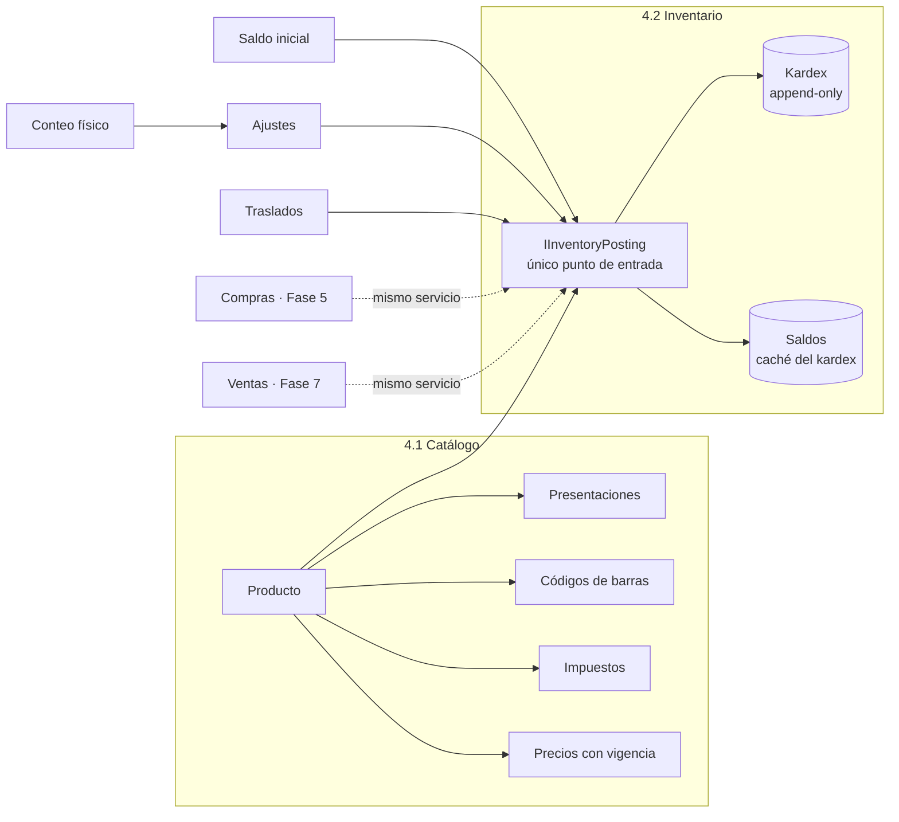
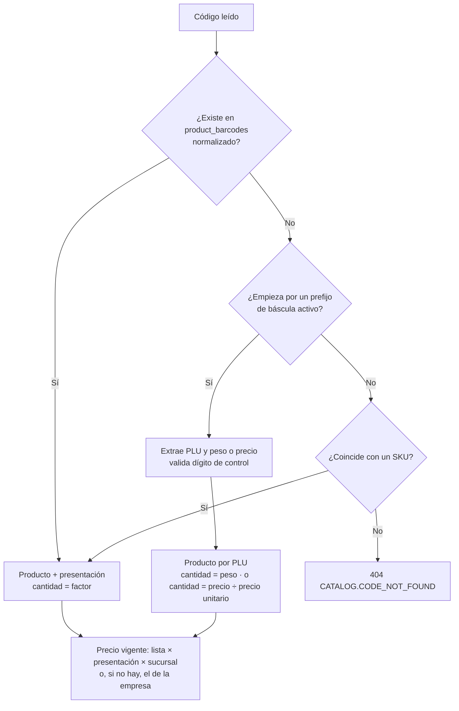

# Fase 4 · Productos e inventario — Propuesta

> Estado: **IMPLEMENTADA (2026-09-28)** — ver [informe](fase-04-informe.md). Aprobada el 2026-09-28 con todas las recomendaciones de la §15: lotes en la Fase 5 (estructura lista ahora);
> importación `.xlsx` con MiniExcel (Apache-2.0); lista de empresa con precio especial opcional por sucursal; impuestos
> saludables y bolsa modelados e inactivos; umbral de aprobación de ajustes $500.000 ⚙️; códigos internos EAN-13 con prefijo `29` + nodo.
> Requisitos previos: Fase 3 implementada ([informe](fase-03-informe.md)).
> Base: docs [04 §H.5–H.6](../04-base-de-datos.md), [05 RN-CAT / RN-INV](../05-reglas-y-estados.md), [07](../07-inventario-kardex.md), [revisión de la Fase 2 §6 y §10](fase-02-revision-arquitectonica.md) y decisiones D7, D8 y D9 del [doc 12](../12-plan-riesgos-decisiones.md).

**Convenciones:** 🔒 = decisión difícil de cambiar después (matriz de revisión en la §3). ✅ = regla de negocio que se cumple. ⚙️ = parámetro configurable.

## 0. Objetivo y alcance

Después de esta fase, una tienda puede **cargar su catálogo completo** (a mano o desde Excel), **fijar precios con vigencia**, **leer cualquier código de barras** (incluidas las etiquetas de la báscula) y **llevar su inventario con kardex**: saldo inicial, ajustes, conteos físicos y traslados entre bodegas. Todo el inventario queda valorizado al costo promedio y cuadra siempre con el kardex.

Es la base de las fases 5 (compras: entradas y costo), 6 (caja) y 7 (ventas: salidas). Por eso esta fase deja listo el **servicio único de publicación de inventario** (`IInventoryPosting`) que usarán todas ellas.

| Incluido | Excluido (fase) |
|---|---|
| Categorías (árbol), marcas, unidades de medida y conversiones | Imágenes de productos (portal) |
| Impuestos con vigencia (IVA, INC bolsa, impuestos saludables) y su asignación a productos | Cálculo de impuestos de una venta y documento fiscal (7) |
| Productos, presentaciones (paquete, caja…), códigos de barras, PLU de báscula | Promociones, combos y kits (7/8) |
| Reglas de códigos de peso/precio variable y **resolución de un escaneo** | Envío de PLU a la báscula (agente de caja, 7) |
| Listas de precios, precio por presentación y por sucursal, **vigencias e historial** | Listas por cliente o grupo de clientes (8) |
| Kardex, saldos, costo promedio ponderado por bodega | Entradas por compra y devoluciones a proveedor (5) |
| Saldo inicial, ajustes con motivo y aprobación | Salidas por venta, anulación y devolución (7) |
| Conteo físico (ciego, varios usuarios, reconteo, sin cerrar la tienda) | Lotes y vencimientos: columna preparada, gestión en la Fase 5 (pregunta 1) |
| Traslados entre bodegas **del mismo nodo** | Traslados entre sucursales (fase de sincronización) |
| Políticas de mínimo/máximo y alerta de bajo mínimo | Sugerido de compra (5) y reportes avanzados (9) |
| Importación de productos, precios y saldo inicial (CSV y Excel) con vista previa | Pantallas (15) |
| Verificación y reconstrucción del saldo contra el kardex | |
| Registro de cambios por campo para la sincronización futura de maestros | Envío a la nube (sincronización) |

La fase se entrega en **dos bloques** con commits separados y una sola aprobación: **4.1 Catálogo e importación** y **4.2 Inventario y kardex**.

---

## 1. Actores y casos de uso

| Actor (rol de sistema) | Qué hace en esta fase |
|---|---|
| Propietario / Administrador | Todo; configura impuestos, reglas de báscula, listas de precios, umbrales |
| Encargado de inventario (`INVENTORY`) | Productos, códigos, saldo inicial, ajustes, conteos, traslados; aprueba ajustes y conteos |
| Compras (`PURCHASING`) | Consulta productos, costos y existencias; mantiene productos |
| Supervisor de caja (`CASH_SUPERVISOR`) | Consulta productos, precios y existencias |
| Cajero (`CASHIER`) | Consulta productos, precios y existencias (sin costos); registra conteos si se le asignan |
| Contador (`ACCOUNTANT`) | Consulta kardex y costos |



---

## 2. Decisiones principales

| # | Decisión | Por qué | |
|---|---|---|---|
| D4-01 | **Kardex inmutable** (solo INSERT; `pos_app` sin UPDATE/DELETE) y saldo como caché actualizado **en la misma transacción** | RN-INV-01/02/11: el stock es consecuencia de documentos; un error se corrige con un movimiento inverso | 🔒 |
| D4-02 | **Costo promedio ponderado por bodega** (D7), llevando el **valor total** del saldo además de la cantidad | El promedio se deriva de valor ÷ cantidad: no se acumulan errores de redondeo; al llegar a cero el valor queda en cero exacto | 🔒 |
| D4-03 | Cantidades siempre en la **unidad base** del producto (`numeric(18,4)`); la unidad base no cambia si hay movimientos | 6 × "Paquete x6" = 36 UND. Un cambio de unidad reinterpretaría todo el historial (RN-CAT-08) | 🔒 |
| D4-04 | **Cada bodega tiene un solo nodo escritor** (el de su sucursal); el portal no mueve inventario | Garantiza que el saldo después de cada movimiento sea correcto sin coordinación entre nodos | 🔒 |
| D4-05 | **Precios como registros con vigencia**, sin solapamiento (restricción de exclusión en la BD), IVA incluido por defecto (D9), por lista × presentación × sucursal opcional | Historial completo; cambios programados (precio desde el lunes); dos cambios offline nunca se pisan (§10.1 de la revisión) | 🔒 |
| D4-06 | **Un código de barras identifica una sola cosa** (producto o presentación) dentro de la empresa; se valida el dígito de control; UPC-A se normaliza a EAN-13 | El escaneo en caja nunca es ambiguo; los lectores envían UPC con o sin el 0 inicial | 🔒 |
| D4-07 | **SKU y códigos internos sin consecutivo global**: los escribe el usuario o se generan con el prefijo del nodo | Dos tiendas offline no pueden generar el mismo código (§10.1 de la revisión) | 🔒 |
| D4-08 | **Impuestos como datos maestros con vigencia** (no configuración) asignados por producto | La ley cambia por fecha; una venta de ayer se recalcula con la tarifa de ayer | 🔒 |
| D4-09 | **Registro de cambios por campo** para todo maestro sincronizable: evento `SYNC` con los campos modificados, la versión base y la nueva | Es el requisito de la §10.1 para combinar ediciones de la tienda y del portal; hacerlo después obligaría a reconstruir el historial | 🔒 |
| D4-10 | Stock negativo **bloqueado por defecto** en ajustes y traslados; configurable (`inventory.allow_negative_stock`, D8) | En ventas (Fase 7) una venta ya entregada nunca se rechaza: se registra y alerta | |
| D4-11 | Conteo **sin cerrar la tienda**: saldo teórico congelado al iniciar + movimientos posteriores | RN-INV-06; un supermercado no puede cerrar para contar | |
| D4-12 | Reglas de código de **peso/precio variable** configurables por empresa (prefijos 20–28) | Cada marca de báscula etiqueta distinto | |
| D4-13 | **Importación con vista previa**: se valida todo el archivo, se muestran los errores por fila y solo se aplica si el usuario confirma; se aplica en una transacción | Cargar 5.000 productos no puede dejar la mitad guardada | |
| D4-14 | Búsqueda por nombre **sin tildes ni mayúsculas** con índice de trigramas; escaneo por índice exacto | "cafe" encuentra "Café Águila Roja"; un escaneo responde en milisegundos | |

---

## 3. Revisión arquitectónica de las decisiones difíciles de cambiar

Todas las decisiones tienen **el mismo impacto en licenciamiento**: ninguno. Las dos ediciones (Caja Única y Multicaja) tienen toda la funcionalidad (ADR-0015); ninguna tabla ni endpoint depende de la edición.

| ID | Decisión | Motivo | Alternativas | Consecuencia positiva | Riesgo | Impacto POS local | Impacto multisucursal | Impacto sincronización | Dificultad de cambiar | Recomendación |
|---|---|---|---|---|---|---|---|---|---|---|
| D4-01 | Kardex inmutable + saldo caché en la misma transacción | El stock debe explicarse siempre por documentos | a) Editar el stock directamente; b) calcular el saldo sumando el kardex en cada consulta | Auditoría total; se puede reconstruir el saldo; ventas rápidas (una fila por producto) | Una fila de saldo muy concurrida (producto estrella) serializa las cajas | Bloqueo por fila en orden de `product_id` → sin *deadlocks*; se mide con 20 cajas concurrentes | Cada sucursal tiene su kardex; la nube consolida | Los movimientos suben tal cual (UUID, sin conflictos); el saldo en la nube se recalcula | Muy alta | **Adoptar** |
| D4-02 | Promedio ponderado por bodega con valor total | Lo habitual en retail colombiano; auditable (D7) | a) Promedio por empresa; b) por sucursal; c) PEPS/FIFO; d) costo estándar | Cada bodega explica su costo; el traslado lleva el costo de origen | Dos bodegas del mismo producto con costos distintos en reportes | Cálculo local, sin Internet | La utilidad por sucursal es exacta; el consolidado de empresa suma valores (no promedia promedios) | Sin impacto: el costo viaja en el movimiento | Muy alta (recalcular el historial) | **Adoptar**; si en el futuro se quiere promedio por empresa, se obtiene como reporte (Σ valor ÷ Σ cantidad) |
| D4-03 | Cantidad en unidad base, `numeric(18,4)` | Una sola unidad para sumar | Guardar la cantidad en la presentación vendida | Kardex y saldos sumables; 4 decimales cubren gramos (0,001 kg) | Productos a granel con precisión mayor a 0,0001 | Ninguno | Ninguno | Ninguno | Muy alta | **Adoptar**; la presentación usada queda como dato informativo en la línea del documento |
| D4-04 | Un nodo escritor por bodega | El saldo "después del movimiento" solo es correcto con un escritor | Escritores múltiples con reconciliación posterior | Sin conflictos de inventario | El portal no puede hacer ajustes | Normal: la tienda es dueña de su inventario | Cada bodega pertenece a una sucursal y a su nodo | Movimientos solo suben (↑), nunca bajan | Alta | **Adoptar** (coherente con ADR-0014) |
| D4-05 | Precios con vigencia sin solapamiento | Historial y cambios programados | Un campo `price` en el producto | Precio de cualquier fecha; promociones con fecha de fin; sin pérdida en ediciones simultáneas | Más filas; la consulta de "precio vigente" necesita índice | Se precalcula el precio vigente en la consulta de escaneo (índice por producto y fecha) | Precio de empresa + precio especial por sucursal | Cada cambio es un registro nuevo → no hay conflicto de campo | Alta | **Adoptar** |
| D4-06 | Código único por empresa; normalización UPC→EAN-13 | Un escaneo = un resultado | Código único por sucursal | Catálogo idéntico en todas las sucursales | Dos tiendas offline registran el mismo código en productos distintos | Se valida en la BD local | Detección de duplicados al sincronizar → bandeja de conflictos para fusionar (§10.1) | Conflicto posible pero **detectable y resoluble** | Alta | **Adoptar** |
| D4-07 | SKU/código interno con prefijo del nodo | Unicidad sin Internet | Consecutivo global desde la nube | Sin choques entre tiendas | Códigos internos menos "bonitos" | Ninguno | Cada nodo tiene su rango | Sin conflictos de creación | Media | **Adoptar**; el usuario siempre puede escribir su propio SKU |
| D4-08 | Impuestos con vigencia, por producto | La tarifa depende de la fecha | Tarifa como configuración | Cambios de ley programados sin tocar productos | El usuario debe mantener las tarifas | Ninguno | Iguales para toda la empresa | Maestro de empresa, sincronizable | Alta | **Adoptar**; se siembran IVA 19 %, 5 %, exento y excluido |
| D4-09 | Registro de cambios por campo | Combinar ediciones tienda ↔ portal | Sincronizar la fila completa (gana la última) | Ediciones de campos distintos se combinan; el conflicto real queda identificado | Más eventos en el outbox | Una fila de outbox por cambio, en la misma transacción | Igual en todas | **Es la base** de la sincronización de maestros | Muy alta | **Adoptar** para todos los maestros (también Organization e Identity) |

---

## 4. Modelo de datos

Dos migraciones: `V2026.10.007__catalog__catalog.sql` y `V2026.10.008__inventory__inventory.sql`, más las repetibles de unidades, permisos y motivos. Todas las tablas de negocio llevan `company_id`, columnas de control, `row_version` y auditoría, como en las fases anteriores. Los tipos siguen el doc 04 §H.5–H.6 con estos **cambios**:

### 4.1 Catálogo (`catalog`)

| Tabla | Contenido | Cambios frente al doc 04 |
|---|---|---|
| `ref.units_of_measure` | UND, KG, G, LB, L, ML, M… con código de unidad para la factura electrónica (UN/ECE, p. ej. `94` unidad, `KGM` kilogramo) y decimales permitidos | Se mueve a `ref` (datos globales, no de la empresa) |
| `ref.unit_conversions` | KG→G = 1000, LB→G = 453,59237… | Se mueve a `ref` |
| `catalog.categories` | Árbol de hasta 4 niveles ⚙️; `path` materializado | Límite de profundidad |
| `catalog.brands` | Marcas | — |
| `catalog.taxes` | Impuestos con vigencia (§4.3) | + `DIAN_code` a validar con Factus |
| `catalog.products` | Según el doc 04 | + `search_text` (nombre y SKU sin tildes, en minúsculas); + `net_content` y `net_content_unit` (p. ej. 1,5 L) para impuestos saludables y precio por unidad de medida; `product_type` admite `STOCKABLE` y `SERVICE` (`KIT` reservado) |
| `catalog.product_packagings` | Presentaciones con factor en unidad base | — |
| `catalog.product_barcodes` | Códigos | + `normalized_code` (UPC-A → EAN-13); unicidad sobre el normalizado entre códigos activos |
| `catalog.variable_barcode_rules` | Reglas de báscula | Unicidad por prefijo |
| `catalog.product_taxes` | Impuestos del producto | + `fixed_amount` opcional (valor por unidad propio del producto, p. ej. bebidas azucaradas según su contenido) |
| `catalog.price_lists` | Listas; una por defecto | — |
| `catalog.product_prices` | Precios con vigencia | `EXCLUDE USING gist` sobre (lista, producto, presentación, sucursal) y rango `[valid_from, valid_to)` |
| `catalog.import_batches` / `import_rows` | Importaciones con su vista previa y resultado por fila | **Nuevas** |

### 4.2 Inventario (`inventory`)

| Tabla | Contenido | Cambios frente al doc 04 |
|---|---|---|
| `inventory.stock_balances` | Saldo por bodega × producto (× lote) | + `total_value numeric(19,4)`; `average_cost` se deriva (valor ÷ cantidad); + `node_id` |
| `inventory.stock_movements` | Kardex **append-only** | + `balance_value`; + `node_id`; + `packaging_id` y `packaging_quantity` informativos; `pos_app` solo SELECT e INSERT |
| `inventory.inventory_lots` | Lotes | Se crea la tabla y la columna `lot_id`; la gestión llega en la Fase 5 |
| `inventory.stock_policies` | Mínimo, máximo, punto de pedido por bodega | — |
| `inventory.adjustment_reasons` | Motivos de la empresa, cada uno mapeado a un tipo fijo | Se siembran al configurar la empresa (§4.4) |
| `inventory.inventory_adjustments` / `_lines` | Ajustes (incluye saldo inicial) | + `approval_required`, `approved_by` ≠ `created_by` (CHECK) |
| `inventory.inventory_counts` / `_lines` / `_entries` | Conteos | + `_entries`: cada captura de cada contador (varios usuarios cuentan el mismo producto en distintos pasillos) |
| `inventory.stock_transfers` / `_lines` | Traslados | CHECK: origen y destino de la **misma sucursal** en esta fase |
| `inventory.stock_verification_runs` | Resultado de cada verificación saldo ↔ kardex | **Nueva** |

### 4.3 Impuestos sembrados y modelables

| Código | Tipo | Cálculo | Estado inicial |
|---|---|---|---|
| `IVA19` | IVA | 19 % | Activo, por defecto en productos nuevos ⚙️ |
| `IVA5` | IVA | 5 % | Activo |
| `IVA0_EXENTO` | IVA | 0 % exento (con derecho a descuento) | Activo |
| `IVA_EXCLUIDO` | IVA | Excluido (no causa IVA) | Activo |
| `INC_BOLSA` | Impuesto al consumo de bolsas plásticas | Valor fijo por unidad, con vigencia anual | Inactivo hasta que el usuario cargue el valor del año |
| `IBUA` | Bebidas ultraprocesadas azucaradas | Valor fijo por unidad **del producto** (depende del contenido y del azúcar) | Inactivo |
| `ICUI` | Comestibles ultraprocesados | Porcentaje con vigencia | Inactivo |

Las **tarifas y valores los confirma el usuario con su contador** y se cargan con su fecha de vigencia; el sistema no los deduce. RN-CAT-02 exige al menos un impuesto de IVA (aunque sea excluido) para vender.

### 4.4 Datos iniciales por empresa

Al terminar el asistente (y al arrancar, para instalaciones existentes, igual que los roles de sistema): lista de precios `GENERAL` por defecto, impuestos de la §4.3, motivos de ajuste (daño, vencimiento, pérdida o robo, consumo interno, degustación, error de digitación, saldo inicial) y dos reglas de báscula de ejemplo (`20` peso y `23` precio, inactivas).

---

## 5. Flujos

### 5.1 Resolver un escaneo (lo que usará la caja en la Fase 7)



Ejemplo de etiqueta de báscula con la regla `20 PPPPP WWWWW C` (peso en gramos): `2000123012505` → PLU `00123` (tomate chonto), `01250` g = **1,250 kg**, precio vigente $4.980/kg → $6.225. Respuesta: producto, presentación, cantidad, precio unitario, impuestos vigentes y si se puede vender (activo, con precio, con IVA).

### 5.2 Publicación de inventario (`IInventoryPosting`)

Igual que el doc 07: líneas ordenadas por `product_id`, `SELECT … FOR UPDATE` del saldo, validación de stock negativo, cálculo de costo, INSERT del movimiento con saldo y valor resultantes, UPDATE del saldo, todo en la transacción del documento origen. Reglas del valor:

| Movimiento | Cantidad | Valor |
|---|---|---|
| Entrada valorizada (saldo inicial, compra, devolución, traslado de entrada) | `q += e` | `v += round(e × costo_entrada, 4)` |
| Entrada con saldo ≤ 0 | `q += e` | el promedio pasa a ser el costo de la entrada: `v = round(q_nueva × costo_entrada, 4)` |
| Salida | `q -= s` | `v -= round(s × promedio, 4)` |
| Salida que deja el saldo en cero | `q = 0` | `v = 0`; la diferencia de redondeo va al costo de **ese** movimiento |

Así, en todo momento, Σ valores del kardex = valor del saldo, al centavo.

### 5.3 Ajuste

`DRAFT` → (si el valor absoluto supera `inventory.adjustment_approval_threshold` ⚙️, por defecto $500.000) `PENDING_APPROVAL` → aprobado por **otro** usuario con `inventory.adjustment.approve` → `POSTED` (genera los movimientos). El **saldo inicial** es un ajuste con el motivo `INITIAL_BALANCE` que exige costo por línea y solo se permite en productos sin movimientos en esa bodega.

### 5.4 Conteo físico

`DRAFT` (bodega, alcance por categorías o lista, ciego sí/no) → `IN_PROGRESS` (congela el teórico) → capturas de varios usuarios (se suman por producto) → `IN_REVIEW` (diferencias; reconteo de líneas fuera de la tolerancia ⚙️) → aprobado → `POSTED` (genera un ajuste con `COUNT_ADJUSTMENT_IN/OUT`).

Diferencia = contado − (teórico congelado + movimientos del producto posteriores al congelamiento). Productos del alcance no contados: se asumen en cero o se excluyen ⚙️ (por defecto: **se excluyen** y se listan como advertencia).

### 5.5 Traslado entre bodegas del mismo nodo

`DRAFT` → despachar (`TRANSFER_OUT` en origen al costo promedio de origen) → `IN_TRANSIT` → recibir (`TRANSFER_IN` en destino al mismo costo; lo no recibido queda como faltante que se lleva a un ajuste con motivo) → `RECEIVED` / `RECEIVED_WITH_DIFFERENCES`. Ejemplo: bodega de almacenamiento → piso de venta, o piso de venta → averías.

### 5.6 Importación

Subir archivo → validación completa (sin guardar) → vista previa: filas nuevas, modificadas, sin cambios y con error (con el motivo) → confirmar → se aplica en una transacción y queda un lote de importación auditado. Plantillas descargables: **productos** (con código, impuesto, categoría, marca, presentación, precio), **precios** (cambio masivo con fecha de vigencia) y **saldo inicial** (bodega, producto, cantidad, costo). Límite ⚙️: 20.000 filas por archivo.

---

## 6. Reglas de negocio

| Regla | Implementación |
|---|---|
| RN-CAT-01 SKU y código de barras únicos | Índices únicos parciales (activos) en la BD + traducción a `409 CATALOG.SKU_DUPLICATED` / `CATALOG.BARCODE_DUPLICATED` |
| RN-CAT-02 Vendible = activo + categoría + unidad + IVA + precio vigente | Se calcula al resolver el escaneo (`sellable` + motivos) |
| RN-CAT-03 Decimales solo en peso/volumen o si se permite | CHECK en la BD + dominio |
| RN-CAT-04 Factor > 0 en unidad base | CHECK |
| RN-CAT-05 Precios sin sobrescribir y sin solapamiento | Restricción de exclusión; al fijar un precio nuevo se cierra la vigencia anterior en la misma transacción |
| RN-CAT-06 Precio bajo el costo | Advertencia por defecto; `catalog.price_below_cost` ⚙️ `WARN` / `BLOCK` (costo del piso de venta de la sucursal) |
| RN-CAT-07 No descontinuar con stock | `409 CATALOG.PRODUCT_HAS_STOCK` ⚙️ |
| RN-CAT-08 Unidad base fija si hay movimientos | `409 CATALOG.BASE_UNIT_LOCKED` |
| RN-INV-01/02 Stock solo por documentos; kardex inmutable | Privilegios de `pos_app` + ningún endpoint para editar saldos |
| RN-INV-03 Stock negativo | `inventory.allow_negative_stock` ⚙️ (empresa, sucursal) |
| RN-INV-04 Motivo obligatorio; aprobación por umbral | Validación + estado `PENDING_APPROVAL`; quien aprueba ≠ quien crea (CHECK) |
| RN-INV-05 Costo promedio | §5.2 |
| RN-INV-06 Conteo con teórico congelado | §5.4 |
| RN-INV-07 Traslado en tránsito | §5.5 |
| RN-INV-10 Servicios sin kardex | El servicio de publicación los ignora |
| RN-INV-11 Saldo = Σ kardex | Verificación diaria ⚙️ y comando `verify-stock`; una diferencia es incidente **crítico** en la auditoría y nunca se corrige en silencio (`rebuild-stock` explícito, con permiso y auditado) |

---

## 7. Permisos que se agregan

| Permiso | Qué permite | Roles de sistema |
|---|---|---|
| `catalog.product.view` | Consultar productos, códigos y precios vigentes | Todos |
| `catalog.product.manage` | Crear y editar productos, presentaciones y códigos | OWNER, ADMIN, INVENTORY, PURCHASING |
| `catalog.price.manage` | Fijar y programar precios | OWNER, ADMIN |
| `catalog.master.manage` | Categorías, marcas, listas de precios, reglas de báscula | OWNER, ADMIN, INVENTORY |
| `catalog.tax.manage` | Impuestos y tarifas | OWNER, ADMIN |
| `catalog.import.run` | Importar archivos | OWNER, ADMIN, INVENTORY |
| `inventory.stock.view` | Existencias por bodega (sin costos) | Todos |
| `inventory.cost.view` | Ver costos, valor del inventario y kardex valorizado | OWNER, ADMIN, INVENTORY, PURCHASING, ACCOUNTANT |
| `inventory.adjustment.manage` | Crear ajustes y saldo inicial | OWNER, ADMIN, INVENTORY |
| `inventory.adjustment.approve` | Aprobar ajustes sobre el umbral | OWNER, ADMIN |
| `inventory.count.manage` | Crear, iniciar, revisar y cerrar conteos | OWNER, ADMIN, INVENTORY |
| `inventory.count.register` | Registrar cantidades contadas | OWNER, ADMIN, INVENTORY, CASH_SUPERVISOR, CASHIER |
| `inventory.count.approve` | Aprobar un conteo (genera el ajuste) | OWNER, ADMIN |
| `inventory.transfer.manage` | Crear, despachar y recibir traslados | OWNER, ADMIN, INVENTORY |
| `inventory.stock.verify` | Verificar y reconstruir saldos | OWNER, ADMIN |

Los roles de sistema reciben estos permisos automáticamente al actualizar (sincronización de roles de la Fase 3). Sin `inventory.cost.view`, las respuestas **omiten** los campos de costo y valor.

---

## 8. Impacto en la sincronización futura

| Dato | Quién escribe | Dirección | Conflictos |
|---|---|---|---|
| Categorías, marcas, productos, presentaciones, códigos, impuestos, reglas de báscula, listas de precios | Cualquier tienda y el portal | ↑↓ | Por campo con versión base (D4-09); mismo campo → gana el más reciente y queda en la bandeja; código duplicado entre tiendas → bandeja para fusionar |
| Precios | Cualquier tienda y el portal | ↑↓ | Ninguno: cada cambio es un registro con vigencia |
| Saldos | Nadie (se derivan) | ↑ como lectura | Ninguno: se recalculan |
| Kardex, ajustes, conteos, traslados | El nodo de la bodega | ↑ | Ninguno (UUID, un escritor por bodega) |
| Motivos de ajuste, políticas de mínimo/máximo | Empresa (motivos) / nodo (políticas) | ↑↓ / ↑ | Por campo |
| Importaciones | El nodo que importa | Local (el resultado viaja como cambios de maestros) | — |

---

## 9. API (resumen)

| Grupo | Endpoints principales |
|---|---|
| `/catalog/categories`, `/brands`, `/units`, `/taxes`, `/price-lists`, `/barcode-rules` | Listar, crear, editar, inactivar |
| `/catalog/products` | Buscar (`search`, categoría, marca, estado, paginado), detalle, crear, editar, cambiar estado; `/{id}/packagings`, `/{id}/barcodes`, `/{id}/taxes`, `/{id}/prices` (vigente, historial, programar) |
| `/catalog/scan/{code}` | Resolver un escaneo (§5.1) |
| `/catalog/imports` | Plantillas, subir (vista previa), confirmar, consultar resultado |
| `/inventory/stock` | Existencias por bodega/producto; bajo mínimo; valor (con permiso) |
| `/inventory/kardex` | Kardex de un producto en una bodega por rango de fechas |
| `/inventory/adjustments`, `/counts`, `/transfers` | Ciclo de vida completo según §5 |
| `/inventory/policies` | Mínimo/máximo |
| `/inventory/verification` | Ejecutar y consultar verificaciones; reconstrucción explícita |

Migrador: `verify-stock` y `rebuild-stock --warehouse … --product …`.

---

## 10. Migración de instalaciones existentes

Las migraciones 007 y 008 solo crean tablas. Al arrancar, un *hook* siembra los datos iniciales de la §4.4 en las empresas que no los tengan (idempotente, auditado), igual que la sincronización de roles de sistema.

## 11. Pruebas previstas

- **Unitarias:** dígitos de control EAN-8/13 y UPC-A, normalización, reglas de báscula, factor de presentaciones, cálculo del promedio y del valor (incluidos saldo negativo y salida a cero), estados de ajuste/conteo/traslado, diferencia de conteo con movimientos posteriores.
- **BD real:** restricción de exclusión de precios, unicidad de códigos, `pos_app` sin UPDATE/DELETE en el kardex, CHECKs nuevos.
- **Concurrencia:** 20 publicaciones simultáneas sobre el mismo producto y 20 sobre productos cruzados → sin *deadlocks*, saldo = Σ kardex.
- **Propiedades:** 10.000 movimientos aleatorios → saldo, valor y promedio coinciden con un cálculo independiente al centavo.
- **API:** escenario "tienda nueva": importar 1.000 productos, saldo inicial, 3 ajustes (uno con aprobación), un conteo con diferencias, un traslado con faltante → kardex, saldos y valor del inventario cuadran; permisos (cajero sin costos).
- **Rendimiento:** con 50.000 productos y 100.000 códigos, escaneo < 20 ms y búsqueda por nombre < 100 ms (p95) en el servidor; importación de 20.000 filas < 60 s.

## 12. Riesgos

| Riesgo | Mitigación |
|---|---|
| Producto estrella muy concurrido bloquea cajas | Transacciones cortas, orden de bloqueo, prueba de 20 cajas; si hiciera falta, saldo por particiones (no se prevé) |
| Catálogos importados sucios (códigos repetidos, IVA mal asignado) | Vista previa con errores por fila; nada se guarda hasta confirmar |
| Tarifas de impuestos saludables cambian | Datos con vigencia; se cargan con el contador |
| Etiquetas de báscula con formatos no previstos | Reglas configurables + prueba con la báscula del piloto (D11) |
| Costos iniciales desconocidos al arrancar | El saldo inicial acepta costo cero con advertencia; la primera compra corrige el promedio |
| Dependencia nueva para leer Excel | `MiniExcel` (Apache-2.0), se registra en licencias antes de agregarla (pregunta 2) |

## 13. Estructura de código

```
src/Modules/Catalog/*     Domain · Application · Infrastructure · Api · Contracts (ICatalogReader para otros módulos)
src/Modules/Inventory/*   Domain · Application · Infrastructure · Api · Contracts (IInventoryPosting para compras y ventas)
src/BuildingBlocks/Pos.Infrastructure   Registro de cambios por campo (D4-09) en el interceptor; lector de CSV/XLSX
src/Server/Pos.Server.Migrations        V2026.10.007, V2026.10.008, repetibles de unidades, permisos y motivos
src/Server/Pos.Server.Migrator          verify-stock, rebuild-stock
tests/Pos.Modules.Catalog.UnitTests, tests/Pos.Modules.Inventory.UnitTests (nuevos)
http/fase-04.http
```

Regla de arquitectura nueva: **solo** el módulo Inventory escribe en `inventory.stock_movements` y `stock_balances`; los demás módulos usan `IInventoryPosting`.

## 14. Criterios de aceptación

- [ ] Catálogo completo por API: categorías, marcas, productos, presentaciones, códigos, impuestos, listas y precios con vigencia e historial.
- [ ] Escaneo: código normal, UPC con y sin 0, presentación, etiqueta de peso y de precio, SKU; `sellable` con motivos.
- [ ] Importación de productos, precios y saldo inicial con vista previa, errores por fila y aplicación atómica.
- [ ] Kardex inmutable; saldo = Σ kardex y valor = Σ valores en todas las pruebas; `verify-stock` detecta una alteración directa en la BD.
- [ ] Ajustes con motivo y aprobación por umbral (quien aprueba ≠ quien crea); conteo con varios contadores, ciego y sin cerrar la tienda; traslado con faltante.
- [ ] 20 publicaciones concurrentes sin *deadlocks*; rendimiento de escaneo y búsqueda según la §11.
- [ ] Cambios de maestros generan eventos `SYNC` por campo con versión base.
- [ ] Permisos nuevos protegen todos los endpoints; costos ocultos sin `inventory.cost.view`.
- [ ] `build.ps1` en verde; cobertura de los dominios de Catalog e Inventory ≥ 90 %.
- [ ] Docs 04, 05 y 07 actualizados, ADRs (kardex y costo, precios con vigencia, códigos, cambios por campo) e informe de fase.

## 15. Preguntas para ti

1. **Lotes y vencimientos:** ¿dejamos la estructura lista ahora y la gestión (lote obligatorio en la entrada, FEFO, alertas de vencimiento) en la Fase 5 con las compras (**recomendado**, porque los lotes entran por compra), o la quieres completa ya?
2. **Excel:** ¿aceptas `MiniExcel` (Apache-2.0) para importar `.xlsx` además de CSV (**recomendado**: los dueños de supermercado trabajan en Excel)?
3. **Precios por sucursal:** ¿una lista de empresa con precio especial opcional por sucursal (**recomendado**), o cada sucursal con su propia lista completa?
4. **Impuestos saludables y bolsa:** ¿tus clientes los manejan? Recomiendo dejarlos modelados e inactivos; cada cliente los activa con su contador.
5. **Umbral de aprobación de ajustes:** ¿$500.000 por ajuste como valor por defecto te parece bien? (configurable por empresa).
6. **Códigos internos** para productos sin código de barras: recomiendo EAN-13 con prefijo `29` + número del nodo + consecutivo del nodo + dígito de control (se imprimen en etiquetas y no chocan entre tiendas). ¿De acuerdo?

**Respuesta del propietario (2026-09-28):** de acuerdo con todas las recomendaciones; fase aprobada.
