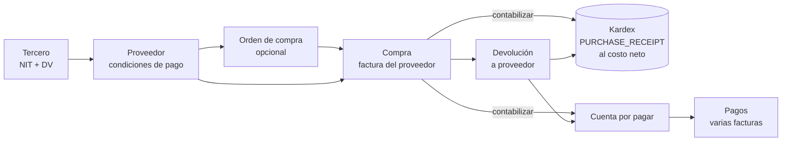
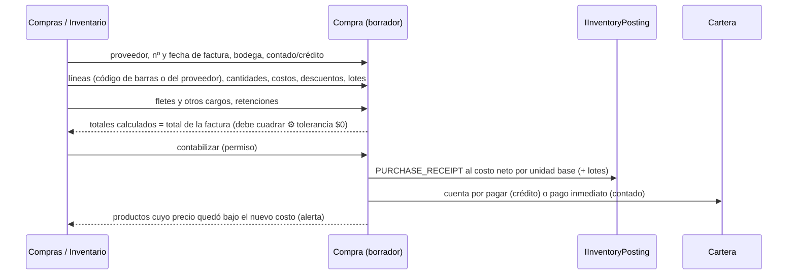

# Fase 5 · Terceros, proveedores y compras — Propuesta

> Estado: **APROBADA (2026-09-28)** con todas las recomendaciones de la §15: retenciones digitadas por compra; IVA de compras
> descontable por defecto (configurable por empresa); documento soporte marcado ahora y emitido en la Fase 11-B; órdenes de compra
> incluidas; lotes solo con cantidades y costo promedio por bodega; XML del proveedor en la Fase 11-B.
> Requisitos previos: Fase 4 implementada ([informe](fase-04-informe.md)).
> Base: docs [02 §5 y §9](../02-modulos.md), [04 §G.5, §H.4 y §H.7](../04-base-de-datos.md), [05 RN-PUR](../05-reglas-y-estados.md),
> [08 devoluciones a proveedor](../08-pos-caja-facturacion.md), matriz de propiedad de la [revisión de la Fase 2 §6 y §10.1](fase-02-revision-arquitectonica.md).

**Convenciones:** 🔒 = decisión difícil de cambiar después (matriz en la §3). ✅ = regla de negocio que se cumple. ⚙️ = parámetro configurable.

## 0. Objetivo y alcance

Después de esta fase la tienda **registra a sus proveedores una sola vez** (como terceros), les **pide mercancía** (orden de
compra), **recibe la factura** y con ella entra el inventario al **costo real** (descuentos y fletes incluidos, IVA descontable
excluido), controla **lotes y vencimientos**, lleva sus **cuentas por pagar** y **devuelve** mercancía al proveedor.

Es la primera fase que mueve el costo promedio con compras reales: todo pasa por `IInventoryPosting` (Fase 4).

| Incluido | Excluido (fase) |
|---|---|
| Terceros (`parties`): identificación única con DV, persona natural o jurídica, datos fiscales, contactos | Clientes, grupos, crédito y puntos (8) |
| "Consumidor final" sembrado (222222222222) para las ventas de la Fase 7 | Portal del cliente (sincronización) |
| Proveedores: condiciones de pago, productos que suministra, código del proveedor, último costo, si factura o no | Pago a proveedores **desde la caja** (6) |
| Órdenes de compra: borrador → aprobada → enviada → recibida parcial/total → cerrada | Envío de la orden por correo o PDF (9) |
| Compras (recepción con factura): directas o contra orden; descuentos, fletes prorrateados, IVA, retenciones | Cálculo automático de retenciones (pregunta 1) |
| Costo de entrada al kardex (`PURCHASE_RECEIPT`) y alerta de productos cuyo precio queda bajo el nuevo costo | Contabilidad (fuera del producto) |
| **Lotes y vencimientos** (pendiente de la Fase 4): lote en la entrada, salidas FEFO, alertas de vencimiento | Bloqueo de venta de lotes vencidos en caja (7) |
| Cuentas por pagar, pagos (transferencia, cheque, efectivo fuera de caja) con aplicación a varias facturas, cartera por edades | Documento soporte electrónico y eventos RADIAN ante la DIAN (11-B, con Factus) |
| Devoluciones a proveedor (al costo de la compra) y su liquidación (nota crédito, reintegro, reposición) | Importar el XML de la factura electrónica del proveedor (pregunta 6) |
| Anulación de una compra (con permiso) | |
| Medios de pago (catálogo compartido con la caja de la Fase 6) | |

Se entrega en **tres bloques** con una sola aprobación: **5.1 Terceros y proveedores**, **5.2 Compras, lotes y órdenes**,
**5.3 Cuentas por pagar y devoluciones**.

---

## 1. Actores y flujo general

| Actor (rol de sistema) | Qué hace |
|---|---|
| Compras (`PURCHASING`) | Proveedores, órdenes, registro de compras (borrador), devoluciones |
| Inventario (`INVENTORY`) | Recibe la mercancía: cantidades, lotes y vencimientos |
| Administrador / Propietario | Aprueba órdenes, contabiliza y anula compras, registra pagos |
| Contador (`ACCOUNTANT`) | Consulta compras, cartera por pagar y costos |



---

## 2. Decisiones principales

| # | Decisión | Por qué | |
|---|---|---|---|
| D5-01 | **Un tercero, varios roles**: `parties` guarda identidad y datos fiscales una sola vez; proveedor (y cliente en la Fase 8) son roles | Evita duplicar NIT y datos fiscales (vital para la factura electrónica); un proveedor puede ser también cliente | 🔒 |
| D5-02 | Identificación única por empresa (tipo + número) con **DV validado** para NIT; el mismo tercero creado en dos tiendas sin conexión se **fusiona** en la nube | Coherente con la matriz de propiedad (§10.1 de la revisión) | 🔒 |
| D5-03 | **Costo de entrada = costo neto**: (valor − descuentos + fletes prorrateados) ÷ cantidad en unidad base; el IVA **descontable** no es costo; si la empresa no descuenta IVA, el IVA **sí** es costo ⚙️ | Es lo que exige la norma contable y lo que hace cuadrar la utilidad | 🔒 |
| D5-04 | Una compra solo afecta inventario y cartera al **contabilizarse** (RN-PUR-01); borrador editable por varios usuarios | La recepción física y la digitación de la factura suelen ser momentos distintos | |
| D5-05 | **Lotes: el saldo por lote lleva solo cantidades; el costo sigue siendo promedio por bodega** (D7) | Un supermercado maneja lotes para vencimientos, no para costear; costo por lote duplicaría el kardex valorizado | 🔒 |
| D5-06 | Salidas **FEFO automáticas** (primero en vencer, primero en salir) cuando no se indica lote; una salida puede partirse en varios lotes | RN-INV-08; la caja no pregunta el lote | 🔒 |
| D5-07 | Devolución a proveedor **al costo de la compra original** (salida valorizada que recalcula el promedio) | Doc 07: devolver al costo promedio distorsionaría la utilidad | 🔒 |
| D5-08 | Anular una compra = **movimientos inversos** (nunca borrar); solo si nada quedó negativo y la cuenta por pagar no tiene pagos | RN-INV-02, RN-PUR-05 | |
| D5-09 | Cartera por pagar como **libro**: la cuenta por pagar nace de la compra y su saldo cambia solo por pagos, devoluciones y notas | Saldo siempre explicable; sin editar saldos | 🔒 |
| D5-10 | No se registra dos veces la misma factura: único (proveedor, número de factura) (RN-PUR-02) | Error frecuente al digitar | |
| D5-11 | Retenciones en la fuente, de IVA y de ICA como **valores digitados por tipo** en la compra (v1); reducen lo que se paga, no el costo ⚙️ | El cálculo automático depende de bases en UVT, régimen y municipio: alto riesgo de error; se valida con el contador (pregunta 1) | |
| D5-12 | Proveedor que **no factura** (campesino, persona natural no obligada): la compra queda marcada "requiere documento soporte" para emitirlo en la Fase 11-B con Factus | La DIAN exige documento soporte electrónico en esas compras | |
| D5-13 | **Medios de pago** como catálogo de la empresa con su código de medio de pago de la factura electrónica (10 efectivo, 47 transferencia, 48 crédito, 49 débito…, a validar con Factus) | Los usan los pagos a proveedores (esta fase) y la caja (Fase 6) | 🔒 |

---

## 3. Revisión arquitectónica de las decisiones difíciles de cambiar

Impacto en licenciamiento: **ninguno** en todas (ADR-0015: toda la funcionalidad en ambas ediciones).

| ID | Decisión | Motivo | Alternativas | Consecuencia positiva | Riesgo | Impacto POS local | Impacto multisucursal | Impacto sincronización | Dificultad de cambiar | Recomendación |
|---|---|---|---|---|---|---|---|---|---|---|
| D5-01 | Tercero único con roles | Un NIT, una ficha | Tablas separadas de clientes y proveedores | Datos fiscales una vez; reportes por tercero | Modelo un poco más abstracto para el usuario | Ninguno | Terceros de empresa: los ven todas las sucursales | Maestro multiescritor (cambios por campo, D4-09) | Muy alta | **Adoptar** |
| D5-02 | Identificación única + DV + fusión | Evitar duplicados | Permitir duplicados y depurar después | Facturación sin errores de NIT | Dos tiendas crean el mismo NIT offline | Validación local inmediata | Fusión en la nube: se conserva el UUID más antiguo, el otro queda `merged_into` | Conflicto detectable y resoluble; los documentos guardan snapshot | Alta | **Adoptar** |
| D5-03 | Costo neto con fletes prorrateados; IVA según la empresa | Norma contable | Costo = precio de lista | Utilidad real por producto | Prorrateo por valor puede no reflejar el peso del flete | Cálculo local | Mismo criterio en todas | Viaja en el movimiento | Alta (recalcular kardex) | **Adoptar** prorrateo por valor; por cantidad o manual ⚙️ por compra |
| D5-05 | Lotes solo en cantidades | Vencimientos, no costeo | Costo por lote (identificación específica) | Kardex valorizado sin duplicar; costo estable | No se sabe la utilidad por lote | FEFO en la caja sin preguntar | Igual en todas | Movimientos con `lot_id` | Alta | **Adoptar** |
| D5-06 | FEFO automático | La caja no pregunta lotes | Pedir lote al vender | Venta rápida; vence primero lo más viejo | Si el físico no sigue FEFO, el sistema difiere de la góndola | Una salida puede generar varios movimientos | Igual | Igual | Media | **Adoptar**; ajuste de lote disponible para corregir |
| D5-07 | Devolución al costo de compra | Utilidad correcta | Al promedio vigente | El costo promedio refleja lo que realmente quedó | Promedio negativo si se devuelve casi todo a un costo mayor | Nuevo tipo de salida valorizada en `StockValuation` | Igual | Igual | Media | **Adoptar**; si el valor quedara negativo, la diferencia va al costo del movimiento y queda auditada |
| D5-09 | Cartera como libro | Saldos explicables | Campo "saldo" editable | Auditoría y conciliación con el proveedor | Más tablas | Ninguno | Cartera por sucursal que compra | Documentos ↑ sin conflicto | Alta | **Adoptar** |
| D5-13 | Medios de pago con código DIAN | Factura y caja coherentes | Lista fija en código | La empresa agrega Nequi, Daviplata, bonos | Códigos DIAN a validar | Catálogo local | De empresa | Maestro ↑↓ | Media | **Adoptar** |

---

## 4. Modelo de datos

Migraciones: `V2026.10.010__parties__parties.sql`, `V2026.10.011__cash__payment_methods.sql`,
`V2026.10.012__purchasing__purchasing.sql`, `V2026.10.013__inventory__lots.sql`. Tipos de documento nuevos: `PURCHASE_ORDER` y
`PAYABLE_PAYMENT` (serie por sucursal).

### 4.1 Terceros (`parties`)

| Tabla | Contenido |
|---|---|
| `parties.parties` | Persona natural (nombres y apellidos) o jurídica (razón social); tipo y número de identificación (`ref.identification_types`), DV (obligatorio y validado para NIT), régimen, responsabilidades fiscales, correo para factura electrónica, teléfonos, dirección, municipio (DIVIPOLA), `search_text`, `merged_into_id` (fusión), estado. Único (empresa, tipo, número) |
| `parties.party_contacts` | Contactos (vendedor, cartera…) con cargo, teléfono, correo, principal |
| Sembrado | "Consumidor final" (identificación 222222222222) por empresa |

### 4.2 Medios de pago (`cash.payment_methods`, esquema de la Fase 6)

`code`, `name`, `kind` (CASH, DEBIT_CARD, CREDIT_CARD, TRANSFER, WALLET, VOUCHER, OTHER), `dian_code`, `requires_reference`,
`affects_cash_drawer`, orden, estado. Sembrados: Efectivo, Tarjeta débito, Tarjeta crédito, Transferencia, Nequi, Daviplata, Bono.

### 4.3 Compras (`purchasing`)

| Tabla | Contenido (doc 04 §H.7 con cambios) |
|---|---|
| `suppliers` | Rol proveedor del tercero: código, plazo de pago (días), medio de pago preferido, cupo, **`issues_invoices`** (factura electrónica o no → documento soporte), estado |
| `supplier_products` | Producto y presentación que suministra, código del proveedor, último costo, última compra, días de entrega, preferido |
| `purchase_orders` / `_lines` | Orden por sucursal y bodega, fechas, estado, totales; cantidades pedidas y recibidas por línea |
| `purchases` / `_lines` / `_line_taxes` | Factura del proveedor (número único por proveedor), fechas, contado o crédito, vencimiento; líneas con presentación, cantidad, cantidad base, costo unitario, descuento, **cargos prorrateados**, costo neto unitario base, lote, vencimiento; impuestos por línea (descontable sí/no) |
| `purchase_withholdings` | **Nueva**: retenciones de la compra por tipo (RETEFUENTE, RETEIVA, RETEICA), base y valor |
| `accounts_payable` | Cuenta por pagar por compra: valor original, saldo, vencimiento, estado |
| `payable_entries` | **Nueva**: libro de la cuenta (cargo inicial, pago, devolución, nota crédito, anulación) con saldo resultante |
| `payable_payments` / `_allocations` | Pago con medio, referencia, fecha; aplicado a una o varias cuentas; `cash_session_id` reservado para la Fase 6 |
| `supplier_returns` / `_lines` | Devolución contra compra: líneas ≤ comprado − devuelto, al costo de la compra; liquidación (NOTA_CREDITO, REINTEGRO, REPOSICION) |

### 4.4 Lotes (`inventory`, completa lo que dejó la Fase 4)

- `inventory_lots` se usa: número de lote, fabricación, **vencimiento**, estado (AVAILABLE, QUARANTINE, EXPIRED, EXHAUSTED).
- `stock_balances` con `lot_id` = **cantidad por lote** (valor 0); la fila sin lote sigue siendo el saldo valorizado del producto
  (D5-05). El verificador comprueba también que Σ cantidades por lote = saldo del producto.
- `stock_movements.lot_id` se llena en entradas y salidas de productos con lote.

---

## 5. Flujos

### 5.1 Compra (recepción con factura)



Costo neto de una línea (unidad base) = (cantidad × costo − descuento + cargos prorrateados + IVA no descontable) ÷ cantidad base.
Ejemplo: 10 cajas × 24 u a $60.000 la caja, descuento $30.000, flete prorrateado $12.000 → (600.000 − 30.000 + 12.000) ÷ 240 = **$2.425** por unidad.

Contra una orden: la compra propone las líneas pendientes; lo recibido no puede superar lo pedido + tolerancia ⚙️ (0 %, RN-PUR-04);
la orden pasa a `PARTIALLY_RECEIVED` o `RECEIVED`.

### 5.2 Lotes y FEFO

Entrada de un producto con lote: exige número y (si controla vencimiento) fecha; si el lote ya existe, suma. Salida sin lote
indicado: toma primero el lote que vence antes; si no alcanza, sigue con el siguiente (un movimiento por lote). Alertas:
lotes que vencen en N días ⚙️ (30) y vencidos → sugerencia de ajuste `EXPIRY`.

### 5.3 Cuentas por pagar y pagos

Crédito → cuenta con vencimiento = fecha de factura + plazo. Contado → cuenta y pago inmediato con el medio indicado. Un pago puede
cubrir varias facturas del mismo proveedor; la cartera por edades agrupa por días vencidos (corriente, 1–30, 31–60, 61–90, > 90).
Un pago se anula con un asiento inverso (nunca se borra).

### 5.4 Devolución a proveedor

Buscar compra → líneas y cantidades (≤ comprado − devuelto) → `POSTED`: kardex `SUPPLIER_RETURN` al costo de la compra (lote
original si aplica) y asiento en la cartera (reduce el saldo o genera saldo a favor) → `SETTLED` al recibir la nota crédito, el
reintegro o la reposición.

### 5.5 Anulación de compra

Solo sin pagos y si revertir no deja existencias negativas (RN-PUR-05): movimientos inversos al costo original, cuenta por pagar
anulada, orden de compra vuelve a pendiente. Con permiso y motivo; auditada como advertencia.

---

## 6. Reglas de negocio

| Regla | Implementación |
|---|---|
| RN-PUR-01 Solo al contabilizar | Estados `DRAFT` → `POSTED` → `VOIDED`; el borrador no toca kardex ni cartera |
| RN-PUR-02 Factura única por proveedor | Índice único (proveedor, número) + `409 PURCHASING.INVOICE_DUPLICATED` |
| RN-PUR-03 Crédito → cuenta por pagar; contado desde caja → movimiento de caja | Crédito y contado fuera de caja en esta fase; desde caja en la Fase 6 |
| RN-PUR-04 Recibido ≤ pedido + tolerancia | ⚙️ `purchasing.receipt_tolerance_percent` (0) |
| RN-PUR-05 Anular solo sin salidas que dejen negativo | Verificación contra el saldo al anular; si no, devolución |
| RN-PUR-06 Devolución ≤ comprado − devuelto | Validación por línea; al costo de la compra |
| RN-INV-08/09 Lotes | Lote obligatorio en la entrada; FEFO; la venta de lotes vencidos se bloquea en la caja (Fase 7) |
| Totales | La suma de la compra debe coincidir con el total de la factura (tolerancia ⚙️ $0) antes de contabilizar |
| Proveedor bloqueado | No admite órdenes ni compras nuevas |

---

## 7. Permisos que se agregan

| Permiso | Roles de sistema |
|---|---|
| `parties.party.view` / `parties.party.manage` | Todos ven; OWNER, ADMIN, PURCHASING gestionan (el cajero podrá crear clientes en la Fase 7) |
| `purchasing.supplier.manage` | OWNER, ADMIN, PURCHASING |
| `purchasing.order.manage` / `purchasing.order.approve` | PURCHASING / OWNER, ADMIN |
| `purchasing.purchase.manage` (borradores) | PURCHASING, INVENTORY |
| `purchasing.purchase.post` / `purchasing.purchase.void` | OWNER, ADMIN (+ PURCHASING contabiliza ⚙️ vía rol clonado) |
| `purchasing.payable.view` / `purchasing.payable.pay` | ACCOUNTANT, PURCHASING / OWNER, ADMIN |
| `purchasing.return.manage` | OWNER, ADMIN, PURCHASING |
| `cash.payment_method.manage` | OWNER, ADMIN |

Los costos siguen protegidos por `inventory.cost.view`.

## 8. Impacto en la sincronización

| Dato | Escribe | Dirección | Conflictos |
|---|---|---|---|
| Terceros, contactos, proveedores, productos del proveedor | Cualquier tienda y el portal | ↑↓ | Por campo (D4-09); mismo NIT en dos tiendas → fusión en la nube |
| Medios de pago | Empresa | ↑↓ | Por campo |
| Órdenes, compras, devoluciones, pagos, asientos de cartera | La sucursal que compra | ↑ | Ninguno (documentos) |
| Lotes | La sucursal que recibe | ↑ | Ninguno (número de lote por producto) |

## 9. API (resumen)

`/parties` (buscar por NIT o nombre, crear, editar, contactos) · `/purchasing/suppliers` (+ productos del proveedor) ·
`/purchasing/orders` (crear, aprobar, enviar, cerrar, cancelar) · `/purchasing/purchases` (borrador, líneas, cargos,
retenciones, contabilizar, anular) · `/purchasing/payables` (cartera por edades, estado de cuenta del proveedor) ·
`/purchasing/payments` (registrar, anular) · `/purchasing/returns` (crear, contabilizar, liquidar) · `/cash/payment-methods` ·
`/inventory/lots` (por producto, por vencer, vencidos).

## 10. Migración de instalaciones existentes

Solo tablas nuevas y columnas en `inventory` (sin datos que migrar). Al arrancar se siembran el Consumidor final, los medios de
pago y los tipos de documento. Los productos que ya marcaron "maneja lotes" y tienen existencias quedan con su saldo sin lote;
el primer conteo o ajuste por lote los distribuye (se documenta en el informe).

## 11. Pruebas previstas

- **Unitarias:** DV de NIT, costo neto con descuentos, fletes e IVA no descontable, prorrateo, totales que cuadran, FEFO
  (partición en varios lotes), salida valorizada de la devolución, libro de cartera y edades, estados de orden y compra.
- **BD real:** factura única por proveedor, identificación única, cantidades por lote que cuadran con el saldo.
- **API:** escenario "semana de compras": orden → recepción parcial → recepción final → pago de dos facturas en un pago →
  devolución de un producto con lote → nota crédito; kardex, costo promedio, cartera y lotes cuadran. Anulación bloqueada si hubo
  salidas. Permisos sobre todos los endpoints.
- **Concurrencia:** dos usuarios contabilizan la misma compra → uno solo lo logra.

## 12. Riesgos

| Riesgo | Mitigación |
|---|---|
| Facturas digitadas con errores de costo | Totales deben cuadrar con la factura; alerta de variación de costo > X % ⚙️ frente a la última compra |
| Retenciones mal calculadas | Valores digitados en v1, validados por el contador; cálculo automático cuando esté definido con él |
| Lotes que no se registran en la recepción | Obligatorio para productos con lote; ajuste de lote para corregir |
| Documento soporte pendiente acumulado hasta la Fase 11-B | Reporte de compras pendientes de documento soporte |

## 13. Estructura de código

```
src/Modules/Parties/*       Terceros y contactos (Contracts: IPartyDirectory para compras y ventas)
src/Modules/Purchasing/*    Proveedores, órdenes, compras, cartera, pagos, devoluciones
src/Modules/Cash/*          Nace con el catálogo de medios de pago (crece en la Fase 6)
src/Modules/Inventory       Lotes, FEFO, salida valorizada (SUPPLIER_RETURN), reversión (REVERSAL)
src/SharedKernel            Dígito de verificación del NIT (se mueve desde Organization para usarlo en terceros)
http/fase-05.http
```

## 14. Criterios de aceptación

- [ ] Terceros con NIT y DV validados; identificación única; Consumidor final sembrado.
- [ ] Proveedores con productos, código del proveedor y último costo; proveedor que no factura marcado para documento soporte.
- [ ] Orden de compra completa, recepción parcial y total con tolerancia.
- [ ] Compra con descuentos, fletes prorrateados, IVA descontable o no, retenciones; totales cuadran; kardex al costo neto.
- [ ] Lotes y vencimientos en la entrada, FEFO en las salidas, alertas de vencimiento; cantidades por lote cuadran.
- [ ] Cartera por pagar como libro, pagos a varias facturas, edades; anulación de pagos por asiento inverso.
- [ ] Devolución al costo de compra y su liquidación; anulación de compra con sus bloqueos.
- [ ] Permisos en todos los endpoints; auditoría; cambios por campo de los maestros nuevos.
- [ ] `build.ps1` en verde; cobertura de los dominios nuevos ≥ 90 %.
- [ ] Docs 04, 05, 07 y 08 actualizados, ADRs (terceros, costo neto, lotes, cartera como libro) e informe.

## 15. Preguntas para ti

1. **Retenciones (retefuente, reteIVA, reteICA):** ¿las digitamos por compra en esta fase (**recomendado**, validado con tu contador) o quieres el cálculo automático desde ya (requiere definir con el contador bases, tarifas y municipios)?
2. **IVA de las compras:** ¿tus clientes típicos son responsables de IVA (el IVA de la compra **no** es costo, **recomendado** como valor por defecto) o hay muchos del régimen simple o no responsables (el IVA **sí** es costo)? Queda configurable por empresa.
3. **Documento soporte** para compras a quienes no facturan (campesinos, fruver): ¿de acuerdo con marcarlas ahora y emitir el documento con Factus en la Fase 11-B (**recomendado**)?
4. **Órdenes de compra:** ¿las incluimos en esta fase (**recomendado**) o prefieres solo compras directas por ahora?
5. **Lotes:** ¿de acuerdo con que el lote lleve solo cantidades y el costo siga siendo promedio por bodega (**recomendado**)?
6. **Factura electrónica del proveedor (XML):** cargarla para llenar la compra automáticamente es muy útil, pero se hace mejor junto con los eventos RADIAN (acuse de recibo) en la Fase 11-B con Factus. ¿La dejamos para esa fase (**recomendado**)?
