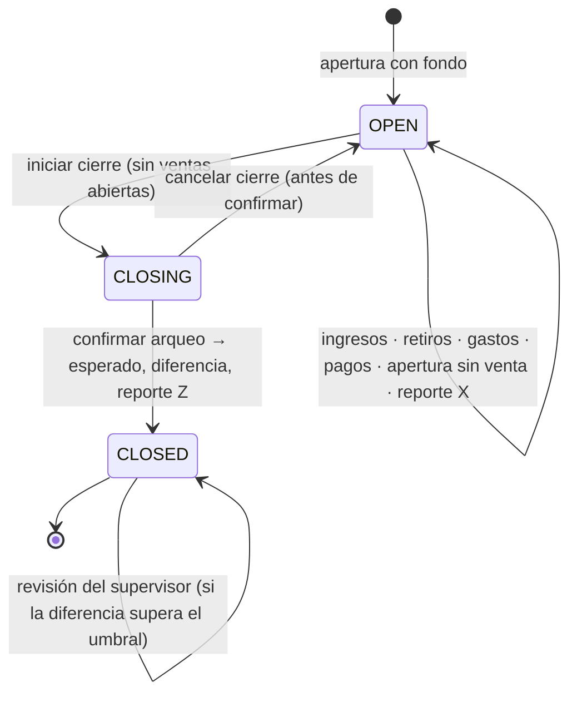

# Fase 6 · Caja: jornadas, movimientos, arqueos y cierres — Propuesta

> Estado: **APROBADA (2026-09-28)** con todas las recomendaciones de la §15: arqueo ciego por defecto; fecha de negocio = fecha de
> apertura; umbral de diferencia $5.000 ⚙️; cambio de cajero = cierre y nueva apertura; medios de pago iniciales Efectivo, Tarjeta
> débito, Tarjeta crédito, Transferencia, Nequi, Daviplata y Bono; un cajero por caja a la vez; módulo de gastos incluido.
> Requisitos previos: Fase 5 aprobada (usa sus medios de pago y registra pagos a proveedores desde la caja).
> Base: docs [02 §8 y §11](../02-modulos.md), [04 §H.9 y §H.10](../04-base-de-datos.md), [05 RN-CSH y estados de caja](../05-reglas-y-estados.md),
> [08 "Caja"](../08-pos-caja-facturacion.md), sello de auditoría en el reporte Z ([revisión de la Fase 2 §4](fase-02-revision-arquitectonica.md)).

**Convenciones:** 🔒 = decisión difícil de cambiar después (matriz en la §3). ✅ = regla de negocio que se cumple. ⚙️ = parámetro configurable.

## 0. Objetivo y alcance

La caja va **antes** que el POS porque toda venta exige una jornada abierta (RN-SAL-01). Después de esta fase cada cajero
**abre su jornada** con un fondo, la caja registra **cada peso que entra o sale** (ingresos, retiros, gastos, pagos a
proveedores, aperturas del cajón sin venta), el cajero **cierra con arqueo ciego** por denominación y medio de pago, el sistema
calcula **lo esperado desde los movimientos** y la diferencia, el supervisor **revisa** las diferencias y se imprime el
**reporte Z** con el sello de la auditoría.

| Incluido | Excluido (fase) |
|---|---|
| Jornadas: apertura con fondo (por denominaciones opcional), una por caja y una por cajero | Ventas y sus pagos (7): esta fase deja listo el registro que usarán |
| Movimientos de caja de solo inserción: ingresos, retiros (sangrías), gastos, pagos a proveedores, aperturas sin venta | Apertura física del cajón y la impresora (agente de caja, 7) |
| Cierre en dos pasos (`CLOSING` → `CLOSED`) con arqueo ciego por denominación y por medio de pago | Transferencia de jornada entre cajeros (pregunta 4) |
| Esperado calculado de los movimientos (RN-CSH-04), diferencias, umbral y revisión del supervisor | Conciliación bancaria de datáfonos (fuera del producto) |
| Reportes X (parcial) y Z (cierre) como datos e impresión de texto (80 mm), con el **sello de la auditoría** en el Z | Diseño visual de los reportes (15) |
| Gastos y categorías de gasto (desde caja o fuera de ella) | Gastos recurrentes y presupuestos (futuro) |
| Pagos a proveedores y compras de contado **desde la caja** (completa la Fase 5) | |
| RN-SEC-07 completa: no se desactiva un usuario con jornada abierta | |
| Denominaciones de Colombia y medios de pago | |

---

## 1. Actores y flujo

| Actor | Qué hace |
|---|---|
| Cajero (`CASHIER`) | Abre y cierra su jornada, registra ingresos y gastos menores, cuenta al cerrar |
| Supervisor de caja (`CASH_SUPERVISOR`) | Autoriza retiros y aperturas sin venta en la caja (autorización de un solo uso, Fase 3), revisa cierres con diferencia, ve reportes |
| Administrador / Propietario | Configura umbrales, medios de pago, categorías de gasto; revisa todo |



---

## 2. Decisiones principales

| # | Decisión | Por qué | |
|---|---|---|---|
| D6-01 | **Movimientos de caja de solo inserción** (privilegios + disparador, como el kardex); una corrección es otro movimiento | Cada peso trazable; base antifraude | 🔒 |
| D6-02 | **Esperado calculado siempre de los movimientos**, por medio de pago; nunca se digita (RN-CSH-04) | Nadie "ajusta" lo esperado | 🔒 |
| D6-03 | **Una jornada no cerrada por caja** y (⚙️) **una abierta por cajero**, garantizadas con índices únicos parciales | RN-CSH-01; imposible abrir dos veces aunque dos equipos lo intenten a la vez | 🔒 |
| D6-04 | **Fecha de negocio de la jornada = fecha de apertura**, aunque el turno pase de medianoche | Un turno nocturno no se parte en dos días en los reportes | 🔒 |
| D6-05 | **Arqueo ciego** por defecto ⚙️: el cajero no ve el esperado hasta confirmar su conteo | Práctica antifraude estándar | |
| D6-06 | **El cierre es definitivo** (RN-CSH-08): no se reabre; las correcciones son movimientos de la jornada siguiente | Los reportes Z impresos no cambian después | 🔒 |
| D6-07 | **Retiros y aperturas sin venta con autorización** de supervisor en la caja (grant de un solo uso de la Fase 3) | RN-CSH-06/07; el supervisor queda en la auditoría | |
| D6-08 | **Reporte Z con el sello de la auditoría** (`SELLO #N · código de 16 caracteres`): al confirmar el cierre se fuerza un sellado | Ancla externa en papel (revisión de la Fase 2 §4): una reescritura posterior de la auditoría se detecta | 🔒 |
| D6-09 | **Jornada ligada a caja, cajero y dispositivo**: solo se abre desde la caja emparejada (o el propio equipo en Caja Única) | Trazabilidad física; coherente con la Fase 3 | |
| D6-10 | Denominaciones y medios de pago como datos (no código); conteo por denominación opcional ⚙️ para medios distintos del efectivo | Cambios de billetes o nuevos medios sin versión nueva | |

---

## 3. Revisión arquitectónica de las decisiones difíciles de cambiar

Impacto en licenciamiento: **ninguno** (ambas ediciones tienen caja completa; Caja Única con una caja).

| ID | Decisión | Motivo | Alternativas | Consecuencia positiva | Riesgo | Impacto POS local | Impacto multisucursal | Impacto sincronización | Dificultad de cambiar | Recomendación |
|---|---|---|---|---|---|---|---|---|---|---|
| D6-01 | Movimientos de solo inserción | Trazabilidad | Totales editables | Antifraude, reportes exactos | Más filas | Una fila por evento; índice por jornada | Por sucursal | Documentos ↑ sin conflicto | Muy alta | **Adoptar** |
| D6-02 | Esperado desde movimientos | Nadie lo digita | Esperado digitado o acumulado en un campo | Imposible "cuadrar" a mano | Cálculo al cerrar (barato: por jornada) | Local, sin Internet | Igual | Se recalcula donde sea | Alta | **Adoptar** |
| D6-03 | Una jornada por caja y por cajero (índices parciales) | RN-CSH-01 | Validar solo en código | Garantía aunque haya concurrencia | Un cajero que olvidó cerrar bloquea su usuario | Cierre forzado por el supervisor ⚙️ (queda auditado, conteo en cero) | Por sucursal | Jornadas ↑ | Media | **Adoptar**, con "cierre por supervisor" |
| D6-04 | Fecha de negocio = apertura | Turnos nocturnos | Partir por medianoche | Reportes por turno coherentes | Ventas de madrugada aparecen en el día anterior | La venta toma la fecha de su jornada (Fase 7) | Igual | Igual | Alta (reportes históricos) | **Adoptar** |
| D6-06 | Cierre definitivo | Z inmutable | Reabrir con permiso | El papel y el sistema siempre coinciden | Un error se corrige al día siguiente | Movimiento de corrección con motivo | Igual | Igual | Alta | **Adoptar** |
| D6-08 | Sello en el Z | Ancla de auditoría | Sin ancla | Detecta reescrituras de la auditoría | El sellado añade ~ms al cierre | Sellado local | Cada nodo su cadena | El sello también sube a la nube | Media | **Adoptar** |

---

## 4. Modelo de datos

Migración `V2026.10.014__cash__cash.sql` (el esquema `cash` nace en la Fase 5 con los medios de pago) y
`V2026.10.015__expenses__expenses.sql`. Tipos de documento: `CASH_SESSION` (ya existe, serie por caja), `CASH_MOVEMENT` y
`EXPENSE` (existe).

| Tabla | Contenido (doc 04 §H.9–H.10 con cambios) |
|---|---|
| `cash.denominations` | Moneda, valor, billete o moneda, orden, estado. COP: billetes 100.000, 50.000, 20.000, 10.000, 5.000, 2.000; monedas 1.000, 500, 200, 100, 50 |
| `cash.cash_sessions` | Número (serie de la caja), sucursal, caja, **dispositivo**, cajero, apertura, **fecha de negocio**, fondo, estado (OPEN, CLOSING, CLOSED), arqueo ciego sí/no, inicio y fin del cierre, quién cerró (cajero o supervisor), totales esperado/contado/diferencia, revisión (quién, cuándo, observación), **sello del Z** (número y código). Índices únicos parciales: caja con jornada no cerrada; cajero con jornada abierta ⚙️ |
| `cash.cash_movements` | **Solo inserción**. Tipo (OPENING_FLOAT, SALE, SALE_VOID, CUSTOMER_REFUND, CASH_IN, CASH_OUT_WITHDRAWAL, EXPENSE, SUPPLIER_PAYMENT, CORRECTION, NO_SALE_DRAWER_OPEN), medio de pago, dirección, valor, documento origen, motivo, autorización (grant), usuario, hora, número |
| `cash.cash_counts` / `_lines` | Conteos de apertura, parciales y cierre por denominación |
| `cash.cash_session_totals` | Al cerrar, por medio de pago: esperado, contado, diferencia, número de transacciones |
| `expenses.expense_categories` | Árbol de dos niveles (p. ej. Servicios > Energía) |
| `expenses.expenses` | Número, categoría, proveedor (tercero) opcional, descripción, valor, IVA, medio de pago, jornada si se pagó desde caja, soporte, estado (POSTED, VOIDED) |

## 5. Flujos

### 5.1 Apertura

Desde la caja emparejada: el cajero entra con su código + PIN (Fase 3) → "abrir jornada" con fondo (conteo por denominación
opcional ⚙️) → movimiento `OPENING_FLOAT`. Si la caja ya tiene una jornada no cerrada o el cajero ya tiene una abierta:
`409 CASH.SESSION_ALREADY_OPEN` indicando cuál.

### 5.2 Durante la jornada

| Operación | Regla |
|---|---|
| Ingreso (`CASH_IN`) | Con motivo (p. ej. "cambio traído del banco") |
| Retiro / sangría (`CASH_OUT_WITHDRAWAL`) | Permiso o autorización de supervisor; no puede dejar el efectivo esperado negativo (RN-CSH-06); alerta cuando el efectivo supera el máximo ⚙️ ($2.000.000) |
| Gasto pagado desde caja (`EXPENSE`) | Crea el gasto y su movimiento en una transacción |
| Pago a proveedor desde caja (`SUPPLIER_PAYMENT`) | Pago de cartera (Fase 5) con la jornada; mismas validaciones de efectivo |
| Apertura sin venta (`NO_SALE_DRAWER_OPEN`) | Motivo obligatorio y autorización ⚙️ (RN-CSH-07) |
| Reporte X | Totales parciales por medio de pago sin cerrar (el cajero no lo ve si el arqueo es ciego ⚙️) |

### 5.3 Cierre

1. **Iniciar cierre** (`CLOSING`): no se admiten más movimientos de venta; en la Fase 7 exigirá resolver ventas abiertas o suspendidas.
2. **Contar**: efectivo por denominación; otros medios por total (vouchers del datáfono, transferencias).
3. **Confirmar**: el sistema calcula el esperado por medio (fondo + entradas − salidas en efectivo; lo registrado en los demás),
   guarda `cash_session_totals`, la diferencia y fuerza un sellado de la auditoría → `CLOSED` y reporte Z.
4. Diferencia (absoluta) > umbral ⚙️ ($5.000): observación obligatoria del cajero y queda **pendiente de revisión** del supervisor.
5. **Cierre por supervisor** (cajero ausente): con permiso, motivo y conteo; auditado como crítico.

Reporte Z (texto de 80 mm y JSON): tienda, caja, cajero, número y fecha de negocio, apertura y cierre, fondo, movimientos por
tipo, totales por medio (esperado, contado, diferencia), aperturas sin venta, retiros con quién autorizó y
`SELLO #1234 · 7F3A-91C2-0B44-E1D8`.

---

## 6. Reglas de negocio

| Regla | Implementación |
|---|---|
| RN-CSH-01 Una jornada por caja / por cajero | Índices únicos parciales + `CASH.SESSION_ALREADY_OPEN` |
| RN-CSH-02 No operar en una caja cerrada | Todo movimiento exige jornada `OPEN` de esa caja |
| RN-CSH-03 En `CLOSING` no hay ventas nuevas | Estado; la Fase 7 lo verifica al vender |
| RN-CSH-04 Esperado desde movimientos | Cálculo en el cierre y en el reporte X; nunca se guarda digitado |
| RN-CSH-05 Diferencia > umbral → observación y revisión | ⚙️ `cash.difference_threshold` |
| RN-CSH-06 Retiros con autorización y sin dejar negativo | Permiso o grant de supervisor; validación del efectivo esperado |
| RN-CSH-07 Aperturas sin venta registradas con motivo | Movimiento `NO_SALE_DRAWER_OPEN` (dirección 0) |
| RN-CSH-08 Cierre definitivo | Sin endpoint de reapertura; correcciones con `CORRECTION` en la jornada siguiente |
| RN-SEC-07 (completa) | No se desactiva un usuario con jornada abierta (`IDENTITY.USER_HAS_OPEN_SESSION`) |

## 7. Permisos que se agregan

| Permiso | Roles de sistema |
|---|---|
| `cash.session.operate` (abrir, cerrar la propia, ingresos, gastos menores) | CASHIER, CASH_SUPERVISOR, OWNER, ADMIN |
| `cash.movement.withdraw` (admite supervisor) | CASH_SUPERVISOR, OWNER, ADMIN |
| `cash.drawer.open` (admite supervisor) | CASH_SUPERVISOR, OWNER, ADMIN |
| `cash.session.close_any` (cierre por supervisor) | CASH_SUPERVISOR, OWNER, ADMIN |
| `cash.session.review` | CASH_SUPERVISOR, OWNER, ADMIN |
| `cash.report.view` (X y Z de cualquier caja, ver esperado) | CASH_SUPERVISOR, OWNER, ADMIN, ACCOUNTANT |
| `expenses.expense.manage` / `expenses.expense.view` | OWNER, ADMIN / ACCOUNTANT |

## 8. Impacto en la sincronización

| Dato | Escribe | Dirección | Conflictos |
|---|---|---|---|
| Jornadas, movimientos, conteos, totales | El nodo de la caja | ↑ | Ninguno (UUID; serie por caja) |
| Gastos | La sucursal | ↑ | Ninguno |
| Denominaciones, categorías de gasto | Empresa | ↑↓ | Por campo |

Con Multicaja la jornada vive en el servidor de la tienda (las cajas trabajan contra él en la LAN); la caja autónoma sin servidor
(fase futura) aplicará el mismo modelo con su diario local.

## 9. API (resumen)

`/cash/sessions` (abrir, actual de la caja, detalle, iniciar cierre, cancelar cierre, confirmar, cierre por supervisor, revisar,
reporte X, reporte Z en JSON y en texto) · `/cash/sessions/{id}/movements` (ingreso, retiro, apertura sin venta, corrección) ·
`/cash/denominations` · `/expenses` y `/expenses/categories` · `/purchasing/payments` acepta `cashSessionId`.

## 10. Migración de instalaciones existentes

Tablas nuevas; se siembran denominaciones y categorías de gasto básicas (servicios públicos, arriendo, aseo, transporte,
papelería, otros) al arrancar.

## 11. Pruebas previstas

- **Unitarias:** cálculo del esperado por medio con todos los tipos de movimiento, diferencias y umbral, estados de la jornada,
  conteo por denominaciones, reglas de retiro.
- **BD real:** movimientos de solo inserción; dos aperturas simultáneas de la misma caja → una sola jornada.
- **API:** escenario "turno completo": apertura, ingreso, gasto, pago a proveedor, retiro autorizado por supervisor, apertura sin
  venta, reporte X, cierre ciego con diferencia → revisión; reporte Z con sello válido que el verificador de auditoría acepta;
  usuario con jornada abierta no se puede desactivar; cierre por supervisor; turno que pasa la medianoche conserva su fecha.
- **Permisos:** todos los endpoints; el cajero no ve el esperado antes de confirmar.

## 12. Riesgos

| Riesgo | Mitigación |
|---|---|
| Cajero que olvida cerrar | Alerta de jornada abierta > N horas ⚙️; cierre por supervisor |
| Diferencias por errores de conteo | Conteo por denominación y reconteo antes de confirmar |
| Pago con datáfono no registrado igual que en el voucher | El cierre compara por medio; la diferencia queda visible por medio |
| Manipulación de la auditoría después del cierre | Sello impreso en el Z y verificable (`verify-audit` acepta el código) |

## 13. Estructura de código

```
src/Modules/Cash/*        Jornadas, movimientos, conteos, cierres, reportes X/Z (Contracts: ICashRegister para ventas y compras)
src/Modules/Expenses/*    Gastos y categorías
src/Modules/Purchasing    Pagos y compras de contado desde la caja
src/Modules/Identity      RN-SEC-07 completa (consulta a Cash.Contracts)
src/BuildingBlocks/Pos.Infrastructure   Sellado a demanda (AuditSealer.SealNowAsync)
http/fase-06.http
```

## 14. Criterios de aceptación

- [ ] Una jornada por caja y por cajero, incluso con aperturas simultáneas.
- [ ] Movimientos de solo inserción; esperado siempre calculado; arqueo ciego.
- [ ] Retiros y aperturas sin venta con autorización de supervisor registrada.
- [ ] Gastos y pagos a proveedores desde la caja en una transacción con su movimiento.
- [ ] Cierre en dos pasos, diferencias con umbral y revisión; cierre por supervisor.
- [ ] Reporte X y Z (texto 80 mm y JSON); el Z lleva un sello que `verify-audit` reconoce.
- [ ] RN-SEC-07 completa; permisos en todos los endpoints; auditoría.
- [ ] `build.ps1` en verde; cobertura del dominio de caja ≥ 90 %.
- [ ] Docs 04, 05 y 08 actualizados, ADRs (movimientos de caja, fecha de negocio, sello en el Z) e informe.

## 15. Preguntas para ti

1. **Arqueo ciego:** ¿por defecto sí (**recomendado**: el cajero cuenta sin ver cuánto debería haber)?
2. **Fecha de negocio:** ¿de acuerdo con que un turno que pasa la medianoche quede con la fecha de apertura (**recomendado**)?
3. **Umbral de diferencia:** ¿$5.000 como valor por defecto (configurable) para exigir observación y revisión del supervisor?
4. **Cambio de cajero:** ¿cierre y nueva apertura (**recomendado**, más simple y trazable) o "transferir la jornada" con autorización?
5. **Medios de pago iniciales:** Efectivo, Tarjeta débito, Tarjeta crédito, Transferencia, Nequi, Daviplata y Bono. ¿Agregas o quitas alguno?
6. **Un cajero por caja a la vez:** ¿de acuerdo (**recomendado**)? (Varios cajeros en la misma caja complican el cuadre).
7. **Gastos:** ¿incluimos el módulo de gastos en esta fase (**recomendado**, porque muchos se pagan desde la caja)?
