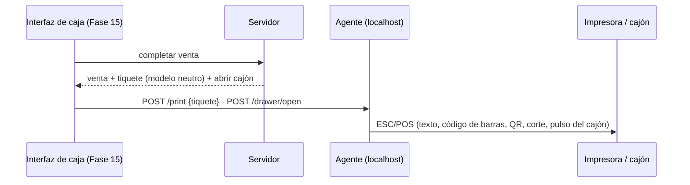

# Fase 7 · POS y ventas — Propuesta (v2)

> Estado: **APROBADA** (con las recomendaciones de la §15) · 2026-09-29
> Requisitos previos: Fase 6 implementada ([informe](fase-06-informe.md)): toda venta exige una jornada de caja abierta (RN-SAL-01).
> Base: docs [08 §M, §9 y §12](../08-pos-caja-facturacion.md), [04 §H.8 y §H.11](../04-base-de-datos.md), [05 RN-SAL y RN-RET](../05-reglas-y-estados.md),
> [10 caja autónoma](../10-offline-backups-actualizaciones.md), ADR-0013 (numeración interna vs fiscal), revisión de la Fase 2 §10.3 (Factus).

**Convenciones:** 🔒 = decisión difícil de cambiar después (matriz en la §3). ✅ = regla de negocio que se cumple. ⚙️ = parámetro configurable.

## Cambios de la v2 (respuestas del propietario)

| Pregunta v1 | Respuesta | Qué cambia en la propuesta |
|---|---|---|
| 1 · Factus | Sin facturación electrónica por ahora: solo el comprobante de venta impreso | Billing registra cada venta como **comprobante interno** (`INTERNAL_RECEIPT`, `NOT_REQUIRED`); el documento electrónico se enciende en la 11-B sin cambiar ventas. Riesgo normativo en la §12 |
| 2 · Vender sin existencias | **No**: siempre son productos físicos | D7-05 invertida: **la venta se bloquea sin existencias** (se valida al escanear y, con bloqueo, al cobrar) |
| 3 · Redondeo a $50 | Sí | Sin cambios (D7-09) |
| 4 · Descuento del cajero | **Todo descuento manual requiere permiso** (dueño o usuario autorizado) | Sin límite porcentual del cajero: `sales.discount.apply` no lo tiene el cajero; autoriza un supervisor con su código y PIN |
| 5 · Promociones | **Sí en esta fase**, administradas por un encargado (no la caja) | Nuevo bloque **7.4 Promociones** con el rol `PROMOTIONS_MANAGER`; se aplican solas al escanear |
| 6 · Reintegro | **No se devuelve dinero**: solo cambio por otro producto de igual o mayor valor | Las devoluciones pasan a ser **cambios de mercancía** (D7-11); el crédito del cambio solo paga una venta nueva en el mismo momento |
| 7 · Agente de caja | Aún sin hardware; configurarlo ya | Agente con transportes red, spooler de Windows, puerto serie/USB y archivo; se prueba con archivo e impresora "Solo texto" de Windows |
| 8 · Lotes vencidos | Prevenir antes de que venzan; vencidos solo con aprobación | D7-15: tablero y alerta de **próximos a vencer**; vender un lote vencido **exige autorización** |
| 9 · Anulación | No quedó clara | Explicada con ejemplos en la §5.3; pregunta de confirmación en la §15 |

## 0. Objetivo y alcance

Después de esta fase **se vende**: el cajero abre su jornada (Fase 6), escanea productos (códigos normales, de presentación y de
báscula), las **promociones vigentes se aplican solas**, los descuentos manuales solo con autorización, suspende y recupera ventas,
cobra con **pagos combinados** (efectivo con cambio y redondeo a $50, tarjetas, transferencias, billeteras) y la venta se completa
**en una sola transacción**: número interno, kardex (FEFO por lotes, **sin quedar negativo**), movimientos de caja, comprobante y
eventos de sincronización. Se anulan ventas por error, se hacen **cambios de mercancía** y un **agente de caja** imprime el tiquete en
impresoras ESC/POS y abre el cajón.

El entregable verificable del plan: **"día de operación"** — 500 ventas simuladas en varias cajas, con promociones, anulaciones y
cambios, y el cierre cuadra **al centavo** con el kardex y con la caja.

| Incluido | Excluido (fase) |
|---|---|
| Venta persistida en el servidor: iniciar, agregar/cambiar/eliminar líneas, cliente, suspender/recuperar, cancelar | Listas de precio por cliente, crédito y puntos (8) |
| Motor de cálculo puro (`SaleCalculator`): precios con impuestos incluidos, promociones, descuentos, redondeo del efectivo | Caja autónoma sin servidor (fase posterior, ya diseñada) |
| Escaneo: EAN/UPC, presentaciones, báscula por peso y por precio, SKU, búsqueda por nombre, consulta de precio | Documento equivalente electrónico real con Factus (11-B) |
| **Validación de existencias** al escanear y al cobrar (sin saldo negativo) | Vales o saldos a favor del cliente (no se usan: el cambio es inmediato) |
| Descuentos manuales y precio abierto **solo con autorización** | Báscula conectada al agente y visor de cliente (14/15) |
| **Promociones automáticas** (bloque 7.4): lleve N pague M, precio o % especial, precio por cantidad, combos | Kits que descuentan componentes del inventario (8) |
| Pagos combinados con cambio solo en efectivo, referencias obligatorias, redondeo a $50 del efectivo ⚙️ | Diseño visual del tiquete y de la UI de caja (15) |
| Completar atómico con `Idempotency-Key`: número, kardex, caja, comprobante, outbox | Reportes de ventas avanzados (9) |
| Anulación de ventas por error (jornada de la venta abierta) con autorización y motivo | |
| **Cambios de mercancía**: se recibe el producto y se entrega otro de igual o mayor valor | |
| Lotes: alerta de **próximos a vencer** y venta de vencidos solo con autorización | |
| Cliente en la venta: Consumidor final por defecto, búsqueda por identificación y creación rápida | |
| Módulo **Billing** (comprobante interno hoy, electrónico en 11-B): `IFiscalProvider`, proveedor nulo | |
| **Agente de caja** (servicio de Windows): tiquete ESC/POS (red, spooler, serie/USB, archivo) y apertura del cajón | |
| El cierre de caja exige resolver ventas abiertas y suspendidas (RN-CSH-03) | |

Se entrega en **cuatro bloques** con una sola aprobación: **7.1 Ventas** (motor, venta, existencias, pagos, completar),
**7.2 Anulaciones, cambios y comprobantes** (Billing), **7.3 Agente de caja e impresión**, **7.4 Promociones**.

---

## 1. Actores y flujo general

| Actor (rol de sistema) | Qué hace |
|---|---|
| Cajero (`CASHIER`) | Vende, suspende, recupera, cobra, crea clientes rápidos, reimprime (copia). **No** aplica descuentos ni anula sin autorización |
| Supervisor de caja (`CASH_SUPERVISOR`) | Autoriza descuentos, precios abiertos, cancelar, anular, cambios de mercancía y venta de lotes vencidos |
| Encargado de promociones (`PROMOTIONS_MANAGER`, **nuevo**) | Crea, programa, pausa y termina promociones; ve el reporte de próximos a vencer para liquidarlos |
| Administrador / Propietario | Todo lo anterior; configura parámetros, consulta ventas |
| Contador (`ACCOUNTANT`) | Consulta ventas, cambios, comprobantes y promociones aplicadas |

```mermaid
stateDiagram-v2
  [*] --> OPEN : iniciar (jornada OPEN de la caja)
  OPEN --> OPEN : escanear (valida existencias, aplica promociones) · cantidad · descuento autorizado · eliminar línea · cliente
  OPEN --> ON_HOLD : suspender (etiqueta)
  ON_HOLD --> OPEN : recuperar (misma caja)
  OPEN --> CANCELLED : cancelar con motivo (no consume número)
  ON_HOLD --> CANCELLED : cancelar
  OPEN --> COMPLETED : cobrar (pagos = total) → número, kardex, caja, comprobante
  COMPLETED --> VOIDED : anular (error; jornada abierta, autorización + motivo) → inversos
  COMPLETED --> COMPLETED : cambios de mercancía parciales (return_status)
```



---

## 2. Decisiones principales

| # | Decisión | Por qué | |
|---|---|---|---|
| D7-01 | **Venta en curso persistida en el servidor**: cada escaneo es un comando que recalcula la venta `OPEN` | Resiste cortes de luz; las líneas eliminadas quedan (`VOIDED`); suspender es cambiar de estado; la lógica vive en un solo lugar | 🔒 |
| D7-02 | **Motor de cálculo puro y determinista** (`SaleCalculator`, dominio) compartible con la futura caja autónoma. Precio con impuestos incluidos: **el cliente paga exactamente el precio exhibido**; el redondeo lo absorbe la base | Evita diferencias de centavos con la góndola; mismo cálculo en servidor y en caja | 🔒 |
| D7-03 | **Número interno al completar** (serie por caja `SALE`, sin huecos); cancelar no consume número | ADR-0013; la caja numera sin el servidor en el modo autónomo | 🔒 |
| D7-04 | **Completar es atómico e idempotente** (`Idempotency-Key` + UUID de la venta): número, pagos, kardex, caja, comprobante, outbox en una transacción (RN-SAL-11) | Reintentar por un corte de red nunca duplica una venta | 🔒 |
| D7-05 | **No se vende sin existencias** (productos que manejan inventario): aviso inmediato al escanear y verificación definitiva al cobrar con el saldo bloqueado; si otra caja vendió la última unidad, el cobro responde `SALES.INSUFFICIENT_STOCK` con los productos. Ya es el comportamiento del kardex (`inventory.allow_negative_stock` = no) | Decisión del propietario: siempre son productos físicos; existencias confiables | 🔒 |
| D7-06 | Costo de la línea = **costo que asigna el kardex al completar** (promedio vigente; FEFO por lotes) | Utilidad histórica exacta (RN-SAL-15) | |
| D7-07 | **Snapshot completo** en la línea: SKU, nombre, código leído, unidad, precio, **promoción aplicada**, impuestos por línea (tarifa y base), costo | El historial no cambia si cambia el producto o la promoción; base de la factura electrónica | 🔒 |
| D7-08 | **Pagos**: primero los medios sin cambio (no exceden el saldo, RN-SAL-09); el efectivo cubre el resto y da cambio; movimiento de caja = lo que queda en el cajón | Ejemplo del doc 08 (§M); cuadra el cierre por medio | 🔒 |
| D7-09 | **Redondeo del efectivo a $50** ⚙️ como `rounding_adjustment` registrado, solo sobre la parte pagada en efectivo | Productos por peso producen valores como $6.225; en tarjeta se cobra exacto | |
| D7-10 | **Anular = deshacer una venta por error** (inverso total: kardex `REVERSAL` al costo original, caja `SALE_VOID`, comprobante anulado) solo con la jornada de la venta abierta y autorización; después del cierre no se anula | RN-SAL-12, RN-CSH-08: el cierre es definitivo (§5.3) | 🔒 |
| D7-11 | **Cambio de mercancía en lugar de devolución de dinero**: el producto recibido genera un crédito al precio pagado en la venta original, que **solo** sirve para pagar, en el mismo momento, una venta nueva de igual o mayor valor; la diferencia la paga el cliente con cualquier medio. Nunca sale dinero del cajón | Decisión del propietario; el cajón no se afecta y no quedan saldos a favor pendientes | 🔒 |
| D7-12 | **Venta ≠ documento fiscal**: módulo `Billing` con `IFiscalProvider`; hoy cada venta genera un **comprobante interno** (`INTERNAL_RECEIPT`, estado `NOT_REQUIRED`); en la 11-B el adaptador de Factus emite el documento electrónico | La venta nunca espera al proveedor; encenderlo después no cambia las ventas | 🔒 |
| D7-13 | **Contrato invertido para el cierre**: `Cash.Contracts` define `IOpenSalesProbe` y `Sales` lo implementa | RN-CSH-03 sin dependencia circular entre módulos | |
| D7-14 | **Agente de caja**: servicio de Windows en cada caja que recibe del servidor el tiquete **ya formateado** (modelo neutro) y lo convierte a ESC/POS; abre el cajón solo por instrucción de la caja | Los periféricos cambian por tienda; la lógica y las plantillas siguen en el servidor | |
| D7-15 | **Vencimientos**: (a) **prevenir**: tablero diario de lotes que vencen en ⚙️ N días (hoy `inventory.expiry_alert_days`) para liquidarlos con una promoción, devolverlos al proveedor o retirarlos; (b) **vender un lote vencido exige autorización** (`sales.expired.sell`, admite supervisor), registrada en la línea | Decisión del propietario; como los lotes se descuentan por FEFO, un lote vencido con saldo indica que debe retirarse de la góndola | |
| D7-16 | **Promociones automáticas** en un módulo propio (`Promotions`), administradas solo por el encargado; se evalúan en el motor puro al recalcular la venta; **una promoción por unidad** (la más favorable para el cliente, sin acumular) y los descuentos manuales autorizados se aplican **después** de la promoción | Resultado predecible y explicable en el tiquete; la caja no decide precios | 🔒 |

---

## 3. Revisión arquitectónica de las decisiones difíciles de cambiar

Impacto en licenciamiento: **ninguno** en todas (ADR-0015: todas las funciones en ambas ediciones).

| ID | Decisión | Motivo | Alternativas | Consecuencia positiva | Riesgo | Impacto POS local | Impacto multisucursal | Impacto sincronización | Dificultad de cambiar | Recomendación |
|---|---|---|---|---|---|---|---|---|---|---|
| D7-01 | Venta persistida en el servidor | Resistencia a fallos y antifraude | Carrito en memoria de la UI | Venta recuperable tras un corte; líneas eliminadas trazables | Una petición LAN por escaneo (~5–20 ms) | Meta: escaneo p95 < 50 ms con recálculo | Ventas por sucursal | Venta `OPEN` no viaja; solo la completada | Alta | **Adoptar** |
| D7-02 | Motor puro con precio que incluye impuestos | Precio de góndola exacto | Calcular impuesto sobre el precio y sumarlo | Cero reclamos de centavos; reutilizable offline | Base gravable con residuos de redondeo | Cálculo local | Igual | Mismo resultado donde se calcule | Muy alta (históricos) | **Adoptar** |
| D7-03 | Número interno al completar, serie por caja | Sin huecos, sin contención | Número al iniciar | Canceladas no dejan huecos | — | La caja no espera a otras | Serie por caja y sucursal | Número único (prefijo de caja) | Alta | **Adoptar** |
| D7-04 | Completar atómico e idempotente | Nunca duplicar ni perder | Pasos separados con compensación | Estado siempre consistente | Transacción más larga (~50–150 ms) | Todo local | Igual | La venta viaja completa, con el mismo UUID | Muy alta | **Adoptar** |
| D7-05 | Bloquear la venta sin existencias | Existencias confiables | Saldo negativo con alerta | Kardex nunca negativo; faltantes visibles de inmediato | Si el sistema está mal (compra sin registrar), el cliente espera en la fila | Validación local | Igual | En la futura **caja autónoma** (sin servidor) no hay saldo en tiempo real: allí se venderá contra el último saldo conocido y se conciliará | Media | **Adoptar**, con el ajuste rápido autorizado de la §5.1 |
| D7-07 | Snapshot completo por línea | Historial y factura | Referencias al catálogo | Documento inmutable | Más datos por línea | — | — | Viaja con la venta | Muy alta | **Adoptar** |
| D7-08 | Pagos: sin cambio primero; efectivo da cambio | Cuadre por medio | Cualquier medio da cambio | Cierre exacto por medio | — | — | — | — | Alta | **Adoptar** |
| D7-10 | Anular solo con la jornada abierta | Cierre definitivo | Anular cualquier día | Z impreso nunca cambia | Después del cierre solo se hace un cambio | — | — | Documento de anulación ↑ | Alta | **Adoptar** |
| D7-11 | Cambio de mercancía sin reintegro de dinero | Política del propietario | Reintegro en efectivo o al medio; vales | Cajón nunca afectado; sin saldos pendientes | Casos de garantía legal (§12, pregunta 2) | — | Cambio en la sucursal de la venta (v1) | Cambio + venta nueva ↑ | Alta | **Adoptar**, con la excepción de garantía de la pregunta 2 |
| D7-12 | Billing separado; comprobante interno hoy | La venta no espera a Factus | Llamar a Factus al completar | Opera sin Internet; 11-B solo agrega el adaptador | Riesgo normativo (§12) | Cola local | Por sucursal | Estado fiscal ↑ | Muy alta | **Adoptar** |
| D7-16 | Promociones en módulo propio, una por unidad, la mejor para el cliente | Resultado predecible | Acumular promociones; reglas por prioridad manual | El cliente y el cajero entienden el tiquete | Menos flexibilidad comercial (sin "promo sobre promo") | Motor puro, funciona sin nube | Promociones por sucursal o para todas | Promociones creadas en el portal ↓ (sincronización) | Alta | **Adoptar** |

---

## 4. Modelo de datos

Migraciones: `V2026.10.016__promotions__promotions.sql`, `V2026.10.017__sales__sales.sql`, `V2026.10.018__billing__billing.sql`,
`V2026.10.019__org__terminal_devices.sql`. Tipos de documento: `SALE`, `CUSTOMER_RETURN` (cambio; ya existen, serie por caja) y
`PROMOTION`. Medio de pago nuevo del sistema: **"Crédito por cambio"** (`EXCHANGE_CREDIT`, no afecta el cajón, no da cambio).

### 4.1 Ventas (`sales`, doc 04 §H.8 con cambios)

| Tabla | Contenido |
|---|---|
| `sales` | Sucursal, caja, bodega, **jornada**, cajero, cliente + `customer_snapshot`, estado (`OPEN`, `ON_HOLD`, `COMPLETED`, `CANCELLED`, `VOIDED`), `return_status`, fecha de negocio (**la de la jornada**), número (al completar), totales (subtotal, promociones, descuentos, impuestos, `rounding_adjustment`, total, pagado, cambio), etiqueta de suspensión, motivos, anulación con autorización, **cambio de origen** (si la venta paga con crédito de un cambio). CHECK: completada ⇒ número y pagado − cambio = total |
| `sale_lines` | Snapshot (SKU, nombre, código leído, unidad, presentación, factor), cantidad y cantidad base, precio unitario, precio modificado, **promoción** (id, nombre, valor), descuento manual (% y valor, autorización), base, impuestos, total, **costo unitario del kardex**, origen del peso, lote vencido autorizado (quién), estado (`ACTIVE`, `VOIDED`), cantidad cambiada |
| `sale_line_taxes` | Impuesto por línea: código, tipo, tarifa o valor fijo, base, valor |
| `sale_payments` | Medio (snapshot del tipo), entregado, aplicado, cambio, referencia, franquicia y últimos 4 dígitos (**nunca** el número completo), estado |
| `sale_discounts` | Descuentos manuales (línea o global, %, valor, motivo, **autorización obligatoria**) — el global se prorratea a las líneas |
| `customer_returns` / `_lines` | Cambio de mercancía: venta original, jornada, motivo, destino por línea (`RETURN_TO_STOCK`, `SEND_TO_DAMAGED`, `DISCARD`), valores al precio pagado, **venta nueva que usó el crédito**. CHECK: crédito = Σ líneas; la venta nueva total ≥ crédito |

### 4.2 Promociones (`promotions`)

| Tabla | Contenido |
|---|---|
| `promotions` | Número, nombre, tipo (`BUY_X_PAY_Y`, `SPECIAL_PRICE`, `PERCENT_OFF`, `QUANTITY_PRICE`, `COMBO`), vigencia (desde/hasta), días de la semana y horario ⚙️, sucursales (todas o lista), estado (`DRAFT`, `ACTIVE`, `PAUSED`, `ENDED`), límite por venta ⚙️, texto para el tiquete |
| `promotion_items` | A qué aplica: producto, presentación, categoría o marca; para combos, cada componente con su cantidad |
| `promotion_rules` | Parámetros: N y M (lleve 3 pague 2), precio especial, porcentaje, desde X unidades a precio Y, precio del combo |

Una promoción activa no se edita: se pausa o termina y se crea otra (historial exacto de lo que se cobró).

### 4.3 Facturación (`billing`, doc 04 §H.11 con cambios)

| Tabla | Contenido |
|---|---|
| `fiscal_documents` | Origen (`SALE`, `SALE_VOID`, `CUSTOMER_RETURN`), tipo (`INTERNAL_RECEIPT` hoy; `POS_ELECTRONIC`, `INVOICE_ELECTRONIC`, `CREDIT_NOTE` en 11-B), número fiscal (null hasta 11-B), estado (`NOT_REQUIRED`, `PENDING`, `SUBMITTING`, `ACCEPTED`, `REJECTED`, `CONTINGENCY`, `ERROR`, `VOIDED`), proveedor, CUFE/CUDE, QR, intentos, documento relacionado, snapshots del comprador y los totales |
| `fiscal_document_events` | Solo inserción: emisión, anulación, envío, respuesta, reintento |
| `fiscal_numbering_ranges` | Rangos autorizados (los llena la Fase 11-B desde Factus) |

### 4.4 Periféricos de la caja (`org.terminal_devices`)

Impresora de tiquetes: conexión (red `IP:9100`, spooler de Windows por nombre, puerto serie/USB virtual `COMx`, archivo), ancho
(58/80 mm), página de códigos, corte automático, cajón conectado a la impresora (pin 2/5); en el futuro báscula y visor.

---

## 5. Flujos

### 5.1 Escaneo, existencias y cálculo

Código → `ScanCodeQuery` del catálogo (Fase 4) → producto vendible (RN-SAL-02) → **existencias disponibles** en la bodega de la caja
(si no alcanzan: `SALES.INSUFFICIENT_STOCK`, la línea no se agrega) → **lote FEFO vencido** → exige autorización (D7-15) → precio
vigente de la sucursal y la presentación → impuestos → la línea se agrega (o suma cantidad ⚙️) → `SaleCalculator` recalcula con las
**promociones vigentes** de la sucursal a esa hora.

Las ventas abiertas **no reservan** existencias: la verificación definitiva es al cobrar, con el saldo bloqueado (dos cajas no pueden
vender la misma última unidad).

**Si el sistema dice que no hay pero el producto está en la mano del cliente** (una compra sin registrar, un conteo mal hecho): un
supervisor con `inventory.adjustment.quick` hace desde la caja un **ajuste rápido** de ese producto (cantidad y motivo, auditado,
con el costo promedio vigente) y la venta continúa. Es un ajuste real del kardex, no un saldo negativo, y aparece en el reporte de
ajustes para revisarlo.

Motor (doc 08 §M): bruto → **promoción** → descuento manual autorizado → base (si el precio incluye impuestos, base = neto ÷ (1 + Σ
tasas), el total de la línea se fuerza al neto) → impuestos por tarifa y fijos por unidad → totales; descuento global prorrateado por
valor con el residuo en la línea mayor.

### 5.2 Cobro (completar)

`POST /sales/{id}/complete` con pagos e `Idempotency-Key`:

1. Validar: jornada `OPEN` de la caja (no `CLOSING`), al menos una línea activa, referencias obligatorias (RN-SAL-10), medios sin
   cambio ≤ saldo (RN-SAL-09), Σ aplicado = total (con el redondeo de efectivo ⚙️), **existencias con el saldo bloqueado**, promociones
   todavía vigentes (si una terminó mientras la venta estaba abierta, se recalcula y se informa).
2. En una transacción: número `SALE` de la caja → kardex `SALE` (FEFO; el costo de cada línea sale del movimiento) → movimientos de
   caja `SALE` por medio (efectivo = entregado − cambio) → comprobante (`INTERNAL_RECEIPT`) → outbox (`sales.sale_completed.v1`) → auditoría.
3. Respuesta: venta completada + **tiquete** (modelo neutro para el agente) + si hubo efectivo, "abrir cajón".

Ejemplo del doc 08: venta de $100.000 → transferencia $50.000 + efectivo entregado $60.000 → aplicado 50.000 + 50.000, cambio
$10.000; caja: `SALE` transferencia +50.000 y `SALE` efectivo +50.000.

### 5.3 Anulación: deshacer una venta hecha por error

**Qué es:** borrar el efecto completo de una venta ya cobrada como si no hubiera ocurrido (queda registrada como `VOIDED`, nunca se
borra). **No es** atender a un cliente que vuelve con un producto: eso es un **cambio** (§5.4).

**Cuándo se usa (ejemplos):**
- La cajera cobró dos veces la misma compra.
- Cobró con tarjeta, pero el datáfono rechazó el pago después de que la venta se completó.
- Registró la venta con el cliente o los productos equivocados y hay que hacerla de nuevo.
- El cliente, antes de salir de la caja, decide no llevar nada.

**Qué hace:** los productos vuelven al inventario al mismo costo y lote, el dinero registrado sale de la caja (en efectivo, la
cajera lo devuelve de ese mismo cajón) y el comprobante queda anulado.

**Regla propuesta:** solo mientras **la jornada de caja en la que se hizo la venta siga abierta** (normalmente el mismo turno),
con autorización de supervisor y motivo. **Por qué:** al cerrar la jornada, el reporte Z queda impreso y sellado (Fase 6); si se
pudiera anular una venta de ayer, ese Z dejaría de cuadrar con el cajón y se abriría la puerta a fraudes ("anulo ventas en efectivo
de días anteriores y me quedo con el dinero"). Pasado el cierre, el único camino es el cambio de mercancía.

### 5.4 Cambio de mercancía (reemplaza la devolución con reintegro)

1. Buscar la venta original (número, fecha, cliente) → elegir líneas y cantidades ≤ vendido − cambiado (RN-RET-02), plazo ⚙️ 30 días,
   motivo y destino por línea (vuelve a la venta, a averías o se descarta).
2. El sistema calcula el **crédito** al precio que el cliente pagó (con su promoción y descuentos prorrateados) y abre una **venta
   nueva** con ese crédito.
3. El cajero escanea lo que el cliente se lleva; la venta nueva debe sumar **igual o más** que el crédito; la diferencia se cobra con
   cualquier medio. Si el cliente no quiere llevar nada, se cancela el cambio y no se registra nada.
4. Al cobrar, en una transacción: número `CUSTOMER_RETURN` (cambio), kardex de entrada al **costo con que salió** (a la venta o a
   averías), la venta nueva completa (pago `EXCHANGE_CREDIT` sin efecto en el cajón + diferencia), `return_status` de la venta original.

### 5.5 Promociones (bloque 7.4)

| Tipo | Ejemplo | Cómo se calcula |
|---|---|---|
| Lleve N pague M | Lleve 3 pague 2 en gaseosa 400 ml | Por cada grupo de N unidades, las N − M de menor precio salen gratis |
| Precio especial | Arroz 500 g a $2.900 del 1 al 15 | Reemplaza el precio de lista en la vigencia |
| Porcentaje | 20 % en toda la categoría lácteos, sábados | Descuento sobre el precio de lista |
| Precio por cantidad | Desde 6 unidades, $1.800 c/u | Aplica cuando la línea llega a la cantidad |
| Combo | Pan + leche + huevos por $15.000 | Cuando están todos los componentes, el valor del combo se reparte entre ellos por su valor |

El encargado crea la promoción en borrador, la revisa con un **simulador** (qué cobraría una venta de ejemplo) y la activa; se puede
pausar o terminar. Cada promoción aplicada queda en la línea y en el tiquete ("Promo Lleve 3 pague 2 −$2.500"). Reporte: cuánto se
vendió y cuánto se descontó por promoción. Enlace con vencimientos: desde el tablero de próximos a vencer se crea una promoción de
liquidación para esos productos.

### 5.6 Cierre de caja

`StartClosing` consulta `IOpenSalesProbe`: con ventas `OPEN` u `ON_HOLD` en la caja responde `409 CASH.OPEN_SALES` con la lista.

### 5.7 Agente de caja (sin hardware todavía)



Servicio de Windows por caja (.NET 10), escucha solo en `localhost`, lee su configuración de periféricos del servidor y no guarda
ventas. Transportes: **red** (`IP:9100`), **spooler de Windows** (impresora instalada con su controlador, envío en modo RAW),
**puerto serie / USB virtual** (`COMx`) y **archivo**. Mientras llega el hardware se prueba con el transporte de archivo (bytes ESC/POS
comparados byte a byte) y con la impresora "Genérico / Solo texto" de Windows. Incluye `GET /status` y una **página de prueba**
(texto, código de barras, QR, corte y pulso de cajón) para validar la impresora el día de la instalación. Marcas ESC/POS habituales
compatibles: Epson TM-T20, Bixolon SRP, 3nStar, Digital POS, Xprinter; el cajón se conecta a la impresora (RJ-11).

---

## 6. Reglas de negocio

| Regla | Implementación |
|---|---|
| RN-SAL-01 Jornada abierta de esa caja | La venta nace con la jornada `OPEN` de la caja de la sesión (PIN) |
| RN-SAL-02/03 Producto vendible y cantidad válida | Escaneo del catálogo; decimales solo si el producto lo permite |
| **RN-SAL-04 (cambia)** Descuento manual | **Siempre con autorización** (`sales.discount.apply`, admite supervisor); nunca negativo ni mayor al precio |
| RN-SAL-05 Precio abierto | Solo productos con precio abierto y `sales.price.override` (admite supervisor) |
| RN-SAL-06 Eliminar línea no la borra | `VOIDED` con usuario y hora; autorización ⚙️ (no) |
| RN-SAL-07 Suspender/recuperar | Misma caja; máximo ⚙️ 10 suspendidas por caja; se resuelven antes del cierre |
| RN-SAL-08 Cancelar | Con motivo; autorización; no consume número |
| RN-SAL-09/10 Pagos | Medios sin cambio ≤ saldo; referencia obligatoria según el medio |
| RN-SAL-11 Completar atómico | Una transacción + idempotencia |
| RN-SAL-12 Completada no se edita | Solo anular (jornada abierta) o cambio de mercancía |
| RN-SAL-13 Consumidor final / identificación | Consumidor final por defecto; identificación si el cliente la pide o el total supera el tope ⚙️ |
| RN-SAL-14 Reimpresión | Marcada "COPIA" y auditada |
| RN-SAL-15 Costo al completar | Costo del movimiento del kardex |
| RN-SAL-16 Peso variable | Del código de báscula (Fase 4); precio embebido si difiere ⚙️ |
| **RN-SAL-17 (nueva)** Existencias | No se vende más de lo disponible; ajuste rápido solo con `inventory.adjustment.quick` |
| **RN-SAL-18 (nueva)** Lote vencido | Vender un lote vencido exige autorización registrada en la línea |
| **RN-RET-01..07 (cambian)** Cambios | Venta completada; cantidades; plazo ⚙️ 30 días; motivo y destino; crédito = precio pagado; **sin reintegro de dinero**; venta nueva ≥ crédito |
| **RN-PRM-01..05 (nuevas)** Promociones | Solo el encargado las administra; una promoción por unidad, la más favorable; vigencia, días y horario; activa = no editable; se aplica también a ventas suspendidas al recuperarlas |
| RN-CSH-03 Cierre | `IOpenSalesProbe`: no se inicia el cierre con ventas abiertas o suspendidas |

## 7. Permisos que se agregan

| Permiso | Roles de sistema |
|---|---|
| `sales.sale.create` (vender, suspender, recuperar, cobrar) | CASHIER, CASH_SUPERVISOR, OWNER, ADMIN |
| `sales.line.void` | CASHIER ⚙️, CASH_SUPERVISOR, OWNER, ADMIN |
| `sales.discount.apply` (admite supervisor) | CASH_SUPERVISOR, OWNER, ADMIN — **no** CASHIER |
| `sales.price.override` (admite supervisor) | CASH_SUPERVISOR, OWNER, ADMIN |
| `sales.sale.cancel` · `sales.sale.void` (admiten supervisor) | CASH_SUPERVISOR, OWNER, ADMIN |
| `sales.expired.sell` (admite supervisor) | CASH_SUPERVISOR, OWNER, ADMIN |
| `sales.exchange.create` (admite supervisor) | CASH_SUPERVISOR, OWNER, ADMIN |
| `sales.sale.reprint` | CASHIER, CASH_SUPERVISOR, OWNER, ADMIN |
| `sales.sale.view` | CASH_SUPERVISOR, OWNER, ADMIN, ACCOUNTANT |
| `inventory.adjustment.quick` (admite supervisor) | CASH_SUPERVISOR, INVENTORY, OWNER, ADMIN |
| `promotions.promotion.manage` | **PROMOTIONS_MANAGER** (nuevo), OWNER, ADMIN |
| `promotions.promotion.view` | PROMOTIONS_MANAGER, CASH_SUPERVISOR, OWNER, ADMIN, ACCOUNTANT |
| `billing.document.view` / `billing.document.manage` | ACCOUNTANT / OWNER, ADMIN |
| `parties.party.manage` (creación rápida de clientes) | + CASHIER (anunciado en la Fase 5) |

## 8. Impacto en la sincronización

| Dato | Escribe | Dirección | Conflictos |
|---|---|---|---|
| Ventas completadas, anuladas, cambios (con líneas, pagos y movimientos) | El nodo de la caja | ↑ | Ninguno (UUID; número con prefijo de caja) |
| Comprobantes y sus eventos | El nodo que vende | ↑ | Ninguno |
| Promociones | Tienda o portal | ↑↓ | Última versión gana por promoción; una activa no se edita, así que los conflictos son raros |
| Ventas `OPEN` / `ON_HOLD`, periféricos | Local | No viajan | — |

## 9. API (resumen)

`/sales` (iniciar, consultar, listar del día) · `/sales/{id}/lines` · `/sales/{id}/discounts` · `/sales/{id}/customer` · `/hold` ·
`/resume` · `/cancel` · `/complete` · `/void` · `/reprint` · `/sales/held` · `/exchanges` (iniciar desde una venta, consultar) ·
`/inventory/quick-adjustments` · `/promotions` (crear, simular, activar, pausar, terminar, reporte) · `/inventory/lots?expiring=true`
(tablero) · `/billing/documents` · `/catalog/price-check` · agente: `localhost:5490/print`, `/drawer/open`, `/status`, `/test-page`.

## 10. Migración de instalaciones existentes

Solo tablas nuevas. Al arrancar: permisos a los roles del sistema, rol `PROMOTIONS_MANAGER`, medio de pago "Crédito por cambio" y
periféricos por defecto de cada caja (impresora "archivo" hasta configurarla).

## 11. Pruebas previstas

- **Unitarias:** `SaleCalculator` (precio con y sin impuestos, varios impuestos, fijos por unidad, **cada tipo de promoción**, la
  promoción más favorable sin acumular, descuento manual después de la promoción, redondeo del efectivo, propiedad: Σ líneas = total
  para 10.000 ventas aleatorias), asignación de pagos, crédito de cambio proporcional, estados de la venta, generador ESC/POS byte a byte.
- **BD real:** número único por caja, CHECK de venta completada, cambio ≤ venta nueva, eventos de solo inserción.
- **API:** venta con báscula, presentación, promoción y descuento autorizado; **venta sin existencias rechazada** y ajuste rápido;
  lote vencido con y sin autorización; suspender/recuperar; pagos combinados; anulación; cambio con diferencia a pagar y cambio por
  menor valor rechazado; cierre bloqueado con ventas abiertas; permisos en todos los endpoints (el cajero no descuenta).
- **"Día de operación":** 500 ventas en 3 cajas en paralelo con promociones, 10 anulaciones y 10 cambios → Σ ventas por medio = Σ caja
  por medio, kardex sin saldos negativos (`verify-stock` sin diferencias), cierres sin diferencia.
- **Rendimiento:** escaneo con existencias y promociones p95 < 50 ms; completar p95 < 150 ms con 3 cajas simultáneas.
- **Concurrencia:** el mismo `complete` dos veces → una sola venta; dos cajas cobran la última unidad a la vez → una se completa y la
  otra recibe `SALES.INSUFFICIENT_STOCK`.

## 12. Riesgos

| Riesgo | Mitigación |
|---|---|
| **Normativa (R-01):** según la DIAN (Resolución 165 de 2023), el tiquete POS debe emitirse como **documento equivalente electrónico** para la mayoría de los contribuyentes; un comprobante impreso no electrónico puede no ser suficiente según el régimen de la empresa | Billing separado: encender Factus (11-B) no cambia ventas. **Confírmalo con tu contador** antes de operar en una tienda real |
| **Garantía legal (Ley 1480 de 2011):** en productos defectuosos, el consumidor puede tener derecho a la devolución del dinero si la reparación o el cambio no son posibles | Pregunta 2: excepción solo para el propietario, registrada y auditada |
| Existencias del sistema erradas detienen una venta | Ajuste rápido autorizado desde la caja; reporte de ajustes; disciplina en el registro de compras |
| Latencia por escaneo en redes malas | Recálculo < 50 ms; la UI (15) muestra el escaneo de inmediato y confirma |
| Diversidad de impresoras | ESC/POS estándar; cuatro transportes; página de prueba; lista de hardware probado |
| Promociones mal configuradas | Borrador + simulador antes de activar; solo el encargado; reporte de descuentos por promoción |

## 13. Estructura de código

```
src/Modules/Sales/*            Venta, SaleCalculator, existencias, pagos, anulación, cambios (Contracts: ISalesReader)
src/Modules/Promotions/*       Promociones: administración, vigencia y evaluación pura (usada por SaleCalculator)
src/Modules/Billing/*          Comprobantes/documentos fiscales, IFiscalProvider, proveedor nulo
src/Modules/Cash               ICashRegister: SALE, SALE_VOID · medio EXCHANGE_CREDIT · IOpenSalesProbe
src/Modules/Inventory          Ajuste rápido autorizado
src/BuildingBlocks/Pos.Printing   Modelo de tiquete neutro + generador ESC/POS (compartido servidor/agente)
src/Terminal/Pos.Terminal.Agent  Servicio de Windows de la caja: impresión y cajón
http/fase-07.http
```

## 14. Criterios de aceptación

- [ ] Venta completa por API con escaneo normal, presentación y báscula; promociones automáticas; descuentos solo con autorización; suspender/recuperar.
- [ ] Sin existencias no se vende; ajuste rápido autorizado; lote vencido solo con autorización; tablero de próximos a vencer.
- [ ] Pagos combinados con cambio solo en efectivo; referencia obligatoria; redondeo del efectivo ⚙️.
- [ ] Completar atómico e idempotente; número sin huecos por caja; kardex (FEFO) y caja por medio.
- [ ] Anulación con la jornada abierta; cambios de mercancía por igual o mayor valor, sin reintegro de dinero.
- [ ] Comprobante interno por venta; `IFiscalProvider` listo para 11-B.
- [ ] Cierre de caja bloqueado con ventas abiertas o suspendidas.
- [ ] Agente de caja: tiquete ESC/POS, cajón y página de prueba (transporte archivo; impresora real cuando llegue).
- [ ] "Día de operación" de 500 ventas cuadra al centavo con kardex y caja; metas de rendimiento.
- [ ] Permisos en todos los endpoints; auditoría; `build.ps1` en verde; cobertura de los dominios nuevos ≥ 90 %.
- [ ] Docs 04, 05 y 08, ADRs (venta y motor, existencias, pagos, anulación y cambios, promociones, Billing, agente) e informe.

## 15. Preguntas finales — resueltas con la aprobación (se adoptan las recomendaciones)

1. **Comprobante:** cuando dices "factura de caja menor", ¿te refieres al **tiquete de venta impreso** con los datos de la empresa
   (NIT, número, productos, impuestos, pagos), sin ser factura electrónica? Así lo propongo.
2. **Garantía legal:** ¿dejamos una **excepción** para devolver dinero en casos de garantía (producto defectuoso), que **solo el
   propietario** puede autorizar y queda auditada (**recomendado**, por la Ley 1480), o nunca se devuelve dinero?
3. **Anulación (§5.3):** con la explicación, ¿de acuerdo con permitirla solo mientras la jornada de caja de la venta siga abierta y con
   autorización de supervisor (**recomendado**)?
4. **Promociones:** ¿los cinco tipos de la §5.5 cubren lo que usas, con la regla "una promoción por producto, la más favorable para el
   cliente, sin acumular" (**recomendado**)?

**Resolución:** (1) el comprobante es el tiquete de venta impreso con los datos de la empresa, sin ser factura electrónica;
(2) se adopta la excepción de garantía: `sales.refund.warranty`, solo el rol OWNER, con motivo y auditoría crítica, reintegro en
efectivo desde la jornada abierta (movimiento `CUSTOMER_REFUND`); (3) anulación solo con la jornada de la venta abierta y autorización;
(4) los cinco tipos de promoción con la regla de una promoción por unidad, la más favorable.
