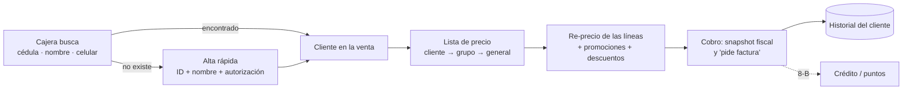

# Fase 8 · Clientes y proveedores — Propuesta

> Estado: **PROPUESTA — pendiente de aprobación** · 2026-09-29
> Requisitos previos: Fase 7 implementada ([informe](fase-07-informe.md)): la venta ya admite un tercero como cliente (Consumidor final
> por defecto, RN-SAL-13) y la cajera crea terceros. Fase 5 implementada ([informe](fase-05-informe.md)): terceros únicos con roles.
> Base: plan [12 §S, fase 8](../12-plan-riesgos-decisiones.md), docs [02 §9–10](../02-modulos.md), [04 §H.4, §H.5, §H.8 y §H.14](../04-base-de-datos.md),
> [06 datos personales](../06-seguridad-usuarios-permisos.md), ADR-0023 (terceros únicos con roles), ADR-0026 (cartera como libro),
> ADR-0030 (motor de cálculo puro), ADR-0034 (promociones), ADR-0035 (Billing), riesgo R-10 (Ley 1581 de 2012).

**Convenciones:** 🔒 = decisión difícil de cambiar después (matriz en la §3). ✅ = regla de negocio que se cumple. ⚙️ = parámetro configurable.

## 0. Objetivo y alcance

Después de esta fase la tienda **conoce a sus clientes**: la cajera los encuentra en segundos por cédula/NIT, nombre o celular, los
crea desde la caja con los datos mínimos, registra su **autorización de tratamiento de datos** (Ley 1581 de 2012) y, si lo piden, los
datos para la **factura electrónica**. Los clientes pertenecen a **grupos** con **listas de precio** (mayorista, empleados, tenderos)
que la venta aplica sola, sin romper el motor de cálculo ni las promociones. Cada cliente tiene su **historial** (compras, cambios,
totales, última compra). Los **proveedores** ganan lo que faltó en la Fase 5 (ficha resumen, historial de costos, días de visita,
cuentas bancarias con control antifraude, vencimientos). El **crédito (fiado)** y los **puntos** quedan **diseñados y con sus puntos
de enganche listos**, sin activarse.

Entregable verificable del plan: **venta con cliente identificado e historial** — un cliente creado en la caja, con autorización,
compra con su lista de precio y promociones, y su historial muestra la compra, el cambio y los totales correctos.

| Incluido | Excluido (fase) |
|---|---|
| Rol **cliente** sobre `parties` en un módulo nuevo `Customers` (estado, grupo, lista, origen, bloqueo) | Ventas a crédito, abonos y cartera por cobrar **en operación** (8-B, pregunta 1) |
| **Búsqueda en caja** por identificación (exacta o prefijo), nombre (sin tildes) y teléfono (solo dígitos) | Acumular y redimir **puntos** en operación (8-B, pregunta 2) |
| **Alta rápida desde caja** con datos mínimos y valores fiscales por defecto; la cajera ya no edita terceros existentes | Promociones exclusivas por grupo de clientes (fase posterior; el modelo lo admite) |
| Datos para **factura electrónica**: correo, régimen, responsabilidades, dirección y municipio; "el cliente pide factura" en la venta; **snapshot fiscal completo** del comprador | Emisión del documento electrónico con Factus (11-B) |
| **Autorización de datos** (Ley 1581): por finalidad, con versión de la política, canal, evidencia, usuario y hora; **marketing opcional** con canales | Envío de campañas de marketing (correo, SMS, WhatsApp) (fase posterior) |
| **Derechos del titular**: consulta/exportación, rectificación, revocación y supresión (anonimización), con plazos | Registro de la base de datos ante la SIC (trámite del propietario, §12) |
| **Grupos de clientes** y **listas de precio por grupo o por cliente** (fijas o % sobre la general) aplicadas en la venta | Portal o app del cliente (sincronización/nube) |
| **Historial del cliente**: ventas, anulaciones, cambios y garantías, totales, ticket promedio, primera/última compra, productos frecuentes | Reportes de ventas por cliente/segmento avanzados (9) |
| **Proveedores**: resumen 360, compras y costos por producto, "¿quién me vende esto?", días de visita/entrega y pedido mínimo, cuentas bancarias con control antifraude, retenciones sugeridas, vencimientos próximos | Evaluación de cumplimiento del proveedor y sugerido de pedido (9/10) |
| **Crédito y puntos preparados**: diseño congelado (ADR), columnas del cliente, tipos de medio de pago reservados, contratos con implementación nula | Reporte a centrales de riesgo (no previsto) |

Se entrega en **cinco bloques** con una sola aprobación: **8.1 Clientes, caja y privacidad**, **8.2 Grupos y listas de precio en la
venta**, **8.3 Historial del cliente**, **8.4 Mejoras de proveedores**, **8.5 Crédito y puntos preparados** (estimación en la §15).

---

## 1. Actores y flujo general

| Actor (rol de sistema) | Qué hace |
|---|---|
| Cajero (`CASHIER`) | Busca clientes, los **crea** (alta rápida) con su autorización de datos, completa correo o teléfono vacíos, marca "pide factura". **No** modifica datos existentes, ni grupos, ni listas |
| Supervisor de caja (`CASH_SUPERVISOR`) | Lo anterior + corrige datos de contacto y fiscales del cliente; consulta el historial |
| Administrador / Propietario | Grupos, listas de precio del cliente, bloqueo, solicitudes de titulares (exportar, suprimir), política de datos |
| Compras (`PURCHASING`) | Proveedores y sus mejoras; **no** cambia cuentas bancarias |
| Contador (`ACCOUNTANT`) | Consulta clientes, historial, proveedores y vencimientos |



---

## 2. Decisiones principales

| # | Decisión | Por qué | |
|---|---|---|---|
| D8-01 | **Módulo nuevo `Customers`** (esquema `customers`) dueño del rol cliente, grupos, privacidad y, en 8-B, crédito y puntos. `Parties` sigue siendo solo el maestro de identidad | Igual que `Purchasing` es dueño del rol proveedor (ADR-0023); `Parties` no crece con reglas comerciales; el doc 02 ya separaba `Parties` (9) y `Customers` (10). Cambia el doc 04, que ubicaba `customers`/`customer_groups` en `parties` | 🔒 |
| D8-02 | **Rol cliente 1:1 con el tercero y con la misma clave** (`customers.customers.party_id` es la PK). `sales.customer_id` sigue apuntando al tercero. El rol se crea en el alta rápida o **automáticamente** la primera vez que un tercero compra (grupo por defecto) | Sin tabla intermedia en consultas de historial; si dos tiendas crean el rol del mismo tercero sin conexión, convergen en la misma fila (no hay duplicado que fusionar) | 🔒 |
| D8-03 | **Búsqueda única en caja**: un texto que se interpreta como identificación (exacta o prefijo, sin DV y sin puntos), teléfono (solo dígitos, ≥ 7) o nombre (trigramas, sin tildes). Meta p95 < 50 ms con 100.000 clientes | La cajera no elige "buscar por…"; el cliente dicta cédula o celular | |
| D8-04 | **Alta rápida** con datos mínimos: tipo y número de identificación (DV obligatorio si es NIT), nombres y apellidos o razón social; opcionales correo y celular. Valores por defecto: régimen **49 (no responsable de IVA)** y responsabilidad **R-99-PN**. La cajera **solo crea y completa campos vacíos**: se retira `parties.party.manage` de CAJERO y SUPERVISOR | Hoy la cajera puede modificar cualquier tercero, **incluidos los proveedores** (NIT, razón social, estado): riesgo de fraude y de errores en compras | |
| D8-05 | **Snapshot fiscal completo del comprador** en la venta (tipo de persona, identificación y DV, nombre, régimen, responsabilidades, correo, dirección, municipio, teléfono) y marca **"el cliente pide factura electrónica"**; si la pide, se exigen los datos completos antes de cobrar | La 11-B emitirá con los datos **del momento de la venta**, aunque el tercero cambie después; reconstruirlos luego es imposible (RN-GEN-03) | 🔒 |
| D8-06 | **Autorización de tratamiento de datos como registro de solo inserción** por finalidad (`SERVICE`: historial y atención; `MARKETING`; `LOYALTY` en 8-B), con versión de la política, canal, evidencia, usuario, caja y hora. Revocar = nuevo registro. El estado vigente se guarda en el cliente para filtrar rápido | La Ley 1581 y el Decreto 1377 de 2013 exigen **conservar prueba** de la autorización; un campo "sí/no" no la prueba | 🔒 |
| D8-07 | Los **datos mínimos de facturación** se tratan por obligación legal (Estatuto Tributario) aun sin autorización; sin autorización `SERVICE`, el cliente se puede identificar para la factura pero **no se le muestra historial ni se usa para marketing** ⚙️ | Minimización (R-10); la venta nunca se bloquea por la autorización. **A validar con un asesor legal** (§12) | |
| D8-08 | **Derechos del titular**: solicitudes registradas con plazo (consultas 10 días hábiles, reclamos 15, Ley 1581 arts. 14–15), exportación de sus datos, rectificación y **supresión = anonimización** del perfil (nombres, contacto, autorizaciones de marketing) conservando los documentos y sus snapshots durante la retención legal | Los documentos contables y fiscales deben conservarse; borrar al tercero rompería ventas | |
| D8-09 | **Resolución del precio**: precio modificado autorizado > **lista del cliente** > **lista de su grupo** > **lista general**; dentro de cada lista, el precio de la sucursal gana al de todas. Producto sin precio en la lista del cliente → precio de la general (con el % de la lista si es derivada, D8-11). La lista se fija en la venta al asignar el cliente; **cambiar el cliente re-precia las líneas activas** (salvo precio abierto/modificado y etiqueta de báscula por precio) | Predecible, una sola consulta por escaneo (la lista ya está en la venta); una lista mayorista no obliga a cargar precio a 20.000 productos | 🔒 |
| D8-10 | **Promociones sobre el precio de lista del cliente, sin tocar `SaleCalculator`**: el motor recibe `UnitPrice` = precio de la lista y `PromotionsAllowed` = la lista admite promociones ⚙️ (por defecto sí). Precio especial y precio por cantidad solo aplican si mejoran (el motor ya descarta descuentos ≤ 0); el porcentaje se aplica sobre el precio de la lista; el descuento manual va después (D7-16) | El motor puro ya tiene esos dos insumos: cero cambios en el cálculo ni en sus 63 pruebas; el dueño decide por lista si "mayorista + promo" se acumula (pregunta 3) | 🔒 |
| D8-11 | **Listas derivadas**: además de las listas con precios fijos, una lista puede ser "% sobre la general" (p. ej. Empleados −5 %) con redondeo ⚙️ ($50, al más cercano); los precios fijos que tenga la lista ganan sobre el porcentaje | Es lo más común (empleados, tenderos) y evita mantener miles de precios | |
| D8-12 | **Snapshot de la lista** en la venta (`price_list_id`, código) y en la línea (lista y **origen del precio**: `LIST`, `DERIVED`, `DEFAULT`, `OPEN`, `OVERRIDE`, `SCALE_LABEL`) | Auditar "¿por qué se cobró este precio?" y reportar ventas por lista (antifraude §12) | 🔒 |
| D8-13 | **Historial calculado en línea** desde las ventas (sin tabla de acumulados) con un índice por cliente; `Sales` lo expone por contrato (`ICustomerSalesHistory`) y `Customers` lo presenta. Total comprado = ventas completadas − créditos de cambio − reintegros (no se cuenta dos veces un cambio) | Las ventas por cliente son pocas; un acumulado exigiría reconstrucción y conciliación. Si crece, se agrega una proyección sin cambiar la API | |
| D8-14 | **Proveedores**: ficha resumen, historial de costos por producto, "¿quién me vende esto?", agenda de visita/entrega y pedido mínimo, **cuentas bancarias** (cambiarlas exige permiso del propietario/administrador, auditoría crítica y queda "por verificar" hasta confirmarlas), retenciones sugeridas (se pre-llenan, siguen siendo digitadas, D5-11) y vencimientos próximos | Completa la Fase 5; el cambio fraudulento de cuenta bancaria de un proveedor es un fraude frecuente | |
| D8-15 | **Crédito (fiado) preparado, no activo**: diseño congelado como **libro** (igual que la cartera por pagar, ADR-0026): cuenta por cobrar por venta, abonos en caja como movimiento que afecta el cajón, cupo y plazo por cliente, bloqueo por mora. Ahora solo: columnas de crédito del cliente, tipo de medio de pago `CUSTOMER_CREDIT` **reservado** (no se puede crear un medio de ese tipo) y contrato `ICustomerCreditGate` con implementación nula | Encenderlo después no cambia ventas ni caja; activarlo hoy trae riesgos contables y fiscales que conviene cerrar con el contador (§12) | 🔒 |
| D8-16 | **Puntos preparados, no activos**: libro de puntos (acumulación por el evento `sales.sale_completed.v1`, redención como medio de pago `LOYALTY_POINTS`, vencimiento); ahora solo el tipo de medio reservado, la finalidad `LOYALTY` en la autorización y el contrato `ILoyaltyProgram` nulo. Los puntos **no son retroactivos** | El evento ya lleva cliente, líneas y pagos; la contabilidad de los puntos (ingreso diferido) debe definirse con el contador | 🔒 |
| D8-17 | **Consumidor final** sigue sin rol de cliente, sin historial personal y con la lista general; el tope RN-SAL-13 ⚙️ se mantiene. Mismo número de identificación con otro tipo (CC 123 vs NIT 123-4 de la misma persona natural) → **advertencia de posible duplicado** al crear | En Colombia el NIT de una persona natural es su cédula + DV: es la fuente más común de duplicados | |

---

## 3. Revisión arquitectónica de las decisiones difíciles de cambiar

Impacto en licenciamiento: **ninguno** en todas (ADR-0015 y ADR-0039: todas las funciones en ambas ediciones; la fila "Clientes
avanzados" del doc 09 original quedó reemplazada).

| ID | Decisión | Motivo | Alternativas | Consecuencia positiva | Riesgo | Impacto POS local | Impacto multisucursal | Impacto sincronización | Dificultad de cambiar | Recomendación |
|---|---|---|---|---|---|---|---|---|---|---|
| D8-01 | Módulo `Customers` | Separar identidad de relación comercial | Todo en `Parties` (doc 04) | `Parties` pequeño; crédito y puntos con dueño claro | Un módulo más (reglas de arquitectura R1–R8) | Ninguno | Clientes de empresa: los ven todas las sucursales | Maestro por campo (D4-09) | Alta (mover tablas y permisos) | **Adoptar** |
| D8-02 | Rol con PK = `party_id` | Historial directo, sin duplicados de rol | Id propio + `party_id` único (como proveedores) | Dos tiendas convergen en la misma fila | Distinto del patrón de proveedores | — | Igual | La fusión de terceros (D5-02) mueve el rol al tercero conservado | Muy alta (claves en ventas y libros futuros) | **Adoptar** |
| D8-05 | Snapshot fiscal completo en la venta | Factura 11-B fiel al momento | Leer el tercero al emitir | Documento reproducible | ~0,5 KB más por venta identificada | Local | — | Viaja con la venta | Muy alta (ventas históricas sin datos) | **Adoptar** |
| D8-06 | Autorizaciones de solo inserción con versión de política | Prueba ante la SIC | Campo booleano | Evidencia de qué aceptó, cuándo, por qué canal | La cajera registra canal "verbal" sin prueba física (pregunta 5) | Registro local inmediato | Por empresa | ↑ sin conflictos (inserciones) | Alta | **Adoptar** |
| D8-09 | Precio: cliente > grupo > general, fijado en la venta; re-precio al cambiar cliente | Un precio explicable | Resolver en cada escaneo leyendo el cliente | Una consulta por escaneo | Un cambio de lista del cliente con la venta abierta no la afecta hasta reasignarlo | p95 del escaneo sin cambio (< 50 ms) | Listas de empresa con precios por sucursal | Listas ↑↓ por campo | Alta | **Adoptar** |
| D8-10 | Promociones sobre la lista, `PromotionsAllowed` por lista | No tocar el motor | Nueva etapa "descuento de lista" en `SaleCalculator` | Motor y pruebas intactos; comportamiento elegible por lista | Acumular % de promo sobre lista mayorista reduce margen (se configura) | Motor puro | Igual | — | Alta (cambia precios cobrados) | **Adoptar** |
| D8-12 | Lista y origen del precio en la línea | Auditoría y antifraude | Solo el precio | "¿Por qué este precio?" siempre respondible | Columnas nuevas en `sale_lines` | — | Reportes por lista | Viaja con la venta | Muy alta (históricos) | **Adoptar** |
| D8-15 | Crédito como libro, reservado | No reescribir ventas y caja en 8-B | Activar ya; o diseñar en 8-B | Enganches listos (medio de pago, contrato, columnas) | Diseño que el contador pida ajustar | La venta a crédito no afecta el cajón; el abono sí | Cartera por sucursal que vende, cupo por empresa | Documentos ↑ | Alta | **Adoptar** reserva; activar en 8-B |
| D8-16 | Puntos como libro, reservado | Igual | Descuento directo en la venta | Redención como medio de pago no altera la base gravable ya calculada | Tratamiento tributario del canje por confirmar | Saldo local; en multisucursal, canje contra el saldo de la nube (8-B) | Saldo de empresa | Movimientos ↑ | Alta | **Adoptar** reserva |

---

## 4. Modelo de datos

Migraciones previstas (la 020 es la última existente):

| Migración | Contenido |
|---|---|
| `V2026.10.021__customers__customers.sql` | Esquema `customers`: grupos, clientes, políticas de datos, autorizaciones (solo inserción), solicitudes de titulares; privilegios |
| `V2026.10.022__parties__search_and_contacts.sql` | `phone_digits` (columna generada + índice), `party_contacts.contact_role` |
| `V2026.10.023__catalog__price_list_rules.sql` | Reglas de la lista: % sobre la general, redondeo, admite promociones |
| `V2026.10.024__sales__customer_pricing.sql` | Lista y snapshot fiscal en la venta, origen del precio en la línea, "pide factura", índice de historial |
| `V2026.10.025__purchasing__supplier_improvements.sql` | Agenda, pedido mínimo, cuentas bancarias, retenciones sugeridas |
| `V2026.10.026__cash__reserved_payment_kinds.sql` | Tipos `CUSTOMER_CREDIT` y `LOYALTY_POINTS` en los CHECK de `cash.payment_methods` y del snapshot de pagos de la venta |
| `R__identity__permissions_catalog.sql` · `R__ref__seed_colombia.sql` | Permisos nuevos (§7) · bancos y festivos (tablas `ref.banks` y `ref.holidays` creadas en la 021) |

### 4.1 Clientes (`customers`)

| Tabla | Contenido |
|---|---|
| `customer_groups` [CTL][DEL] | Código (`^[A-Z0-9_]{2,20}$`, único), nombre, **lista de precio** (null = general), estado. Sembrado: `GENERAL` (por defecto, sin lista) |
| `customers` [CTL][DEL] | **PK `party_id`** (FK al tercero), empresa, grupo, **lista propia** (null = la del grupo), estado (`ACTIVE`, `INACTIVE`, `BLOCKED` con motivo), origen (`POS_QUICK`, `BACKOFFICE`, `AUTO_ON_SALE`, `IMPORT`), sucursal de creación, "siempre pide factura electrónica", estado vigente de autorización (`SERVICE`, `MARKETING` y canales de marketing, calculado del libro), `anonymized_at`. **Preparados (8-B)**: `credit_status` (`NONE` hoy, CHECK), `credit_limit`, `credit_term_days`, `loyalty_status` (`NONE` hoy) |
| `privacy_policies` | Versión, vigencia, texto de la política y del **aviso corto** (el que se lee o imprime en la caja), hash SHA-256 del texto, estado. Se siembra una **plantilla** que el propietario debe revisar (aviso en el tablero hasta que la acepte) |
| `customer_consents` | **Solo inserción** (trigger): tercero, finalidad (`SERVICE`, `MARKETING`, `LOYALTY`), otorgada sí/no, canal (`POS_VERBAL`, `POS_SIGNED`, `PAPER_FORM`, `WEB`, `PHONE`, `EMAIL`, `IMPORT`), canales de marketing (`EMAIL`, `SMS`, `WHATSAPP`, `CALL`), versión de la política, referencia de evidencia (nº del formato físico), usuario, sucursal, caja, nodo, fecha |
| `data_requests` | Solicitud del titular: tercero, tipo (`QUERY`, `UPDATE`, `REVOKE`, `DELETE`, `COMPLAINT`), canal, recibida, **vence** (10 o 15 días hábiles), estado (`OPEN`, `RESOLVED`, `REJECTED`), respuesta, quién y cuándo |

### 4.2 Terceros (`parties`, cambios menores)

- `phone_digits` generado (solo dígitos del teléfono) con índice para la búsqueda por celular; `search_text` sin cambios.
- `party_contacts.contact_role` (`SALES`, `COLLECTIONS`, `LOGISTICS`, `OTHER`) para los contactos de proveedores.
- Sin tabla nueva: el alta rápida crea el tercero con `PartyData` y los valores por defecto de D8-04.

### 4.3 Listas de precio (`catalog.price_lists`, columnas nuevas)

`adjustment_percent` (null = lista fija; p. ej. −5,00), `rounding_increment` ⚙️ (50), `allows_promotions` (true). CHECK: la lista
general no tiene porcentaje; porcentaje entre −90 y +100. `product_prices` sin cambios (los precios fijos de una lista derivada ganan
sobre el porcentaje). El contrato `ICatalogSaleItems` recibe un `priceListId` opcional (null = general, compatible con lo actual) y
devuelve el origen del precio.

### 4.4 Ventas (`sales`, columnas nuevas)

| Tabla | Columnas |
|---|---|
| `sales` | `price_list_id`, `price_list_code`, `customer_group_code`, `customer_fiscal` (jsonb: tipo de persona, DV, régimen, responsabilidades, dirección, municipio, teléfono; las columnas actuales de nombre, identificación y correo se conservan), `invoice_requested` (CHECK: si es true, hay cliente identificado). Índice de historial `(company_id, customer_id, completed_at DESC) WHERE customer_id IS NOT NULL AND status IN ('COMPLETED','VOIDED')` |
| `sale_lines` | `price_list_id`, `price_source` (`LIST`, `DERIVED`, `DEFAULT`, `OPEN`, `OVERRIDE`, `SCALE_LABEL`) |

Las ventas existentes quedan con la lista general y `price_source = 'DEFAULT'` (o `OVERRIDE`/`SCALE_LABEL` según sus datos).

### 4.5 Proveedores (`purchasing`, tablas y columnas nuevas)

| Tabla | Contenido |
|---|---|
| `suppliers` (+) | `minimum_order_amount`, `order_cutoff_note` |
| `supplier_schedules` | Día de la semana y tipo (`VISIT`, `ORDER`, `DELIVERY`), sucursal (null = todas) |
| `supplier_bank_accounts` | Banco (catálogo `ref.banks`, sembrado en `R__ref__seed_colombia.sql`), tipo (`SAVINGS`, `CHECKING`), número, titular e identificación del titular, **estado** (`PENDING_VERIFICATION`, `VERIFIED`, `INACTIVE`), verificada por y cuándo, principal. Único por (proveedor, banco, número) |
| `supplier_withholding_defaults` | Tipo (`RETEFUENTE`, `RETEIVA`, `RETEICA`), tarifa %, concepto; solo **pre-llenan** la compra |

### 4.6 Crédito y puntos: diseño reservado (tablas de la 8-B, no se crean ahora)

| Tabla futura | Diseño congelado |
|---|---|
| `customers.receivables` | Cuenta por cobrar por venta a crédito: valor, saldo, vence, estado (como `accounts_payable`) |
| `customers.receivable_entries` | Libro de solo inserción: `CHARGE`, `PAYMENT`, `CREDIT_NOTE`, `WRITE_OFF`, `VOID` con saldo resultante (ADR-0026) |
| `customers.receivable_payments` / `_allocations` | Abono en caja (movimiento `RECEIVABLE_COLLECTION` que **sí** afecta el cajón) o fuera de caja, aplicado a varias cuentas |
| `customers.loyalty_accounts` / `loyalty_entries` | Saldo de puntos y libro (`EARN`, `REDEEM`, `EXPIRE`, `ADJUST`, `REVERSAL` por anulación o cambio) |

---

## 5. Flujos

### 5.1 Identificar al cliente en la caja

1. La cajera escribe o escanea el documento (lector de cédula ⚙️ en 15), dice un nombre o un celular → `GET /customers/lookup?q=`.
   Resultados: identificación, nombre, grupo, estado y si **le falta el correo** para factura. Máximo 20; exactos primero.
2. **Si existe**: `PUT /sales/{id}/customer` → se fija la lista (D8-09), se re-precian las líneas y se toma el snapshot. Cliente
   `BLOCKED` → `CUSTOMERS.BLOCKED` con el motivo; tercero sin rol cliente (p. ej. un proveedor) → se crea el rol (`AUTO_ON_SALE`).
3. **Si no existe**: alta rápida `POST /customers/quick` (tipo, número, DV si es NIT, nombres/razón social; opcionales correo y
   celular) + **autorización**: la cajera lee el aviso corto y marca lo que el cliente acepta (`SERVICE`; `MARKETING` y canales, por
   defecto **no**). Con autorización obtenida en caja el tiquete imprime una línea: "Autorizó el tratamiento de datos (política vN)".
   Mismo número con otro tipo → aviso de posible duplicado (D8-17). Dos cajas crean la misma cédula a la vez → una crea y la otra
   recibe `409 PARTIES.DUPLICATED` **con el tercero existente**, que la caja usa sin reintentar.
4. **"Pide factura electrónica"**: con el cliente, `invoiceRequested = true` exige tipo de persona, correo, régimen y
   responsabilidades (persona natural no responsable: `49` / `R-99-PN` ya vienen por defecto) y, para persona jurídica, dirección y
   municipio. Si faltan: `SALES.CUSTOMER_FISCAL_DATA_INCOMPLETE` con la lista; la cajera completa los vacíos. Hoy la venta sigue
   generando el comprobante interno (D7-12); la marca y el snapshot quedan listos para la 11-B.
5. Tope RN-SAL-13 ⚙️: sin cambios. Nota: el umbral legal a partir del cual se exige identificar al comprador o emitir factura
   electrónica de venta en lugar del documento POS (Res. DIAN 165 de 2023) **debe confirmarlo el contador** antes de fijar el tope.

### 5.2 Precio con lista de cliente y promociones (ejemplos)

Lista general: arroz $3.000, leche $4.150. Lista **Mayorista** (fija, arroz $2.800; admite promociones: no). Lista **Empleados**
(−5 % sobre la general, redondeo $50; admite promociones: sí). Promociones vigentes: arroz a precio especial $2.900; 20 % en lácteos.

| Cliente | Arroz | Leche |
|---|---|---|
| Consumidor final | 3.000 → promo $2.900 | 4.150 − 20 % = **$3.320** |
| Mayorista | **$2.800** (lista; sin promociones) | 4.150 (sin precio en la lista → general; sin promociones) |
| Empleado | 3.000 × 0,95 = $2.850 → la promo de $2.900 no mejora: **$2.850** | 4.150 × 0,95 = 3.942,5 → **$3.950** − 20 % = **$3.160** |

Orden completo: precio de la lista (D8-09/D8-11) → promoción si la lista lo permite (la más favorable, D7-16) → descuento manual
autorizado → impuestos. El `SaleCalculator` no cambia: solo cambia el `UnitPrice` y el `PromotionsAllowed` que recibe.

### 5.3 Historial del cliente

`GET /customers/{id}/history?from&to&page`: ventas (número, fecha, sucursal, caja, total, medios, estado; las anuladas marcadas),
cambios y reintegros por garantía con su venta de origen. `GET /customers/{id}/summary`: número de compras, **total comprado**
(D8-13), ticket promedio, primera y última compra, sucursal habitual, 10 productos más comprados, lista y grupo. Sin autorización
`SERVICE` vigente: el resumen solo muestra datos de facturación (D8-07). En Multicaja con varias sucursales, cada tienda ve su
historial local hasta que la sincronización (nube) lo consolide.

### 5.4 Derechos del titular

Registrar la solicitud (canal, fecha; vence en 10 o 15 días hábiles con el calendario de festivos `ref.holidays`, nuevo) → según el tipo:
**exportar** (JSON y PDF con datos, autorizaciones y resumen de compras), **rectificar** (edición auditada), **revocar** (nuevo
registro de autorización) o **suprimir**: se reemplazan nombres por "TITULAR SUPRIMIDO", se borran correo, teléfono y dirección, se
revocan las finalidades, el rol queda `INACTIVE` con `anonymized_at`; la identificación se conserva mientras exista la obligación de
conservar los documentos (10 años) y los snapshots de las ventas no cambian. Todo con auditoría `WARNING`.

### 5.5 Proveedores

- **Resumen** (`/summary`): comprado en el período, número de compras, última compra, saldo, vencido, devoluciones, productos activos.
- **Costos**: `GET /purchasing/products/{productId}/suppliers` (quién lo vende, último costo, días de entrega, preferido) y
  `/cost-history` (costo neto por compra y proveedor; solo con `inventory.cost.view`).
- **Agenda**: días de visita del vendedor, de pedido y de entrega por sucursal; pedido mínimo. Base para el sugerido de pedido (9/10).
- **Cuentas bancarias**: registrar o cambiar exige `purchasing.supplier.bank_manage` (propietario/administrador) con autorización
  crítica; una cuenta nueva o modificada queda `PENDING_VERIFICATION` y el pago a proveedor muestra la advertencia hasta que otro
  usuario con el permiso la marque `VERIFIED` (confirmada por teléfono con el contacto de cartera).
- **Retenciones sugeridas**: al crear la compra se pre-llenan tipo y tarifa; el usuario ajusta la base y confirma (D5-11 sigue).
- **Vencimientos**: `GET /purchasing/payables/due?days=7` (por vencer y vencidas) para el tablero.

### 5.6 Crédito y puntos: qué queda listo y qué falta (8-B)

| Queda listo ahora | Se implementa en 8-B |
|---|---|
| Columnas de crédito y puntos del cliente (`NONE`) | Asignar cupo, plazo y activar crédito (`customers.credit.manage`) |
| Tipos de medio `CUSTOMER_CREDIT` y `LOYALTY_POINTS` en los CHECK; la API rechaza crear medios de esos tipos (`CASH.PAYMENT_KIND_NOT_AVAILABLE`) | Sembrar "Crédito cliente" (código DIAN de forma de pago crédito) y "Puntos" |
| `ICustomerCreditGate` y `ILoyaltyProgram` (Customers.Contracts) con implementación nula; `Sales` ya los consulta si llega un pago de ese tipo | Validar cupo y mora al cobrar; cuenta por cobrar en la transacción del cobro |
| Evento `sales.sale_completed.v1` con cliente, líneas y pagos (ya existe) | Acumular puntos por evento; redimir como medio de pago; vencimiento |
| Finalidad `LOYALTY` en la autorización | Abonos en caja (`RECEIVABLE_COLLECTION` en el arqueo), estado de cuenta, edades, anulación de venta a crédito |
| ADR del libro de cartera por cobrar y del libro de puntos | Reglas de la factura electrónica (forma de pago crédito) con la 11-B |

---

## 6. Reglas de negocio

| Regla | Implementación |
|---|---|
| **RN-CUS-01 (nueva)** Rol cliente | Uno por tercero (PK `party_id`); el Consumidor final no tiene rol |
| **RN-CUS-02 (nueva)** Alta rápida | Identificación única (D5-02), DV si es NIT, nombres o razón social; valores fiscales por defecto; la cajera no modifica campos con valor |
| **RN-CUS-03 (nueva)** Cliente bloqueado | No se asigna a ventas nuevas; con motivo y auditado |
| **RN-CUS-04 (nueva)** Posible duplicado | Mismo número con otro tipo de identificación → advertencia (no bloquea) |
| **RN-PRL-01 (nueva)** Lista aplicable | Modificado > cliente > grupo > general; sucursal > todas; sin precio en la lista → general (± %) |
| **RN-PRL-02 (nueva)** Re-precio | Cambiar el cliente re-precia las líneas activas salvo `OPEN`, `OVERRIDE` y `SCALE_LABEL`; la venta informa las líneas que cambiaron |
| **RN-PRL-03 (nueva)** Promociones y lista | Solo si la lista las admite; la más favorable sobre el precio de la lista (RN-PRM-02) |
| **RN-PRL-04 (nueva)** Asignar listas | Solo `customers.pricing.assign` (propietario/administrador); auditado |
| **RN-DAT-01 (nueva)** Autorización | Registro de solo inserción por finalidad con versión de la política; marketing nunca por defecto |
| **RN-DAT-02 (nueva)** Sin autorización `SERVICE` | Se vende e identifica para la factura; no se muestra historial ni se exporta para marketing |
| **RN-DAT-03 (nueva)** Solicitudes | Plazo de 10 (consulta) o 15 (reclamo) días hábiles; alerta de vencimiento |
| **RN-DAT-04 (nueva)** Supresión | Anonimización del perfil; documentos y snapshots se conservan |
| **RN-SAL-13 (cambia)** Identificación | + "pide factura electrónica" exige datos fiscales completos antes de cobrar |
| **RN-SAL-19 (nueva)** Snapshot del comprador | Datos fiscales completos y lista aplicada al cobrar |
| **RN-PUR-09 (nueva)** Cuenta bancaria | Nueva o modificada → por verificar; la verifica otro usuario con el permiso |
| **RN-PUR-10 (nueva)** Retenciones sugeridas | Pre-llenan; nunca se contabilizan sin confirmar |

## 7. Permisos y roles

| Permiso | Roles de sistema |
|---|---|
| `customers.customer.view` (buscar, ficha básica) | CASHIER, CASH_SUPERVISOR, PURCHASING, ACCOUNTANT, OWNER, ADMIN |
| `customers.customer.quick_create` (alta rápida, completar vacíos, registrar autorización) | CASHIER, CASH_SUPERVISOR, OWNER, ADMIN |
| `customers.customer.manage` (corregir datos, bloquear) | CASH_SUPERVISOR, OWNER, ADMIN |
| `customers.pricing.assign` (grupo y lista del cliente) — sensible | OWNER, ADMIN |
| `customers.group.manage` | OWNER, ADMIN |
| `customers.history.view` | CASH_SUPERVISOR, ACCOUNTANT, OWNER, ADMIN |
| `customers.privacy.manage` (política, solicitudes, exportar, suprimir) — sensible | OWNER, ADMIN |
| `purchasing.supplier.bank_manage` (admite autorización) — sensible | OWNER, ADMIN |
| `parties.party.manage` | **Se retira de CASHIER y CASH_SUPERVISOR**; quedan PURCHASING, OWNER, ADMIN |

Cambios de roles: los roles de sistema se actualizan al arrancar (como en fases anteriores); los **roles personalizados clonados**
conservan `parties.party.manage` y el informe lo advierte. Ningún rol nuevo. Los permisos de la 8-B (`customers.credit.manage`,
`customers.receivable.collect`, `loyalty.*`) **no** se crean ahora (el catálogo solo tiene permisos con endpoints).

## 8. Impacto en la sincronización

| Dato | Escribe | Dirección | Conflictos |
|---|---|---|---|
| Clientes, grupos, listas y sus reglas | Cualquier tienda y el portal | ↑↓ | Por campo (D4-09); el rol converge por `party_id`; tercero duplicado → fusión (D5-02) mueve el rol |
| Autorizaciones de datos, solicitudes | La tienda o el portal | ↑ (y ↓ las del portal) | Ninguno (solo inserción; el estado vigente es el último registro por fecha) |
| Política de datos | Empresa | ↑↓ | Versiones nuevas, nunca se editan |
| Ventas con lista y snapshot fiscal | El nodo de la caja | ↑ | Ninguno |
| Agenda, cuentas bancarias y retenciones del proveedor | Tienda o portal | ↑↓ | Por campo; cambio de cuenta bancaria → auditoría crítica en ambos lados |

## 9. API (resumen)

`/customers/lookup?q=` · `/customers` (listar, crear completo) · `/customers/quick` · `/customers/{id}` (ficha, editar) ·
`/customers/{id}/status` · `/customers/{id}/pricing` · `/customers/{id}/consents` (listar, registrar) · `/customers/{id}/history` ·
`/customers/{id}/summary` · `/customers/{id}/export` · `/customers/{id}/anonymize` · `/customers/groups` ·
`/customers/privacy-policies` · `/customers/data-requests` · `/catalog/price-lists` (+ porcentaje, redondeo, promociones) ·
`/catalog/price-check?customerId=` · `PUT /sales/{id}/customer` (+ `invoiceRequested`; responde las líneas re-preciadas) ·
`/sales?customerId=` · `/purchasing/suppliers/{id}/summary` · `/purchasing/suppliers/{id}/schedule` ·
`/purchasing/suppliers/{id}/bank-accounts` (+ `/verify`) · `/purchasing/suppliers/{id}/withholdings` ·
`/purchasing/products/{productId}/suppliers` · `/purchasing/products/{productId}/cost-history` · `/purchasing/payables/due`.

## 10. Migración de instalaciones existentes

Tablas y columnas nuevas, sin reescribir datos: las ventas existentes quedan con la lista general. Al arrancar: permisos y roles de
sistema actualizados; grupo `GENERAL`; plantilla de política de datos (pendiente de aceptar por el propietario); **rol cliente
automático** para los terceros que ya aparecen en ventas (origen `AUTO_ON_SALE`, sin autorización registrada: el tablero lo muestra
para completarla en la próxima compra); catálogos de bancos (`ref.banks`) y festivos de Colombia (`ref.holidays`) en `R__ref__seed_colombia.sql`.

## 11. Pruebas previstas

- **Unitarias:** resolución del precio (cliente > grupo > general, sucursal, sin precio → general, derivada con redondeo, precio fijo
  sobre %), `PromotionsAllowed` por lista con cada tipo de promoción (tabla de la §5.2 exacta), re-precio al cambiar el cliente (sin
  tocar `OPEN`/`OVERRIDE`/`SCALE_LABEL`), alta rápida (DV, valores por defecto, posible duplicado), búsqueda (clasificación del
  texto, teléfono en dígitos), libro de autorizaciones y estado vigente, plazos en días hábiles, anonimización, total comprado con
  cambios y garantías, datos fiscales completos para "pide factura", cuentas bancarias por verificar.
- **BD real:** PK del rol = tercero, autorizaciones de solo inserción, `invoice_requested` ⇒ cliente, porcentaje solo en listas no
  generales, tipos de medio reservados aceptados por el CHECK, índice de historial usado (`EXPLAIN`).
- **API:** escenario **"cliente identificado"**: alta rápida en caja con autorización → venta con lista Empleados y promoción →
  cobro con "pide factura" y snapshot fiscal → cambio de mercancía → el historial y el resumen cuadran; cliente mayorista sin
  promociones; cliente bloqueado rechazado; la cajera **no** puede editar un proveedor ni asignar listas (`403`); exportar y
  suprimir; crear un medio `CUSTOMER_CREDIT` rechazado; proveedor: cuenta bancaria nueva por verificar, resumen y costos.
- **Rendimiento:** búsqueda en caja p95 < 50 ms con 100.000 clientes; escaneo con lista de cliente p95 < 50 ms (igual que hoy).
- **Concurrencia:** dos cajas crean la misma cédula a la vez → una sola ficha, la otra recibe la existente.
- **Arquitectura:** `Customers` solo usa contratos de `Parties`, `Catalog` y `Sales`; `Sales` solo `Customers.Contracts`.

## 12. Riesgos

| Riesgo | Mitigación |
|---|---|
| **Protección de datos (R-10):** autorización previa, expresa e informada con prueba (Ley 1581 de 2012, Decreto 1377 de 2013); la autorización **verbal** en caja es válida si queda prueba, pero es la más débil; política de tratamiento publicada; la inscripción en el Registro Nacional de Bases de Datos de la SIC depende del tamaño de la empresa | Libro de autorizaciones con versión, canal y evidencia; aviso en el tiquete; formato físico opcional (pregunta 5); plantilla de política. **Validar con un abogado** el texto y el canal verbal; el trámite ante la SIC es del propietario |
| Contacto comercial y de cobranza: la Ley 2300 de 2023 limita canales, horarios y frecuencia | Canales de marketing autorizados por cliente; las campañas y la cobranza (fases posteriores) respetarán esos límites |
| **Fuga de margen o fraude con listas** (la cajera asigna la lista mayorista a conocidos) | Solo propietario/administrador asigna listas; lista y origen del precio en cada línea; reporte de ventas por lista (9); auditoría |
| Datos fiscales incompletos al pedir factura (rechazos en la 11-B) | Validación antes de cobrar; aviso de "falta el correo" en la búsqueda |
| Duplicados CC/NIT de la misma persona | Advertencia al crear (RN-CUS-04); fusión en la nube (D5-02) |
| Quitar `parties.party.manage` a la cajera cambia la operación actual | El supervisor corrige; la cajera completa vacíos; se explica en el informe |
| **Crédito (8-B)**: forma de pago crédito en la factura electrónica, cartera y su deterioro, intereses (límite de usura), reporte a centrales solo con autorización (Ley 1266 de 2008), cobranza (Ley 2300) | Se deja reservado; se define con el contador antes de activarlo |
| **Puntos (8-B)**: ingreso diferido (NIIF 15) y tratamiento tributario del canje (¿descuento o medio de pago? efecto en el IVA) | Reservado como medio de pago; confirmar con el contador antes de activarlo |
| Crecimiento del historial | Índice por cliente; proyección de acumulados si hiciera falta (sin cambiar la API) |

## 13. Estructura de código

```
src/Modules/Customers/*        (nuevo) Clientes, grupos, búsqueda en caja, alta rápida, autorizaciones, solicitudes, política;
                               Contracts: ICustomerDirectory (perfil de precios y snapshot), ICustomerCreditGate y ILoyaltyProgram (nulos)
src/Modules/Parties            Búsqueda por teléfono, rol del contacto; el alta rápida reutiliza Party.Create
src/Modules/Catalog            Reglas de la lista (% y redondeo, promociones); ICatalogSaleItems con priceListId opcional y origen del precio
src/Modules/Sales              CustomerResolver con ICustomerDirectory, re-precio, snapshot fiscal, "pide factura", ICustomerSalesHistory
src/Modules/Purchasing         Resumen, agenda, cuentas bancarias, retenciones sugeridas, costos por producto, vencimientos
src/Modules/Cash               Tipos de medio reservados (rechazo al crear)
src/Modules/Identity           Roles de sistema: permisos nuevos y retiro de parties.party.manage
http/fase-08.http
```

## 14. Criterios de aceptación

- [ ] **Venta con cliente identificado**: búsqueda por cédula, nombre y celular; alta rápida en caja con autorización y aviso en el tiquete.
- [ ] Grupos y listas (fijas y derivadas) aplicadas en la venta con la prioridad de D8-09; promociones según la lista; tabla de la §5.2 exacta; re-precio al cambiar el cliente.
- [ ] Snapshot fiscal completo y "pide factura" con validación; lista y origen del precio en cada línea.
- [ ] **Historial** y resumen del cliente correctos con anulaciones, cambios y garantías.
- [ ] Autorizaciones de solo inserción; solicitudes con plazos; exportación y supresión por anonimización.
- [ ] Proveedores: resumen, costos por producto, agenda, cuentas bancarias con verificación, retenciones sugeridas, vencimientos.
- [ ] Crédito y puntos reservados: tipos de medio rechazados al crear, contratos nulos, ADR del diseño.
- [ ] La cajera no modifica terceros existentes ni asigna listas; permisos en todos los endpoints; auditoría.
- [ ] Metas de rendimiento; `build.ps1` en verde; cobertura de los dominios nuevos ≥ 90 %.
- [ ] Docs 02, 04, 05, 06 y 08 actualizados; ADRs (módulo Customers y rol con la clave del tercero, precio por cliente y promociones, autorización de datos, crédito y puntos reservados) e informe.

## 15. Bloques y estimación

| Bloque | Contenido | Tamaño relativo | Pruebas nuevas (aprox.) |
|---|---|---|---|
| 8.1 Clientes, caja y privacidad | Módulo `Customers`, búsqueda, alta rápida, autorizaciones, política, solicitudes, cambio de roles | ~35 % | 90 |
| 8.2 Grupos y listas en la venta | Reglas de lista, resolución y re-precio, snapshot fiscal y "pide factura", migración de ventas | ~25 % | 60 |
| 8.3 Historial | Contrato de historial, resumen, índice, escenario "cliente identificado" | ~10 % | 20 |
| 8.4 Proveedores | Resumen, costos, agenda, cuentas bancarias, retenciones, vencimientos | ~20 % | 40 |
| 8.5 Crédito y puntos preparados | Tipos reservados, contratos nulos, columnas, ADR | ~10 % | 10 |

Orden sugerido: 8.1 → 8.2 → 8.3 (dependen entre sí); 8.4 y 8.5 en paralelo. Total previsto ≈ 220 pruebas nuevas.

## 16. Preguntas para ti (la opción recomendada va primero)

1. **Crédito (fiado):** ¿lo dejamos **preparado ahora y lo activamos en una fase 8-B** después de validarlo con tu contador
   (**recomendado**), o lo quieres operando ya en esta fase (más semanas y los riesgos de la §12)?
2. **Puntos:** ¿igual, **preparados ahora y activos en la 8-B** (**recomendado**), o no los necesitas en la primera versión?
3. **Listas y promociones:** ¿cada lista decide si admite promociones (por defecto sí; el precio especial solo aplica si mejora y el
   porcentaje se aplica sobre el precio de la lista) (**recomendado**), o nunca se acumulan y siempre gana el menor precio?
4. **Listas por porcentaje:** ¿incluimos listas "% sobre la general" con redondeo a $50 (empleados, tenderos) (**recomendado**), o
   solo listas con precios cargados producto por producto?
5. **Autorización de datos en la caja:** ¿la cajera registra la autorización **verbal** con prueba (usuario, hora, versión de la
   política y aviso en el tiquete) y el formato firmado queda opcional (**recomendado**, validándolo con un abogado), o exigimos
   siempre un formato firmado para guardar historial y marketing?
6. **Permisos de la cajera:** ¿le **quitamos la edición de terceros existentes** (solo crea clientes y completa datos vacíos; el
   supervisor corrige) (**recomendado**), o la dejamos editar clientes (nunca proveedores)?
