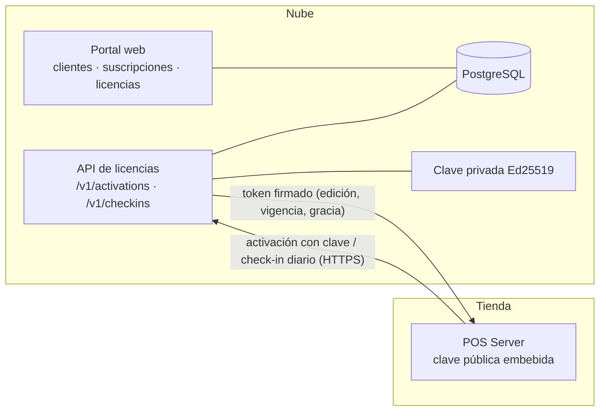

# Fase 12-A · Servidor y portal web de licencias — Propuesta

> Estado: **APROBADA** (con las recomendaciones de la §13) · 2026-09-29
> Origen: pedido del propietario de ir construyendo el ambiente web donde se controlan las licencias (se adelanta la parte en la nube
> de la Fase 12; la parte dentro del POS queda como **12-B**).
> Base: [doc 09 · licenciamiento](../09-licenciamiento.md) con los cambios de [ADR-0015](../adr/0015-ediciones-caja-unica-multicaja.md)
> (sin planes por módulos ni límite de cajas: la única diferencia comercial es la **edición** Caja Única / Multicaja),
> [doc 10](../10-offline-backups-actualizaciones.md) (el POS nunca deja de vender por falta de Internet).

**Convenciones:** 🔒 = decisión difícil de cambiar después (matriz en la §3). ⚙️ = parámetro configurable.

## Cambios de la v2 (respuestas del propietario)

| Pregunta v1 | Respuesta | Qué cambia |
|---|---|---|
| 1 · Dónde publicarlo | Hay un **VPS y un dominio**, aún sin configurar | L-11: Docker Compose en el VPS (aplicación + PostgreSQL + proxy **Caddy** con HTTPS automático de Let's Encrypt) y respaldo diario de la BD fuera del VPS. Se construye y prueba en tu máquina con el mismo Compose |
| 2 · Tecnología | "Ayúdame eligiendo el mejor" | L-02: **Blazor Web App de .NET 10** con la librería de componentes **MudBlazor** (justificación abajo) |
| 3 · Quién entra | Solo tú y tu equipo | Roles Superadministrador y Soporte; el rol de distribuidor queda preparado en el modelo, sin pantallas |
| 4 · Autoservicio | Falta claridad | Explicado en la §12; se mantiene fuera de 12-A |
| 5 · Prueba y gracia | 30 y 7 días, configurables | Sin cambios |
| 6 · Varias sucursales | **Una licencia por razón social (NIT)** | L-03/L-07: la licencia es de la **empresa**; cada sucursal es una **instalación** de esa misma licencia |
| 7 · Orden | Sin respuesta | Se mantiene la recomendación: en paralelo con la Fase 7 (confírmalo al aprobar) |

**Por qué Blazor (y no React/Angular):** el portal es un panel administrativo interno (formularios, tablas, filtros) para pocos
usuarios; con Blazor se escribe todo en C#, se **reutilizan** el token, las validaciones del NIT y las convenciones del POS, se prueba
con las mismas herramientas y hay una sola aplicación que desplegar. React/Angular ganan en ecosistema y en sitios públicos de mucho
tráfico, pero agregarían un segundo lenguaje, otra compilación y otra API que mantener, sin beneficio para este uso. Para el futuro
portal del cliente (más usuarios) se puede reevaluar sin afectar este.

## 0. Objetivo y alcance

Después de esta fase existe, en la nube, un **servidor de licencias con su portal web**: tú (y tu equipo de soporte o ventas)
registras clientes y sus empresas, creas suscripciones Caja Única o Multicaja, generas claves de licencia, ves qué instalaciones y
equipos las usan, renuevas, suspendes, reactivas y liberas equipos. El servidor expone la **API que usará el POS** para activarse y
renovar su licencia, y firma los **tokens de licencia** que el POS verifica sin conexión.

| Incluido (12-A) | Excluido |
|---|---|
| Proyecto en la nube independiente del POS (mismo repositorio), desplegable como contenedor | Módulo de licencias **dentro del POS**: activación en el asistente, heartbeat diario, estados locales (`VALID`, `GRACE`, `RESTRICTED`, `DEMO`) y restricciones → **12-B** |
| Portal web interno: clientes (cuentas y distribuidores), empresas, suscripciones, licencias, instalaciones, equipos, historial | Cobro en línea y pasarela de pagos (futuro; las renovaciones se registran a mano) |
| Usuarios del portal con roles y **doble factor** (TOTP) obligatorio | Portal del cliente final (autoservicio) — explicado en la §12 |
| API para el POS: activar, renovar (check-in), liberar equipo, consultar estado | Sincronización de ventas y portal de datos del cliente (fase de sincronización) |
| Token firmado **Ed25519** (JWS) con edición, vigencia, gracia, instalación y equipo; rotación de claves | Facturación electrónica de tu propia venta de licencias |
| **Simulador de POS** (línea de comandos) para probar activación y renovación de punta a punta sin el POS real | |
| Auditoría de todo lo que se hace en el portal; tablero con vencimientos próximos | |

Se entrega en **tres bloques** con una sola aprobación: **12-A.1 Núcleo y API** (modelo, token, activación, check-in),
**12-A.2 Portal web** (usuarios, 2FA, pantallas), **12-A.3 Despliegue** (contenedor, configuración, respaldo de la BD, guía).

---

## 1. Actores y flujo general

| Actor | Qué hace |
|---|---|
| Superadministrador (tú) | Todo, incluidos usuarios del portal y claves de firma |
| Soporte | Consulta, libera equipos, reactiva, extiende la gracia |
| Ventas / distribuidor | Crea clientes y suscripciones de **sus** clientes, genera claves |
| POS (máquina) | Activa con la clave, renueva el token cada día, informa versión y número de cajas |



Ciclo de una licencia: **alta del cliente → suscripción (edición, periodo) → clave → activación desde el POS → check-ins
diarios → renovación (o vencimiento → gracia → restringido) → reactivación**.

---

## 2. Decisiones principales

| # | Decisión | Por qué | |
|---|---|---|---|
| L-01 | **Proyecto en la nube separado del POS**, en el mismo repositorio (`src/Cloud`), con su propia BD y despliegue; será el núcleo de la futura plataforma en la nube (sincronización y portal del cliente) | Un solo lugar para lo que vive en internet; el POS no depende de él para vender | 🔒 |
| L-02 | **Mismo stack**: .NET 10 + PostgreSQL; portal **Blazor Web App** (páginas renderizadas en el servidor e interactividad de servidor) con **MudBlazor** (MIT) | Un solo lenguaje y las mismas convenciones del POS (módulos, SQL-first, pruebas, auditoría); un panel administrativo de formularios y tablas no necesita una SPA | 🔒 |
| L-03 | **Modelo por edición y por NIT** (ADR-0015): cuenta → empresa (NIT con DV, **única**) → suscripción (edición `SINGLE`/`MULTI`, periodicidad, vigencia, estado) → **una licencia por empresa** (clave) → instalaciones (**una por sucursal**) → equipos → activaciones → check-ins. Sin planes ni features | Decisión del propietario: se licencia la razón social; renovar o suspender afecta a todas sus sucursales a la vez | 🔒 |
| L-04 | **Token JWS compacto con EdDSA (Ed25519)** firmado con NSec (ya usado en el POS), con `kid` para rotar claves; el POS trae **varias claves públicas** embebidas | Verificación sin conexión; una clave comprometida se reemplaza sin reinstalar | 🔒 |
| L-05 | Contenido del token: licencia, empresa (NIT), instalación, huella del equipo servidor, **edición**, estado de la suscripción, emitido, `valid_until`, `grace_days`, `refresh_after`, mensajes | Lo mínimo para operar offline hasta `valid_until + gracia` (doc 09) | 🔒 |
| L-06 | **Clave de licencia** con formato legible (`POS-XXXXX-XXXXX-XXXXX-XXXXX`, alfabeto sin 0/O/1/I, con dígito de control); en la BD solo se guarda su **hash** y un prefijo visible | Se dicta por teléfono sin errores; una fuga de la BD no revela claves | |
| L-07 | La **huella del equipo** es un hash (placa, disco, MachineGuid) con tolerancia de 2 de 3; las **cajas adicionales no se activan en la nube** (se emparejan con el servidor de la tienda); cada **sucursal** activa una instalación de la licencia de su empresa (Caja Única: su único equipo; Multicaja: el servidor de la tienda); máximo de instalaciones por licencia ⚙️ (por defecto sin límite, pregunta 2) | Evita copiar la instalación a otro PC sin castigar un cambio de disco | 🔒 |
| L-08 | **Usuarios del portal propios** con contraseña Argon2id (como el POS) y **TOTP obligatorio**; roles Superadministrador, Soporte, Ventas/distribuidor (ve solo sus clientes) | Quien entra al portal puede suspender tiendas: la seguridad es la de un sistema de pagos | 🔒 |
| L-09 | **Nada se borra**: suspensiones, renovaciones, liberaciones y cambios quedan como eventos; auditoría encadenada como la del POS | Explicar cualquier reclamo de un cliente | |
| L-10 | Renovación **manual** en esta fase (registrar el pago y extender el periodo); la pasarela se integra después con webhooks | El cobro cambia por país y proveedor; el modelo ya tiene eventos de suscripción | |
| L-11 | **Despliegue con Docker Compose en el VPS**: aplicación (API + portal en el mismo proceso), PostgreSQL 18 y **Caddy** como proxy con HTTPS automático (Let's Encrypt) en un subdominio (p. ej. `licencias.tudominio.com`); respaldo diario de la BD (`pg_dump` cifrado) **fuera del VPS**; la clave privada en un archivo protegido fuera del repositorio y de la BD | Aprovecha el VPS que ya tienes; portable a cualquier proveedor; el mismo Compose corre en tu máquina para pruebas | |

---

## 3. Revisión arquitectónica de las decisiones difíciles de cambiar

| ID | Decisión | Motivo | Alternativas | Consecuencia positiva | Riesgo | Impacto POS local | Impacto multisucursal | Impacto sincronización | Impacto licenciamiento | Dificultad de cambiar | Recomendación |
|---|---|---|---|---|---|---|---|---|---|---|---|
| L-01 | Nube separada en el mismo repositorio | Un solo producto en la nube | Repositorio aparte; servicio de terceros de licencias | Compartir contratos (token) y convenciones con el POS | La nube crece: hay que modularla desde el inicio | Ninguno: el POS vende sin la nube | Una cuenta con varias sucursales/instalaciones | La sincronización se agrega como otro módulo | Base del sistema de licencias | Alta | **Adoptar** |
| L-02 | .NET 10 + Blazor | Mismo lenguaje | React/Angular + API; Razor Pages | Un equipo, un stack, menos piezas | Blazor Server necesita conexión estable del navegador | — | — | — | — | Media | **Adoptar** con MudBlazor |
| L-03 | Modelo por edición | ADR-0015 | Planes por features (doc 09 original) | Simple y alineado al negocio | Si en el futuro vuelven los planes, se agregan tablas | El POS solo mira la edición | Una licencia por NIT cubre todas sus sucursales (una instalación por sucursal) | — | Directo | Media | **Adoptar** |
| L-04 | JWS EdDSA con `kid` | Offline y seguro | Licencia RSA; licencias por archivo sin firma | Firmas cortas y rápidas; rotación | Perder la clave privada = no emitir tokens | El POS verifica sin Internet | — | — | Núcleo | Muy alta (el POS instalado confía en las claves públicas) | **Adoptar**, con respaldo cifrado de la clave privada y 2 claves públicas embebidas desde el día 1 |
| L-05 | Contenido del token | Operar offline | Token mínimo + consultas en línea | El POS decide solo | Cambios del token exigen versión (`ver`) | Estados locales (12-B) | — | — | Núcleo | Alta | **Adoptar** con campo de versión |
| L-07 | Huella con tolerancia; cajas no se activan en la nube | Antipiratería razonable | Activar cada caja | No molesta al cliente honesto; sin límite de cajas (ADR-0015) | Una copia completa del servidor en otro PC requiere reactivación en línea | Activación una vez por servidor | Cada sucursal su instalación | — | Detecta copias | Alta | **Adoptar** |
| L-08 | Usuarios propios + TOTP | Seguridad del portal | Iniciar sesión con Google/Microsoft | Sin depender de terceros | Recuperación de 2FA manual | — | — | — | Protege las suspensiones | Media | **Adoptar**; SSO se puede agregar después |

---

## 4. Modelo de datos (esquema `licensing` en la BD de la nube)

| Tabla | Contenido |
|---|---|
| `accounts` | Cliente comercial o distribuidor: nombre, NIT con DV, contacto, tipo (`DIRECT`, `RESELLER`), distribuidor padre |
| `organizations` | Empresa licenciada (la del POS): razón social, NIT con DV (**único**), ciudad, cuenta |
| `subscriptions` | Empresa, **edición** (`SINGLE`, `MULTI`), periodicidad (`MONTHLY`, `ANNUAL`), inicio y fin del periodo, prueba hasta, días de gracia ⚙️ (7), estado (`TRIAL`, `ACTIVE`, `PAST_DUE`, `SUSPENDED`, `CANCELLED`, `EXPIRED`) |
| `subscription_events` | Solo inserción: creada, renovada (con referencia del pago), cambio de edición, suspendida, reactivada, cancelada, gracia extendida; quién y cuándo |
| `licenses` | Suscripción, hash de la clave + prefijo visible, estado (`ACTIVE`, `REVOKED`), máximo de instalaciones ⚙️ (sin límite por defecto); una sola licencia vigente por empresa |
| `installations` | `installation_id` del POS, licencia, nombre de la sucursal declarada, versión, primera activación, último check-in, estado |
| `devices` | Huella (hash) y rol (`ALL_IN_ONE`, `STORE_SERVER`), nombre del equipo, sistema operativo |
| `activations` | Licencia, equipo, activada, liberada (motivo, por quién), estado |
| `checkins` | Solo inserción: fecha, versión, cajas activas, reloj reportado, IP, resultado (token emitido, rechazo y motivo) |
| `signing_keys` | `kid`, clave pública, estado (`ACTIVE`, `RETIRED`), creada; la privada **no** se guarda en la BD |
| `portal_users` / `portal_sessions` | Usuarios del portal, rol, cuenta de distribuidor, hash Argon2id, secreto TOTP cifrado, bloqueos, sesiones revocables |
| `audit_log` / `audit_seals` | Auditoría encadenada como la del POS |

## 5. Flujos

### 5.1 Activación (desde el POS; en 12-A, desde el simulador)

`POST /v1/activations` { clave, `installation_id`, huella, rol del equipo, versión, NIT de la empresa } → validar clave (hash),
suscripción vigente o en prueba, **edición compatible con el rol** (Caja Única → `ALL_IN_ONE`; Multicaja → `STORE_SERVER` o, en una
sucursal pequeña, `ALL_IN_ONE`, pregunta 1), NIT igual al de la empresa licenciada, máximo de instalaciones → registrar instalación, equipo y activación → **token**. Errores con código
estable (`LICENSE.KEY_INVALID`, `LICENSE.EDITION_MISMATCH`, `LICENSE.INSTALLATIONS_EXCEEDED`, `LICENSE.SUBSCRIPTION_INACTIVE`…).

### 5.2 Check-in diario

`POST /v1/checkins` firmado por la instalación (token vigente + huella) { versión, cajas activas, reloj } → registra el check-in →
token renovado con el estado actual de la suscripción (renovada, vencida, suspendida) y mensajes para mostrar en el POS (aviso de
vencimiento, actualización disponible). Si la huella no coincide (2 de 3) → exige reactivación.

### 5.3 Desde el portal

Alta de cliente y empresa → suscripción (edición, periodo o prueba de N días ⚙️) → **generar clave** (se muestra una sola vez; se
puede regenerar, lo que revoca la anterior) → ver instalaciones y equipos → **liberar equipo** (cambio de PC) → renovar (registrar
pago, extender periodo) → suspender / reactivar (el POS lo recibe en el siguiente check-in) → tablero: vencen en 7/15/30 días,
en gracia, suspendidas, sin check-in hace más de N días ⚙️.

### 5.4 Tiempos del token (doc 09)

`valid_until` = fin del periodo pagado · `grace_days` ⚙️ 7 · `refresh_after` = 24 h. Mientras el token no venza, el POS funciona
completo sin Internet; en gracia sigue con avisos; restringido: **nunca** detiene una jornada abierta ni bloquea consultas,
reportes, exportación o backup (RN-LIC-01..04, se implementa en 12-B).

## 6. Seguridad

- HTTPS obligatorio (HSTS); la API del POS con límite de peticiones por IP y por licencia; respuestas idénticas para "clave
  inexistente" y "clave revocada" hacia afuera (sin enumerar claves); tiempo constante al comparar hashes.
- Portal: Argon2id + TOTP obligatorio, bloqueo por intentos, sesiones revocables, cookies seguras (`HttpOnly`, `SameSite=Strict`),
  protección CSRF (antiforgery de ASP.NET Core), cabeceras de seguridad (CSP).
- Clave privada Ed25519 fuera de la BD y del repositorio; respaldo cifrado en un lugar distinto al servidor; procedimiento de rotación.
- Auditoría encadenada de cada acción del portal (quién suspendió a quién y por qué).

## 7. API (resumen)

API del POS: `POST /v1/activations` · `POST /v1/checkins` · `POST /v1/deactivations` · `GET /v1/public-keys` (claves públicas por
`kid`). Portal: pantallas de tablero, cuentas, empresas, suscripciones, licencias, instalaciones, usuarios del portal, auditoría;
detrás, una API interna `/admin/...` con los mismos permisos (para automatizar en el futuro).

## 8. Pruebas previstas

- **Unitarias:** firma y verificación del token (incluida la rotación con `kid`), formato y dígito de control de la clave,
  tolerancia de la huella (2 de 3), estados de la suscripción y cálculo de vigencia y gracia.
- **BD real:** clave única por hash, activaciones únicas por equipo, eventos de solo inserción.
- **API:** activación correcta; edición incompatible; instalaciones excedidas; suscripción suspendida → token con estado suspendido;
  check-in con huella distinta → reactivación; liberar equipo y activar en otro; límite de peticiones.
- **Portal:** inicio de sesión con TOTP, permisos por rol (el distribuidor solo ve sus clientes), cada acción auditada.
- **De punta a punta:** el **simulador de POS** activa, renueva, recibe una suspensión y una renovación, y verifica cada token con la
  clave pública.

## 9. Riesgos

| Riesgo | Mitigación |
|---|---|
| Pérdida o filtración de la clave privada | Fuera de la BD; respaldo cifrado separado; rotación con `kid`; el POS trae 2 claves públicas desde el día 1 |
| El portal queda expuesto a internet | 2FA obligatorio, límites, auditoría, actualizaciones del contenedor |
| Caída del servidor de licencias | No afecta ventas: el POS opera con el token vigente y la gracia; monitoreo del servicio |
| Costos de nube | Un contenedor pequeño + PostgreSQL administrado básico alcanza para miles de instalaciones (un check-in diario por tienda) |

## 10. Estructura de código

```
src/Cloud/Pos.Cloud.Host            ASP.NET Core: API del POS + portal Blazor, contenedor Docker
src/Cloud/Modules/Licensing/*       Dominio, casos de uso, persistencia y endpoints de licencias
src/Cloud/Modules/PortalIdentity/*  Usuarios del portal, TOTP, sesiones, roles
src/Shared/Pos.Licensing.Contracts  Token (claims, versión), verificación Ed25519 — lo usarán el servidor y el POS (12-B)
tools/Pos.License.Simulator         Simulador de POS por línea de comandos
http/fase-12a.http · docs/despliegue-nube.md
```

## 11. Criterios de aceptación

- [ ] Portal con usuarios, roles y TOTP; clientes, empresas, suscripciones (Caja Única / Multicaja), claves, instalaciones y equipos.
- [ ] Activación, check-in y liberación de equipo por API con errores de código estable; límite de peticiones.
- [ ] Token Ed25519 con `kid`, verificable con la clave pública; rotación probada.
- [ ] Suspender, renovar y reactivar desde el portal se reflejan en el siguiente check-in.
- [ ] Simulador de POS de punta a punta.
- [ ] Contenedor desplegable con guía paso a paso; respaldo de la BD de la nube.
- [ ] Auditoría de todas las acciones del portal; `build.ps1` en verde; cobertura del dominio de licencias ≥ 90 %.
- [ ] Docs 09 actualizado, ADRs (nube separada, token Ed25519 con rotación, modelo por edición) e informe.

## 12. Autoservicio del cliente final (explicación de la pregunta 4)

"Autoservicio" es que **el dueño del supermercado** (tu cliente) entre a una página propia, sin llamarte, para:

| Qué haría el cliente | Hoy, sin autoservicio |
|---|---|
| Ver su licencia: edición, fecha de vencimiento, sucursales y equipos activados | Te llama y tú lo miras en el portal |
| Liberar el equipo cuando cambia de computador | Tu soporte lo libera desde el portal |
| Descargar el instalador y las actualizaciones | Se lo envías tú |
| Renovar y pagar en línea | Te paga por transferencia y tú registras la renovación |
| Consultar sus ventas en la nube y actualizar sus datos | Llega con la sincronización (visión del producto) |

Es otro portal, con otros usuarios (miles de clientes, no tu equipo) y otras reglas de seguridad; por eso **recomiendo** construirlo
junto con el **portal del cliente** de la fase de sincronización, que ya tendrá sus usuarios y la consulta de ventas, en lugar de
hacer dos portales de cliente. Mientras tanto, todo eso lo hace tu equipo desde el portal de 12-A.

## 13. Preguntas finales — resueltas con la aprobación (se adoptan las recomendaciones)

1. **Edición con varias sucursales:** con una licencia por NIT, ¿la edición es la misma para todas las sucursales de la empresa?
   **Recomiendo:** una licencia Multicaja permite que una sucursal pequeña se instale en un solo equipo (modo Caja Única); una licencia
   Caja Única solo admite instalaciones de un equipo por sucursal.
2. **Precio y número de sucursales:** ¿cobras lo mismo sin importar cuántas sucursales tenga la empresa? Si es así, las instalaciones
   quedan **sin límite** (**recomendado** por defecto); si cobras por sucursal, se fija un máximo en cada licencia desde el portal.
3. **VPS:** cuando lo configuremos necesitaré el sistema operativo (recomiendo Ubuntu 24.04 LTS), la memoria (2 GB alcanzan) y el
   subdominio que quieras usar. No hace falta para empezar: se construye y prueba en tu máquina.
4. **Orden de trabajo:** ¿construyo la 12-A **en paralelo** con la Fase 7 (**recomendado**)?

**Resolución:** (1) una licencia Multicaja admite instalaciones `STORE_SERVER` o `ALL_IN_ONE`; una Caja Única solo `ALL_IN_ONE`;
(2) instalaciones sin límite por defecto, con máximo configurable por licencia; (3) el VPS se configura al final (12-A.3);
(4) se construye en paralelo con la Fase 7.
